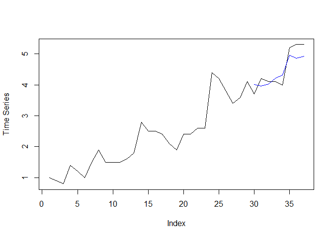
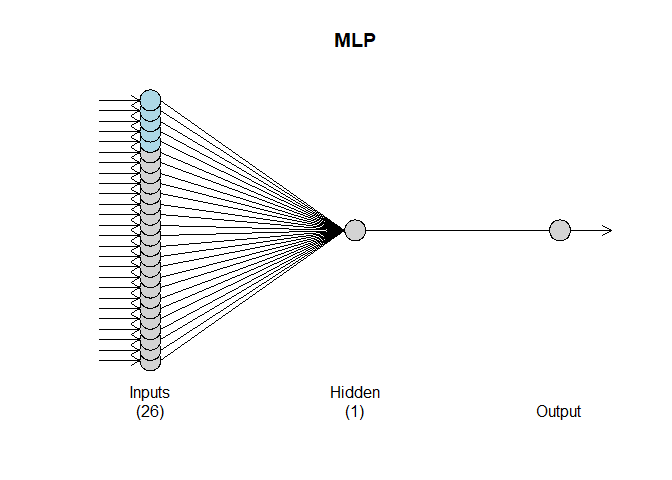
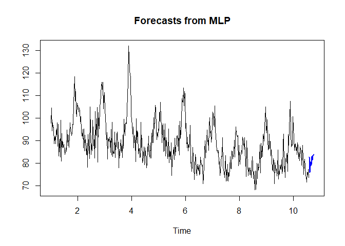
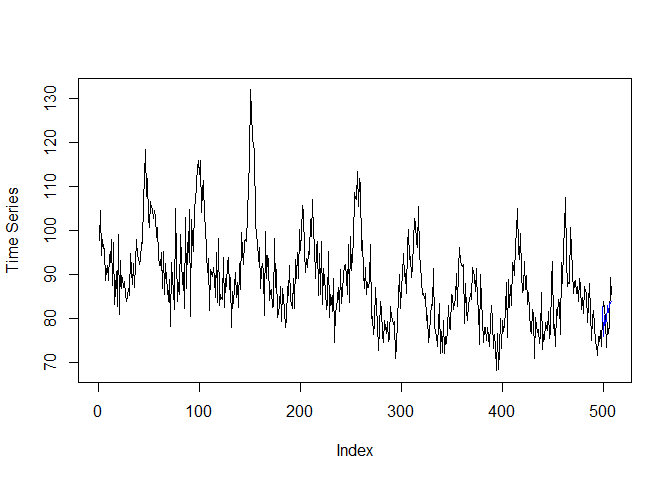
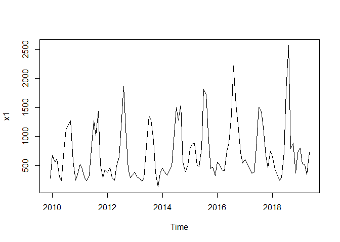
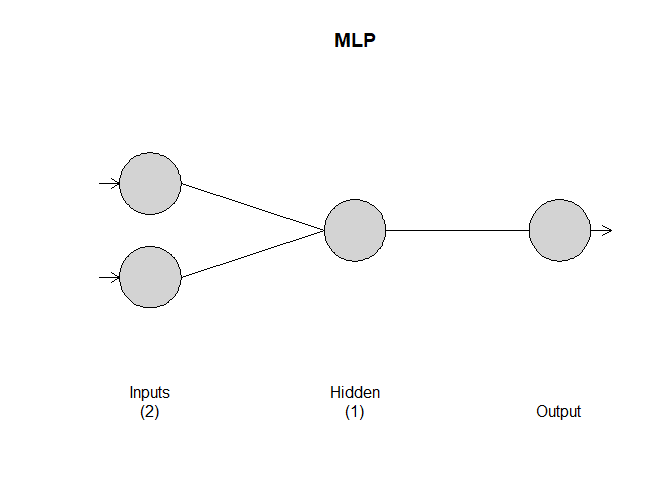
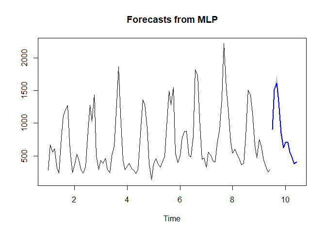
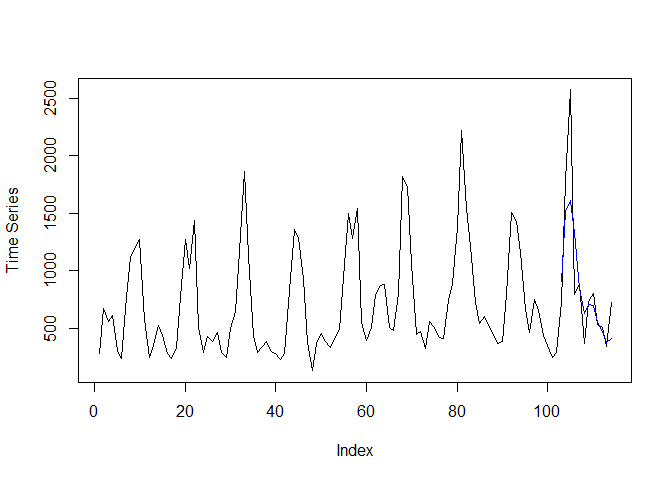

Live Session Assignment 13
================
Nikhil Gupta
2020-03-30 20:02:12

-   [Setup](#setup)
-   [Sunspot Melanoma Data](#sunspot-melanoma-data)
    -   [Modeling](#modeling)
-   [Schumway pollution data](#schumway-pollution-data)
    -   [Modeling](#modeling-1)
-   [My data](#my-data)
    -   [Modeling](#modeling-2)

Setup
=====

``` r
library(tswge)
```

    ## Warning: package 'tswge' was built under R version 3.5.3

``` r
library(tswgewrapped)
library(tidyverse)
```

    ## Warning: package 'tidyverse' was built under R version 3.5.3

    ## -- Attaching packages -------------------------------------------------------------------------------------------------------- tidyverse 1.2.1 --

    ## v ggplot2 3.2.0     v purrr   0.3.3
    ## v tibble  2.1.3     v dplyr   0.8.5
    ## v tidyr   0.8.3     v stringr 1.4.0
    ## v readr   1.3.1     v forcats 0.4.0

    ## Warning: package 'ggplot2' was built under R version 3.5.3

    ## Warning: package 'tibble' was built under R version 3.5.3

    ## Warning: package 'tidyr' was built under R version 3.5.3

    ## Warning: package 'readr' was built under R version 3.5.2

    ## Warning: package 'purrr' was built under R version 3.5.3

    ## Warning: package 'dplyr' was built under R version 3.5.3

    ## Warning: package 'stringr' was built under R version 3.5.3

    ## Warning: package 'forcats' was built under R version 3.5.3

    ## -- Conflicts ----------------------------------------------------------------------------------------------------------- tidyverse_conflicts() --
    ## x dplyr::filter() masks stats::filter()
    ## x dplyr::lag()    masks stats::lag()

``` r
library(tseries)
```

    ## Warning: package 'tseries' was built under R version 3.5.3

``` r
library(orcutt)
```

    ## Warning: package 'orcutt' was built under R version 3.5.3

    ## Loading required package: lmtest

    ## Warning: package 'lmtest' was built under R version 3.5.3

    ## Loading required package: zoo

    ## Warning: package 'zoo' was built under R version 3.5.3

    ## 
    ## Attaching package: 'zoo'

    ## The following objects are masked from 'package:base':
    ## 
    ##     as.Date, as.Date.numeric

``` r
library(vars)
```

    ## Warning: package 'vars' was built under R version 3.5.3

    ## Loading required package: MASS

    ## Warning: package 'MASS' was built under R version 3.5.3

    ## 
    ## Attaching package: 'MASS'

    ## The following object is masked from 'package:dplyr':
    ## 
    ##     select

    ## Loading required package: strucchange

    ## Warning: package 'strucchange' was built under R version 3.5.3

    ## Loading required package: sandwich

    ## Warning: package 'sandwich' was built under R version 3.5.3

    ## 
    ## Attaching package: 'strucchange'

    ## The following object is masked from 'package:stringr':
    ## 
    ##     boundary

    ## Loading required package: urca

    ## Warning: package 'urca' was built under R version 3.5.3

``` r
library(RColorBrewer)
library(nnfor)
```

    ## Warning: package 'nnfor' was built under R version 3.5.3

    ## Loading required package: forecast

    ## Warning: package 'forecast' was built under R version 3.5.3

Sunspot Melanoma Data
=====================

``` r
# # melanoma incidence and sunspot numbers 1936-1972
# melanoma=c(1.0, 0.9, 0.8, 1.4, 1.2, 1.0, 1.5, 1.9, 1.5, 1.5, 1.5, 1.6, 1.8, 2.8, 2.5, 2.5, 2.4, 2.1, 1.9, 2.4, 2.4, 2.6, 2.6, 4.4, 4.2, 3.8, 3.4, 3.6, 4.1, 3.7, 4.2, 4.1, 4.1, 4.0, 5.2, 5.3, 5.3)
# sunspot=c(40, 115, 100,  80,  60,  40,  23,  10,  10,  25,  75, 145, 130, 130,  80,  65,  20,  10,   5,  10, 60, 190, 180, 175, 120,  50,  35,  20,  10,  15,  30,  60, 105, 105, 105,  80,  65)

data = read.csv("../MSDS-6373-Time-Series/Unit 13/Melanoma_Sunspot.csv", header = TRUE)
data %>% glimpse()
```

    ## Observations: 37
    ## Variables: 3
    ## $ Year     <int> 1936, 1937, 1938, 1939, 1940, 1941, 1942, 1943, 1944,...
    ## $ Melanoma <dbl> 1.0, 0.9, 0.8, 1.4, 1.2, 1.0, 1.5, 1.9, 1.5, 1.5, 1.5...
    ## $ Sunspot  <int> 40, 115, 100, 80, 60, 40, 23, 10, 10, 25, 75, 145, 13...

``` r
data_train = data %>% slice(1:29)
data_test = data %>% slice(30:37)
```

Modeling
--------

``` r
set.seed(2)

## Regressor lags will be picked automatically
fit = nnfor::mlp(y = ts(data_train$Melanoma, start = c(1936), frequency = 1),
                 xreg = data.frame(Sunspot = ts(data_train$Sunspot,  start = c(1936), frequency = 1))
                 )
fit
```

    ## MLP fit with 5 hidden nodes and 20 repetitions.
    ## Series modelled in differences: D1.
    ## Univariate lags: (1,2,3)
    ## 1 regressor included.
    ## - Regressor 1 lags: (1,2,3)
    ## Forecast combined using the median operator.
    ## MSE: 0.0017.

``` r
h = 8

# Must include entire dataset to xreg for predict

f = forecast(fit,  h = h, xreg = data.frame(Sunspot = ts(data$Sunspot, start = c(1936), frequency = 1)))
plot(data$Melanoma,type = "l", ylab = "Time Series")
lines(seq(nrow(data_train)+1,nrow(data)), f$mean, col = "blue")
```



``` r
ASE = mean((data$Melanoma %>% tail(h) - f$mean)^2)
ASE
```

    ## [1] 0.08397865

Schumway pollution data
=======================

``` r
data = read.csv("../Datasets/la_cmort_study.csv", header = TRUE)
data %>% glimpse()
```

    ## Observations: 508
    ## Variables: 4
    ## $ Week  <int> 1, 2, 3, 4, 5, 6, 7, 8, 9, 10, 11, 12, 13, 14, 15, 16, 1...
    ## $ temp  <dbl> 72.38, 67.19, 62.94, 72.49, 74.25, 67.88, 74.20, 74.88, ...
    ## $ part  <dbl> 72.72, 49.60, 55.68, 55.16, 66.02, 44.01, 47.83, 43.60, ...
    ## $ cmort <dbl> 97.85, 104.64, 94.36, 98.05, 95.85, 95.98, 88.63, 90.85,...

``` r
data_train = data %>% slice(1:498)
data_test = data %>% slice(499:508)
```

Modeling
--------

``` r
set.seed(2)

## Note that xreg has to be a dataframe else it will not work

fit = nnfor::mlp(y = ts(data_train$cmort, frequency = 52),
                 xreg = data.frame(temp = ts(data_train$temp, frequency = 52),
                                   part = ts(data_train$part, frequency = 52)),
                 xreg.lags = (list(1:13, 1:13)), allow.det.season = FALSE,
                 hd = 1
                 )
                 
fit
```

    ## MLP fit with 1 hidden node and 20 repetitions.
    ## Series modelled in differences: D1.
    ## Univariate lags: (1,2,3,4,5,6,7,8,9,10,11,12,13,14,16,17,18,19,20,30,46)
    ## 2 regressors included.
    ## - Regressor 1 lags: (1,13)
    ## - Regressor 2 lags: (4,7,13)
    ## Forecast combined using the median operator.
    ## MSE: 26.2938.

``` r
plot(fit)
```



``` r
h = 10

f = forecast(fit,  h = h, xreg = data.frame(temp = ts(data$temp, frequency = 52),
                                            part = ts(data$part, frequency = 52)))

plot(f)
```



``` r
plot(data$cmort, type = "l", ylab = "Time Series")
lines(seq(nrow(data_train)+1,nrow(data)), f$mean, col = "blue")
```



``` r
ASE = mean((data$cmort %>% tail(h) - f$mean)^2)
ASE
```

    ## [1] 20.4757

My data
=======

``` r
electrictiy = read.csv("../Datasets/electricity_usage_nikhil_house.csv")
head(electrictiy)
```

    ##         Date Usage
    ## 1 12/31/2009   280
    ## 2  1/31/2010   669
    ## 3  2/28/2010   559
    ## 4  3/31/2010   611
    ## 5  4/30/2010   309
    ## 6  5/31/2010   238

-   There are some missing values. We will need to impute these

``` r
data = ts(electrictiy$Usage, frequency = 12, start = c(2009, 12))

library(imputeTS)
```

    ## Warning: package 'imputeTS' was built under R version 3.5.3

    ## 
    ## Attaching package: 'imputeTS'

    ## The following object is masked from 'package:zoo':
    ## 
    ##     na.locf

    ## The following object is masked from 'package:tseries':
    ## 
    ##     na.remove

``` r
data = imputeTS::na_interpolation(data, option = 'spline')
data = data.frame(data)
```

``` r
plot(data)
```



``` r
data_train = data %>% slice(1:102)
data_test = data %>% slice(103:114)
```

Modeling
--------

``` r
set.seed(2)

## Note that xreg has to be a dataframe else it will not work
fit = nnfor::mlp(y = ts(data_train$data, frequency = 12), lags = 1:12, difforder = c(12), hd = 1) 
fit
```

    ## MLP fit with 1 hidden node and 20 repetitions.
    ## Series modelled in differences: D12.
    ## Univariate lags: (1,12)
    ## Forecast combined using the median operator.
    ## MSE: 55349.3738.

``` r
plot(fit)
```



``` r
h = 12

f = forecast(fit,  h = h)

plot(f)
```



``` r
plot(as.numeric(data$data), type = "l", ylab = "Time Series")
lines(seq(nrow(data_train)+1,nrow(data)), f$mean, col = "blue")
```



``` r
ASE = mean((as.numeric(data$data) %>% tail(h) - f$mean)^2)
ASE
```

    ## [1] 123499.5
