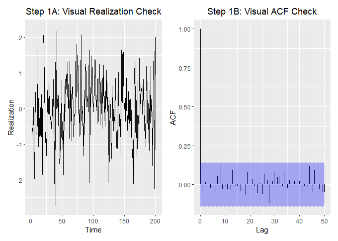
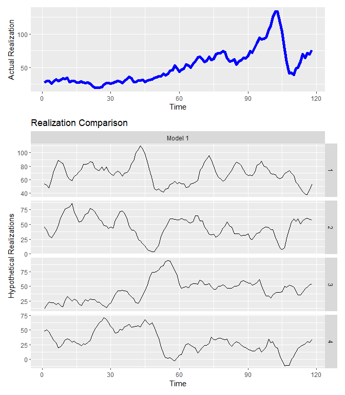
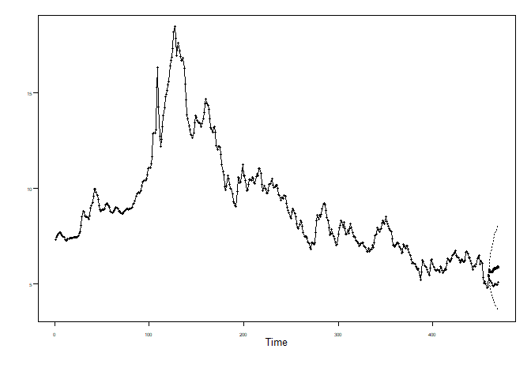

Homework 9
================
Nikhil Gupta
2020-03-16 23:12:29

-   [Setup](#setup)
-   [Problem 9.1](#problem-9.1)
    -   [Model 1](#model-1)
        -   [a](#a)
        -   [b](#b)
        -   [c](#c)
        -   [d](#d)
    -   [Model 2](#model-2)
        -   [a](#a-1)
        -   [b](#b-1)
        -   [c](#c-1)
        -   [d](#d-1)
    -   [Model 3](#model-3)
        -   [a](#a-2)
        -   [b](#b-2)
        -   [c](#c-2)
        -   [d](#d-2)
-   [Problem 9.2](#problem-9.2)
    -   [wtcrude](#wtcrude)
        -   [a](#a-3)
        -   [b](#b-3)
        -   [c](#c-3)
        -   [d](#d-3)
    -   [eco.mort](#eco.mort)
        -   [a](#a-4)
        -   [b](#b-4)
        -   [c](#c-4)
        -   [d](#d-4)
    -   [hadley](#hadley)
        -   [a](#a-5)
        -   [b](#b-5)
        -   [c](#c-5)
        -   [d](#d-5)
-   [Problem 9.3](#problem-9.3)
    -   [Overfit](#overfit)
    -   [Remove s = 6 seasonality](#remove-s-6-seasonality)
    -   [Model ID](#model-id)
        -   [a](#a-6)
        -   [b](#b-6)
        -   [c](#c-6)
        -   [d](#d-6)

Setup
=====

``` r
library(tswge)
```

    ## Warning: package 'tswge' was built under R version 3.5.3

``` r
library(tidyverse)
```

    ## Warning: package 'tidyverse' was built under R version 3.5.3

    ## -- Attaching packages --------------------------------------- tidyverse 1.2.1 --

    ## v ggplot2 3.2.0     v purrr   0.3.3
    ## v tibble  2.1.3     v dplyr   0.8.3
    ## v tidyr   0.8.3     v stringr 1.4.0
    ## v readr   1.3.1     v forcats 0.4.0

    ## Warning: package 'ggplot2' was built under R version 3.5.3

    ## Warning: package 'tibble' was built under R version 3.5.3

    ## Warning: package 'tidyr' was built under R version 3.5.3

    ## Warning: package 'readr' was built under R version 3.5.2

    ## Warning: package 'purrr' was built under R version 3.5.3

    ## Warning: package 'dplyr' was built under R version 3.5.3

    ## Warning: package 'stringr' was built under R version 3.5.3

    ## Warning: package 'forcats' was built under R version 3.5.3

    ## -- Conflicts ------------------------------------------ tidyverse_conflicts() --
    ## x dplyr::filter() masks stats::filter()
    ## x dplyr::lag()    masks stats::lag()

``` r
library(tswgewrapped)
```

Problem 9.1
===========

Model 1
-------

``` r
phi = c(1.5, -1.21, 0.455)
theta = 0
n = 200
mean = 50

factor.wge(phi = phi)
```

    ## 
    ## Coefficients of Original polynomial:  
    ## 1.5000 -1.2100 0.4550 
    ## 
    ## Factor                 Roots                Abs Recip    System Freq 
    ## 1-0.8000B+0.6500B^2    0.6154+-1.0769i      0.8062       0.1674
    ## 1-0.7000B              1.4286               0.7000       0.0000
    ##   
    ## 

``` r
xa = mean + gen.arma.wge(n = n, phi = phi, plot = FALSE, sn = 101)    
# px = plotts.sample.wge(xa)
```

``` r
e = est.arma.wge(xa, p = length(phi))
```

    ## 
    ## Coefficients of Original polynomial:  
    ## 1.5250 -1.2507 0.4301 
    ## 
    ## Factor                 Roots                Abs Recip    System Freq 
    ## 1-0.9001B+0.6882B^2    0.6539+-1.0126i      0.8296       0.1587
    ## 1-0.6249B              1.6002               0.6249       0.0000
    ##   
    ## 

``` r
e$avar
```

    ## [1] 0.9061681

``` r
mean(xa)
```

    ## [1] 50.03217

### a

``` r
models = list("Model 1" = list(phi = e$phi, theta = e$theta, vara = e$avar, res = e$res, sliding_ase = FALSE))

n.ahead = 20

mdl_compare = tswgewrapped::ModelCompareUnivariate$new(x = xa, mdl_list = models, n.ahead = n.ahead)
```

    ## 
    ## 
    ## 
    ## Computing metrics for:  Model 1

    ## Warning in sliding_ase(x = self$get_x(), phi = private$get_models()[[name]]
    ## [["phi"]], : Batch Size has not been specified. Will assume a single batch

    ## 
    ## Number of batches expected:  1

``` r
mdl_compare$evaluate_residuals()
```

    ## 
    ## 
    ## Evaluating residuals for model: 'Model 1'

    ## Loading required namespace: ggfortify

    ## Loading required namespace: patchwork


    ## None of the 'ljung_box' tests rejected the null hypothesis that the data is consistent with white noise at an significance level of  0.05

    ## # A tibble: 2 x 7
    ##   test               K chi.square    df  pval Model   Decision
    ##   <chr>          <dbl>      <dbl> <dbl> <dbl> <chr>   <chr>   
    ## 1 Ljung-Box test    24       12.7    21 0.917 Model 1 FTR NULL
    ## 2 Ljung-Box test    48       31.4    45 0.938 Model 1 FTR NULL

-   Data is consistent with white noise

### b

``` r
pt = plotts.true.wge(phi = e$phi, theta = e$theta)
```


``` r
px = plotts.sample.wge(xa)
```


### c

``` r
mdl_compare$plot_simple_forecasts(lastn = TRUE, limits = TRUE)
```


-   Model forecasts settle down pretty quickly to mean so they may not do such a good job at long term forecasting

### d

``` r
mdl_compare$plot_multiple_realizations(n.realizations = 4, seed = 100, plot = "realization", scales = 'free_y')
```


``` r
mdl_compare$plot_multiple_realizations(n.realizations = 4, seed = 100, plot = c("acf", "spectrum"), scales = 'fixed')
```


Very much similar to original realization

Model 2
-------

``` r
phi = c(1.6, -1.7, 1.28, -0.72)
n = 200
mean = 200

factor.wge(phi = phi)
```

    ## 
    ## Coefficients of Original polynomial:  
    ## 1.6000 -1.7000 1.2800 -0.7200 
    ## 
    ## Factor                 Roots                Abs Recip    System Freq 
    ## 1-1.6000B+0.9000B^2    0.8889+-0.5666i      0.9487       0.0903
    ## 1+0.0000B+0.8000B^2    0.0000+-1.1180i      0.8944       0.2500
    ##   
    ## 

``` r
xb = mean + gen.arma.wge(n = n, phi = phi, plot = FALSE, sn = 101)    
```

``` r
e = est.arma.wge(xb, p = length(phi))
```

    ## 
    ## Coefficients of Original polynomial:  
    ## 1.5665 -1.6648 1.2901 -0.7428 
    ## 
    ## Factor                 Roots                Abs Recip    System Freq 
    ## 1-1.6042B+0.8999B^2    0.8913+-0.5628i      0.9486       0.0896
    ## 1+0.0377B+0.8254B^2   -0.0228+-1.1005i      0.9085       0.2533
    ##   
    ## 

``` r
e$avar
```

    ## [1] 0.8822195

``` r
mean(xb)
```

    ## [1] 199.8764

### a

``` r
models = list("Model 2" = list(phi = e$phi, theta = e$theta, vara = e$avar, res = e$res, sliding_ase = FALSE))
n.ahead = 20

mdl_compare = tswgewrapped::ModelCompareUnivariate$new(x = xb, mdl_list = models, n.ahead = n.ahead)
```

    ## 
    ## 
    ## 
    ## Computing metrics for:  Model 2

    ## Warning in sliding_ase(x = self$get_x(), phi = private$get_models()[[name]]
    ## [["phi"]], : Batch Size has not been specified. Will assume a single batch

    ## 
    ## Number of batches expected:  1

``` r
mdl_compare$evaluate_residuals()
```

    ## 
    ## 
    ## Evaluating residuals for model: 'Model 2'



    ## None of the 'ljung_box' tests rejected the null hypothesis that the data is consistent with white noise at an significance level of  0.05

    ## # A tibble: 2 x 7
    ##   test               K chi.square    df  pval Model   Decision
    ##   <chr>          <dbl>      <dbl> <dbl> <dbl> <chr>   <chr>   
    ## 1 Ljung-Box test    24       12.0    20 0.918 Model 2 FTR NULL
    ## 2 Ljung-Box test    48       30.4    44 0.941 Model 2 FTR NULL

-   Data is consistent with white noise

### b

``` r
pt = plotts.true.wge(phi = e$phi, theta = e$theta)
```


``` r
px = plotts.sample.wge(xb)
```


### c

``` r
mdl_compare$plot_simple_forecasts(lastn = TRUE, limits = TRUE)
```


-   Model forecasts do a pretty good job of forecasting last 20 values

### d

``` r
mdl_compare$plot_multiple_realizations(n.realizations = 4, seed = 100, plot = "realization", scales = 'free_y')
```


``` r
mdl_compare$plot_multiple_realizations(n.realizations = 4, seed = 100, plot = c("acf", "spectrum"), scales = 'fixed')
```


Very much similar to original realization

Model 3
-------

``` r
phi = c(1, -1.7, 0.8, -0.72)
theta = 0.9
n = 200
mean = -10

factor.wge(phi = phi)
```

    ## 
    ## Coefficients of Original polynomial:  
    ## 1.0000 -1.7000 0.8000 -0.7200 
    ## 
    ## Factor                 Roots                Abs Recip    System Freq 
    ## 1-1.0000B+0.9000B^2    0.5556+-0.8958i      0.9487       0.1616
    ## 1+0.0000B+0.8000B^2    0.0000+-1.1180i      0.8944       0.2500
    ##   
    ## 

``` r
xc = mean + gen.arma.wge(n = n, phi = phi, theta = theta, plot = FALSE, sn = 101)    
```

``` r
e = est.arma.wge(xc, p = length(phi), q = length(theta))
```

    ## 
    ## Coefficients of Original polynomial:  
    ## 0.9794 -1.6998 0.8191 -0.7686 
    ## 
    ## Factor                 Roots                Abs Recip    System Freq 
    ## 1-1.0328B+0.9146B^2    0.5646+-0.8801i      0.9564       0.1592
    ## 1+0.0534B+0.8403B^2   -0.0318+-1.0904i      0.9167       0.2546
    ##   
    ## 

``` r
factor.wge(e$theta)
```

    ## 
    ## Coefficients of Original polynomial:  
    ## 0.9012 
    ## 
    ## Factor                 Roots                Abs Recip    System Freq 
    ## 1-0.9012B              1.1097               0.9012       0.0000
    ##   
    ## 

``` r
e$avar
```

    ## [1] 0.9054452

``` r
mean(xa)
```

    ## [1] 50.03217

### a

``` r
models = list("Model 3" = list(phi = e$phi, theta = e$theta, vara = e$avar, res = e$res, sliding_ase = FALSE))
n.ahead = 20

mdl_compare = tswgewrapped::ModelCompareUnivariate$new(x = xc, mdl_list = models, n.ahead = n.ahead)
```

    ## 
    ## 
    ## 
    ## Computing metrics for:  Model 3

    ## Warning in sliding_ase(x = self$get_x(), phi = private$get_models()[[name]]
    ## [["phi"]], : Batch Size has not been specified. Will assume a single batch

    ## 
    ## Number of batches expected:  1

``` r
mdl_compare$evaluate_residuals()
```

    ## 
    ## 
    ## Evaluating residuals for model: 'Model 3'


    ## None of the 'ljung_box' tests rejected the null hypothesis that the data is consistent with white noise at an significance level of  0.05

    ## # A tibble: 2 x 7
    ##   test               K chi.square    df  pval Model   Decision
    ##   <chr>          <dbl>      <dbl> <dbl> <dbl> <chr>   <chr>   
    ## 1 Ljung-Box test    24       11.8    19 0.893 Model 3 FTR NULL
    ## 2 Ljung-Box test    48       29.8    43 0.936 Model 3 FTR NULL

-   Data is consistent with white noise

### b

``` r
pt = plotts.true.wge(phi = e$phi, theta = e$theta)
```


``` r
px = plotts.sample.wge(xc)
```


### c

``` r
mdl_compare$plot_simple_forecasts(lastn = TRUE, limits = TRUE)
```


``` r
f = fore.arma.wge(xc, phi = e$phi, theta = e$theta, n.ahead = 20, lastn = TRUE, limits = FALSE)
```


-   Model forecasts settle down pretty quickly to mean so they may not do such a good job at long term forecasting

### d

``` r
mdl_compare$plot_multiple_realizations(n.realizations = 4, seed = 100, plot = "realization", scales = 'free_y')
```


``` r
mdl_compare$plot_multiple_realizations(n.realizations = 4, seed = 100, plot = c("acf", "spectrum"), scales = 'fixed')
```


Very much similar to original realization

Problem 9.2
===========

``` r
data(wtcrude)
x = wtcrude
```

``` r
px = plotts.sample.wge(x)
```


wtcrude
-------

-   From last week, we picked ARMA(7,2)

``` r
e = est.arma.wge(x, p = 7, q = 2)
```

    ## 
    ## Coefficients of Original polynomial:  
    ## 0.9432 -0.2904 0.5868 -0.1263 -0.3517 -0.0538 0.2289 
    ## 
    ## Factor                 Roots                Abs Recip    System Freq 
    ## 1+0.3078B+0.9061B^2   -0.1699+-1.0367i      0.9519       0.2758
    ## 1-0.9504B              1.0522               0.9504       0.0000
    ## 1-1.4130B+0.6409B^2    1.1024+-0.5874i      0.8006       0.0779
    ## 1+1.1124B+0.4147B^2   -1.3412+-0.7826i      0.6440       0.4159
    ##   
    ## 

``` r
factor.wge(e$theta)
```

    ## 
    ## Coefficients of Original polynomial:  
    ## -0.4106 -0.7894 
    ## 
    ## Factor                 Roots                Abs Recip    System Freq 
    ## 1+0.4106B+0.7894B^2   -0.2601+-1.0951i      0.8885       0.2871
    ##   
    ## 

``` r
e$avar
```

    ## [1] 20.08697

``` r
mean(x)
```

    ## [1] 50.68398

### a

``` r
models = list("Model 1" = list(phi = e$phi, theta = e$theta, vara = e$avar, res = e$res, sliding_ase = FALSE))
n.ahead = 20

mdl_compare = tswgewrapped::ModelCompareUnivariate$new(x = x, mdl_list = models, n.ahead = n.ahead)
```

    ## 
    ## 
    ## 
    ## Computing metrics for:  Model 1

    ## Warning in sliding_ase(x = self$get_x(), phi = private$get_models()[[name]]
    ## [["phi"]], : Batch Size has not been specified. Will assume a single batch

    ## 
    ## Number of batches expected:  1

``` r
mdl_compare$evaluate_residuals()
```

    ## 
    ## 
    ## Evaluating residuals for model: 'Model 1'


    ## None of the 'ljung_box' tests rejected the null hypothesis that the data is consistent with white noise at an significance level of  0.05

    ## # A tibble: 2 x 7
    ##   test               K chi.square    df  pval Model   Decision
    ##   <chr>          <dbl>      <dbl> <dbl> <dbl> <chr>   <chr>   
    ## 1 Ljung-Box test    24       15.2    15 0.434 Model 1 FTR NULL
    ## 2 Ljung-Box test    48       33.3    39 0.726 Model 1 FTR NULL

-   Data is consistent with white noise

### b

``` r
pt = plotts.true.wge(phi = e$phi)  # Solution forgot the theta term
```


``` r
pt = plotts.true.wge(phi = e$phi, theta = e$theta)
```


``` r
px = plotts.sample.wge(x)
```


### c

``` r
mdl_compare$plot_simple_forecasts(lastn = TRUE, limits = TRUE)
```


``` r
f = fore.arma.wge(x, phi = e$phi, theta = e$theta, n.ahead = 10, lastn = TRUE)
```


-   Model forecasts settle down pretty quickly to mean so they may not do such a good job at long term forecasting

### d

``` r
mdl_compare$plot_multiple_realizations(n.realizations = 4, seed = 100, plot = "realization", scales = 'free_y')
```



``` r
mdl_compare$plot_multiple_realizations(n.realizations = 4, seed = 100, plot = c("acf", "spectrum"), scales = 'fixed')
```


-   Some realizations do a good job of capturing the wandering behavior but some do not.

eco.mort
--------

``` r
data("eco.mort30")
x = eco.mort30
```

``` r
px = plotts.sample.wge(x)
```


-   Last week we modeled this as an ARMA(6,2)

``` r
e = est.arma.wge(x, p = 6, q = 2)
```

    ## 
    ## Coefficients of Original polynomial:  
    ## 0.5538 -0.2136 0.8615 -0.4133 0.3464 -0.1528 
    ## 
    ## Factor                 Roots                Abs Recip    System Freq 
    ## 1-0.9906B              1.0095               0.9906       0.0000
    ## 1+1.0576B+0.8439B^2   -0.6266+-0.8901i      0.9186       0.3476
    ## 1-0.1501B+0.3882B^2    0.1933+-1.5932i      0.6231       0.2308
    ## 1-0.4708B              2.1243               0.4708       0.0000
    ##   
    ## 

``` r
factor.wge(e$theta)
```

    ## 
    ## Coefficients of Original polynomial:  
    ## -1.0228 -0.8847 
    ## 
    ## Factor                 Roots                Abs Recip    System Freq 
    ## 1+1.0228B+0.8847B^2   -0.5781+-0.8923i      0.9406       0.3415
    ##   
    ## 

``` r
e$avar
```

    ## [1] 0.06449579

``` r
mean(x)
```

    ## [1] 8.973241

### a

``` r
models = list("Model 1" = list(phi = e$phi, theta = e$theta, vara = e$avar, res = e$res, sliding_ase = FALSE))
n.ahead = 20

mdl_compare = tswgewrapped::ModelCompareUnivariate$new(x = x, mdl_list = models, n.ahead = n.ahead)
```

    ## 
    ## 
    ## 
    ## Computing metrics for:  Model 1

    ## Warning in sliding_ase(x = self$get_x(), phi = private$get_models()[[name]]
    ## [["phi"]], : Batch Size has not been specified. Will assume a single batch

    ## 
    ## Number of batches expected:  1

``` r
mdl_compare$evaluate_residuals()
```

    ## 
    ## 
    ## Evaluating residuals for model: 'Model 1'


    ## None of the 'ljung_box' tests rejected the null hypothesis that the data is consistent with white noise at an significance level of  0.05

    ## # A tibble: 2 x 7
    ##   test               K chi.square    df  pval Model   Decision
    ##   <chr>          <dbl>      <dbl> <dbl> <dbl> <chr>   <chr>   
    ## 1 Ljung-Box test    24       16.1    16 0.445 Model 1 FTR NULL
    ## 2 Ljung-Box test    48       29.5    40 0.888 Model 1 FTR NULL

-   Data is consistent with white noise

### b

``` r
pt = plotts.true.wge(phi = e$phi)  # Solution forgot the theta term
```


``` r
pt = plotts.true.wge(phi = e$phi, theta = e$theta)
```


``` r
px = plotts.sample.wge(x)
```

 \* These are similar

### c

``` r
mdl_compare$plot_simple_forecasts(lastn = TRUE, limits = TRUE)
```


``` r
f = fore.arma.wge(x, phi = e$phi, theta = e$theta, n.ahead = 10, lastn = TRUE)
```



-   Model forecasts settle down pretty quickly to mean so they may not do such a good job at long term forecasting

### d

``` r
mdl_compare$plot_multiple_realizations(n.realizations = 4, seed = 100, plot = "realization", scales = 'free_y')
```


``` r
mdl_compare$plot_multiple_realizations(n.realizations = 4, seed = 100, plot = c("acf", "spectrum"), scales = 'fixed')
```


hadley
------

``` r
data("hadley")
x = hadley
```

``` r
px = plotts.sample.wge(x)
```


-   Last week we modeled this as an ARMA(4,2)

``` r
e = est.arma.wge(x, p = 4, q = 2)
```

    ## 
    ## Coefficients of Original polynomial:  
    ## 0.3111 0.6797 -0.2650 0.2573 
    ## 
    ## Factor                 Roots                Abs Recip    System Freq 
    ## 1-0.9913B              1.0088               0.9913       0.0000
    ## 1+0.9648B             -1.0365               0.9648       0.5000
    ## 1-0.2846B+0.2691B^2    0.5289+-1.8539i      0.5187       0.2058
    ##   
    ## 

``` r
factor.wge(e$theta)
```

    ## 
    ## Coefficients of Original polynomial:  
    ## -0.3408 0.5275 
    ## 
    ## Factor                 Roots                Abs Recip    System Freq 
    ## 1+0.9164B             -1.0912               0.9164       0.5000
    ## 1-0.5756B              1.7372               0.5756       0.0000
    ##   
    ## 

``` r
e$avar
```

    ## [1] 0.01043551

``` r
mean(x)
```

    ## [1] -0.1684937

### a

``` r
models = list("Model 1" = list(phi = e$phi, theta = e$theta, vara = e$avar, res = e$res, sliding_ase = FALSE))
n.ahead = 20

mdl_compare = tswgewrapped::ModelCompareUnivariate$new(x = x, mdl_list = models, n.ahead = n.ahead)
```

    ## 
    ## 
    ## 
    ## Computing metrics for:  Model 1

    ## Warning in sliding_ase(x = self$get_x(), phi = private$get_models()[[name]]
    ## [["phi"]], : Batch Size has not been specified. Will assume a single batch

    ## 
    ## Number of batches expected:  1

``` r
mdl_compare$evaluate_residuals()
```

    ## 
    ## 
    ## Evaluating residuals for model: 'Model 1'


    ## None of the 'ljung_box' tests rejected the null hypothesis that the data is consistent with white noise at an significance level of  0.05

    ## # A tibble: 2 x 7
    ##   test               K chi.square    df  pval Model   Decision
    ##   <chr>          <dbl>      <dbl> <dbl> <dbl> <chr>   <chr>   
    ## 1 Ljung-Box test    24       14.4    18 0.702 Model 1 FTR NULL
    ## 2 Ljung-Box test    48       40.5    42 0.535 Model 1 FTR NULL

-   Data is consistent with white noise

### b

``` r
pt = plotts.true.wge(phi = e$phi, theta = e$theta)
```


``` r
px = plotts.sample.wge(x)
```

 \* These are similar

### c

``` r
mdl_compare$plot_simple_forecasts(lastn = TRUE, limits = TRUE)
```


``` r
f = fore.arma.wge(x, phi = e$phi, theta = e$theta, n.ahead = 10, lastn = TRUE)
```


-   Model forecasts settle down pretty quickly to mean so they may not do such a good job at long term forecasting

### d

``` r
mdl_compare$plot_multiple_realizations(n.realizations = 4, seed = 100, plot = "realization", scales = 'free_y')
```


``` r
mdl_compare$plot_multiple_realizations(n.realizations = 4, seed = 100, plot = c("acf", "spectrum"), scales = 'fixed')
```


-   The sample autocorrelations tend to damped much more quickly than the actual realization so maybe a non-stationary model may be appropriate here.

Problem 9.3
===========

``` r
phi = c(0.8)
d = 0
theta = 0
s = 6
mean = 25
n = 200

x = gen.aruma.wge(n = n, phi = phi, theta = theta, d = d, s = s, plot = FALSE, sn = 101)
```

``` r
px = plotts.sample.wge(x)
```


### Overfit

``` r
e.burg = est.ar.wge(x, p = 10, type = 'burg')
```

    ## 
    ## Coefficients of Original polynomial:  
    ## 0.6859 0.0733 0.0761 -0.0383 -0.0062 0.9883 -0.6741 -0.0722 -0.0929 0.0229 
    ## 
    ## Factor                 Roots                Abs Recip    System Freq 
    ## 1-1.0079B+0.9973B^2    0.5053+-0.8645i      0.9987       0.1658
    ## 1+0.9986B             -1.0014               0.9986       0.5000
    ## 1+0.9988B+0.9944B^2   -0.5022+-0.8680i      0.9972       0.3335
    ## 1-0.9454B              1.0578               0.9454       0.0000
    ## 1-0.9063B              1.1034               0.9063       0.0000
    ## 1+0.3618B+0.1453B^2   -1.2455+-2.3093i      0.3811       0.3287
    ## 1-0.1856B              5.3868               0.1856       0.0000
    ##   
    ## 

``` r
factor.wge.season(6)
```

    ## --------------------------------------------------
    ## Printing Factors for Seasonality 's' = 6
    ## --------------------------------------------------
    ## 
    ## Coefficients of Original polynomial:  
    ## 0.0000 0.0000 0.0000 0.0000 0.0000 1.0000 
    ## 
    ## Factor                 Roots                Abs Recip    System Freq 
    ## 1+1.0000B             -1.0000               1.0000       0.5000
    ## 1+1.0000B+1.0000B^2   -0.5000+-0.8660i      1.0000       0.3333
    ## 1-1.0000B+1.0000B^2    0.5000+-0.8660i      1.0000       0.1667
    ## 1-1.0000B              1.0000               1.0000       0.0000
    ##   
    ## 

-   Yes, s = 6 is present in the overfit table

### Remove s = 6 seasonality

``` r
x.d6 = artrans.wge(x, phi.tr = c(rep(0,5),1))
```


-   Resulting signal looks stationary

Model ID
--------

``` r
aic5.wge(x.d6)
```

    ## ---------WORKING... PLEASE WAIT... 
    ## 
    ## 
    ## Five Smallest Values of  aic

    ##       p    q        aic
    ## 5     1    1 -0.1869702
    ## 7     2    0 -0.1858153
    ## 4     1    0 -0.1851132
    ## 10    3    0 -0.1781257
    ## 8     2    1 -0.1770424

``` r
e = est.arma.wge(x.d6, p = 1, q = 1)
```

    ## 
    ## Coefficients of Original polynomial:  
    ## 0.8366 
    ## 
    ## Factor                 Roots                Abs Recip    System Freq 
    ## 1-0.8366B              1.1953               0.8366       0.0000
    ##   
    ## 

``` r
factor.wge(e$theta)
```

    ## 
    ## Coefficients of Original polynomial:  
    ## 0.1455 
    ## 
    ## Factor                 Roots                Abs Recip    System Freq 
    ## 1-0.1455B              6.8715               0.1455       0.0000
    ##   
    ## 

``` r
e$avar
```

    ## [1] 0.8042074

``` r
mean(x)
```

    ## [1] -4.28332

### a

``` r
models = list("Model 1" = list(d = d, s = s, phi = e$phi, theta = e$theta, vara = e$avar, res = e$res, sliding_ase = FALSE))
n.ahead = 20

mdl_compare = tswgewrapped::ModelCompareUnivariate$new(x = x, mdl_list = models, n.ahead = n.ahead)
```

    ## 
    ## 
    ## 
    ## Computing metrics for:  Model 1

    ## Warning in sliding_ase(x = self$get_x(), phi = private$get_models()[[name]]
    ## [["phi"]], : Batch Size has not been specified. Will assume a single batch

    ## 
    ## Number of batches expected:  1

``` r
mdl_compare$evaluate_residuals()
```

    ## 
    ## 
    ## Evaluating residuals for model: 'Model 1'


    ## None of the 'ljung_box' tests rejected the null hypothesis that the data is consistent with white noise at an significance level of  0.05

    ## # A tibble: 2 x 7
    ##   test               K chi.square    df  pval Model   Decision
    ##   <chr>          <dbl>      <dbl> <dbl> <dbl> <chr>   <chr>   
    ## 1 Ljung-Box test    24       14.7    22 0.874 Model 1 FTR NULL
    ## 2 Ljung-Box test    48       35.7    46 0.864 Model 1 FTR NULL

-   Data is consistent with white noise

### b

``` r
## Important ##
factors = mult.wge(fac1 = c(rep(0,5), 0.999), fac2 = e$phi)
phi = factors$model.coef
pt = plotts.true.wge(phi = phi, theta = e$theta)
```


``` r
px = plotts.sample.wge(x)
```

 \* These are similar

### c

``` r
mdl_compare$plot_simple_forecasts(lastn = TRUE, limits = FALSE)
```


``` r
f = fore.aruma.wge(x, d = d, s = s, phi = e$phi, theta = e$theta, n.ahead = 10, lastn = TRUE, limits = FALSE)
```


-   Model forecasts do a pretty good job of forecasting the values

### d

``` r
mdl_compare$plot_multiple_realizations(n.realizations = 4, seed = 100, plot = "realization", scales = 'free_y')
```


``` r
mdl_compare$plot_multiple_realizations(n.realizations = 4, seed = 100, plot = c("acf", "spectrum"), scales = 'fixed')
```


