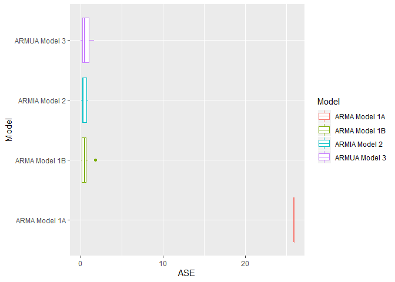
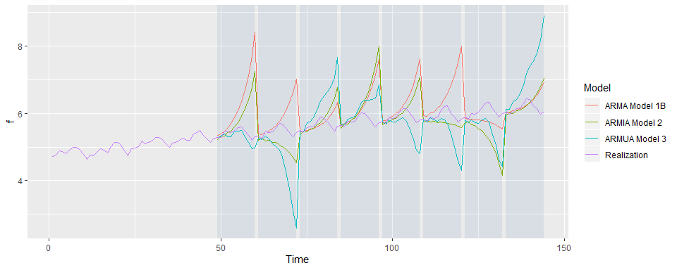
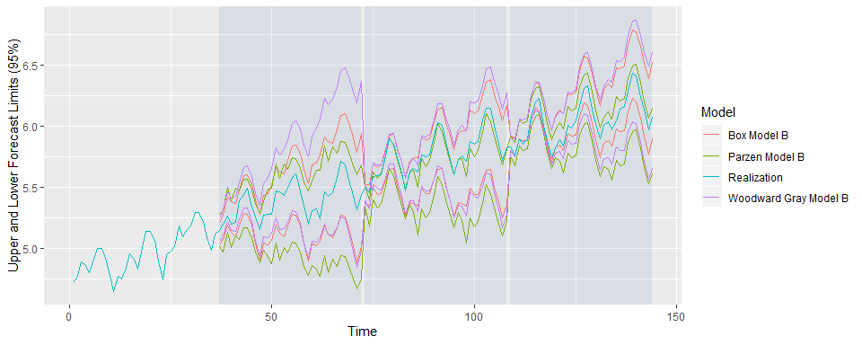
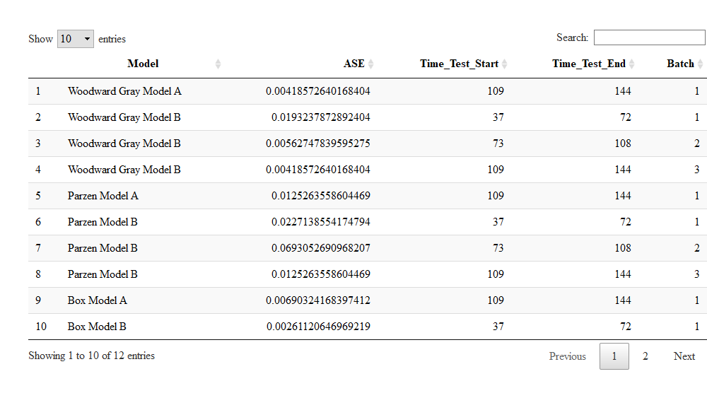
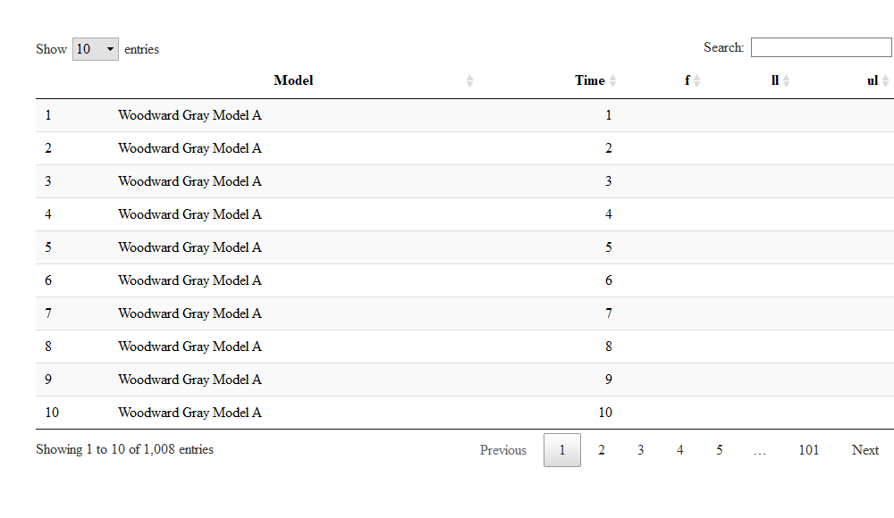

Model Compare Univariate
================
Nikhil Gupta
2020-03-12 17:22:32

``` r
library(tswge)
library(tswgewrapped)
library(tidyverse)
```

``` r
source("ModelCompareUnivariate.R")
```

``` r
data("airlog")

# Woodward Gray Airline Model
phi_wg = c(-0.36, -0.05, -0.14, -0.11, 0.04, 0.09, -0.02, 0.02, 0.17, 0.03, -0.10, -0.38)
d_wg = 1
s_wg = 12

# Parzen Model
phi_pz = c(0.7400, 0.0000, 0.0000, 0.0000, 0.0000, 0.0000, 0.0000, 0.0000, 0.0000, 0.0000, 0.0000, 0.3800, -0.2812)
s_pz = 12

# Box Model
d_bx = 1
s_bx = 12  
theta_bx =  c(0.40, 0.00, 0.00, 0.00, 0.00, 0.00, 0.00, 0.00, 0.00, 0.00, 0.00, 0.60, -0.24)


models = list("Woodward Gray Model A" = list(phi = phi_wg, d = d_wg, s = s_wg, sliding_ase = FALSE),
              "Woodward Gray Model B" = list(phi = phi_wg, d = d_wg, s = s_wg, sliding_ase = TRUE),
              "Parzen Model A" = list(phi = phi_pz, s = s_pz, sliding_ase = FALSE),
              "Parzen Model B" = list(phi = phi_pz, s = s_pz, sliding_ase = TRUE),
              "Box Model A" = list(theta = theta_bx, d = d_bx, s = s_bx, sliding_ase = FALSE),
              "Box Model B" = list(theta = theta_bx, d = d_bx, s = s_bx, sliding_ase = TRUE)
              )
```

``` r
mdl_compare = ModelCompareUnivariate$new(x = airlog, mdl_list = models, n.ahead = 36, batch_size = 72)
```

    ## 
    ## 
    ## 
    ## Computing metrics for:  Woodward Gray Model A

    ## Warning in private$sliding_ase(x = self$get_x(), phi = self$get_models()
    ## [[name]][["phi"]], : Batch Size has not been specified. Will assume a
    ## single batch

    ## 
    ## Number of batches expected:  1 
    ## 
    ## 
    ## 
    ## Computing metrics for:  Woodward Gray Model B 
    ## Number of batches expected:  3 
    ## 
    ## 
    ## 
    ## Computing metrics for:  Parzen Model A

    ## Warning in private$sliding_ase(x = self$get_x(), phi = self$get_models()
    ## [[name]][["phi"]], : Batch Size has not been specified. Will assume a
    ## single batch

    ## 
    ## Number of batches expected:  1 
    ## 
    ## 
    ## 
    ## Computing metrics for:  Parzen Model B 
    ## Number of batches expected:  3 
    ## 
    ## 
    ## 
    ## Computing metrics for:  Box Model A

    ## Warning in private$sliding_ase(x = self$get_x(), phi = self$get_models()
    ## [[name]][["phi"]], : Batch Size has not been specified. Will assume a
    ## single batch

    ## 
    ## Number of batches expected:  1 
    ## 
    ## 
    ## 
    ## Computing metrics for:  Box Model B 
    ## Number of batches expected:  3

``` r
mdl_compare$plot_histogram_ases()
```



``` r
mdl_compare$plot_forecasts(only_sliding = TRUE)
```



``` r
mdl_compare$statistical_compare()  
```

    ##             Df   Sum Sq   Mean Sq F value Pr(>F)
    ## Model        2 0.001460 0.0007298   2.197  0.192
    ## Residuals    6 0.001993 0.0003322               
    ## 
    ## 
    ##   Tukey multiple comparisons of means
    ##     95% family-wise confidence level
    ## 
    ## Fit: aov(formula = ASE ~ Model, data = results)
    ## 
    ## $Model
    ##                                              diff         lwr        upr
    ## Parzen Model B-Box Model B            0.028566162 -0.01709432 0.07422664
    ## Woodward Gray Model B-Box Model B     0.003429999 -0.04223048 0.04909048
    ## Woodward Gray Model B-Parzen Model B -0.025136163 -0.07079665 0.02052432
    ##                                          p adj
    ## Parzen Model B-Box Model B           0.2134940
    ## Woodward Gray Model B-Box Model B    0.9712778
    ## Woodward Gray Model B-Parzen Model B 0.2838256

    ## Call:
    ##    aov(formula = ASE ~ Model, data = results)
    ## 
    ## Terms:
    ##                       Model   Residuals
    ## Sum of Squares  0.001459617 0.001993128
    ## Deg. of Freedom           2           6
    ## 
    ## Residual standard error: 0.01822602
    ## Estimated effects may be unbalanced

``` r
# Only compares models that have sliding_ase calculations, since we need more than 1 result per model
```

``` r
ASEs = mdl_compare$get_tabular_metrics(ases = TRUE)
DT::datatable(ASEs)
```



``` r
forecasts = mdl_compare$get_tabular_metrics(ases = FALSE)
DT::datatable(forecasts)
```


