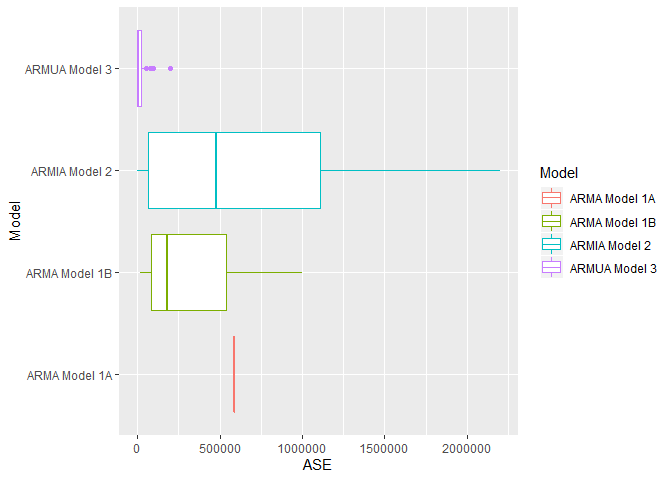

Model Compare Univariate
================
Nikhil Gupta
2020-03-08 16:53:53

``` r
library(tswge)
```

    ## Warning: package 'tswge' was built under R version 3.5.3

``` r
library(tswgewrapped)
library(tidyverse)
```

    ## Warning: package 'tidyverse' was built under R version 3.5.3

    ## -- Attaching packages -------------------------------------------------------------------------------------------- tidyverse 1.2.1 --

    ## v ggplot2 3.2.0     v purrr   0.3.2
    ## v tibble  2.1.3     v dplyr   0.8.3
    ## v tidyr   0.8.3     v stringr 1.4.0
    ## v readr   1.3.1     v forcats 0.4.0

    ## Warning: package 'ggplot2' was built under R version 3.5.3

    ## Warning: package 'tibble' was built under R version 3.5.3

    ## Warning: package 'tidyr' was built under R version 3.5.3

    ## Warning: package 'readr' was built under R version 3.5.2

    ## Warning: package 'purrr' was built under R version 3.5.3

    ## Warning: package 'dplyr' was built under R version 3.5.3

    ## Warning: package 'stringr' was built under R version 3.5.3

    ## Warning: package 'forcats' was built under R version 3.5.3

    ## -- Conflicts ----------------------------------------------------------------------------------------------- tidyverse_conflicts() --
    ## x dplyr::filter() masks stats::filter()
    ## x dplyr::lag()    masks stats::lag()

``` r
source("ModelCompareUnivariate.R")
```

    ## Warning: package 'R6' was built under R version 3.5.3

``` r
data("airlog")

models = list("ARMA Model 1A" = list(phi = c(0.5, 1), theta = c(0.5), sliding_ase = FALSE),
              "ARMA Model 1B" = list(phi = c(0.5, 1), theta = c(0.5), sliding_ase = TRUE),
              "ARMIA Model 2" = list(phi = c(0.5, 1), p = 2, d = 1, sliding_ase = TRUE),
              "ARMUA Model 3" = list(phi = c(0.5, 1), d = 1, s = 12, sliding_ase = TRUE))
```

``` r
mdl_compare = ModelCompareUnivariate$new(x = airlog, mdl_list = models, n.ahead = 36, batch_size = 108)
```

    ## Warning in sliding_ase(x = self$get_x(), phi = self$get_models()[[name]]
    ## [["phi"]], : Batch Size has not been specified. Will assume a single batch

``` r
mdl_compare$plot_histogram_ases()
```


