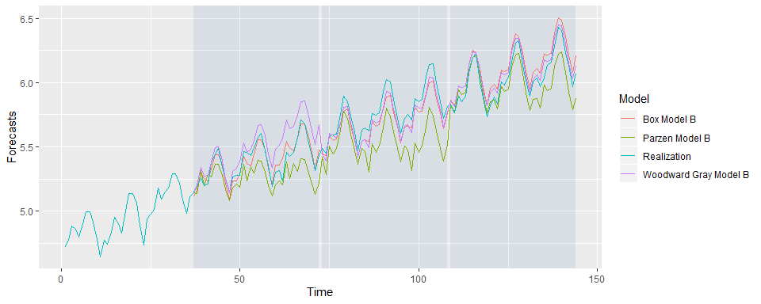

Model Compare Univariate
================
Nikhil Gupta
2020-03-11 21:35:06

``` r
library(tswge)
```

    ## Warning: package 'tswge' was built under R version 3.5.3

``` r
library(tswgewrapped)
library(tidyverse)
```

    ## Warning: package 'tidyverse' was built under R version 3.5.3

    ## -- Attaching packages ----------------------------------------------------------------------------------------------------- tidyverse 1.2.1 --

    ## v ggplot2 3.2.0     v purrr   0.3.2
    ## v tibble  2.1.3     v dplyr   0.8.3
    ## v tidyr   0.8.3     v stringr 1.4.0
    ## v readr   1.3.1     v forcats 0.4.0

    ## Warning: package 'ggplot2' was built under R version 3.5.3

    ## Warning: package 'tibble' was built under R version 3.5.3

    ## Warning: package 'tidyr' was built under R version 3.5.3

    ## Warning: package 'readr' was built under R version 3.5.2

    ## Warning: package 'purrr' was built under R version 3.5.3

    ## Warning: package 'dplyr' was built under R version 3.5.3

    ## Warning: package 'stringr' was built under R version 3.5.3

    ## Warning: package 'forcats' was built under R version 3.5.3

    ## -- Conflicts -------------------------------------------------------------------------------------------------------- tidyverse_conflicts() --
    ## x dplyr::filter() masks stats::filter()
    ## x dplyr::lag()    masks stats::lag()

``` r
source("ModelCompareUnivariate.R")
```

    ## Warning: package 'R6' was built under R version 3.5.3

``` r
data("airlog")

models = list("ARMA Model 1A" = list(phi = c(0.5, 1), theta = c(0.5), sliding_ase = FALSE),
              "ARMA Model 1B" = list(phi = c(0.5, 1), theta = c(0.5), sliding_ase = TRUE),
              "ARMIA Model 2" = list(phi = c(0.5, 1), p = 2, d = 1, sliding_ase = TRUE),
              "ARMUA Model 3" = list(phi = c(0.5, 1), d = 1, s = 12, sliding_ase = TRUE))
```

``` r
mdl_compare = ModelCompareUnivariate$new(x = airlog, mdl_list = models, n.ahead = 12, batch_size = 60)
```

    ## Computing metrics for:  ARMA Model 1A

    ## Warning in private$sliding_ase(x = self$get_x(), phi = self$get_models()
    ## [[name]][["phi"]], : Batch Size has not been specified. Will assume a
    ## single batch

    ## 
    ## Number of batches expected:  1 
    ## Computing metrics for:  ARMA Model 1B 
    ## Number of batches expected:  8 
    ## Computing metrics for:  ARMIA Model 2 
    ## Number of batches expected:  8 
    ## Computing metrics for:  ARMUA Model 3 
    ## Number of batches expected:  8

``` r
mdl_compare$plot_histogram_ases()
```


``` r
mdl_compare$plot_forecasts(only_sliding = TRUE)
```



``` r
mdl_compare$statistical_compare()  
```

    ##             Df Sum Sq Mean Sq F value Pr(>F)    
    ## Model        3  616.9  205.62   743.3 <2e-16 ***
    ## Residuals   21    5.8    0.28                   
    ## ---
    ## Signif. codes:  0 '***' 0.001 '**' 0.01 '*' 0.05 '.' 0.1 ' ' 1
    ## 
    ## 
    ##   Tukey multiple comparisons of means
    ##     95% family-wise confidence level
    ## 
    ## Fit: aov(formula = ASE ~ Model, data = results)
    ## 
    ## $Model
    ##                                    diff         lwr         upr     p adj
    ## ARMA Model 1B-ARMA Model 1A -25.3309119 -26.8858531 -23.7759707 0.0000000
    ## ARMIA Model 2-ARMA Model 1A -25.4779990 -27.0329403 -23.9230578 0.0000000
    ## ARMUA Model 3-ARMA Model 1A -25.2215646 -26.7765058 -23.6666234 0.0000000
    ## ARMIA Model 2-ARMA Model 1B  -0.1470871  -0.8800935   0.5859192 0.9429453
    ## ARMUA Model 3-ARMA Model 1B   0.1093473  -0.6236590   0.8423536 0.9751573
    ## ARMUA Model 3-ARMIA Model 2   0.2564344  -0.4765719   0.9894408 0.7648553

    ## Call:
    ##    aov(formula = ASE ~ Model, data = results)
    ## 
    ## Terms:
    ##                    Model Residuals
    ## Sum of Squares  616.8658    5.8092
    ## Deg. of Freedom        3        21
    ## 
    ## Residual standard error: 0.5259562
    ## Estimated effects may be unbalanced

``` r
# Only compares models that have sliding_ase calculations, since we need more than 1 result per model
```

``` r
mdl_compare$get_tabular_metrics(ases = TRUE)
```

    ## # A tibble: 25 x 3
    ##    Model             ASE  Time
    ##    <chr>           <dbl> <dbl>
    ##  1 ARMA Model 1A 25.9      133
    ##  2 ARMA Model 1B  1.82      49
    ##  3 ARMA Model 1B  0.449     61
    ##  4 ARMA Model 1B  0.0952    73
    ##  5 ARMA Model 1B  0.635     85
    ##  6 ARMA Model 1B  0.572     97
    ##  7 ARMA Model 1B  0.868    109
    ##  8 ARMA Model 1B  0.125    121
    ##  9 ARMA Model 1B  0.127    133
    ## 10 ARMIA Model 2  0.667     49
    ## # ... with 15 more rows

``` r
mdl_compare$get_tabular_metrics(ases = FALSE)
```

    ## # A tibble: 720 x 5
    ##    Model          Time     f    ll    ul
    ##    <chr>         <dbl> <dbl> <dbl> <dbl>
    ##  1 ARMA Model 1A     1    NA    NA    NA
    ##  2 ARMA Model 1A     2    NA    NA    NA
    ##  3 ARMA Model 1A     3    NA    NA    NA
    ##  4 ARMA Model 1A     4    NA    NA    NA
    ##  5 ARMA Model 1A     5    NA    NA    NA
    ##  6 ARMA Model 1A     6    NA    NA    NA
    ##  7 ARMA Model 1A     7    NA    NA    NA
    ##  8 ARMA Model 1A     8    NA    NA    NA
    ##  9 ARMA Model 1A     9    NA    NA    NA
    ## 10 ARMA Model 1A    10    NA    NA    NA
    ## # ... with 710 more rows
