GDP Prediction
================
Nikhil Gupta
2020-03-28 14:31:29

## Setup

``` r
library(tswge)
library(tswgewrapped)
library(tidyverse)
library(ggplot2)
library(tseries)
library(RColorBrewer)
library(reshape2)
```

``` r
data = read.csv("../data/economic_indicators_all_ex_3mo_china.csv")
data %>% glimpse()
```

    ## Observations: 195
    ## Variables: 20
    ## $ date              <fct> 1971 Q1, 1971 Q2, 1971 Q3, 1971 Q4, 1972 Q1, 1…
    ## $ gdp_change        <dbl> 18.2, 7.7, 7.6, 4.4, 14.3, 12.1, 7.9, 12.4, 15…
    ## $ unrate            <dbl> 6.0, 5.9, 6.0, 6.0, 5.8, 5.7, 5.5, 5.2, 4.9, 4…
    ## $ nfjobschg         <dbl> 0.096056052, 0.556025967, 0.505234794, 0.69120…
    ## $ treas10yr         <dbl> 5.53, 6.70, 6.00, 5.89, 6.12, 6.15, 6.54, 6.41…
    ## $ fedintrate        <dbl> 3.71, 4.91, 5.55, 4.14, 3.83, 4.46, 4.87, 5.33…
    ## $ personincomechg   <dbl> 4.7, 4.9, 3.8, 5.2, 3.6, 3.2, 4.7, 7.6, 7.9, 7…
    ## $ cpichg            <dbl> 0.5025126, 1.5000000, 0.4926108, 0.7352941, 0.…
    ## $ popchg            <dbl> 0.2946422, 0.2908775, 0.3218315, 0.2876627, 0.…
    ## $ housingpermitschg <dbl> -0.4527448, 8.1864696, 4.8870205, 6.8637275, -…
    ## $ homeownership     <dbl> 64.0, 64.1, 64.4, 64.5, 64.3, 64.5, 64.3, 64.4…
    ## $ corpprofitchg     <dbl> 12.7497657, 3.7704482, 6.6068568, 3.2925583, 5…
    ## $ inventorieschg    <dbl> 1.4133990, 0.8875532, 1.2661519, 0.1830707, 0.…
    ## $ crude_wtichg      <dbl> 0.0000000, 0.0000000, 0.0000000, 0.0000000, 0.…
    ## $ ppichg            <dbl> 1.8867925, 1.0582011, 0.2617801, 0.7832898, 1.…
    ## $ ipichg            <dbl> 0.4683401, 1.4955435, 0.7421236, 2.3442537, 4.…
    ## $ wilshirechg       <dbl> 12.0000000, 0.8928571, -0.8849558, 5.3571429, …
    ## $ goldchg           <dbl> 3.8127090, 3.6082474, 5.6592040, 2.4131842, 11…
    ## $ japanchg          <dbl> -0.14002011, -0.02990053, -5.42533850, -5.3098…
    ## $ ukchg             <dbl> 0.536204173, 0.004134452, 2.091946420, 2.31635…

``` r
data <- data %>% dplyr::select(c(gdp_change, nfjobschg, ipichg, treas10yr, fedintrate, cpichg, inventorieschg, ppichg, popchg, homeownership, corpprofitchg, personincomechg, housingpermitschg))

#data <- data %>% dplyr::select(c(gdp_change, inventorieschg, personincomechg, housingpermitschg))
```

# CCF Analysis

``` r
lag.max = 12
```

``` r
var_interest = 'gdp_change'

for (name in colnames(data)){
  # By convention, the X2 variable comes first
  c = ccf(data[name], data[var_interest], lag.max = lag.max)
  index = which(abs(c$acf[,1,1]) == max(abs(c$acf[,1,1])))
  max_ccf = c$lag[,1,1][index] 
  cat(paste("\nFor variable: ", name, " , max cross-correlation is at lag: ", max_ccf, sep = ""))
}
```

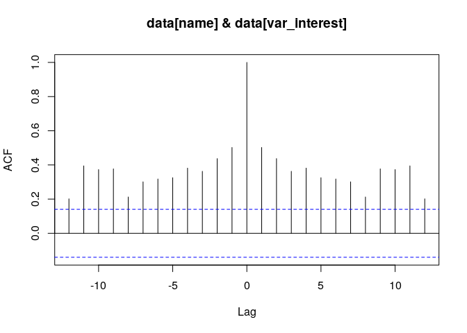<!-- -->

    ## 
    ## For variable: gdp_change , max cross-correlation is at lag: 0

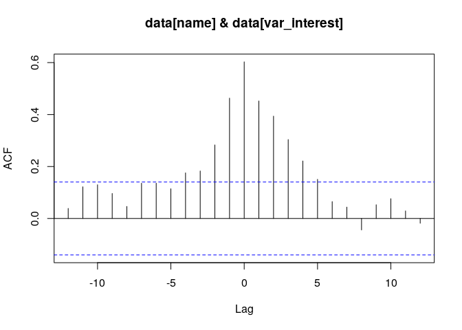<!-- -->

    ## 
    ## For variable: nfjobschg , max cross-correlation is at lag: 0

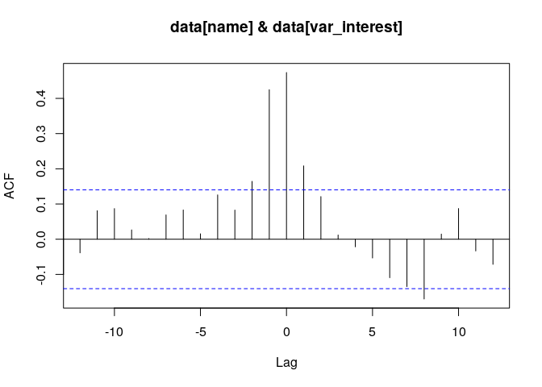<!-- -->

    ## 
    ## For variable: ipichg , max cross-correlation is at lag: 0

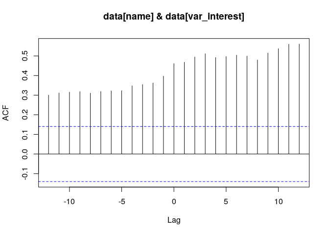<!-- -->

    ## 
    ## For variable: treas10yr , max cross-correlation is at lag: 12

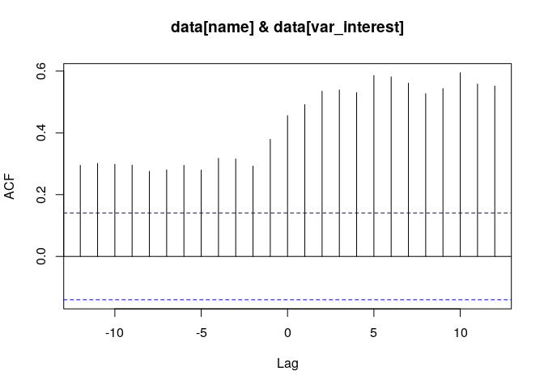<!-- -->

    ## 
    ## For variable: fedintrate , max cross-correlation is at lag: 10

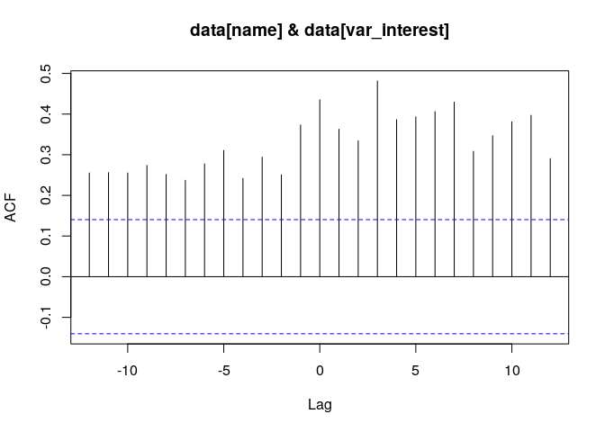<!-- -->

    ## 
    ## For variable: cpichg , max cross-correlation is at lag: 3

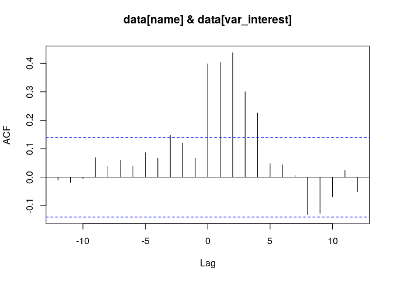<!-- -->

    ## 
    ## For variable: inventorieschg , max cross-correlation is at lag: 2

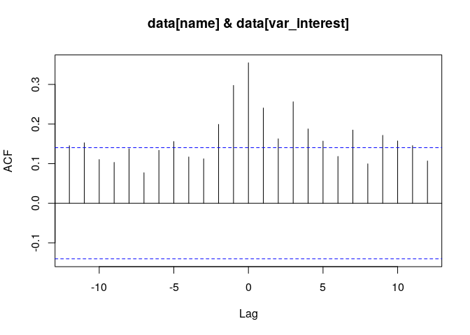<!-- -->

    ## 
    ## For variable: ppichg , max cross-correlation is at lag: 0

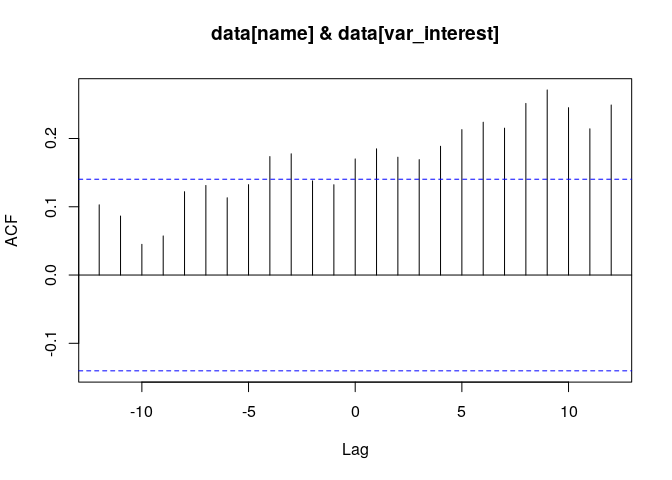<!-- -->

    ## 
    ## For variable: popchg , max cross-correlation is at lag: 9

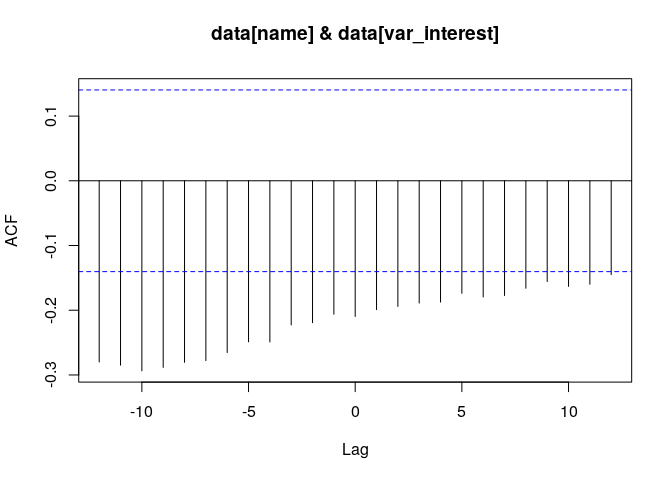<!-- -->

    ## 
    ## For variable: homeownership , max cross-correlation is at lag: -10

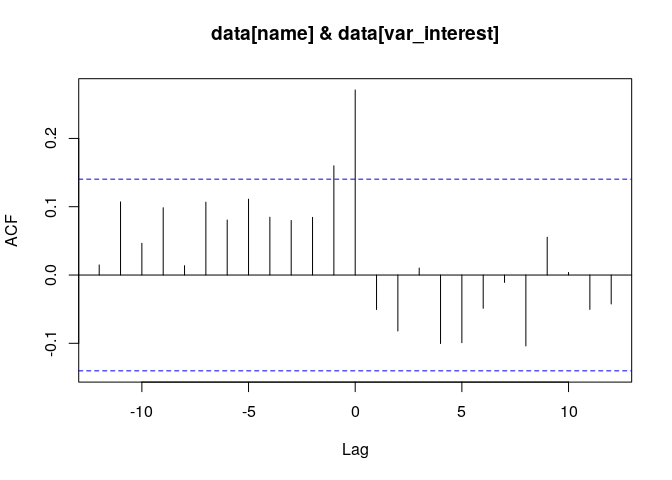<!-- -->

    ## 
    ## For variable: corpprofitchg , max cross-correlation is at lag: 0

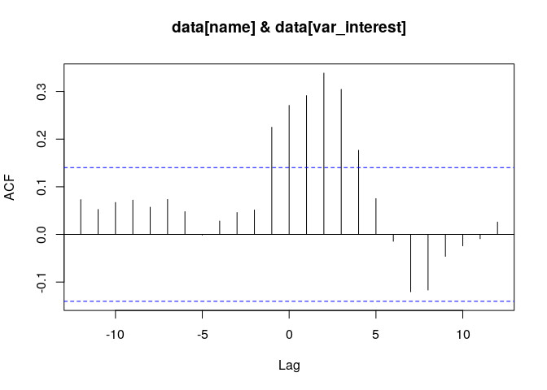<!-- -->

    ## 
    ## For variable: personincomechg , max cross-correlation is at lag: 2

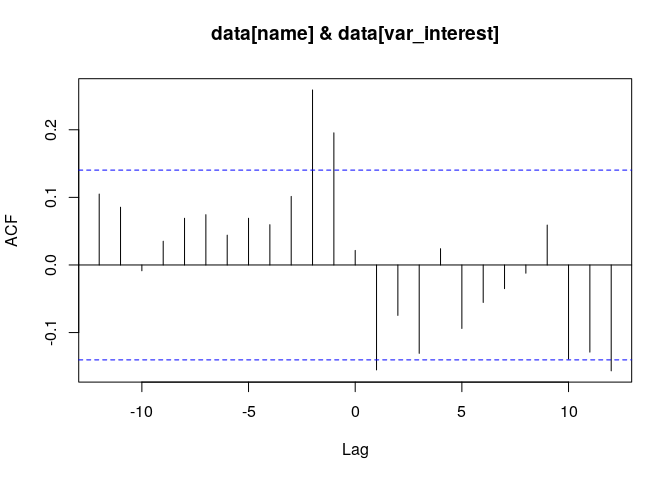<!-- -->

    ## 
    ## For variable: housingpermitschg , max cross-correlation is at lag: -2

  - TODO: Add some notes here

  - We will use lag.max = 12 in VARselect to give it enough room to pick
    the best model.

## Backward Variable Selection

We start with the following variables in the model. AIC is used for
selection criteria.

gdp\_change nfjobschg ipichg treas10yr fedintrate cpichg inventorieschg
ppichg popchg homeownership corpprofitchg personincomechg
housingpermitschg

### VAR with `trend_type = Trend`

#### Iteration 1

The following variables were selected in iteration one.

personincomechg housingpermitschg fedintrate nfjobschg ipichg

AIC selected a model of lag 12 and lag 12 is used in at least one of the
variables.

``` r
lag.max = 12
  
models = list(
                "VARS AIC Trend"    = list(select = "aic", trend_type = "trend", lag.max = lag.max)
                )
var_interest = 'gdp_change'

mdl_build = ModelBuildMultivariateVAR$new(data = data, var_interest = var_interest,
                                            mdl_list = models, verbose = 1)
```

    ## 
    ## 
    ## 
    ## Model:  VARS AIC Trend 
    ## Trend type:  trend 
    ## 
    ## VARselect Object:
    ## $selection
    ## AIC(n)  HQ(n)  SC(n) FPE(n) 
    ##     12     12      1     12 
    ## 
    ## $criteria
    ##                  1            2            3            4            5
    ## AIC(n) -4.34419014 -4.919643721 -5.869926829 -6.188252201 -6.361582021
    ## HQ(n)  -3.05033678 -2.424355092 -2.173202935 -1.290093040 -0.261987595
    ## SC(n)  -1.15224216  1.236255949  3.249924534  5.895550855  8.686172728
    ## FPE(n)  0.01303267  0.007510603  0.003098819  0.002563348  0.002685188
    ##                   6            7           8            9            10
    ## AIC(n) -6.497434040 -6.488937205 -7.17523085 -8.361602475 -10.551763625
    ## HQ(n)   0.803595652  2.013527753  2.52866938  2.543733014   1.555007131
    ## SC(n)  11.514272402 14.486720930 16.76437898 18.541959046  19.315749590
    ## FPE(n)  0.003312405  0.005610448  0.00602407  0.005509778   0.003064579
    ##                   11            12
    ## AIC(n) -13.340088112 -1.843828e+01
    ## HQ(n)   -0.031882090 -3.928644e+00
    ## SC(n)   19.491376796  1.735713e+01
    ## FPE(n)   0.002120881  6.600086e-04
    ## 
    ## Lag K to use for the VAR Model:  12 
    ## 
    ## 
    ## Printing summary of the VAR fit for the variable of interest: gdp_change
    ## 
    ## Call:
    ## lm(formula = y ~ -1 + ., data = datamat)
    ## 
    ## Residuals:
    ##      Min       1Q   Median       3Q      Max 
    ## -2.34763 -0.60012 -0.02455  0.57149  2.82637 
    ## 
    ## Coefficients:
    ##                         Estimate Std. Error t value Pr(>|t|)   
    ## gdp_change.l1         -4.480e-01  2.082e-01  -2.152  0.04089 * 
    ## nfjobschg.l1           2.652e+00  2.659e+00   0.998  0.32769   
    ## ipichg.l1             -7.609e-02  5.537e-01  -0.137  0.89176   
    ## treas10yr.l1          -1.996e+00  1.030e+00  -1.938  0.06353 . 
    ## fedintrate.l1          2.176e+00  7.328e-01   2.970  0.00633 **
    ## cpichg.l1             -2.612e-01  1.334e+00  -0.196  0.84630   
    ## inventorieschg.l1      2.189e-01  7.339e-01   0.298  0.76792   
    ## ppichg.l1              1.058e-01  4.521e-01   0.234  0.81682   
    ## popchg.l1              3.486e+01  4.143e+01   0.841  0.40775   
    ## homeownership.l1       2.645e-02  1.701e+00   0.016  0.98771   
    ## corpprofitchg.l1      -1.040e-01  9.335e-02  -1.114  0.27552   
    ## personincomechg.l1     2.329e-01  5.004e-01   0.465  0.64550   
    ## housingpermitschg.l1   1.502e-01  6.547e-02   2.295  0.03008 * 
    ## gdp_change.l2          1.132e-01  2.290e-01   0.494  0.62518   
    ## nfjobschg.l2           2.715e+00  2.625e+00   1.035  0.31042   
    ## ipichg.l2             -4.640e-01  5.375e-01  -0.863  0.39586   
    ## treas10yr.l2          -1.093e+00  1.497e+00  -0.730  0.47211   
    ## fedintrate.l2         -1.279e+00  8.453e-01  -1.513  0.14222   
    ## cpichg.l2             -6.322e-01  1.254e+00  -0.504  0.61853   
    ## inventorieschg.l2     -5.347e-01  7.042e-01  -0.759  0.45449   
    ## ppichg.l2              1.941e-01  4.182e-01   0.464  0.64634   
    ## popchg.l2             -1.863e+00  4.790e+01  -0.039  0.96928   
    ## homeownership.l2       3.078e+00  2.074e+00   1.484  0.14973   
    ## corpprofitchg.l2      -6.067e-02  9.618e-02  -0.631  0.53364   
    ## personincomechg.l2    -1.488e+00  5.865e-01  -2.537  0.01753 * 
    ## housingpermitschg.l2   9.015e-02  8.114e-02   1.111  0.27672   
    ## gdp_change.l3         -2.356e-01  2.544e-01  -0.926  0.36290   
    ## nfjobschg.l3          -4.261e-01  2.617e+00  -0.163  0.87193   
    ## ipichg.l3              9.455e-02  6.212e-01   0.152  0.88021   
    ## treas10yr.l3           5.790e-01  1.112e+00   0.521  0.60704   
    ## fedintrate.l3          9.957e-01  8.696e-01   1.145  0.26261   
    ## cpichg.l3             -1.094e+00  1.447e+00  -0.756  0.45654   
    ## inventorieschg.l3     -3.000e-01  8.000e-01  -0.375  0.71072   
    ## ppichg.l3              3.173e-02  5.385e-01   0.059  0.95347   
    ## popchg.l3              3.791e+01  4.579e+01   0.828  0.41527   
    ## homeownership.l3      -2.193e+00  2.033e+00  -1.079  0.29063   
    ## corpprofitchg.l3       5.864e-02  8.523e-02   0.688  0.49749   
    ## personincomechg.l3    -2.868e-01  6.334e-01  -0.453  0.65450   
    ## housingpermitschg.l3   1.009e-01  6.976e-02   1.446  0.16012   
    ## gdp_change.l4          3.666e-01  2.737e-01   1.339  0.19205   
    ## nfjobschg.l4           9.965e-01  2.415e+00   0.413  0.68326   
    ## ipichg.l4             -7.510e-01  6.037e-01  -1.244  0.22459   
    ## treas10yr.l4           5.796e-01  1.275e+00   0.455  0.65317   
    ## fedintrate.l4         -6.377e-01  7.123e-01  -0.895  0.37884   
    ## cpichg.l4              2.669e+00  1.491e+00   1.790  0.08518 . 
    ## inventorieschg.l4     -4.610e-01  8.162e-01  -0.565  0.57704   
    ## ppichg.l4             -7.220e-01  4.812e-01  -1.500  0.14556   
    ## popchg.l4             -9.396e+01  4.698e+01  -2.000  0.05606 . 
    ## homeownership.l4       1.024e+00  1.991e+00   0.514  0.61134   
    ## corpprofitchg.l4       8.628e-02  8.252e-02   1.046  0.30537   
    ## personincomechg.l4     7.873e-01  7.002e-01   1.124  0.27115   
    ## housingpermitschg.l4   5.643e-03  6.239e-02   0.090  0.92864   
    ## gdp_change.l5          9.750e-02  2.524e-01   0.386  0.70247   
    ## nfjobschg.l5           6.770e+00  2.412e+00   2.807  0.00935 **
    ## ipichg.l5             -1.785e+00  7.479e-01  -2.387  0.02454 * 
    ## treas10yr.l5           3.192e-02  1.411e+00   0.023  0.98212   
    ## fedintrate.l5         -8.453e-02  7.227e-01  -0.117  0.90778   
    ## cpichg.l5             -7.787e-01  1.476e+00  -0.528  0.60232   
    ## inventorieschg.l5      5.467e-01  7.967e-01   0.686  0.49865   
    ## ppichg.l5              4.148e-01  4.978e-01   0.833  0.41228   
    ## popchg.l5              1.659e+01  4.518e+01   0.367  0.71636   
    ## homeownership.l5       2.919e+00  2.150e+00   1.358  0.18626   
    ## corpprofitchg.l5       1.333e-01  8.959e-02   1.488  0.14871   
    ## personincomechg.l5     2.093e-01  6.533e-01   0.320  0.75124   
    ## housingpermitschg.l5  -8.056e-02  6.826e-02  -1.180  0.24865   
    ## gdp_change.l6         -1.952e-01  3.020e-01  -0.646  0.52372   
    ## nfjobschg.l6           3.328e+00  3.364e+00   0.989  0.33166   
    ## ipichg.l6             -3.805e-01  8.010e-01  -0.475  0.63872   
    ## treas10yr.l6          -2.178e+00  1.196e+00  -1.821  0.08010 . 
    ## fedintrate.l6         -2.718e-02  7.564e-01  -0.036  0.97160   
    ## cpichg.l6              1.963e+00  1.750e+00   1.122  0.27225   
    ## inventorieschg.l6      3.586e-01  9.107e-01   0.394  0.69695   
    ## ppichg.l6             -9.730e-01  5.773e-01  -1.685  0.10387   
    ## popchg.l6             -5.245e+01  4.534e+01  -1.157  0.25790   
    ## homeownership.l6      -2.678e+00  2.452e+00  -1.092  0.28469   
    ## corpprofitchg.l6       1.687e-01  9.697e-02   1.740  0.09373 . 
    ## personincomechg.l6    -1.297e+00  6.399e-01  -2.026  0.05311 . 
    ## housingpermitschg.l6   1.058e-02  7.378e-02   0.143  0.88710   
    ## gdp_change.l7          3.602e-02  2.436e-01   0.148  0.88361   
    ## nfjobschg.l7          -6.114e+00  2.935e+00  -2.083  0.04719 * 
    ## ipichg.l7              4.597e-01  7.092e-01   0.648  0.52255   
    ## treas10yr.l7           7.074e-01  1.136e+00   0.622  0.53906   
    ## fedintrate.l7          9.629e-01  6.928e-01   1.390  0.17639   
    ## cpichg.l7              8.047e-01  1.382e+00   0.582  0.56538   
    ## inventorieschg.l7     -1.641e+00  9.918e-01  -1.655  0.10999   
    ## ppichg.l7             -3.611e-01  3.956e-01  -0.913  0.36974   
    ## popchg.l7             -7.884e+00  4.424e+01  -0.178  0.85992   
    ## homeownership.l7       3.207e+00  2.706e+00   1.185  0.24671   
    ## corpprofitchg.l7       1.323e-01  9.053e-02   1.462  0.15579   
    ## personincomechg.l7    -2.670e-01  6.643e-01  -0.402  0.69104   
    ## housingpermitschg.l7  -1.751e-02  7.428e-02  -0.236  0.81554   
    ## gdp_change.l8         -6.644e-01  2.857e-01  -2.325  0.02814 * 
    ## nfjobschg.l8          -4.083e+00  2.810e+00  -1.453  0.15822   
    ## ipichg.l8              1.446e+00  7.425e-01   1.947  0.06244 . 
    ## treas10yr.l8          -5.165e-01  1.286e+00  -0.402  0.69132   
    ## fedintrate.l8          4.206e-01  6.502e-01   0.647  0.52340   
    ## cpichg.l8              1.030e-01  1.423e+00   0.072  0.94286   
    ## inventorieschg.l8      2.932e-01  8.752e-01   0.335  0.74032   
    ## ppichg.l8              2.113e-02  4.202e-01   0.050  0.96027   
    ## popchg.l8              2.102e+01  4.688e+01   0.448  0.65768   
    ## homeownership.l8      -3.849e+00  2.384e+00  -1.614  0.11852   
    ## corpprofitchg.l8       9.309e-02  9.114e-02   1.021  0.31647   
    ## personincomechg.l8    -2.152e-01  6.317e-01  -0.341  0.73615   
    ## housingpermitschg.l8   6.318e-05  6.524e-02   0.001  0.99923   
    ## gdp_change.l9          2.281e-01  2.854e-01   0.799  0.43134   
    ## nfjobschg.l9           5.222e-01  3.111e+00   0.168  0.86799   
    ## ipichg.l9              6.353e-01  6.054e-01   1.049  0.30368   
    ## treas10yr.l9          -1.195e+00  1.340e+00  -0.892  0.38066   
    ## fedintrate.l9          1.521e-01  5.879e-01   0.259  0.79788   
    ## cpichg.l9              1.919e+00  1.353e+00   1.418  0.16801   
    ## inventorieschg.l9     -5.813e-01  7.948e-01  -0.731  0.47105   
    ## ppichg.l9             -5.661e-01  4.086e-01  -1.386  0.17765   
    ## popchg.l9              1.008e+01  4.381e+01   0.230  0.81985   
    ## homeownership.l9      -3.811e+00  1.887e+00  -2.020  0.05378 . 
    ## corpprofitchg.l9       5.853e-02  9.581e-02   0.611  0.54655   
    ## personincomechg.l9     4.300e-01  4.781e-01   0.899  0.37665   
    ## housingpermitschg.l9   5.327e-02  5.336e-02   0.998  0.32732   
    ## gdp_change.l10         3.146e-01  3.250e-01   0.968  0.34194   
    ## nfjobschg.l10          3.335e+00  3.098e+00   1.077  0.29156   
    ## ipichg.l10            -8.116e-01  5.391e-01  -1.505  0.14428   
    ## treas10yr.l10          1.177e+00  1.407e+00   0.837  0.41031   
    ## fedintrate.l10        -7.025e-01  6.014e-01  -1.168  0.25334   
    ## cpichg.l10            -1.140e+00  1.435e+00  -0.794  0.43411   
    ## inventorieschg.l10     8.574e-03  9.225e-01   0.009  0.99266   
    ## ppichg.l10            -9.371e-02  4.480e-01  -0.209  0.83595   
    ## popchg.l10             5.786e+00  4.547e+01   0.127  0.89973   
    ## homeownership.l10      6.778e-01  2.027e+00   0.334  0.74070   
    ## corpprofitchg.l10      9.947e-02  8.603e-02   1.156  0.25812   
    ## personincomechg.l10   -7.842e-01  4.994e-01  -1.570  0.12842   
    ## housingpermitschg.l10  7.730e-02  5.741e-02   1.347  0.18974   
    ## gdp_change.l11         5.330e-01  3.095e-01   1.722  0.09698 . 
    ## nfjobschg.l11         -1.565e+00  2.508e+00  -0.624  0.53819   
    ## ipichg.l11             3.623e-02  5.723e-01   0.063  0.95000   
    ## treas10yr.l11          3.635e-01  1.244e+00   0.292  0.77251   
    ## fedintrate.l11         5.631e-02  7.536e-01   0.075  0.94101   
    ## cpichg.l11             2.935e-01  1.350e+00   0.217  0.82959   
    ## inventorieschg.l11    -3.609e-01  9.016e-01  -0.400  0.69217   
    ## ppichg.l11            -3.233e-01  3.725e-01  -0.868  0.39338   
    ## popchg.l11            -8.462e+00  4.009e+01  -0.211  0.83445   
    ## homeownership.l11     -3.945e-01  1.966e+00  -0.201  0.84248   
    ## corpprofitchg.l11     -4.334e-03  9.087e-02  -0.048  0.96232   
    ## personincomechg.l11   -4.170e-01  5.153e-01  -0.809  0.42571   
    ## housingpermitschg.l11  4.868e-02  5.011e-02   0.972  0.34025   
    ## gdp_change.l12         2.575e-01  2.170e-01   1.187  0.24597   
    ## nfjobschg.l12         -1.205e+00  2.058e+00  -0.585  0.56338   
    ## ipichg.l12             1.132e-01  5.322e-01   0.213  0.83327   
    ## treas10yr.l12         -2.023e-01  1.074e+00  -0.188  0.85208   
    ## fedintrate.l12         1.472e+00  6.347e-01   2.320  0.02845 * 
    ## cpichg.l12            -2.277e+00  1.456e+00  -1.564  0.12996   
    ## inventorieschg.l12     6.901e-01  7.848e-01   0.879  0.38733   
    ## ppichg.l12             1.605e-01  3.707e-01   0.433  0.66870   
    ## popchg.l12             2.845e+01  4.047e+01   0.703  0.48823   
    ## homeownership.l12      2.276e+00  1.817e+00   1.253  0.22141   
    ## corpprofitchg.l12      7.404e-02  6.892e-02   1.074  0.29257   
    ## personincomechg.l12    3.323e-01  4.558e-01   0.729  0.47252   
    ## housingpermitschg.l12  8.617e-02  5.242e-02   1.644  0.11226   
    ## trend                 -1.511e-02  5.817e-02  -0.260  0.79715   
    ## ---
    ## Signif. codes:  0 '***' 0.001 '**' 0.01 '*' 0.05 '.' 0.1 ' ' 1
    ## 
    ## Residual standard error: 2.237 on 26 degrees of freedom
    ## Multiple R-squared:  0.9865, Adjusted R-squared:  0.905 
    ## F-statistic: 12.11 on 157 and 26 DF,  p-value: 3.287e-10

``` r
mdl_build$summarize_build()
```

    ## # A tibble: 9 x 9
    ##   Model    Selection Trend Season     K SigVar    OriginalVar    Lag MaxLag
    ##   <chr>    <chr>     <chr>  <dbl> <dbl> <chr>     <chr>        <dbl>  <dbl>
    ## 1 VARS AI… aic       trend      0    12 gdp_chan… gdp_change      -1     -8
    ## 2 VARS AI… aic       trend      0    12 fedintra… fedintrate      -1    -12
    ## 3 VARS AI… aic       trend      0    12 housingp… housingperm…    -1     -1
    ## 4 VARS AI… aic       trend      0    12 personin… personincom…    -2     -2
    ## 5 VARS AI… aic       trend      0    12 nfjobsch… nfjobschg       -5     -7
    ## 6 VARS AI… aic       trend      0    12 ipichg.l5 ipichg          -5     -5
    ## 7 VARS AI… aic       trend      0    12 nfjobsch… nfjobschg       -7     -7
    ## 8 VARS AI… aic       trend      0    12 gdp_chan… gdp_change      -8     -8
    ## 9 VARS AI… aic       trend      0    12 fedintra… fedintrate     -12    -12

#### Iteration 2

The following variables were selected in iteration two

personincomechg housingpermitschg

AIC selected a model of lag 6, but only lag 4 was significant in at
least one of the variables.

``` r
lag.max = 12
  
models = list(
                "VARS AIC Trend"    = list(select = "aic", trend_type = "trend", lag.max = lag.max)
                )
var_interest = 'gdp_change'

mdl_build = ModelBuildMultivariateVAR$new(data = data %>% dplyr::select(c(gdp_change, personincomechg, housingpermitschg,
                                                                          fedintrate, nfjobschg, ipichg)),
                                          var_interest = var_interest,
                                          mdl_list = models,
                                          verbose = 1)
```

    ## 
    ## 
    ## 
    ## Model:  VARS AIC Trend 
    ## Trend type:  trend 
    ## 
    ## VARselect Object:
    ## $selection
    ## AIC(n)  HQ(n)  SC(n) FPE(n) 
    ##      6      2      1      6 
    ## 
    ## $criteria
    ##                1         2         3         4         5         6
    ## AIC(n)  4.601079  4.156127  4.062501  4.012284  3.993433  3.960213
    ## HQ(n)   4.899661  4.710636  4.872937  5.078647  5.315722  5.538430
    ## SC(n)   5.337683  5.524105  6.061853  6.643011  7.255533  7.853688
    ## FPE(n) 99.614082 63.915742 58.381958 55.846034 55.324651 54.277468
    ##                7         8         9        10        11        12
    ## AIC(n)  4.045981  4.120470  4.073223  4.053084  3.965318  4.054599
    ## HQ(n)   5.880125  6.210541  6.419221  6.655008  6.823170  7.168378
    ## SC(n)   8.570831  9.276693  9.860821 10.472056 11.015665 11.736320
    ## FPE(n) 60.320051 66.735722 65.898029 67.489134 65.307062 76.393423
    ## 
    ## Lag K to use for the VAR Model:  6 
    ## 
    ## 
    ## Printing summary of the VAR fit for the variable of interest: gdp_change
    ## 
    ## Call:
    ## lm(formula = y ~ -1 + ., data = datamat)
    ## 
    ## Residuals:
    ##     Min      1Q  Median      3Q     Max 
    ## -6.8168 -1.4315  0.0166  1.4211 14.0245 
    ## 
    ## Coefficients:
    ##                        Estimate Std. Error t value Pr(>|t|)    
    ## gdp_change.l1         0.0346239  0.0959238   0.361 0.718637    
    ## personincomechg.l1    0.2789793  0.2390618   1.167 0.245048    
    ## housingpermitschg.l1  0.0878338  0.0247135   3.554 0.000506 ***
    ## fedintrate.l1         0.2523964  0.2301193   1.097 0.274461    
    ## nfjobschg.l1          1.8986875  1.2764744   1.487 0.138968    
    ## ipichg.l1             0.4592810  0.2515221   1.826 0.069812 .  
    ## gdp_change.l2         0.3203077  0.0960035   3.336 0.001067 ** 
    ## personincomechg.l2   -0.5530475  0.2705875  -2.044 0.042692 *  
    ## housingpermitschg.l2  0.0457488  0.0266145   1.719 0.087661 .  
    ## fedintrate.l2        -0.3822368  0.2905840  -1.315 0.190353    
    ## nfjobschg.l2          0.9399952  1.3346229   0.704 0.482314    
    ## ipichg.l2            -0.3580238  0.2564246  -1.396 0.164686    
    ## gdp_change.l3         0.1862578  0.0989596   1.882 0.061726 .  
    ## personincomechg.l3   -0.0059092  0.2531621  -0.023 0.981409    
    ## housingpermitschg.l3 -0.0006512  0.0271042  -0.024 0.980864    
    ## fedintrate.l3         0.2897290  0.2940189   0.985 0.325989    
    ## nfjobschg.l3         -1.9005508  1.3734913  -1.384 0.168468    
    ## ipichg.l3            -0.2907146  0.2605818  -1.116 0.266338    
    ## gdp_change.l4         0.2749979  0.1029432   2.671 0.008378 ** 
    ## personincomechg.l4    0.1044984  0.2476563   0.422 0.673658    
    ## housingpermitschg.l4 -0.0176942  0.0272042  -0.650 0.516401    
    ## fedintrate.l4         0.0185223  0.2915594   0.064 0.949429    
    ## nfjobschg.l4         -1.1984666  1.3611542  -0.880 0.379990    
    ## ipichg.l4             0.1747724  0.2557134   0.683 0.495351    
    ## gdp_change.l5         0.0560776  0.0965884   0.581 0.562381    
    ## personincomechg.l5   -0.0490116  0.2766822  -0.177 0.859634    
    ## housingpermitschg.l5 -0.0122592  0.0259665  -0.472 0.637522    
    ## fedintrate.l5        -0.3241073  0.2810209  -1.153 0.250589    
    ## nfjobschg.l5          0.5790697  1.3138978   0.441 0.660037    
    ## ipichg.l5            -0.0110445  0.2456569  -0.045 0.964199    
    ## gdp_change.l6         0.0208621  0.0905553   0.230 0.818107    
    ## personincomechg.l6    0.2609520  0.2238446   1.166 0.245532    
    ## housingpermitschg.l6 -0.0314223  0.0244987  -1.283 0.201581    
    ## fedintrate.l6         0.1819689  0.2266054   0.803 0.423216    
    ## nfjobschg.l6         -0.3496711  1.0168293  -0.344 0.731409    
    ## ipichg.l6             0.1593555  0.2313782   0.689 0.492047    
    ## trend                 0.0014592  0.0035087   0.416 0.678082    
    ## ---
    ## Signif. codes:  0 '***' 0.001 '**' 0.01 '*' 0.05 '.' 0.1 ' ' 1
    ## 
    ## Residual standard error: 2.79 on 152 degrees of freedom
    ## Multiple R-squared:  0.8863, Adjusted R-squared:  0.8586 
    ## F-statistic: 32.02 on 37 and 152 DF,  p-value: < 2.2e-16

``` r
mdl_build$summarize_build()
```

    ## # A tibble: 4 x 9
    ##   Model    Selection Trend Season     K SigVar    OriginalVar    Lag MaxLag
    ##   <chr>    <chr>     <chr>  <dbl> <dbl> <chr>     <chr>        <dbl>  <dbl>
    ## 1 VARS AI… aic       trend      0     6 housingp… housingperm…    -1     -1
    ## 2 VARS AI… aic       trend      0     6 gdp_chan… gdp_change      -2     -4
    ## 3 VARS AI… aic       trend      0     6 personin… personincom…    -2     -2
    ## 4 VARS AI… aic       trend      0     6 gdp_chan… gdp_change      -4     -4

#### Iteration 3

Final iteration is reached with the two variables in the model with at
least one significant variable at lag 4.

``` r
lag.max = 4
  
models = list(
                "VARS AIC Trend"    = list(select = "aic", trend_type = "trend", lag.max = lag.max)
                )
var_interest = 'gdp_change'

mdl_build = ModelBuildMultivariateVAR$new(data = data %>% dplyr::select(c(gdp_change, personincomechg, housingpermitschg)),
                                          var_interest = var_interest,
                                          mdl_list = models,
                                          verbose = 1)
```

    ## 
    ## 
    ## 
    ## Model:  VARS AIC Trend 
    ## Trend type:  trend 
    ## 
    ## VARselect Object:
    ## $selection
    ## AIC(n)  HQ(n)  SC(n) FPE(n) 
    ##      4      4      2      4 
    ## 
    ## $criteria
    ##                  1           2           3           4
    ## AIC(n)    7.684615    7.503113    7.395404    7.213149
    ## HQ(n)     7.767378    7.647950    7.602313    7.482131
    ## SC(n)     7.888946    7.860693    7.906232    7.877226
    ## FPE(n) 2174.671691 1813.858713 1628.950186 1358.017939
    ## 
    ## Lag K to use for the VAR Model:  4 
    ## 
    ## 
    ## Printing summary of the VAR fit for the variable of interest: gdp_change
    ## 
    ## Call:
    ## lm(formula = y ~ -1 + ., data = datamat)
    ## 
    ## Residuals:
    ##     Min      1Q  Median      3Q     Max 
    ## -7.7106 -1.7750  0.3221  1.7504 15.5905 
    ## 
    ## Coefficients:
    ##                        Estimate Std. Error t value Pr(>|t|)    
    ## gdp_change.l1         0.2595522  0.0716036   3.625 0.000377 ***
    ## personincomechg.l1    0.4557438  0.1906985   2.390 0.017899 *  
    ## housingpermitschg.l1  0.1016036  0.0214306   4.741 4.34e-06 ***
    ## gdp_change.l2         0.2966443  0.0740003   4.009 8.97e-05 ***
    ## personincomechg.l2   -0.8188966  0.2261471  -3.621 0.000382 ***
    ## housingpermitschg.l2  0.1005641  0.0224745   4.475 1.36e-05 ***
    ## gdp_change.l3         0.1524433  0.0742809   2.052 0.041609 *  
    ## personincomechg.l3    0.1101331  0.2329399   0.473 0.636938    
    ## housingpermitschg.l3  0.0008116  0.0229988   0.035 0.971890    
    ## gdp_change.l4         0.2273536  0.0705023   3.225 0.001500 ** 
    ## personincomechg.l4    0.2523043  0.1842385   1.369 0.172586    
    ## housingpermitschg.l4 -0.0401817  0.0216310  -1.858 0.064878 .  
    ## trend                 0.0015845  0.0028574   0.555 0.579927    
    ## ---
    ## Signif. codes:  0 '***' 0.001 '**' 0.01 '*' 0.05 '.' 0.1 ' ' 1
    ## 
    ## Residual standard error: 2.965 on 178 degrees of freedom
    ## Multiple R-squared:  0.8545, Adjusted R-squared:  0.8439 
    ## F-statistic: 80.44 on 13 and 178 DF,  p-value: < 2.2e-16

``` r
mdl_build$summarize_build()
```

    ## # A tibble: 8 x 9
    ##   Model    Selection Trend Season     K SigVar    OriginalVar    Lag MaxLag
    ##   <chr>    <chr>     <chr>  <dbl> <dbl> <chr>     <chr>        <dbl>  <dbl>
    ## 1 VARS AI… aic       trend      0     4 gdp_chan… gdp_change      -1     -4
    ## 2 VARS AI… aic       trend      0     4 personin… personincom…    -1     -2
    ## 3 VARS AI… aic       trend      0     4 housingp… housingperm…    -1     -2
    ## 4 VARS AI… aic       trend      0     4 gdp_chan… gdp_change      -2     -4
    ## 5 VARS AI… aic       trend      0     4 personin… personincom…    -2     -2
    ## 6 VARS AI… aic       trend      0     4 housingp… housingperm…    -2     -2
    ## 7 VARS AI… aic       trend      0     4 gdp_chan… gdp_change      -3     -4
    ## 8 VARS AI… aic       trend      0     4 gdp_chan… gdp_change      -4     -4

### VAR with `trend_type = Const`

#### Iteration 1

The following variables were selected in iteration one.

nfjobschg ipichg treas10yr fedintrate popchg homeownership corpprofitchg
personincomechg housingpermitschg

AIC selected a model of lag 12 and lag 12 is used in at least one of the
variables.

``` r
lag.max = 12
  
models = list(
                "VARS AIC Trend"    = list(select = "aic", trend_type = "const", lag.max = lag.max)
                )
var_interest = 'gdp_change'

mdl_build = ModelBuildMultivariateVAR$new(data = data, var_interest = var_interest,
                                            mdl_list = models, verbose = 1)
```

    ## 
    ## 
    ## 
    ## Model:  VARS AIC Trend 
    ## Trend type:  const 
    ## 
    ## VARselect Object:
    ## $selection
    ## AIC(n)  HQ(n)  SC(n) FPE(n) 
    ##     12     12      1     12 
    ## 
    ## $criteria
    ##                  1            2            3           4            5
    ## AIC(n) -4.11510343 -4.762679775 -5.831024937 -6.15876838 -6.246275859
    ## HQ(n)  -2.82125007 -2.267391146 -2.134301042 -1.26060922 -0.146681432
    ## SC(n)  -0.92315545  1.393219895  3.288826427  5.92503467  8.801478891
    ## FPE(n)  0.01638794  0.008787056  0.003221745  0.00264005  0.003013363
    ##                   6            7            8            9            10
    ## AIC(n) -6.384647512 -6.437655915 -7.222666712 -8.335066549 -10.504924620
    ## HQ(n)   0.916382180  2.064809044  2.481233512  2.570268941   1.601846136
    ## SC(n)  11.627058930 14.538002221 16.716943116 18.568494972  19.362588595
    ## FPE(n)  0.003707882  0.005905663  0.005744985  0.005657943   0.003211536
    ##                   11            12
    ## AIC(n) -13.066385903 -1.844603e+01
    ## HQ(n)    0.241820118 -3.936392e+00
    ## SC(n)   19.765079005  1.734938e+01
    ## FPE(n)   0.002788584  6.549143e-04
    ## 
    ## Lag K to use for the VAR Model:  12 
    ## 
    ## 
    ## Printing summary of the VAR fit for the variable of interest: gdp_change
    ## 
    ## Call:
    ## lm(formula = y ~ -1 + ., data = datamat)
    ## 
    ## Residuals:
    ##     Min      1Q  Median      3Q     Max 
    ## -2.1850 -0.4952  0.0150  0.5255  2.8116 
    ## 
    ## Coefficients:
    ##                         Estimate Std. Error t value Pr(>|t|)   
    ## gdp_change.l1         -4.708e-01  1.968e-01  -2.392  0.02427 * 
    ## nfjobschg.l1           1.290e+00  2.722e+00   0.474  0.63952   
    ## ipichg.l1             -1.715e-01  5.386e-01  -0.318  0.75269   
    ## treas10yr.l1          -2.007e+00  9.814e-01  -2.045  0.05109 . 
    ## fedintrate.l1          2.482e+00  7.126e-01   3.483  0.00177 **
    ## cpichg.l1             -6.431e-01  1.221e+00  -0.526  0.60301   
    ## inventorieschg.l1      1.553e-01  6.906e-01   0.225  0.82381   
    ## ppichg.l1              2.370e-01  3.943e-01   0.601  0.55293   
    ## popchg.l1              2.850e+01  3.943e+01   0.723  0.47624   
    ## homeownership.l1      -5.159e-01  1.659e+00  -0.311  0.75833   
    ## corpprofitchg.l1      -9.952e-02  8.672e-02  -1.148  0.26157   
    ## personincomechg.l1     2.739e-01  4.794e-01   0.571  0.57269   
    ## housingpermitschg.l1   1.664e-01  6.427e-02   2.589  0.01555 * 
    ## gdp_change.l2          8.505e-02  2.042e-01   0.417  0.68039   
    ## nfjobschg.l2           2.678e+00  2.530e+00   1.058  0.29956   
    ## ipichg.l2             -4.624e-01  5.151e-01  -0.898  0.37755   
    ## treas10yr.l2          -1.142e+00  1.433e+00  -0.797  0.43254   
    ## fedintrate.l2         -1.346e+00  8.145e-01  -1.652  0.11051   
    ## cpichg.l2             -5.441e-01  1.171e+00  -0.465  0.64613   
    ## inventorieschg.l2     -7.118e-01  6.700e-01  -1.062  0.29780   
    ## ppichg.l2              1.773e-01  3.834e-01   0.463  0.64750   
    ## popchg.l2             -6.459e+00  4.447e+01  -0.145  0.88564   
    ## homeownership.l2       2.709e+00  2.016e+00   1.344  0.19065   
    ## corpprofitchg.l2      -5.371e-02  7.983e-02  -0.673  0.50702   
    ## personincomechg.l2    -1.488e+00  5.617e-01  -2.650  0.01353 * 
    ## housingpermitschg.l2   1.195e-01  8.115e-02   1.473  0.15280   
    ## gdp_change.l3         -1.918e-01  2.185e-01  -0.878  0.38819   
    ## nfjobschg.l3          -7.613e-01  2.519e+00  -0.302  0.76490   
    ## ipichg.l3              1.806e-01  5.519e-01   0.327  0.74614   
    ## treas10yr.l3           4.948e-01  1.054e+00   0.469  0.64274   
    ## fedintrate.l3          1.093e+00  8.250e-01   1.325  0.19683   
    ## cpichg.l3             -1.233e+00  1.302e+00  -0.947  0.35234   
    ## inventorieschg.l3     -5.788e-01  7.967e-01  -0.726  0.47404   
    ## ppichg.l3              1.015e-01  4.473e-01   0.227  0.82222   
    ## popchg.l3              4.595e+01  4.454e+01   1.032  0.31170   
    ## homeownership.l3      -1.687e+00  1.995e+00  -0.846  0.40539   
    ## corpprofitchg.l3       6.879e-02  6.785e-02   1.014  0.32001   
    ## personincomechg.l3    -3.234e-01  6.078e-01  -0.532  0.59915   
    ## housingpermitschg.l3   1.169e-01  6.830e-02   1.712  0.09883 . 
    ## gdp_change.l4          4.666e-01  2.728e-01   1.711  0.09908 . 
    ## nfjobschg.l4           8.099e-01  2.335e+00   0.347  0.73147   
    ## ipichg.l4             -6.789e-01  5.640e-01  -1.204  0.23950   
    ## treas10yr.l4           6.691e-02  1.268e+00   0.053  0.95832   
    ## fedintrate.l4         -6.867e-01  6.882e-01  -0.998  0.32760   
    ## cpichg.l4              2.471e+00  1.445e+00   1.709  0.09927 . 
    ## inventorieschg.l4     -5.207e-01  7.497e-01  -0.695  0.49349   
    ## ppichg.l4             -7.428e-01  4.599e-01  -1.615  0.11840   
    ## popchg.l4             -1.063e+02  4.598e+01  -2.313  0.02890 * 
    ## homeownership.l4       1.145e+00  1.912e+00   0.599  0.55443   
    ## corpprofitchg.l4       1.130e-01  6.855e-02   1.649  0.11120   
    ## personincomechg.l4     8.159e-01  6.691e-01   1.219  0.23362   
    ## housingpermitschg.l4   2.192e-02  5.888e-02   0.372  0.71263   
    ## gdp_change.l5          1.786e-01  2.482e-01   0.719  0.47833   
    ## nfjobschg.l5           6.535e+00  2.331e+00   2.803  0.00943 **
    ## ipichg.l5             -1.764e+00  7.018e-01  -2.513  0.01849 * 
    ## treas10yr.l5           2.903e-01  1.328e+00   0.219  0.82872   
    ## fedintrate.l5         -1.066e-01  6.952e-01  -0.153  0.87936   
    ## cpichg.l5             -1.220e+00  1.455e+00  -0.839  0.40928   
    ## inventorieschg.l5      6.839e-01  7.334e-01   0.933  0.35964   
    ## ppichg.l5              4.305e-01  4.779e-01   0.901  0.37596   
    ## popchg.l5              2.429e+01  4.373e+01   0.555  0.58338   
    ## homeownership.l5       2.865e+00  2.074e+00   1.381  0.17899   
    ## corpprofitchg.l5       1.713e-01  7.836e-02   2.187  0.03797 * 
    ## personincomechg.l5     1.263e-01  6.315e-01   0.200  0.84302   
    ## housingpermitschg.l5  -7.140e-02  6.242e-02  -1.144  0.26311   
    ## gdp_change.l6         -8.248e-02  2.965e-01  -0.278  0.78307   
    ## nfjobschg.l6           3.257e+00  3.245e+00   1.004  0.32470   
    ## ipichg.l6             -4.425e-01  7.589e-01  -0.583  0.56485   
    ## treas10yr.l6          -2.497e+00  1.177e+00  -2.122  0.04350 * 
    ## fedintrate.l6         -5.244e-02  7.280e-01  -0.072  0.94313   
    ## cpichg.l6              1.235e+00  1.756e+00   0.704  0.48795   
    ## inventorieschg.l6      4.866e-01  8.827e-01   0.551  0.58618   
    ## ppichg.l6             -8.753e-01  5.610e-01  -1.560  0.13082   
    ## popchg.l6             -4.657e+01  4.227e+01  -1.102  0.28068   
    ## homeownership.l6      -2.321e+00  2.321e+00  -1.000  0.32660   
    ## corpprofitchg.l6       2.221e-01  8.956e-02   2.480  0.01994 * 
    ## personincomechg.l6    -1.474e+00  6.274e-01  -2.349  0.02670 * 
    ## housingpermitschg.l6   1.615e-02  5.777e-02   0.279  0.78208   
    ## gdp_change.l7          1.101e-01  2.411e-01   0.457  0.65180   
    ## nfjobschg.l7          -5.905e+00  2.760e+00  -2.139  0.04198 * 
    ## ipichg.l7              4.891e-01  6.575e-01   0.744  0.46361   
    ## treas10yr.l7           7.003e-01  1.081e+00   0.648  0.52273   
    ## fedintrate.l7          1.033e+00  6.683e-01   1.546  0.13416   
    ## cpichg.l7              6.513e-01  1.324e+00   0.492  0.62689   
    ## inventorieschg.l7     -1.589e+00  9.562e-01  -1.662  0.10851   
    ## ppichg.l7             -4.654e-01  3.883e-01  -1.199  0.24146   
    ## popchg.l7             -1.640e+01  4.312e+01  -0.380  0.70685   
    ## homeownership.l7       2.742e+00  2.633e+00   1.041  0.30726   
    ## corpprofitchg.l7       1.785e-01  8.262e-02   2.160  0.04015 * 
    ## personincomechg.l7    -2.835e-01  6.413e-01  -0.442  0.66203   
    ## housingpermitschg.l7  -1.961e-02  5.422e-02  -0.362  0.72047   
    ## gdp_change.l8         -6.281e-01  2.642e-01  -2.377  0.02507 * 
    ## nfjobschg.l8          -4.100e+00  2.648e+00  -1.549  0.13358   
    ## ipichg.l8              1.493e+00  6.574e-01   2.271  0.03167 * 
    ## treas10yr.l8          -9.064e-01  1.271e+00  -0.713  0.48213   
    ## fedintrate.l8          6.498e-01  6.490e-01   1.001  0.32601   
    ## cpichg.l8              3.307e-01  1.368e+00   0.242  0.81081   
    ## inventorieschg.l8      3.647e-01  8.274e-01   0.441  0.66299   
    ## ppichg.l8             -1.095e-01  4.089e-01  -0.268  0.79097   
    ## popchg.l8              2.569e+01  4.324e+01   0.594  0.55759   
    ## homeownership.l8      -3.871e+00  2.252e+00  -1.719  0.09748 . 
    ## corpprofitchg.l8       1.359e-01  8.005e-02   1.698  0.10146   
    ## personincomechg.l8    -1.245e-01  6.072e-01  -0.205  0.83911   
    ## housingpermitschg.l8  -3.077e-03  4.998e-02  -0.062  0.95138   
    ## gdp_change.l9          3.145e-01  2.705e-01   1.163  0.25553   
    ## nfjobschg.l9          -1.250e-01  3.026e+00  -0.041  0.96737   
    ## ipichg.l9              6.842e-01  5.840e-01   1.172  0.25201   
    ## treas10yr.l9          -1.326e+00  1.296e+00  -1.023  0.31583   
    ## fedintrate.l9          1.844e-01  5.665e-01   0.325  0.74747   
    ## cpichg.l9              2.039e+00  1.289e+00   1.582  0.12582   
    ## inventorieschg.l9     -4.707e-01  7.617e-01  -0.618  0.54197   
    ## ppichg.l9             -6.614e-01  3.929e-01  -1.683  0.10430   
    ## popchg.l9              1.619e+01  4.241e+01   0.382  0.70585   
    ## homeownership.l9      -3.864e+00  1.768e+00  -2.185  0.03806 * 
    ## corpprofitchg.l9       9.546e-02  7.656e-02   1.247  0.22357   
    ## personincomechg.l9     2.668e-01  4.751e-01   0.562  0.57919   
    ## housingpermitschg.l9   5.403e-02  4.297e-02   1.258  0.21975   
    ## gdp_change.l10         3.596e-01  2.904e-01   1.238  0.22664   
    ## nfjobschg.l10          3.388e+00  2.987e+00   1.134  0.26707   
    ## ipichg.l10            -7.914e-01  5.198e-01  -1.522  0.13996   
    ## treas10yr.l10          1.439e+00  1.343e+00   1.071  0.29389   
    ## fedintrate.l10        -6.777e-01  5.806e-01  -1.167  0.25369   
    ## cpichg.l10            -1.217e+00  1.329e+00  -0.915  0.36850   
    ## inventorieschg.l10     1.455e-01  8.437e-01   0.172  0.86444   
    ## ppichg.l10            -9.750e-02  4.151e-01  -0.235  0.81615   
    ## popchg.l10             1.936e+00  4.358e+01   0.044  0.96490   
    ## homeownership.l10      7.370e-01  1.946e+00   0.379  0.70795   
    ## corpprofitchg.l10      1.410e-01  7.741e-02   1.822  0.08005 . 
    ## personincomechg.l10   -9.052e-01  4.734e-01  -1.912  0.06693 . 
    ## housingpermitschg.l10  8.233e-02  4.758e-02   1.730  0.09543 . 
    ## gdp_change.l11         6.819e-01  2.988e-01   2.282  0.03092 * 
    ## nfjobschg.l11         -2.094e+00  2.448e+00  -0.855  0.40030   
    ## ipichg.l11             2.111e-02  5.485e-01   0.038  0.96959   
    ## treas10yr.l11          1.042e-01  1.209e+00   0.086  0.93198   
    ## fedintrate.l11         1.283e-01  7.123e-01   0.180  0.85845   
    ## cpichg.l11            -1.200e-01  1.328e+00  -0.090  0.92872   
    ## inventorieschg.l11    -5.354e-01  8.658e-01  -0.618  0.54166   
    ## ppichg.l11            -2.117e-01  3.683e-01  -0.575  0.57029   
    ## popchg.l11            -4.706e+00  3.879e+01  -0.121  0.90437   
    ## homeownership.l11      5.453e-02  1.925e+00   0.028  0.97761   
    ## corpprofitchg.l11      3.936e-02  8.599e-02   0.458  0.65093   
    ## personincomechg.l11   -4.192e-01  4.917e-01  -0.853  0.40168   
    ## housingpermitschg.l11  4.961e-02  4.500e-02   1.102  0.28040   
    ## gdp_change.l12         3.118e-01  2.128e-01   1.465  0.15496   
    ## nfjobschg.l12         -7.817e-01  1.979e+00  -0.395  0.69601   
    ## ipichg.l12             2.722e-02  5.138e-01   0.053  0.95816   
    ## treas10yr.l12          3.110e-01  1.092e+00   0.285  0.77817   
    ## fedintrate.l12         1.580e+00  6.027e-01   2.622  0.01442 * 
    ## cpichg.l12            -2.793e+00  1.430e+00  -1.953  0.06164 . 
    ## inventorieschg.l12     6.846e-01  6.963e-01   0.983  0.33456   
    ## ppichg.l12             2.349e-01  3.574e-01   0.657  0.51678   
    ## popchg.l12             3.258e+01  3.086e+01   1.055  0.30091   
    ## homeownership.l12      1.789e+00  1.758e+00   1.018  0.31811   
    ## corpprofitchg.l12      9.450e-02  6.811e-02   1.388  0.17705   
    ## personincomechg.l12    3.551e-01  4.296e-01   0.827  0.41594   
    ## housingpermitschg.l12  8.687e-02  4.884e-02   1.779  0.08699 . 
    ## const                  2.988e+01  2.123e+01   1.407  0.17125   
    ## ---
    ## Signif. codes:  0 '***' 0.001 '**' 0.01 '*' 0.05 '.' 0.1 ' ' 1
    ## 
    ## Residual standard error: 2.159 on 26 degrees of freedom
    ## Multiple R-squared:  0.9572, Adjusted R-squared:  0.7003 
    ## F-statistic: 3.727 on 156 and 26 DF,  p-value: 0.0001207

``` r
mdl_build$summarize_build()
```

    ## # A tibble: 18 x 9
    ##    Model   Selection Trend Season     K SigVar    OriginalVar    Lag MaxLag
    ##    <chr>   <chr>     <chr>  <dbl> <dbl> <chr>     <chr>        <dbl>  <dbl>
    ##  1 VARS A… aic       const      0    12 gdp_chan… gdp_change      -1    -11
    ##  2 VARS A… aic       const      0    12 fedintra… fedintrate      -1    -12
    ##  3 VARS A… aic       const      0    12 housingp… housingperm…    -1     -1
    ##  4 VARS A… aic       const      0    12 personin… personincom…    -2     -6
    ##  5 VARS A… aic       const      0    12 popchg.l4 popchg          -4     -4
    ##  6 VARS A… aic       const      0    12 nfjobsch… nfjobschg       -5     -7
    ##  7 VARS A… aic       const      0    12 ipichg.l5 ipichg          -5     -8
    ##  8 VARS A… aic       const      0    12 corpprof… corpprofitc…    -5     -7
    ##  9 VARS A… aic       const      0    12 treas10y… treas10yr       -6     -6
    ## 10 VARS A… aic       const      0    12 corpprof… corpprofitc…    -6     -7
    ## 11 VARS A… aic       const      0    12 personin… personincom…    -6     -6
    ## 12 VARS A… aic       const      0    12 nfjobsch… nfjobschg       -7     -7
    ## 13 VARS A… aic       const      0    12 corpprof… corpprofitc…    -7     -7
    ## 14 VARS A… aic       const      0    12 gdp_chan… gdp_change      -8    -11
    ## 15 VARS A… aic       const      0    12 ipichg.l8 ipichg          -8     -8
    ## 16 VARS A… aic       const      0    12 homeowne… homeownersh…    -9     -9
    ## 17 VARS A… aic       const      0    12 gdp_chan… gdp_change     -11    -11
    ## 18 VARS A… aic       const      0    12 fedintra… fedintrate     -12    -12

#### Iteration 2

All variables selected in iteration 1 remain in the model.

AIC selected a model of lag 12, but only lag 11 significant in the
model.

``` r
lag.max = 12
  
models = list(
                "VARS AIC Trend"    = list(select = "aic", trend_type = "const", lag.max = lag.max)
                )
var_interest = 'gdp_change'

mdl_build = ModelBuildMultivariateVAR$new(data %>% dplyr::select(c(gdp_change, personincomechg, housingpermitschg,
                                                                   fedintrate, nfjobschg, ipichg, treas10yr, popchg,
                                                                   homeownership, corpprofitchg)),
                                           var_interest = var_interest,
                                           mdl_list = models, verbose = 1)
```

    ## 
    ## 
    ## 
    ## Model:  VARS AIC Trend 
    ## Trend type:  const 
    ## 
    ## VARselect Object:
    ## $selection
    ## AIC(n)  HQ(n)  SC(n) FPE(n) 
    ##     12      3      1     12 
    ## 
    ## $criteria
    ##                  1           2           3           4           5
    ## AIC(n) -2.39587754 -2.68944193 -4.07511146 -4.02266739 -4.35133035
    ## HQ(n)  -1.61387825 -1.19653420 -1.87129529 -1.10794278 -0.72569730
    ## SC(n)  -0.46667821  0.99357497  1.36172301  3.16798465  4.59313926
    ## FPE(n)  0.09122498  0.06861204  0.01755995  0.01934441  0.01499694
    ##                  6           7           8           9          10
    ## AIC(n) -4.47342101 -4.45950512 -4.61106681 -4.99842790 -5.63002600
    ## HQ(n)  -0.13687952  0.58794482  1.14729157  1.47083892  1.55014925
    ## SC(n)   6.22486616  7.99259963  9.59485551 10.96131199 12.08353145
    ## FPE(n)  0.01486693  0.01776164  0.01918238  0.01776744  0.01432531
    ##                11          12
    ## AIC(n) -6.2964632 -7.16292952
    ## HQ(n)   1.5946205  1.43906262
    ## SC(n)  13.1709119 14.05826307
    ## FPE(n)  0.0127979  0.01124266
    ## 
    ## Lag K to use for the VAR Model:  12 
    ## 
    ## 
    ## Printing summary of the VAR fit for the variable of interest: gdp_change
    ## 
    ## Call:
    ## lm(formula = y ~ -1 + ., data = datamat)
    ## 
    ## Residuals:
    ##     Min      1Q  Median      3Q     Max 
    ## -3.7941 -0.7306 -0.0356  0.7314  4.0306 
    ## 
    ## Coefficients:
    ##                         Estimate Std. Error t value Pr(>|t|)    
    ## gdp_change.l1          -0.275235   0.130169  -2.114 0.038505 *  
    ## personincomechg.l1     -0.092335   0.311929  -0.296 0.768209    
    ## housingpermitschg.l1    0.140352   0.032117   4.370 4.82e-05 ***
    ## fedintrate.l1           2.158420   0.366401   5.891 1.70e-07 ***
    ## nfjobschg.l1            3.034171   1.467537   2.068 0.042865 *  
    ## ipichg.l1              -0.129516   0.305105  -0.424 0.672673    
    ## treas10yr.l1           -2.878425   0.615425  -4.677 1.62e-05 ***
    ## popchg.l1             -11.630154  22.409629  -0.519 0.605622    
    ## homeownership.l1        0.187989   0.985391   0.191 0.849324    
    ## corpprofitchg.l1        0.003282   0.046663   0.070 0.944162    
    ## gdp_change.l2           0.239024   0.124085   1.926 0.058655 .  
    ## personincomechg.l2     -1.261531   0.350898  -3.595 0.000643 ***
    ## housingpermitschg.l2    0.150984   0.040698   3.710 0.000445 ***
    ## fedintrate.l2          -1.081523   0.521556  -2.074 0.042273 *  
    ## nfjobschg.l2            0.413850   1.561595   0.265 0.791875    
    ## ipichg.l2              -0.205784   0.298849  -0.689 0.493652    
    ## treas10yr.l2            0.951575   0.793590   1.199 0.235061    
    ## popchg.l2              34.246205  26.697700   1.283 0.204358    
    ## homeownership.l2        1.060876   1.320692   0.803 0.424886    
    ## corpprofitchg.l2       -0.106876   0.050377  -2.122 0.037880 *  
    ## gdp_change.l3          -0.091811   0.133586  -0.687 0.494469    
    ## personincomechg.l3      0.222365   0.383226   0.580 0.563852    
    ## housingpermitschg.l3    0.046475   0.038579   1.205 0.232907    
    ## fedintrate.l3           0.327798   0.483302   0.678 0.500139    
    ## nfjobschg.l3           -0.977496   1.699288  -0.575 0.567212    
    ## ipichg.l3              -0.294503   0.288932  -1.019 0.312031    
    ## treas10yr.l3            0.856738   0.687116   1.247 0.217139    
    ## popchg.l3              23.462723  27.799970   0.844 0.401923    
    ## homeownership.l3        0.057068   1.296014   0.044 0.965019    
    ## corpprofitchg.l3        0.023191   0.049974   0.464 0.644224    
    ## gdp_change.l4           0.138095   0.136427   1.012 0.315363    
    ## personincomechg.l4      1.123252   0.364754   3.079 0.003089 ** 
    ## housingpermitschg.l4   -0.019462   0.035064  -0.555 0.580860    
    ## fedintrate.l4          -0.334792   0.478087  -0.700 0.486377    
    ## nfjobschg.l4            3.368232   1.735701   1.941 0.056862 .  
    ## ipichg.l4              -0.998773   0.321696  -3.105 0.002870 ** 
    ## treas10yr.l4           -1.246167   0.751907  -1.657 0.102503    
    ## popchg.l4             -79.037836  30.748933  -2.570 0.012573 *  
    ## homeownership.l4       -1.091991   1.189229  -0.918 0.362055    
    ## corpprofitchg.l4        0.169392   0.047135   3.594 0.000646 ***
    ## gdp_change.l5           0.070784   0.131921   0.537 0.593487    
    ## personincomechg.l5     -0.193680   0.422864  -0.458 0.648539    
    ## housingpermitschg.l5   -0.029932   0.034661  -0.864 0.391151    
    ## fedintrate.l5           0.163731   0.472834   0.346 0.730307    
    ## nfjobschg.l5            6.164736   1.707099   3.611 0.000611 ***
    ## ipichg.l5              -1.449715   0.381908  -3.796 0.000337 ***
    ## treas10yr.l5            0.110307   0.711317   0.155 0.877266    
    ## popchg.l5              23.758878  34.490299   0.689 0.493483    
    ## homeownership.l5        2.423671   1.238406   1.957 0.054843 .  
    ## corpprofitchg.l5        0.175264   0.051204   3.423 0.001103 ** 
    ## gdp_change.l6          -0.054228   0.138686  -0.391 0.697130    
    ## personincomechg.l6     -1.371420   0.430619  -3.185 0.002268 ** 
    ## housingpermitschg.l6   -0.028544   0.035643  -0.801 0.426275    
    ## fedintrate.l6          -0.403138   0.462140  -0.872 0.386394    
    ## nfjobschg.l6           -2.014820   1.851190  -1.088 0.280635    
    ## ipichg.l6              -0.142584   0.415304  -0.343 0.732516    
    ## treas10yr.l6           -0.672616   0.674928  -0.997 0.322845    
    ## popchg.l6             -23.289650  31.726471  -0.734 0.465669    
    ## homeownership.l6       -0.488072   1.330868  -0.367 0.715068    
    ## corpprofitchg.l6        0.090264   0.052421   1.722 0.090075 .  
    ## gdp_change.l7          -0.193651   0.130463  -1.484 0.142787    
    ## personincomechg.l7     -0.027761   0.432679  -0.064 0.949049    
    ## housingpermitschg.l7    0.017475   0.034530   0.506 0.614598    
    ## fedintrate.l7           1.397709   0.468203   2.985 0.004051 ** 
    ## nfjobschg.l7           -5.252410   1.792453  -2.930 0.004735 ** 
    ## ipichg.l7               0.796650   0.352758   2.258 0.027453 *  
    ## treas10yr.l7            0.259440   0.680422   0.381 0.704290    
    ## popchg.l7             -45.422878  30.521847  -1.488 0.141765    
    ## homeownership.l7        0.899772   1.330962   0.676 0.501535    
    ## corpprofitchg.l7        0.102480   0.046609   2.199 0.031639 *  
    ## gdp_change.l8          -0.577463   0.141776  -4.073 0.000134 ***
    ## personincomechg.l8      0.421690   0.384250   1.097 0.276695    
    ## housingpermitschg.l8    0.002782   0.031405   0.089 0.929700    
    ## fedintrate.l8          -0.127676   0.457296  -0.279 0.781023    
    ## nfjobschg.l8           -1.809042   1.883400  -0.961 0.340525    
    ## ipichg.l8               0.859555   0.353687   2.430 0.017995 *  
    ## treas10yr.l8           -0.708799   0.687543  -1.031 0.306585    
    ## popchg.l8              82.871781  29.230916   2.835 0.006178 ** 
    ## homeownership.l8       -1.508252   1.286572  -1.172 0.245560    
    ## corpprofitchg.l8        0.124413   0.046846   2.656 0.010045 *  
    ## gdp_change.l9           0.159535   0.158855   1.004 0.319147    
    ## personincomechg.l9      0.470369   0.314310   1.497 0.139593    
    ## housingpermitschg.l9    0.056353   0.029265   1.926 0.058738 .  
    ## fedintrate.l9          -0.190086   0.396081  -0.480 0.632976    
    ## nfjobschg.l9            2.318016   1.823428   1.271 0.208392    
    ## ipichg.l9              -0.057070   0.353619  -0.161 0.872313    
    ## treas10yr.l9           -0.204813   0.716814  -0.286 0.776040    
    ## popchg.l9               9.076157  28.972975   0.313 0.755132    
    ## homeownership.l9       -4.109145   1.286680  -3.194 0.002209 ** 
    ## corpprofitchg.l9        0.082742   0.043890   1.885 0.064087 .  
    ## gdp_change.l10          0.467048   0.153169   3.049 0.003372 ** 
    ## personincomechg.l10    -0.732956   0.317813  -2.306 0.024453 *  
    ## housingpermitschg.l10   0.070678   0.032387   2.182 0.032884 *  
    ## fedintrate.l10         -0.262859   0.378312  -0.695 0.489764    
    ## nfjobschg.l10           1.839647   1.712110   1.074 0.286767    
    ## ipichg.l10             -0.609257   0.291851  -2.088 0.040954 *  
    ## treas10yr.l10          -0.509066   0.720682  -0.706 0.482606    
    ## popchg.l10            -34.317581  31.549181  -1.088 0.280917    
    ## homeownership.l10      -0.129134   1.302753  -0.099 0.921360    
    ## corpprofitchg.l10       0.060885   0.043799   1.390 0.169471    
    ## gdp_change.l11          0.312207   0.140715   2.219 0.030175 *  
    ## personincomechg.l11    -0.439802   0.319680  -1.376 0.173847    
    ## housingpermitschg.l11   0.082653   0.032467   2.546 0.013405 *  
    ## fedintrate.l11          0.741907   0.372241   1.993 0.050658 .  
    ## nfjobschg.l11          -2.359955   1.735461  -1.360 0.178804    
    ## ipichg.l11             -0.480629   0.300461  -1.600 0.114762    
    ## treas10yr.l11           1.131687   0.699266   1.618 0.110655    
    ## popchg.l11             17.698754  30.905360   0.573 0.568935    
    ## homeownership.l11       1.731156   1.242220   1.394 0.168414    
    ## corpprofitchg.l11       0.030466   0.044904   0.678 0.499996    
    ## gdp_change.l12          0.137194   0.117937   1.163 0.249173    
    ## personincomechg.l12     0.457828   0.253878   1.803 0.076194 .  
    ## housingpermitschg.l12   0.047287   0.031600   1.496 0.139619    
    ## fedintrate.l12          0.412327   0.307338   1.342 0.184616    
    ## nfjobschg.l12           1.051623   1.278010   0.823 0.413741    
    ## ipichg.l12             -0.106565   0.287321  -0.371 0.711983    
    ## treas10yr.l12           0.088225   0.570502   0.155 0.877604    
    ## popchg.l12              4.982623  22.311309   0.223 0.824019    
    ## homeownership.l12       0.825631   1.086280   0.760 0.450103    
    ## corpprofitchg.l12       0.026133   0.038636   0.676 0.501308    
    ## const                  17.252060  12.623348   1.367 0.176662    
    ## ---
    ## Signif. codes:  0 '***' 0.001 '**' 0.01 '*' 0.05 '.' 0.1 ' ' 1
    ## 
    ## Residual standard error: 2.006 on 62 degrees of freedom
    ## Multiple R-squared:  0.9119, Adjusted R-squared:  0.7415 
    ## F-statistic:  5.35 on 120 and 62 DF,  p-value: 1.339e-11

``` r
mdl_build$summarize_build()
```

    ## # A tibble: 32 x 9
    ##    Model   Selection Trend Season     K SigVar    OriginalVar    Lag MaxLag
    ##    <chr>   <chr>     <chr>  <dbl> <dbl> <chr>     <chr>        <dbl>  <dbl>
    ##  1 VARS A… aic       const      0    12 gdp_chan… gdp_change      -1    -11
    ##  2 VARS A… aic       const      0    12 housingp… housingperm…    -1    -11
    ##  3 VARS A… aic       const      0    12 fedintra… fedintrate      -1     -7
    ##  4 VARS A… aic       const      0    12 nfjobsch… nfjobschg       -1     -7
    ##  5 VARS A… aic       const      0    12 treas10y… treas10yr       -1     -1
    ##  6 VARS A… aic       const      0    12 personin… personincom…    -2    -10
    ##  7 VARS A… aic       const      0    12 housingp… housingperm…    -2    -11
    ##  8 VARS A… aic       const      0    12 fedintra… fedintrate      -2     -7
    ##  9 VARS A… aic       const      0    12 corpprof… corpprofitc…    -2     -8
    ## 10 VARS A… aic       const      0    12 personin… personincom…    -4    -10
    ## # … with 22 more rows

#### Iteration 3

All variables selected in iteration 1 remain in the model.

AIC selected a model of lag 11 and at least one variable of lag 11 is
significant in the model.

``` r
lag.max = 11
  
models = list(
                "VARS AIC Trend"    = list(select = "aic", trend_type = "const", lag.max = lag.max)
                )
var_interest = 'gdp_change'

mdl_build = ModelBuildMultivariateVAR$new(data %>% dplyr::select(c(gdp_change, personincomechg, housingpermitschg,
                                                                   fedintrate, nfjobschg, ipichg, treas10yr, popchg,
                                                                   homeownership, corpprofitchg)),
                                           var_interest = var_interest,
                                           mdl_list = models, verbose = 1)
```

    ## 
    ## 
    ## 
    ## Model:  VARS AIC Trend 
    ## Trend type:  const 
    ## 
    ## VARselect Object:
    ## $selection
    ## AIC(n)  HQ(n)  SC(n) FPE(n) 
    ##     11      3      1     11 
    ## 
    ## $criteria
    ##                  1           2           3           4           5
    ## AIC(n) -2.31427567 -2.61103269 -3.97220640 -3.90204773 -4.19133751
    ## HQ(n)  -1.53527627 -1.12385202 -1.77684446 -0.99850452 -0.57961303
    ## SC(n)  -0.39230321  1.05818747  1.44426145  3.26166781  4.71962573
    ## FPE(n)  0.09897894  0.07419611  0.01945268  0.02179637  0.01755438
    ##                 6           7           8           9          10
    ## AIC(n) -4.2839233 -4.26812135 -4.41994063 -4.76971339 -5.47733912
    ## HQ(n)   0.0359825  0.75996568  1.31632767  1.67473618  1.67529173
    ## SC(n)   6.3742877  8.13733728  9.73276569 11.13024063 12.16986260
    ## FPE(n)  0.0178881  0.02134889  0.02295361  0.02194312  0.01625891
    ##                11
    ## AIC(n) -6.1327072
    ## HQ(n)   1.7281049
    ## SC(n)  13.2617422
    ## FPE(n)  0.0145122
    ## 
    ## Lag K to use for the VAR Model:  11 
    ## 
    ## 
    ## Printing summary of the VAR fit for the variable of interest: gdp_change
    ## 
    ## Call:
    ## lm(formula = y ~ -1 + ., data = datamat)
    ## 
    ## Residuals:
    ##     Min      1Q  Median      3Q     Max 
    ## -3.5988 -0.7393 -0.0618  0.8629  4.2058 
    ## 
    ## Coefficients:
    ##                         Estimate Std. Error t value Pr(>|t|)    
    ## gdp_change.l1          -0.153741   0.110383  -1.393 0.167908    
    ## personincomechg.l1     -0.044590   0.272478  -0.164 0.870463    
    ## housingpermitschg.l1    0.120011   0.029382   4.085 0.000112 ***
    ## fedintrate.l1           1.895502   0.336443   5.634 3.11e-07 ***
    ## nfjobschg.l1            3.607322   1.292444   2.791 0.006700 ** 
    ## ipichg.l1              -0.124429   0.267294  -0.466 0.642948    
    ## treas10yr.l1           -2.799369   0.584900  -4.786 8.64e-06 ***
    ## popchg.l1             -28.998393  19.939117  -1.454 0.150136    
    ## homeownership.l1        0.135912   0.943905   0.144 0.885906    
    ## corpprofitchg.l1        0.025154   0.040950   0.614 0.540953    
    ## gdp_change.l2           0.290132   0.110743   2.620 0.010694 *  
    ## personincomechg.l2     -1.144504   0.323261  -3.540 0.000700 ***
    ## housingpermitschg.l2    0.104990   0.032266   3.254 0.001726 ** 
    ## fedintrate.l2          -1.187831   0.421732  -2.817 0.006239 ** 
    ## nfjobschg.l2            0.147718   1.485090   0.099 0.921040    
    ## ipichg.l2              -0.248628   0.273183  -0.910 0.365757    
    ## treas10yr.l2            0.881211   0.621915   1.417 0.160756    
    ## popchg.l2              44.087082  26.048941   1.692 0.094820 .  
    ## homeownership.l2        0.929454   1.224248   0.759 0.450175    
    ## corpprofitchg.l2       -0.079967   0.043749  -1.828 0.071658 .  
    ## gdp_change.l3          -0.076974   0.115724  -0.665 0.508051    
    ## personincomechg.l3      0.394399   0.329041   1.199 0.234548    
    ## housingpermitschg.l3    0.018631   0.032143   0.580 0.563950    
    ## fedintrate.l3           0.443032   0.413579   1.071 0.287601    
    ## nfjobschg.l3           -0.942531   1.553457  -0.607 0.545911    
    ## ipichg.l3              -0.351309   0.280003  -1.255 0.213604    
    ## treas10yr.l3            0.787992   0.640323   1.231 0.222416    
    ## popchg.l3              12.615551  24.174263   0.522 0.603349    
    ## homeownership.l3        0.169028   1.116186   0.151 0.880051    
    ## corpprofitchg.l3        0.084294   0.042178   1.999 0.049382 *  
    ## gdp_change.l4           0.117695   0.122934   0.957 0.341534    
    ## personincomechg.l4      0.682284   0.307947   2.216 0.029839 *  
    ## housingpermitschg.l4   -0.019743   0.030886  -0.639 0.524686    
    ## fedintrate.l4          -0.357251   0.421037  -0.849 0.398931    
    ## nfjobschg.l4            2.353881   1.531317   1.537 0.128577    
    ## ipichg.l4              -0.875493   0.295722  -2.961 0.004140 ** 
    ## treas10yr.l4           -1.048397   0.638207  -1.643 0.104741    
    ## popchg.l4             -69.277367  27.680003  -2.503 0.014560 *  
    ## homeownership.l4       -0.843477   1.108166  -0.761 0.449021    
    ## corpprofitchg.l4        0.177427   0.044902   3.951 0.000178 ***
    ## gdp_change.l5           0.091649   0.124827   0.734 0.465171    
    ## personincomechg.l5     -0.236084   0.378766  -0.623 0.535032    
    ## housingpermitschg.l5   -0.010437   0.031044  -0.336 0.737692    
    ## fedintrate.l5           0.546683   0.406391   1.345 0.182720    
    ## nfjobschg.l5            5.988824   1.572257   3.809 0.000288 ***
    ## ipichg.l5              -1.284985   0.345720  -3.717 0.000393 ***
    ## treas10yr.l5            0.140714   0.635088   0.222 0.825270    
    ## popchg.l5              26.643892  28.709951   0.928 0.356447    
    ## homeownership.l5        2.312153   1.161886   1.990 0.050336 .  
    ## corpprofitchg.l5        0.159768   0.046119   3.464 0.000894 ***
    ## gdp_change.l6          -0.038940   0.116898  -0.333 0.740007    
    ## personincomechg.l6     -1.047477   0.370244  -2.829 0.006022 ** 
    ## housingpermitschg.l6   -0.031022   0.031161  -0.996 0.322753    
    ## fedintrate.l6          -0.695355   0.380050  -1.830 0.071387 .  
    ## nfjobschg.l6           -2.426690   1.500114  -1.618 0.110047    
    ## ipichg.l6              -0.057336   0.325587  -0.176 0.860702    
    ## treas10yr.l6           -0.494665   0.636461  -0.777 0.439545    
    ## popchg.l6              -9.883114  27.789015  -0.356 0.723130    
    ## homeownership.l6       -0.720199   1.244228  -0.579 0.564484    
    ## corpprofitchg.l6        0.051633   0.043822   1.178 0.242527    
    ## gdp_change.l7          -0.176707   0.121054  -1.460 0.148652    
    ## personincomechg.l7      0.305032   0.367183   0.831 0.408832    
    ## housingpermitschg.l7    0.023580   0.029746   0.793 0.430508    
    ## fedintrate.l7           1.632507   0.392256   4.162 8.52e-05 ***
    ## nfjobschg.l7           -3.799985   1.622288  -2.342 0.021892 *  
    ## ipichg.l7               0.733366   0.306112   2.396 0.019151 *  
    ## treas10yr.l7            0.007427   0.635006   0.012 0.990700    
    ## popchg.l7             -41.309776  25.992071  -1.589 0.116310    
    ## homeownership.l7        0.375925   1.136093   0.331 0.741673    
    ## corpprofitchg.l7        0.099595   0.041487   2.401 0.018917 *  
    ## gdp_change.l8          -0.436912   0.123392  -3.541 0.000699 ***
    ## personincomechg.l8     -0.170888   0.283947  -0.602 0.549152    
    ## housingpermitschg.l8    0.013926   0.028622   0.487 0.628034    
    ## fedintrate.l8          -0.340697   0.365447  -0.932 0.354267    
    ## nfjobschg.l8           -2.543325   1.547120  -1.644 0.104495    
    ## ipichg.l8               0.799490   0.309438   2.584 0.011776 *  
    ## treas10yr.l8           -0.685857   0.625975  -1.096 0.276829    
    ## popchg.l8              85.404576  25.979811   3.287 0.001557 ** 
    ## homeownership.l8       -1.180866   1.139767  -1.036 0.303594    
    ## corpprofitchg.l8        0.081512   0.040356   2.020 0.047069 *  
    ## gdp_change.l9           0.196408   0.134595   1.459 0.148785    
    ## personincomechg.l9      0.423009   0.289848   1.459 0.148740    
    ## housingpermitschg.l9    0.061413   0.027760   2.212 0.030075 *  
    ## fedintrate.l9          -0.065012   0.347546  -0.187 0.852133    
    ## nfjobschg.l9            1.873742   1.504481   1.245 0.216952    
    ## ipichg.l9              -0.042646   0.268659  -0.159 0.874315    
    ## treas10yr.l9            0.298069   0.623780   0.478 0.634189    
    ## popchg.l9               7.667854  27.384915   0.280 0.780267    
    ## homeownership.l9       -3.107743   1.160770  -2.677 0.009161 ** 
    ## corpprofitchg.l9        0.068190   0.038436   1.774 0.080215 .  
    ## gdp_change.l10          0.329823   0.123739   2.665 0.009459 ** 
    ## personincomechg.l10    -0.509769   0.283288  -1.799 0.076077 .  
    ## housingpermitschg.l10   0.062122   0.029567   2.101 0.039092 *  
    ## fedintrate.l10         -0.405918   0.343719  -1.181 0.241453    
    ## nfjobschg.l10           2.498133   1.554949   1.607 0.112466    
    ## ipichg.l10             -0.603896   0.256904  -2.351 0.021444 *  
    ## treas10yr.l10          -0.611405   0.643271  -0.950 0.345013    
    ## popchg.l10            -44.580515  28.969471  -1.539 0.128157    
    ## homeownership.l10      -0.343262   1.175136  -0.292 0.771036    
    ## corpprofitchg.l10       0.024527   0.039824   0.616 0.539880    
    ## gdp_change.l11          0.292143   0.103752   2.816 0.006253 ** 
    ## personincomechg.l11    -0.064136   0.224080  -0.286 0.775522    
    ## housingpermitschg.l11   0.061965   0.028000   2.213 0.030020 *  
    ## fedintrate.l11          0.912801   0.279775   3.263 0.001680 ** 
    ## nfjobschg.l11          -1.116771   1.186453  -0.941 0.349672    
    ## ipichg.l11             -0.474812   0.261125  -1.818 0.073115 .  
    ## treas10yr.l11           1.148144   0.502451   2.285 0.025214 *  
    ## popchg.l11             16.939360  20.827713   0.813 0.418686    
    ## homeownership.l11       2.169201   0.964364   2.249 0.027506 *  
    ## corpprofitchg.l11      -0.001014   0.036311  -0.028 0.977803    
    ## const                  14.533455  11.510819   1.263 0.210755    
    ## ---
    ## Signif. codes:  0 '***' 0.001 '**' 0.01 '*' 0.05 '.' 0.1 ' ' 1
    ## 
    ## Residual standard error: 1.999 on 73 degrees of freedom
    ## Multiple R-squared:  0.8984, Adjusted R-squared:  0.7453 
    ## F-statistic: 5.867 on 110 and 73 DF,  p-value: 5.653e-14

``` r
mdl_build$summarize_build()
```

    ## # A tibble: 35 x 9
    ##    Model   Selection Trend Season     K SigVar    OriginalVar    Lag MaxLag
    ##    <chr>   <chr>     <chr>  <dbl> <dbl> <chr>     <chr>        <dbl>  <dbl>
    ##  1 VARS A… aic       const      0    11 housingp… housingperm…    -1    -11
    ##  2 VARS A… aic       const      0    11 fedintra… fedintrate      -1    -11
    ##  3 VARS A… aic       const      0    11 nfjobsch… nfjobschg       -1     -7
    ##  4 VARS A… aic       const      0    11 treas10y… treas10yr       -1    -11
    ##  5 VARS A… aic       const      0    11 gdp_chan… gdp_change      -2    -11
    ##  6 VARS A… aic       const      0    11 personin… personincom…    -2     -6
    ##  7 VARS A… aic       const      0    11 housingp… housingperm…    -2    -11
    ##  8 VARS A… aic       const      0    11 fedintra… fedintrate      -2    -11
    ##  9 VARS A… aic       const      0    11 corpprof… corpprofitc…    -3     -8
    ## 10 VARS A… aic       const      0    11 personin… personincom…    -4     -6
    ## # … with 25 more rows

### VAR with `trend_type = Both`

#### Iteration 1

The following variables were selected in iteration one.

nfjobschg ipichg  
treas10yr fedintrate  
cpichg popchg homeownership personincomechg  
housingpermitschg

AIC selected a model of lag 12 and lag 12 is used in at least one of the
variables.

``` r
lag.max = 12
  
models = list(
                "VARS AIC Trend"    = list(select = "aic", trend_type = "both", lag.max = lag.max)
                )
var_interest = 'gdp_change'

mdl_build = ModelBuildMultivariateVAR$new(data = data, var_interest = var_interest,
                                            mdl_list = models, verbose = 1)
```

    ## 
    ## 
    ## 
    ## Model:  VARS AIC Trend 
    ## Trend type:  both 
    ## 
    ## VARselect Object:
    ## $selection
    ## AIC(n)  HQ(n)  SC(n) FPE(n) 
    ##     12     12      1     12 
    ## 
    ## $criteria
    ##                  1            2            3            4            5
    ## AIC(n) -4.34535841 -4.929231970 -5.931056055 -6.255042186 -6.499701260
    ## HQ(n)  -2.95908695 -2.341525244 -2.141914063 -1.264464927 -0.307688737
    ## SC(n)  -0.92541415  1.454663984  3.416791592  6.056757155  8.776049773
    ## FPE(n)  0.01302915  0.007463395  0.002936474  0.002429784  0.002389891
    ##                   6            7            8            9           10
    ## AIC(n) -6.579520332 -6.577742193 -7.326125011 -8.586591177 -10.78642550
    ## HQ(n)   0.813927457  2.017140863  2.470193310  2.411162410   1.41276335
    ## SC(n)  11.660182394 14.625912227 16.841481101 18.544966629  19.30908400
    ## FPE(n)  0.003153902  0.005390207  0.005559996  0.004875055   0.00282058
    ##                  11            12
    ## AIC(n) -13.76021924 -1.969080e+01
    ## HQ(n)   -0.35959512 -5.088736e+00
    ## SC(n)   19.29924196  1.633262e+01
    ## FPE(n)   0.00176297  2.830757e-04
    ## 
    ## Lag K to use for the VAR Model:  12 
    ## 
    ## 
    ## Printing summary of the VAR fit for the variable of interest: gdp_change
    ## 
    ## Call:
    ## lm(formula = y ~ -1 + ., data = datamat)
    ## 
    ## Residuals:
    ##      Min       1Q   Median       3Q      Max 
    ## -2.16887 -0.54266  0.03124  0.51850  2.72648 
    ## 
    ## Coefficients:
    ##                         Estimate Std. Error t value Pr(>|t|)   
    ## gdp_change.l1         -5.229e-01  2.074e-01  -2.521  0.01845 * 
    ## nfjobschg.l1           1.163e+00  2.741e+00   0.424  0.67503   
    ## ipichg.l1             -2.251e-01  5.454e-01  -0.413  0.68333   
    ## treas10yr.l1          -2.167e+00  1.005e+00  -2.156  0.04093 * 
    ## fedintrate.l1          2.798e+00  8.093e-01   3.457  0.00197 **
    ## cpichg.l1             -1.274e+00  1.440e+00  -0.885  0.38454   
    ## inventorieschg.l1      2.944e-01  7.140e-01   0.412  0.68357   
    ## ppichg.l1              4.940e-01  5.007e-01   0.987  0.33332   
    ## popchg.l1              1.813e+01  4.153e+01   0.437  0.66615   
    ## homeownership.l1      -4.094e-01  1.673e+00  -0.245  0.80872   
    ## corpprofitchg.l1      -1.223e-01  9.133e-02  -1.339  0.19254   
    ## personincomechg.l1     3.546e-01  4.916e-01   0.721  0.47743   
    ## housingpermitschg.l1   1.722e-01  6.501e-02   2.650  0.01377 * 
    ## gdp_change.l2         -1.179e-02  2.355e-01  -0.050  0.96047   
    ## nfjobschg.l2           2.792e+00  2.548e+00   1.096  0.28372   
    ## ipichg.l2             -5.234e-01  5.231e-01  -1.001  0.32656   
    ## treas10yr.l2          -9.695e-01  1.455e+00  -0.666  0.51147   
    ## fedintrate.l2         -1.438e+00  8.265e-01  -1.740  0.09418 . 
    ## cpichg.l2             -8.218e-01  1.223e+00  -0.672  0.50788   
    ## inventorieschg.l2     -6.076e-01  6.851e-01  -0.887  0.38363   
    ## ppichg.l2              2.968e-01  4.109e-01   0.722  0.47679   
    ## popchg.l2              4.774e+00  4.668e+01   0.102  0.91934   
    ## homeownership.l2       2.463e+00  2.049e+00   1.202  0.24056   
    ## corpprofitchg.l2      -9.832e-02  9.624e-02  -1.022  0.31678   
    ## personincomechg.l2    -1.558e+00  5.710e-01  -2.729  0.01146 * 
    ## housingpermitschg.l2   1.317e-01  8.288e-02   1.588  0.12474   
    ## gdp_change.l3         -2.907e-01  2.493e-01  -1.166  0.25455   
    ## nfjobschg.l3          -5.821e-01  2.542e+00  -0.229  0.82078   
    ## ipichg.l3             -2.753e-02  6.078e-01  -0.045  0.96423   
    ## treas10yr.l3           2.537e-01  1.098e+00   0.231  0.81919   
    ## fedintrate.l3          1.297e+00  8.646e-01   1.500  0.14603   
    ## cpichg.l3             -1.796e+00  1.471e+00  -1.221  0.23337   
    ## inventorieschg.l3     -7.301e-01  8.212e-01  -0.889  0.38244   
    ## ppichg.l3              3.948e-01  5.693e-01   0.693  0.49445   
    ## popchg.l3              4.705e+01  4.481e+01   1.050  0.30372   
    ## homeownership.l3      -1.429e+00  2.029e+00  -0.704  0.48779   
    ## corpprofitchg.l3       2.593e-02  8.519e-02   0.304  0.76335   
    ## personincomechg.l3    -2.664e-01  6.150e-01  -0.433  0.66858   
    ## housingpermitschg.l3   1.209e-01  6.886e-02   1.756  0.09127 . 
    ## gdp_change.l4          4.794e-01  2.748e-01   1.745  0.09334 . 
    ## nfjobschg.l4           7.348e-01  2.350e+00   0.313  0.75712   
    ## ipichg.l4             -8.062e-01  5.870e-01  -1.373  0.18187   
    ## treas10yr.l4          -3.339e-01  1.361e+00  -0.245  0.80827   
    ## fedintrate.l4         -7.217e-01  6.934e-01  -1.041  0.30792   
    ## cpichg.l4              2.336e+00  1.462e+00   1.598  0.12269   
    ## inventorieschg.l4     -7.868e-01  8.178e-01  -0.962  0.34518   
    ## ppichg.l4             -6.846e-01  4.677e-01  -1.464  0.15577   
    ## popchg.l4             -1.062e+02  4.624e+01  -2.297  0.03025 * 
    ## homeownership.l4       1.397e+00  1.946e+00   0.718  0.47944   
    ## corpprofitchg.l4       7.852e-02  8.025e-02   0.978  0.33726   
    ## personincomechg.l4     7.295e-01  6.807e-01   1.072  0.29408   
    ## housingpermitschg.l4   4.517e-02  6.535e-02   0.691  0.49582   
    ## gdp_change.l5          1.745e-01  2.497e-01   0.699  0.49102   
    ## nfjobschg.l5           6.326e+00  2.358e+00   2.683  0.01275 * 
    ## ipichg.l5             -1.924e+00  7.311e-01  -2.632  0.01435 * 
    ## treas10yr.l5           7.356e-01  1.437e+00   0.512  0.61327   
    ## fedintrate.l5         -1.735e-01  7.037e-01  -0.246  0.80731   
    ## cpichg.l5             -1.259e+00  1.464e+00  -0.860  0.39798   
    ## inventorieschg.l5      4.860e-01  7.743e-01   0.628  0.53589   
    ## ppichg.l5              4.869e-01  4.853e-01   1.003  0.32529   
    ## popchg.l5              3.165e+01  4.484e+01   0.706  0.48685   
    ## homeownership.l5       2.770e+00  2.089e+00   1.326  0.19679   
    ## corpprofitchg.l5       1.402e-01  8.707e-02   1.611  0.11982   
    ## personincomechg.l5     1.441e-01  6.354e-01   0.227  0.82238   
    ## housingpermitschg.l5  -4.604e-02  6.964e-02  -0.661  0.51459   
    ## gdp_change.l6         -1.005e-01  2.990e-01  -0.336  0.73945   
    ## nfjobschg.l6           3.366e+00  3.266e+00   1.031  0.31251   
    ## ipichg.l6             -6.184e-01  7.914e-01  -0.781  0.44192   
    ## treas10yr.l6          -2.643e+00  1.196e+00  -2.210  0.03649 * 
    ## fedintrate.l6         -1.187e-01  7.364e-01  -0.161  0.87320   
    ## cpichg.l6              1.178e+00  1.767e+00   0.667  0.51104   
    ## inventorieschg.l6      5.803e-01  8.947e-01   0.649  0.52251   
    ## ppichg.l6             -8.122e-01  5.692e-01  -1.427  0.16600   
    ## popchg.l6             -5.635e+01  4.408e+01  -1.279  0.21281   
    ## homeownership.l6      -1.663e+00  2.462e+00  -0.676  0.50551   
    ## corpprofitchg.l6       1.953e-01  9.557e-02   2.043  0.05169 . 
    ## personincomechg.l6    -1.605e+00  6.501e-01  -2.469  0.02072 * 
    ## housingpermitschg.l6   5.968e-02  7.784e-02   0.767  0.45043   
    ## gdp_change.l7          1.305e-01  2.437e-01   0.536  0.59690   
    ## nfjobschg.l7          -5.178e+00  2.908e+00  -1.781  0.08711 . 
    ## ipichg.l7              3.102e-01  6.947e-01   0.447  0.65902   
    ## treas10yr.l7           8.830e-01  1.109e+00   0.797  0.43321   
    ## fedintrate.l7          1.116e+00  6.792e-01   1.643  0.11296   
    ## cpichg.l7              7.883e-01  1.341e+00   0.588  0.56207   
    ## inventorieschg.l7     -1.512e+00  9.661e-01  -1.565  0.13024   
    ## ppichg.l7             -4.775e-01  3.907e-01  -1.222  0.23313   
    ## popchg.l7             -1.824e+01  4.342e+01  -0.420  0.67802   
    ## homeownership.l7       2.496e+00  2.664e+00   0.937  0.35783   
    ## corpprofitchg.l7       1.523e-01  8.875e-02   1.716  0.09853 . 
    ## personincomechg.l7    -2.902e-01  6.450e-01  -0.450  0.65666   
    ## housingpermitschg.l7   2.611e-02  7.703e-02   0.339  0.73749   
    ## gdp_change.l8         -6.972e-01  2.781e-01  -2.507  0.01905 * 
    ## nfjobschg.l8          -3.522e+00  2.750e+00  -1.281  0.21202   
    ## ipichg.l8              1.226e+00  7.336e-01   1.671  0.10724   
    ## treas10yr.l8          -9.757e-01  1.281e+00  -0.762  0.45336   
    ## fedintrate.l8          7.230e-01  6.585e-01   1.098  0.28271   
    ## cpichg.l8              2.092e-01  1.383e+00   0.151  0.88101   
    ## inventorieschg.l8      2.150e-01  8.510e-01   0.253  0.80261   
    ## ppichg.l8             -8.006e-02  4.127e-01  -0.194  0.84775   
    ## popchg.l8              4.108e+01  4.719e+01   0.871  0.39225   
    ## homeownership.l8      -3.408e+00  2.330e+00  -1.462  0.15612   
    ## corpprofitchg.l8       1.045e-01  8.875e-02   1.178  0.25002   
    ## personincomechg.l8    -1.757e-01  6.137e-01  -0.286  0.77700   
    ## housingpermitschg.l8   3.377e-02  6.670e-02   0.506  0.61705   
    ## gdp_change.l9          2.661e-01  2.781e-01   0.957  0.34780   
    ## nfjobschg.l9          -9.056e-02  3.044e+00  -0.030  0.97650   
    ## ipichg.l9              6.616e-01  5.879e-01   1.125  0.27115   
    ## treas10yr.l9          -1.400e+00  1.307e+00  -1.071  0.29432   
    ## fedintrate.l9          2.365e-01  5.731e-01   0.413  0.68338   
    ## cpichg.l9              1.863e+00  1.314e+00   1.418  0.16852   
    ## inventorieschg.l9     -5.493e-01  7.717e-01  -0.712  0.48321   
    ## ppichg.l9             -6.212e-01  3.981e-01  -1.561  0.13121   
    ## popchg.l9              2.137e+01  4.310e+01   0.496  0.62429   
    ## homeownership.l9      -4.317e+00  1.858e+00  -2.323  0.02859 * 
    ## corpprofitchg.l9       5.146e-02  9.311e-02   0.553  0.58538   
    ## personincomechg.l9     2.400e-01  4.788e-01   0.501  0.62062   
    ## housingpermitschg.l9   8.246e-02  5.488e-02   1.503  0.14547   
    ## gdp_change.l10         2.547e-01  3.176e-01   0.802  0.43012   
    ## nfjobschg.l10          3.547e+00  3.010e+00   1.178  0.24976   
    ## ipichg.l10            -8.120e-01  5.234e-01  -1.552  0.13333   
    ## treas10yr.l10          1.266e+00  1.367e+00   0.926  0.36334   
    ## fedintrate.l10        -6.558e-01  5.845e-01  -1.122  0.27251   
    ## cpichg.l10            -1.635e+00  1.427e+00  -1.146  0.26267   
    ## inventorieschg.l10    -1.019e-01  8.981e-01  -0.113  0.91054   
    ## ppichg.l10             2.122e-02  4.407e-01   0.048  0.96198   
    ## popchg.l10            -5.397e+00  4.468e+01  -0.121  0.90483   
    ## homeownership.l10      5.585e-01  1.969e+00   0.284  0.77898   
    ## corpprofitchg.l10      1.144e-01  8.403e-02   1.362  0.18541   
    ## personincomechg.l10   -1.076e+00  5.174e-01  -2.079  0.04807 * 
    ## housingpermitschg.l10  1.126e-01  5.988e-02   1.880  0.07180 . 
    ## gdp_change.l11         6.309e-01  3.066e-01   2.058  0.05017 . 
    ## nfjobschg.l11         -2.410e+00  2.491e+00  -0.968  0.34251   
    ## ipichg.l11             8.137e-02  5.562e-01   0.146  0.88487   
    ## treas10yr.l11          1.337e-01  1.216e+00   0.110  0.91334   
    ## fedintrate.l11         3.370e-04  7.324e-01   0.000  0.99964   
    ## cpichg.l11            -4.290e-01  1.385e+00  -0.310  0.75936   
    ## inventorieschg.l11    -7.532e-01  9.085e-01  -0.829  0.41490   
    ## ppichg.l11            -1.567e-01  3.761e-01  -0.417  0.68056   
    ## popchg.l11            -3.135e+00  3.905e+01  -0.080  0.93666   
    ## homeownership.l11      1.942e-01  1.943e+00   0.100  0.92119   
    ## corpprofitchg.l11      2.001e-02  8.949e-02   0.224  0.82487   
    ## personincomechg.l11   -4.947e-01  5.026e-01  -0.984  0.33440   
    ## housingpermitschg.l11  6.752e-02  5.003e-02   1.350  0.18920   
    ## gdp_change.l12         3.419e-01  2.170e-01   1.575  0.12776   
    ## nfjobschg.l12         -2.712e-01  2.081e+00  -0.130  0.89732   
    ## ipichg.l12             5.559e-02  5.179e-01   0.107  0.91537   
    ## treas10yr.l12          3.638e-01  1.100e+00   0.331  0.74369   
    ## fedintrate.l12         1.488e+00  6.161e-01   2.414  0.02341 * 
    ## cpichg.l12            -3.249e+00  1.537e+00  -2.114  0.04469 * 
    ## inventorieschg.l12     3.868e-01  7.848e-01   0.493  0.62641   
    ## ppichg.l12             3.189e-01  3.731e-01   0.855  0.40081   
    ## popchg.l12             1.022e+01  4.088e+01   0.250  0.80469   
    ## homeownership.l12      1.278e+00  1.870e+00   0.684  0.50043   
    ## corpprofitchg.l12      9.957e-02  6.876e-02   1.448  0.16003   
    ## personincomechg.l12    2.682e-01  4.442e-01   0.604  0.55147   
    ## housingpermitschg.l12  1.002e-01  5.163e-02   1.942  0.06355 . 
    ## const                  3.697e+01  2.296e+01   1.610  0.11994   
    ## trend                 -5.102e-02  6.071e-02  -0.840  0.40864   
    ## ---
    ## Signif. codes:  0 '***' 0.001 '**' 0.01 '*' 0.05 '.' 0.1 ' ' 1
    ## 
    ## Residual standard error: 2.172 on 25 degrees of freedom
    ## Multiple R-squared:  0.9584, Adjusted R-squared:  0.6969 
    ## F-statistic: 3.666 on 157 and 25 DF,  p-value: 0.0001837

``` r
mdl_build$summarize_build()
```

    ## # A tibble: 15 x 9
    ##    Model   Selection Trend Season     K SigVar    OriginalVar    Lag MaxLag
    ##    <chr>   <chr>     <chr>  <dbl> <dbl> <chr>     <chr>        <dbl>  <dbl>
    ##  1 VARS A… aic       both       0    12 gdp_chan… gdp_change      -1     -8
    ##  2 VARS A… aic       both       0    12 treas10y… treas10yr       -1     -6
    ##  3 VARS A… aic       both       0    12 fedintra… fedintrate      -1    -12
    ##  4 VARS A… aic       both       0    12 housingp… housingperm…    -1     -1
    ##  5 VARS A… aic       both       0    12 personin… personincom…    -2    -10
    ##  6 VARS A… aic       both       0    12 popchg.l4 popchg          -4     -4
    ##  7 VARS A… aic       both       0    12 nfjobsch… nfjobschg       -5     -5
    ##  8 VARS A… aic       both       0    12 ipichg.l5 ipichg          -5     -5
    ##  9 VARS A… aic       both       0    12 treas10y… treas10yr       -6     -6
    ## 10 VARS A… aic       both       0    12 personin… personincom…    -6    -10
    ## 11 VARS A… aic       both       0    12 gdp_chan… gdp_change      -8     -8
    ## 12 VARS A… aic       both       0    12 homeowne… homeownersh…    -9     -9
    ## 13 VARS A… aic       both       0    12 personin… personincom…   -10    -10
    ## 14 VARS A… aic       both       0    12 fedintra… fedintrate     -12    -12
    ## 15 VARS A… aic       both       0    12 cpichg.l… cpichg         -12    -12

#### Iteration 2

The following variables were selected in iteration two

nfjobschg ipichg  
treas10yr fedintrate  
personincomechg  
housingpermitschg

AIC selected a model of lag 12, but only the variables were only
significant to lag 10.

``` r
lag.max = 12
  
models = list(
                "VARS AIC Trend"    = list(select = "aic", trend_type = "both", lag.max = lag.max)
                )
var_interest = 'gdp_change'

mdl_build = ModelBuildMultivariateVAR$new(data %>% dplyr::select(c(gdp_change, nfjobschg, ipichg, treas10yr,
                                                                   fedintrate, cpichg, popchg, homeownership,
                                                                   personincomechg, housingpermitschg)),
                                          var_interest = var_interest,
                                          mdl_list = models, verbose = 1)
```

    ## 
    ## 
    ## 
    ## Model:  VARS AIC Trend 
    ## Trend type:  both 
    ## 
    ## VARselect Object:
    ## $selection
    ## AIC(n)  HQ(n)  SC(n) FPE(n) 
    ##     12      3      1     10 
    ## 
    ## $criteria
    ##                    1             2             3             4
    ## AIC(n) -7.1510158879 -7.6421284215 -8.9719719299 -9.1112941390
    ## HQ(n)  -6.2979257583 -6.0781298506 -6.6970649177 -6.1254786855
    ## SC(n)  -5.0464348041 -3.7837297678 -3.3597557064 -1.7452603456
    ## FPE(n)  0.0007855462  0.0004854453  0.0001316113  0.0001199959
    ##                    5             6             7             8
    ## AIC(n) -9.397063e+00 -9.4805410425 -9.3652894962 -9.6876955547
    ## HQ(n)  -5.700339e+00 -5.0729087063 -4.2467487187 -3.8582463359
    ## SC(n)  -2.772120e-01  1.3931278906  3.2621970068  4.6936085182
    ## FPE(n)  9.744314e-05  0.0001008556  0.0001341156  0.0001229969
    ##                    9            10            11            12
    ## AIC(n) -1.011939e+01 -1.082471e+01 -1.120171e+01 -1.180102e+01
    ## HQ(n)  -3.579033e+00 -3.573442e+00 -3.239534e+00 -3.127941e+00
    ## SC(n)   6.015731e+00  7.064231e+00  8.441048e+00  9.595551e+00
    ## FPE(n)  1.100122e-04  8.340114e-05  1.011212e-04  1.185735e-04
    ## 
    ## Lag K to use for the VAR Model:  12 
    ## 
    ## 
    ## Printing summary of the VAR fit for the variable of interest: gdp_change
    ## 
    ## Call:
    ## lm(formula = y ~ -1 + ., data = datamat)
    ## 
    ## Residuals:
    ##     Min      1Q  Median      3Q     Max 
    ## -3.6836 -0.8450 -0.1510  0.8322  3.1933 
    ## 
    ## Coefficients:
    ##                         Estimate Std. Error t value Pr(>|t|)    
    ## gdp_change.l1          -0.251347   0.140487  -1.789 0.078562 .  
    ## nfjobschg.l1            3.673673   1.708194   2.151 0.035478 *  
    ## ipichg.l1              -0.079451   0.328608  -0.242 0.809762    
    ## treas10yr.l1           -2.486017   0.655369  -3.793 0.000344 ***
    ## fedintrate.l1           1.810509   0.395040   4.583 2.32e-05 ***
    ## cpichg.l1               0.444133   0.516315   0.860 0.393048    
    ## popchg.l1             -19.491193  23.779750  -0.820 0.415604    
    ## homeownership.l1        0.554634   1.096782   0.506 0.614895    
    ## personincomechg.l1      0.131015   0.347649   0.377 0.707585    
    ## housingpermitschg.l1    0.107324   0.036820   2.915 0.004971 ** 
    ## gdp_change.l2           0.179185   0.144220   1.242 0.218827    
    ## nfjobschg.l2            0.814629   1.709793   0.476 0.635457    
    ## ipichg.l2              -0.570027   0.332734  -1.713 0.091762 .  
    ## treas10yr.l2            0.488774   0.813849   0.601 0.550351    
    ## fedintrate.l2          -1.132935   0.525707  -2.155 0.035112 *  
    ## cpichg.l2              -0.067408   0.557599  -0.121 0.904176    
    ## popchg.l2              25.123214  27.646269   0.909 0.367065    
    ## homeownership.l2        1.250026   1.400130   0.893 0.375477    
    ## personincomechg.l2     -0.930016   0.388804  -2.392 0.019854 *  
    ## housingpermitschg.l2    0.104519   0.044741   2.336 0.022788 *  
    ## gdp_change.l3          -0.161904   0.160322  -1.010 0.316547    
    ## nfjobschg.l3           -0.603121   1.767306  -0.341 0.734076    
    ## ipichg.l3              -0.260561   0.342143  -0.762 0.449259    
    ## treas10yr.l3            1.269920   0.721449   1.760 0.083381 .  
    ## fedintrate.l3           0.624781   0.514840   1.214 0.229600    
    ## cpichg.l3              -0.020972   0.529306  -0.040 0.968523    
    ## popchg.l3              25.316456  28.693528   0.882 0.381075    
    ## homeownership.l3        0.161368   1.374537   0.117 0.906930    
    ## personincomechg.l3     -0.290439   0.418506  -0.694 0.490323    
    ## housingpermitschg.l3    0.065807   0.045126   1.458 0.149896    
    ## gdp_change.l4           0.160070   0.188304   0.850 0.398614    
    ## nfjobschg.l4            0.582142   1.760103   0.331 0.741972    
    ## ipichg.l4              -0.717831   0.323819  -2.217 0.030377 *  
    ## treas10yr.l4           -0.362945   0.833955  -0.435 0.664946    
    ## fedintrate.l4          -0.091347   0.496815  -0.184 0.854729    
    ## cpichg.l4               0.088836   0.501254   0.177 0.859916    
    ## popchg.l4             -46.129556  30.214691  -1.527 0.131998    
    ## homeownership.l4       -0.223195   1.355709  -0.165 0.869777    
    ## personincomechg.l4      0.838116   0.412448   2.032 0.046510 *  
    ## housingpermitschg.l4    0.011019   0.041325   0.267 0.790645    
    ## gdp_change.l5          -0.111390   0.176548  -0.631 0.530443    
    ## nfjobschg.l5            5.268222   1.656719   3.180 0.002316 ** 
    ## ipichg.l5              -0.811455   0.357376  -2.271 0.026715 *  
    ## treas10yr.l5            0.023695   0.804135   0.029 0.976589    
    ## fedintrate.l5          -0.008525   0.484737  -0.018 0.986026    
    ## cpichg.l5              -0.094985   0.552210  -0.172 0.863999    
    ## popchg.l5              35.446126  32.579340   1.088 0.280878    
    ## homeownership.l5        1.921213   1.352430   1.421 0.160535    
    ## personincomechg.l5      0.024450   0.459343   0.053 0.957723    
    ## housingpermitschg.l5   -0.020126   0.038723  -0.520 0.605130    
    ## gdp_change.l6          -0.196090   0.175035  -1.120 0.266982    
    ## nfjobschg.l6           -0.877428   1.897467  -0.462 0.645425    
    ## ipichg.l6               0.073793   0.398011   0.185 0.853526    
    ## treas10yr.l6           -0.883298   0.779900  -1.133 0.261824    
    ## fedintrate.l6          -0.292726   0.475773  -0.615 0.540669    
    ## cpichg.l6              -0.412566   0.586887  -0.703 0.484747    
    ## popchg.l6              -9.045817  30.110766  -0.300 0.764880    
    ## homeownership.l6       -1.920621   1.439383  -1.334 0.187053    
    ## personincomechg.l6     -0.718029   0.442242  -1.624 0.109616    
    ## housingpermitschg.l6    0.005465   0.038680   0.141 0.888115    
    ## gdp_change.l7          -0.138980   0.155472  -0.894 0.374879    
    ## nfjobschg.l7           -4.587223   1.811158  -2.533 0.013905 *  
    ## ipichg.l7               0.531303   0.376980   1.409 0.163805    
    ## treas10yr.l7            0.522881   0.785667   0.666 0.508224    
    ## fedintrate.l7           1.226616   0.487981   2.514 0.014605 *  
    ## cpichg.l7              -0.386451   0.593837  -0.651 0.517639    
    ## popchg.l7             -56.197327  30.671770  -1.832 0.071802 .  
    ## homeownership.l7        0.956232   1.445790   0.661 0.510852    
    ## personincomechg.l7     -0.299809   0.451891  -0.663 0.509539    
    ## housingpermitschg.l7    0.036102   0.039372   0.917 0.362776    
    ## gdp_change.l8          -0.563686   0.154638  -3.645 0.000554 ***
    ## nfjobschg.l8           -3.133844   2.019294  -1.552 0.125847    
    ## ipichg.l8               0.914397   0.368088   2.484 0.015746 *  
    ## treas10yr.l8           -0.668504   0.817534  -0.818 0.416707    
    ## fedintrate.l8          -0.387612   0.482429  -0.803 0.424829    
    ## cpichg.l8               0.996404   0.604899   1.647 0.104655    
    ## popchg.l8              54.006961  31.419189   1.719 0.090701 .  
    ## homeownership.l8       -0.774909   1.416404  -0.547 0.586309    
    ## personincomechg.l8      0.004449   0.431215   0.010 0.991802    
    ## housingpermitschg.l8    0.010906   0.037247   0.293 0.770674    
    ## gdp_change.l9           0.139674   0.174766   0.799 0.427273    
    ## nfjobschg.l9            1.661716   1.982700   0.838 0.405242    
    ## ipichg.l9              -0.197658   0.369886  -0.534 0.595025    
    ## treas10yr.l9           -0.148190   0.822922  -0.180 0.857688    
    ## fedintrate.l9          -0.383709   0.447627  -0.857 0.394685    
    ## cpichg.l9               0.454056   0.612038   0.742 0.461010    
    ## popchg.l9             -13.659789  29.802716  -0.458 0.648337    
    ## homeownership.l9       -2.489668   1.328066  -1.875 0.065630 .  
    ## personincomechg.l9      0.652908   0.334278   1.953 0.055389 .  
    ## housingpermitschg.l9    0.047324   0.033500   1.413 0.162838    
    ## gdp_change.l10          0.264972   0.165306   1.603 0.114119    
    ## nfjobschg.l10           2.396466   2.044951   1.172 0.245796    
    ## ipichg.l10             -0.749375   0.321175  -2.333 0.022949 *  
    ## treas10yr.l10           0.326677   0.815848   0.400 0.690251    
    ## fedintrate.l10         -0.628010   0.427804  -1.468 0.147246    
    ## cpichg.l10             -0.314863   0.619128  -0.509 0.612897    
    ## popchg.l10            -19.090624  31.143901  -0.613 0.542168    
    ## homeownership.l10      -0.306332   1.350662  -0.227 0.821336    
    ## personincomechg.l10    -0.395358   0.337951  -1.170 0.246604    
    ## housingpermitschg.l10   0.049682   0.034076   1.458 0.149979    
    ## gdp_change.l11          0.164787   0.150024   1.098 0.276345    
    ## nfjobschg.l11          -1.456326   1.876199  -0.776 0.440624    
    ## ipichg.l11             -0.323735   0.358481  -0.903 0.370039    
    ## treas10yr.l11           0.343081   0.774394   0.443 0.659311    
    ## fedintrate.l11          0.401658   0.418955   0.959 0.341488    
    ## cpichg.l11             -0.022213   0.638739  -0.035 0.972371    
    ## popchg.l11              8.995808  30.776536   0.292 0.771053    
    ## homeownership.l11       0.158079   1.317770   0.120 0.904910    
    ## personincomechg.l11    -0.450369   0.358017  -1.258 0.213202    
    ## housingpermitschg.l11   0.053016   0.033105   1.601 0.114437    
    ## gdp_change.l12          0.070190   0.118909   0.590 0.557179    
    ## nfjobschg.l12          -0.136326   1.347335  -0.101 0.919738    
    ## ipichg.l12              0.140040   0.326735   0.429 0.669722    
    ## treas10yr.l12          -0.224327   0.610841  -0.367 0.714709    
    ## fedintrate.l12          0.463564   0.355966   1.302 0.197720    
    ## cpichg.l12             -0.599719   0.612900  -0.978 0.331695    
    ## popchg.l12             -4.305890  23.409054  -0.184 0.854670    
    ## homeownership.l12       1.069285   1.159957   0.922 0.360248    
    ## personincomechg.l12     0.190647   0.312635   0.610 0.544255    
    ## housingpermitschg.l12   0.059203   0.033664   1.759 0.083657 .  
    ## const                   3.317895  13.784913   0.241 0.810602    
    ## trend                  -0.066916   0.025102  -2.666 0.009819 ** 
    ## ---
    ## Signif. codes:  0 '***' 0.001 '**' 0.01 '*' 0.05 '.' 0.1 ' ' 1
    ## 
    ## Residual standard error: 2.14 on 61 degrees of freedom
    ## Multiple R-squared:  0.9014, Adjusted R-squared:  0.7058 
    ## F-statistic: 4.608 on 121 and 61 DF,  p-value: 5.079e-10

    ## Warning: Expected 2 pieces. Missing pieces filled with `NA` in 1 rows [17].

``` r
mdl_build$summarize_build()
```

    ## # A tibble: 17 x 9
    ##    Model   Selection Trend Season     K SigVar    OriginalVar    Lag MaxLag
    ##    <chr>   <chr>     <chr>  <dbl> <dbl> <chr>     <chr>        <dbl>  <dbl>
    ##  1 VARS A… aic       both       0    12 nfjobsch… nfjobschg       -1     -7
    ##  2 VARS A… aic       both       0    12 treas10y… treas10yr       -1     -1
    ##  3 VARS A… aic       both       0    12 fedintra… fedintrate      -1     -7
    ##  4 VARS A… aic       both       0    12 housingp… housingperm…    -1     -2
    ##  5 VARS A… aic       both       0    12 fedintra… fedintrate      -2     -7
    ##  6 VARS A… aic       both       0    12 personin… personincom…    -2     -4
    ##  7 VARS A… aic       both       0    12 housingp… housingperm…    -2     -2
    ##  8 VARS A… aic       both       0    12 ipichg.l4 ipichg          -4    -10
    ##  9 VARS A… aic       both       0    12 personin… personincom…    -4     -4
    ## 10 VARS A… aic       both       0    12 nfjobsch… nfjobschg       -5     -7
    ## 11 VARS A… aic       both       0    12 ipichg.l5 ipichg          -5    -10
    ## 12 VARS A… aic       both       0    12 nfjobsch… nfjobschg       -7     -7
    ## 13 VARS A… aic       both       0    12 fedintra… fedintrate      -7     -7
    ## 14 VARS A… aic       both       0    12 gdp_chan… gdp_change      -8     -8
    ## 15 VARS A… aic       both       0    12 ipichg.l8 ipichg          -8    -10
    ## 16 VARS A… aic       both       0    12 ipichg.l… ipichg         -10    -10
    ## 17 VARS A… aic       both       0    12 trend     trend           NA     NA

#### Iteration 3

The following variables were selected in iteration three

fedintrate  
personincomechg  
housingpermitschg

AIC selected a model of lag 6, but only the variables were only
significant to lag 2.

``` r
lag.max = 10
  
models = list(
                "VARS AIC Trend"    = list(select = "aic", trend_type = "both", lag.max = lag.max)
                )
var_interest = 'gdp_change'

mdl_build = ModelBuildMultivariateVAR$new(data %>% dplyr::select(c(gdp_change, nfjobschg, ipichg, treas10yr,
                                                                   fedintrate, personincomechg, housingpermitschg)),
                                          var_interest = var_interest,
                                          mdl_list = models, verbose = 1)
```

    ## 
    ## 
    ## 
    ## Model:  VARS AIC Trend 
    ## Trend type:  both 
    ## 
    ## VARselect Object:
    ## $selection
    ## AIC(n)  HQ(n)  SC(n) FPE(n) 
    ##      6      2      1      6 
    ## 
    ## $criteria
    ##                1         2         3         4         5         6
    ## AIC(n)  3.266317  2.919805  2.956994  2.870872  2.917965  2.726637
    ## HQ(n)   3.710767  3.709938  4.092811  4.352372  4.745148  4.899504
    ## SC(n)   4.362979  4.869425  5.759574  6.526411  7.426463  8.088095
    ## FPE(n) 26.228718 18.593965 19.414996 18.012965 19.225171 16.307781
    ##                7         8         9        10
    ## AIC(n)  2.850269  2.867382  2.938386  2.787473
    ## HQ(n)   5.368819  5.731616  6.148303  6.343073
    ## SC(n)   9.064685  9.934758 10.858721 11.560766
    ## FPE(n) 19.158630 20.497716 23.505895 21.991190
    ## 
    ## Lag K to use for the VAR Model:  6 
    ## 
    ## 
    ## Printing summary of the VAR fit for the variable of interest: gdp_change
    ## 
    ## Call:
    ## lm(formula = y ~ -1 + ., data = datamat)
    ## 
    ## Residuals:
    ##     Min      1Q  Median      3Q     Max 
    ## -6.3586 -1.5267  0.0737  1.5191 12.8818 
    ## 
    ## Coefficients:
    ##                       Estimate Std. Error t value Pr(>|t|)    
    ## gdp_change.l1        -0.098534   0.099750  -0.988 0.324894    
    ## nfjobschg.l1          2.192003   1.234512   1.776 0.077896 .  
    ## ipichg.l1             0.325729   0.242719   1.342 0.181694    
    ## treas10yr.l1         -0.489237   0.399903  -1.223 0.223167    
    ## fedintrate.l1         0.522009   0.244318   2.137 0.034309 *  
    ## personincomechg.l1    0.271227   0.226862   1.196 0.233820    
    ## housingpermitschg.l1  0.094786   0.024706   3.836 0.000186 ***
    ## gdp_change.l2         0.154891   0.101321   1.529 0.128513    
    ## nfjobschg.l2          1.363401   1.303313   1.046 0.297254    
    ## ipichg.l2            -0.443955   0.247176  -1.796 0.074560 .  
    ## treas10yr.l2          0.269537   0.504822   0.534 0.594212    
    ## fedintrate.l2        -0.308537   0.300919  -1.025 0.306922    
    ## personincomechg.l2   -0.577754   0.258749  -2.233 0.027089 *  
    ## housingpermitschg.l2  0.078821   0.026939   2.926 0.003989 ** 
    ## gdp_change.l3         0.029670   0.100554   0.295 0.768366    
    ## nfjobschg.l3         -1.353778   1.309655  -1.034 0.303002    
    ## ipichg.l3            -0.377802   0.250252  -1.510 0.133300    
    ## treas10yr.l3          0.404224   0.520114   0.777 0.438316    
    ## fedintrate.l3         0.304680   0.295551   1.031 0.304311    
    ## personincomechg.l3   -0.002415   0.241920  -0.010 0.992049    
    ## housingpermitschg.l3  0.031885   0.027558   1.157 0.249165    
    ## gdp_change.l4         0.135841   0.105000   1.294 0.197815    
    ## nfjobschg.l4         -0.986634   1.291395  -0.764 0.446105    
    ## ipichg.l4             0.097745   0.244236   0.400 0.689593    
    ## treas10yr.l4         -0.176407   0.512386  -0.344 0.731130    
    ## fedintrate.l4         0.086922   0.285241   0.305 0.761009    
    ## personincomechg.l4    0.114132   0.235838   0.484 0.629156    
    ## housingpermitschg.l4  0.013853   0.027222   0.509 0.611593    
    ## gdp_change.l5        -0.030002   0.098534  -0.304 0.761197    
    ## nfjobschg.l5          0.475135   1.247639   0.381 0.703888    
    ## ipichg.l5             0.014897   0.235788   0.063 0.949711    
    ## treas10yr.l5         -0.352160   0.503069  -0.700 0.485034    
    ## fedintrate.l5        -0.260412   0.276563  -0.942 0.347963    
    ## personincomechg.l5   -0.073738   0.262073  -0.281 0.778833    
    ## housingpermitschg.l5  0.012276   0.025529   0.481 0.631322    
    ## gdp_change.l6        -0.072072   0.089735  -0.803 0.423196    
    ## nfjobschg.l6         -0.522652   0.979336  -0.534 0.594380    
    ## ipichg.l6             0.310046   0.223392   1.388 0.167297    
    ## treas10yr.l6         -0.281872   0.393069  -0.717 0.474462    
    ## fedintrate.l6         0.043171   0.241133   0.179 0.858162    
    ## personincomechg.l6    0.038495   0.217895   0.177 0.860018    
    ## housingpermitschg.l6 -0.008871   0.024475  -0.362 0.717551    
    ## const                11.922457   2.433738   4.899 2.55e-06 ***
    ## trend                -0.041805   0.009398  -4.448 1.71e-05 ***
    ## ---
    ## Signif. codes:  0 '***' 0.001 '**' 0.01 '*' 0.05 '.' 0.1 ' ' 1
    ## 
    ## Residual standard error: 2.632 on 145 degrees of freedom
    ## Multiple R-squared:  0.6675, Adjusted R-squared:  0.5689 
    ## F-statistic: 6.769 on 43 and 145 DF,  p-value: < 2.2e-16

    ## Warning: Expected 2 pieces. Missing pieces filled with `NA` in 2 rows [5,
    ## 6].

``` r
mdl_build$summarize_build()
```

    ## # A tibble: 6 x 9
    ##   Model    Selection Trend Season     K SigVar    OriginalVar    Lag MaxLag
    ##   <chr>    <chr>     <chr>  <dbl> <dbl> <chr>     <chr>        <dbl>  <dbl>
    ## 1 VARS AI… aic       both       0     6 fedintra… fedintrate      -1     -1
    ## 2 VARS AI… aic       both       0     6 housingp… housingperm…    -1     -2
    ## 3 VARS AI… aic       both       0     6 personin… personincom…    -2     -2
    ## 4 VARS AI… aic       both       0     6 housingp… housingperm…    -2     -2
    ## 5 VARS AI… aic       both       0     6 const     const           NA     NA
    ## 6 VARS AI… aic       both       0     6 trend     trend           NA     NA

#### Iteration 4

All models remain in the model at itertion 4.

AIC selected a model of lag 2 and all variables are significant at lag
of 2.

``` r
lag.max = 2
  
models = list(
                "VARS AIC Trend"    = list(select = "aic", trend_type = "both", lag.max = lag.max)
                )
var_interest = 'gdp_change'

mdl_build = ModelBuildMultivariateVAR$new(data %>% dplyr::select(c(gdp_change, fedintrate,
                                                                   personincomechg, housingpermitschg)),
                                          var_interest = var_interest,
                                          mdl_list = models, verbose = 1)
```

    ## 
    ## 
    ## 
    ## Model:  VARS AIC Trend 
    ## Trend type:  both 
    ## 
    ## VARselect Object:
    ## $selection
    ## AIC(n)  HQ(n)  SC(n) FPE(n) 
    ##      2      2      2      2 
    ## 
    ## $criteria
    ##                  1           2
    ## AIC(n)    7.687535    7.344306
    ## HQ(n)     7.851840    7.618148
    ## SC(n)     8.093258    8.020511
    ## FPE(n) 2181.166087 1547.935937
    ## 
    ## Lag K to use for the VAR Model:  2 
    ## 
    ## 
    ## Printing summary of the VAR fit for the variable of interest: gdp_change
    ## 
    ## Call:
    ## lm(formula = y ~ -1 + ., data = datamat)
    ## 
    ## Residuals:
    ##     Min      1Q  Median      3Q     Max 
    ## -8.5043 -1.8400  0.0464  1.5512 15.7825 
    ## 
    ## Coefficients:
    ##                       Estimate Std. Error t value Pr(>|t|)    
    ## gdp_change.l1         0.110125   0.067419   1.633 0.104095    
    ## fedintrate.l1         0.619883   0.176631   3.509 0.000565 ***
    ## personincomechg.l1    0.479765   0.167063   2.872 0.004564 ** 
    ## housingpermitschg.l1  0.082932   0.020742   3.998 9.25e-05 ***
    ## gdp_change.l2         0.158699   0.065010   2.441 0.015592 *  
    ## fedintrate.l2        -0.645214   0.174347  -3.701 0.000284 ***
    ## personincomechg.l2   -0.580419   0.162443  -3.573 0.000451 ***
    ## housingpermitschg.l2  0.064580   0.020720   3.117 0.002123 ** 
    ## const                 8.118145   1.226000   6.622 3.82e-10 ***
    ## trend                -0.031656   0.006301  -5.024 1.20e-06 ***
    ## ---
    ## Signif. codes:  0 '***' 0.001 '**' 0.01 '*' 0.05 '.' 0.1 ' ' 1
    ## 
    ## Residual standard error: 2.765 on 183 degrees of freedom
    ## Multiple R-squared:  0.5522, Adjusted R-squared:  0.5302 
    ## F-statistic: 25.07 on 9 and 183 DF,  p-value: < 2.2e-16

    ## Warning: Expected 2 pieces. Missing pieces filled with `NA` in 2 rows [8,
    ## 9].

``` r
mdl_build$summarize_build()
```

    ## # A tibble: 9 x 9
    ##   Model    Selection Trend Season     K SigVar    OriginalVar    Lag MaxLag
    ##   <chr>    <chr>     <chr>  <dbl> <dbl> <chr>     <chr>        <dbl>  <dbl>
    ## 1 VARS AI… aic       both       0     2 fedintra… fedintrate      -1     -2
    ## 2 VARS AI… aic       both       0     2 personin… personincom…    -1     -2
    ## 3 VARS AI… aic       both       0     2 housingp… housingperm…    -1     -2
    ## 4 VARS AI… aic       both       0     2 gdp_chan… gdp_change      -2     -2
    ## 5 VARS AI… aic       both       0     2 fedintra… fedintrate      -2     -2
    ## 6 VARS AI… aic       both       0     2 personin… personincom…    -2     -2
    ## 7 VARS AI… aic       both       0     2 housingp… housingperm…    -2     -2
    ## 8 VARS AI… aic       both       0     2 const     const           NA     NA
    ## 9 VARS AI… aic       both       0     2 trend     trend           NA     NA

### Compare Selected Models

``` r
n.ahead <- 2
batch_size <- 130 ## 12 years to predict the next 2 quarters

# VAR with `trend_type = Trend`

lag.max <- 4 # Increased since AIC is hitting its limit
model.name <- 'VAR_AIC_Trend'
model.variables <- c('gdp_change', 'personincomechg', 'personincomechg')

models = list(
  'VAR_AIC_Trend' = list(type = "VAR", select = "aic", trend_type = "trend", lag.max = lag.max, sliding_ase = TRUE)
)

mdl_compare <- ModelCompareMultivariateVAR$new(data = data %>% dplyr::select(model.variables),
                                              mdl_list = models, var_interest = var_interest,
                                              n.ahead = n.ahead, batch_size = batch_size, verbose = 1)
```

    ## Note: Using an external vector in selections is ambiguous.
    ## ℹ Use `all_of(model.variables)` instead of `model.variables` to silence this message.
    ## ℹ See <https://tidyselect.r-lib.org/reference/faq-external-vector.html>.
    ## This message is displayed once per session.

    ## 
    ## 
    ## 
    ## Model:  VAR_AIC_Trend 
    ## Trend type:  trend 
    ## 
    ## VARselect Object:
    ## $selection
    ## AIC(n)  HQ(n)  SC(n) FPE(n) 
    ##      4      4      4      4 
    ## 
    ## $criteria
    ##                1         2         3         4
    ## AIC(n)  3.028525  2.896727  2.816009  2.665092
    ## HQ(n)   3.069906  2.965696  2.912567  2.789237
    ## SC(n)   3.130690  3.067003  3.054396  2.971589
    ## FPE(n) 20.666826 18.115184 16.711127 14.371276
    ## 
    ## Lag K to use for the VAR Model:  4 
    ## 
    ## 
    ## Printing summary of the VAR fit for the variable of interest: gdp_change
    ## 
    ## Call:
    ## lm(formula = y ~ -1 + ., data = datamat)
    ## 
    ## Residuals:
    ##     Min      1Q  Median      3Q     Max 
    ## -9.6470 -1.5156  0.3274  1.8409 16.6383 
    ## 
    ## Coefficients:
    ##                     Estimate Std. Error t value Pr(>|t|)    
    ## gdp_change.l1       0.404934   0.071967   5.627 6.84e-08 ***
    ## personincomechg.l1  0.732696   0.202450   3.619 0.000383 ***
    ## gdp_change.l2       0.220375   0.077367   2.848 0.004899 ** 
    ## personincomechg.l2 -0.983820   0.245042  -4.015 8.68e-05 ***
    ## gdp_change.l3       0.042293   0.077393   0.546 0.585407    
    ## personincomechg.l3  0.121305   0.253157   0.479 0.632394    
    ## gdp_change.l4       0.210658   0.071187   2.959 0.003494 ** 
    ## personincomechg.l4  0.257240   0.201118   1.279 0.202507    
    ## trend               0.001643   0.003117   0.527 0.598621    
    ## ---
    ## Signif. codes:  0 '***' 0.001 '**' 0.01 '*' 0.05 '.' 0.1 ' ' 1
    ## 
    ## Residual standard error: 3.259 on 182 degrees of freedom
    ## Multiple R-squared:  0.8203, Adjusted R-squared:  0.8114 
    ## F-statistic: 92.32 on 9 and 182 DF,  p-value: < 2.2e-16
    ## 
    ## 
    ## 
    ## 
    ## Computing metrics for:  VAR_AIC_Trend 
    ## Number of batches expected:  33 
    ## # A tibble: 1 x 6
    ##   Model         Selection Trend SlidingASE Init_K Final_K
    ##   <chr>         <chr>     <chr> <lgl>       <dbl>   <dbl>
    ## 1 VAR_AIC_Trend aic       trend TRUE            4       4

``` r
mdl_comp <- mdl_compare$get_tabular_metrics(ases = FALSE) %>% na.omit()
forecasts <- data.frame(forecast = mdl_comp[which(mdl_comp$Model == model.name), 'f'],
                        model = rep(model.name, length(which(mdl_comp$Model == model.name))),
                        step = which(mdl_comp$Model == model.name) + batch_size)

aes_cmp <- melt(mdl_compare$get_tabular_metrics(ases = T),
                id.vars = c("Model", 'ASE'), measure.vars = c("Time_Test_Start", "Time_Test_End")) %>%
            select(-c(variable))

# VAR with `trend_type = Trend`

lag.max <- 11 # Increased since AIC is hitting its limit
model.name <- 'VAR_AIC_Const'
model.variables <- c('gdp_change', 'nfjobschg', 'ipichg',
                     'treas10yr', 'fedintrate', 'popchg', 
                     'homeownership', 'corpprofitchg', 
                     'personincomechg', 'housingpermitschg')

models = list(
  'VAR_AIC_Const' = list(type = "VAR", select = "aic", trend_type = "const", lag.max = lag.max, sliding_ase = TRUE)
)

mdl_compare <- ModelCompareMultivariateVAR$new(data = data %>% dplyr::select(model.variables),
                                              mdl_list = models, var_interest = var_interest,
                                              n.ahead = n.ahead, batch_size = batch_size, verbose = 1)
```

    ## 
    ## 
    ## 
    ## Model:  VAR_AIC_Const 
    ## Trend type:  const 
    ## 
    ## VARselect Object:
    ## $selection
    ## AIC(n)  HQ(n)  SC(n) FPE(n) 
    ##     11      3      1     11 
    ## 
    ## $criteria
    ##                  1           2           3           4           5
    ## AIC(n) -2.31427567 -2.61103269 -3.97220640 -3.90204773 -4.19133751
    ## HQ(n)  -1.53527627 -1.12385202 -1.77684446 -0.99850452 -0.57961303
    ## SC(n)  -0.39230321  1.05818747  1.44426145  3.26166781  4.71962573
    ## FPE(n)  0.09897894  0.07419611  0.01945268  0.02179637  0.01755438
    ##                 6           7           8           9          10
    ## AIC(n) -4.2839233 -4.26812135 -4.41994063 -4.76971339 -5.47733912
    ## HQ(n)   0.0359825  0.75996568  1.31632767  1.67473618  1.67529173
    ## SC(n)   6.3742877  8.13733728  9.73276569 11.13024063 12.16986260
    ## FPE(n)  0.0178881  0.02134889  0.02295361  0.02194312  0.01625891
    ##                11
    ## AIC(n) -6.1327072
    ## HQ(n)   1.7281049
    ## SC(n)  13.2617422
    ## FPE(n)  0.0145122
    ## 
    ## Lag K to use for the VAR Model:  11 
    ## 
    ## 
    ## Printing summary of the VAR fit for the variable of interest: gdp_change
    ## 
    ## Call:
    ## lm(formula = y ~ -1 + ., data = datamat)
    ## 
    ## Residuals:
    ##     Min      1Q  Median      3Q     Max 
    ## -3.5988 -0.7393 -0.0618  0.8629  4.2058 
    ## 
    ## Coefficients:
    ##                         Estimate Std. Error t value Pr(>|t|)    
    ## gdp_change.l1          -0.153741   0.110383  -1.393 0.167908    
    ## nfjobschg.l1            3.607322   1.292444   2.791 0.006700 ** 
    ## ipichg.l1              -0.124429   0.267294  -0.466 0.642948    
    ## treas10yr.l1           -2.799369   0.584900  -4.786 8.64e-06 ***
    ## fedintrate.l1           1.895502   0.336443   5.634 3.11e-07 ***
    ## popchg.l1             -28.998393  19.939117  -1.454 0.150136    
    ## homeownership.l1        0.135912   0.943905   0.144 0.885906    
    ## corpprofitchg.l1        0.025154   0.040950   0.614 0.540953    
    ## personincomechg.l1     -0.044590   0.272478  -0.164 0.870463    
    ## housingpermitschg.l1    0.120011   0.029382   4.085 0.000112 ***
    ## gdp_change.l2           0.290132   0.110743   2.620 0.010694 *  
    ## nfjobschg.l2            0.147718   1.485090   0.099 0.921040    
    ## ipichg.l2              -0.248628   0.273183  -0.910 0.365757    
    ## treas10yr.l2            0.881211   0.621915   1.417 0.160756    
    ## fedintrate.l2          -1.187831   0.421732  -2.817 0.006239 ** 
    ## popchg.l2              44.087082  26.048941   1.692 0.094820 .  
    ## homeownership.l2        0.929454   1.224248   0.759 0.450175    
    ## corpprofitchg.l2       -0.079967   0.043749  -1.828 0.071658 .  
    ## personincomechg.l2     -1.144504   0.323261  -3.540 0.000700 ***
    ## housingpermitschg.l2    0.104990   0.032266   3.254 0.001726 ** 
    ## gdp_change.l3          -0.076974   0.115724  -0.665 0.508051    
    ## nfjobschg.l3           -0.942531   1.553457  -0.607 0.545911    
    ## ipichg.l3              -0.351309   0.280003  -1.255 0.213604    
    ## treas10yr.l3            0.787992   0.640323   1.231 0.222416    
    ## fedintrate.l3           0.443032   0.413579   1.071 0.287601    
    ## popchg.l3              12.615551  24.174263   0.522 0.603349    
    ## homeownership.l3        0.169028   1.116186   0.151 0.880051    
    ## corpprofitchg.l3        0.084294   0.042178   1.999 0.049382 *  
    ## personincomechg.l3      0.394399   0.329041   1.199 0.234548    
    ## housingpermitschg.l3    0.018631   0.032143   0.580 0.563950    
    ## gdp_change.l4           0.117695   0.122934   0.957 0.341534    
    ## nfjobschg.l4            2.353881   1.531317   1.537 0.128577    
    ## ipichg.l4              -0.875493   0.295722  -2.961 0.004140 ** 
    ## treas10yr.l4           -1.048397   0.638207  -1.643 0.104741    
    ## fedintrate.l4          -0.357251   0.421037  -0.849 0.398931    
    ## popchg.l4             -69.277367  27.680003  -2.503 0.014560 *  
    ## homeownership.l4       -0.843477   1.108166  -0.761 0.449021    
    ## corpprofitchg.l4        0.177427   0.044902   3.951 0.000178 ***
    ## personincomechg.l4      0.682284   0.307947   2.216 0.029839 *  
    ## housingpermitschg.l4   -0.019743   0.030886  -0.639 0.524686    
    ## gdp_change.l5           0.091649   0.124827   0.734 0.465171    
    ## nfjobschg.l5            5.988824   1.572257   3.809 0.000288 ***
    ## ipichg.l5              -1.284985   0.345720  -3.717 0.000393 ***
    ## treas10yr.l5            0.140714   0.635088   0.222 0.825270    
    ## fedintrate.l5           0.546683   0.406391   1.345 0.182720    
    ## popchg.l5              26.643892  28.709951   0.928 0.356447    
    ## homeownership.l5        2.312153   1.161886   1.990 0.050336 .  
    ## corpprofitchg.l5        0.159768   0.046119   3.464 0.000894 ***
    ## personincomechg.l5     -0.236084   0.378766  -0.623 0.535032    
    ## housingpermitschg.l5   -0.010437   0.031044  -0.336 0.737692    
    ## gdp_change.l6          -0.038940   0.116898  -0.333 0.740007    
    ## nfjobschg.l6           -2.426690   1.500114  -1.618 0.110047    
    ## ipichg.l6              -0.057336   0.325587  -0.176 0.860702    
    ## treas10yr.l6           -0.494665   0.636461  -0.777 0.439545    
    ## fedintrate.l6          -0.695355   0.380050  -1.830 0.071387 .  
    ## popchg.l6              -9.883114  27.789015  -0.356 0.723130    
    ## homeownership.l6       -0.720199   1.244228  -0.579 0.564484    
    ## corpprofitchg.l6        0.051633   0.043822   1.178 0.242527    
    ## personincomechg.l6     -1.047477   0.370244  -2.829 0.006022 ** 
    ## housingpermitschg.l6   -0.031022   0.031161  -0.996 0.322753    
    ## gdp_change.l7          -0.176707   0.121054  -1.460 0.148652    
    ## nfjobschg.l7           -3.799985   1.622288  -2.342 0.021892 *  
    ## ipichg.l7               0.733366   0.306112   2.396 0.019151 *  
    ## treas10yr.l7            0.007427   0.635006   0.012 0.990700    
    ## fedintrate.l7           1.632507   0.392256   4.162 8.52e-05 ***
    ## popchg.l7             -41.309776  25.992071  -1.589 0.116310    
    ## homeownership.l7        0.375925   1.136093   0.331 0.741673    
    ## corpprofitchg.l7        0.099595   0.041487   2.401 0.018917 *  
    ## personincomechg.l7      0.305032   0.367183   0.831 0.408832    
    ## housingpermitschg.l7    0.023580   0.029746   0.793 0.430508    
    ## gdp_change.l8          -0.436912   0.123392  -3.541 0.000699 ***
    ## nfjobschg.l8           -2.543325   1.547120  -1.644 0.104495    
    ## ipichg.l8               0.799490   0.309438   2.584 0.011776 *  
    ## treas10yr.l8           -0.685857   0.625975  -1.096 0.276829    
    ## fedintrate.l8          -0.340697   0.365447  -0.932 0.354267    
    ## popchg.l8              85.404576  25.979811   3.287 0.001557 ** 
    ## homeownership.l8       -1.180866   1.139767  -1.036 0.303594    
    ## corpprofitchg.l8        0.081512   0.040356   2.020 0.047069 *  
    ## personincomechg.l8     -0.170888   0.283947  -0.602 0.549152    
    ## housingpermitschg.l8    0.013926   0.028622   0.487 0.628034    
    ## gdp_change.l9           0.196408   0.134595   1.459 0.148785    
    ## nfjobschg.l9            1.873742   1.504481   1.245 0.216952    
    ## ipichg.l9              -0.042646   0.268659  -0.159 0.874315    
    ## treas10yr.l9            0.298069   0.623780   0.478 0.634189    
    ## fedintrate.l9          -0.065012   0.347546  -0.187 0.852133    
    ## popchg.l9               7.667854  27.384915   0.280 0.780267    
    ## homeownership.l9       -3.107743   1.160770  -2.677 0.009161 ** 
    ## corpprofitchg.l9        0.068190   0.038436   1.774 0.080215 .  
    ## personincomechg.l9      0.423009   0.289848   1.459 0.148740    
    ## housingpermitschg.l9    0.061413   0.027760   2.212 0.030075 *  
    ## gdp_change.l10          0.329823   0.123739   2.665 0.009459 ** 
    ## nfjobschg.l10           2.498133   1.554949   1.607 0.112466    
    ## ipichg.l10             -0.603896   0.256904  -2.351 0.021444 *  
    ## treas10yr.l10          -0.611405   0.643271  -0.950 0.345013    
    ## fedintrate.l10         -0.405918   0.343719  -1.181 0.241453    
    ## popchg.l10            -44.580515  28.969471  -1.539 0.128157    
    ## homeownership.l10      -0.343262   1.175136  -0.292 0.771036    
    ## corpprofitchg.l10       0.024527   0.039824   0.616 0.539880    
    ## personincomechg.l10    -0.509769   0.283288  -1.799 0.076077 .  
    ## housingpermitschg.l10   0.062122   0.029567   2.101 0.039092 *  
    ## gdp_change.l11          0.292143   0.103752   2.816 0.006253 ** 
    ## nfjobschg.l11          -1.116771   1.186453  -0.941 0.349672    
    ## ipichg.l11             -0.474812   0.261125  -1.818 0.073115 .  
    ## treas10yr.l11           1.148144   0.502451   2.285 0.025214 *  
    ## fedintrate.l11          0.912801   0.279775   3.263 0.001680 ** 
    ## popchg.l11             16.939360  20.827713   0.813 0.418686    
    ## homeownership.l11       2.169201   0.964364   2.249 0.027506 *  
    ## corpprofitchg.l11      -0.001014   0.036311  -0.028 0.977803    
    ## personincomechg.l11    -0.064136   0.224080  -0.286 0.775522    
    ## housingpermitschg.l11   0.061965   0.028000   2.213 0.030020 *  
    ## const                  14.533455  11.510819   1.263 0.210755    
    ## ---
    ## Signif. codes:  0 '***' 0.001 '**' 0.01 '*' 0.05 '.' 0.1 ' ' 1
    ## 
    ## Residual standard error: 1.999 on 73 degrees of freedom
    ## Multiple R-squared:  0.8984, Adjusted R-squared:  0.7453 
    ## F-statistic: 5.867 on 110 and 73 DF,  p-value: 5.653e-14
    ## 
    ## 
    ## 
    ## 
    ## Computing metrics for:  VAR_AIC_Const 
    ## Number of batches expected:  33 
    ## # A tibble: 1 x 6
    ##   Model         Selection Trend SlidingASE Init_K Final_K
    ##   <chr>         <chr>     <chr> <lgl>       <dbl>   <dbl>
    ## 1 VAR_AIC_Const aic       const TRUE           11      11

``` r
mdl_comp <- mdl_compare$get_tabular_metrics(ases = FALSE) %>% na.omit()
forecasts <- rbind(forecasts, data.frame(forecast = mdl_comp[which(mdl_comp$Model == model.name), 'f'],
                                         model = rep(model.name, length(which(mdl_comp$Model == model.name))),
                                         step = which(mdl_comp$Model == model.name) + batch_size))

aes_cmp <- rbind(aes_cmp, melt(mdl_compare$get_tabular_metrics(ases = T),
                               id.vars = c("Model", 'ASE'), measure.vars = c("Time_Test_Start", "Time_Test_End")) %>%
                            select(-c(variable)))

# VAR with `trend_type = Trend`

lag.max <- 2 # Increased since AIC is hitting its limit
model.name <- 'VAR_AIC_Both'
model.variables <- c('gdp_change', 'fedintrate', 'personincomechg', 'personincomechg')

models = list(
  'VAR_AIC_Both' = list(type = "VAR", select = "aic", trend_type = "both", lag.max = lag.max, sliding_ase = TRUE)
)

mdl_compare <- ModelCompareMultivariateVAR$new(data = data %>% dplyr::select(model.variables),
                                              mdl_list = models, var_interest = var_interest,
                                              n.ahead = n.ahead, batch_size = batch_size, verbose = 1)
```

    ## 
    ## 
    ## 
    ## Model:  VAR_AIC_Both 
    ## Trend type:  both 
    ## 
    ## VARselect Object:
    ## $selection
    ## AIC(n)  HQ(n)  SC(n) FPE(n) 
    ##      2      2      2      2 
    ## 
    ## $criteria
    ##                1         2
    ## AIC(n)  3.145747  2.957615
    ## HQ(n)   3.248437  3.121920
    ## SC(n)   3.399324  3.363338
    ## FPE(n) 23.237830 19.254750
    ## 
    ## Lag K to use for the VAR Model:  2 
    ## 
    ## 
    ## Printing summary of the VAR fit for the variable of interest: gdp_change
    ## 
    ## Call:
    ## lm(formula = y ~ -1 + ., data = datamat)
    ## 
    ## Residuals:
    ##     Min      1Q  Median      3Q     Max 
    ## -9.2865 -1.7922  0.1435  1.7459 15.9265 
    ## 
    ## Coefficients:
    ##                     Estimate Std. Error t value Pr(>|t|)    
    ## gdp_change.l1       0.182341   0.069665   2.617 0.009593 ** 
    ## fedintrate.l1       0.530476   0.179536   2.955 0.003537 ** 
    ## personincomechg.l1  0.632598   0.173773   3.640 0.000353 ***
    ## gdp_change.l2       0.099778   0.067500   1.478 0.141057    
    ## fedintrate.l2      -0.694978   0.176987  -3.927 0.000121 ***
    ## personincomechg.l2 -0.690838   0.170262  -4.058 7.31e-05 ***
    ## const               9.340878   1.270409   7.353 6.08e-12 ***
    ## trend              -0.038227   0.006523  -5.861 2.07e-08 ***
    ## ---
    ## Signif. codes:  0 '***' 0.001 '**' 0.01 '*' 0.05 '.' 0.1 ' ' 1
    ## 
    ## Residual standard error: 2.932 on 185 degrees of freedom
    ## Multiple R-squared:  0.491,  Adjusted R-squared:  0.4717 
    ## F-statistic: 25.49 on 7 and 185 DF,  p-value: < 2.2e-16
    ## 
    ## 
    ## 
    ## 
    ## Computing metrics for:  VAR_AIC_Both 
    ## Number of batches expected:  33 
    ## # A tibble: 1 x 6
    ##   Model        Selection Trend SlidingASE Init_K Final_K
    ##   <chr>        <chr>     <chr> <lgl>       <dbl>   <dbl>
    ## 1 VAR_AIC_Both aic       both  TRUE            2       2

``` r
mdl_comp <- mdl_compare$get_tabular_metrics(ases = FALSE) %>% na.omit()
forecasts <- rbind(forecasts, data.frame(forecast = mdl_comp[which(mdl_comp$Model == model.name), 'f'],
                                         model = rep(model.name, length(which(mdl_comp$Model == model.name))),
                                         step = which(mdl_comp$Model == model.name) + batch_size))

aes_cmp <- rbind(aes_cmp, melt(mdl_compare$get_tabular_metrics(ases = T),
                               id.vars = c("Model", 'ASE'), measure.vars = c("Time_Test_Start", "Time_Test_End")) %>%
                            select(-c(variable)))
```

## Compare Results of Model Selection

### Forecasts vs Realization

``` r
realization.end <- length(data$gdp_change)
forecast.steps <- length(data$gdp_change[batch_size : realization.end])

forecasts <- rbind(
  forecasts,
  data.frame(
    f = data$gdp_change[batch_size : realization.end],
    model = rep('Realization', forecast.steps),
    step = seq(forecast.steps) + batch_size
    )
  )

forecasts %>%
  ggplot(aes(x = step, y = f, col = model)) +
  geom_line() +
  ggtitle('Model Forecasts with Realization') +
  ylab('Change in GDP') +
  xlab('Time Step')
```

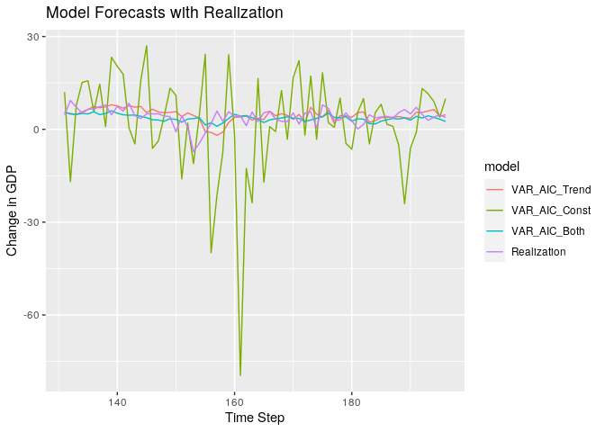<!-- -->

### Forecasts vs Realization (with Reasonable Models)

``` r
forecasts %>%
  filter(model %in% c('VAR_AIC_Trend', 'VAR_AIC_Both', 'Realization')) %>%
  ggplot(aes(x = step, y = f, col = model)) +
  geom_line() +
  ggtitle('Model Forecasts with Realization') +
  ylab('Change in GDP') +
  xlab('Time Step')
```

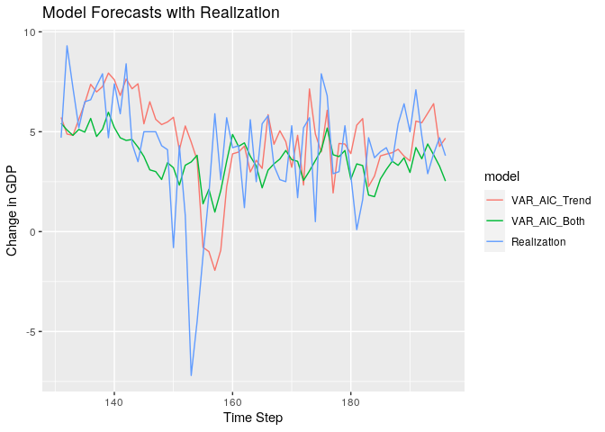<!-- -->

### ASE Over Time

``` r
aes_cmp %>% ggplot(aes(y = ASE, x = value, col = Model)) +
  geom_line()
```

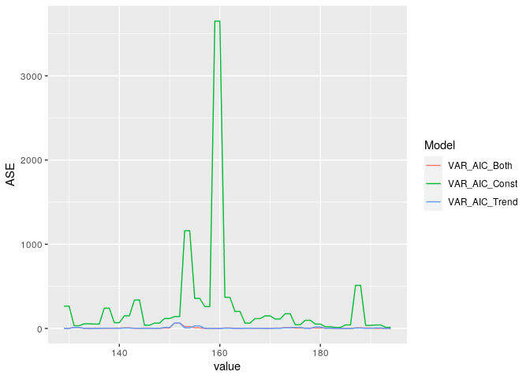<!-- -->

### ASE Over Time (with Reasonable Models)

``` r
aes_cmp  %>% 
  filter(Model %in% c('VAR_AIC_Trend', 'VAR_AIC_Both')) %>%
  ggplot(aes(y = ASE, x = value, col = Model)) +
  geom_line()
```

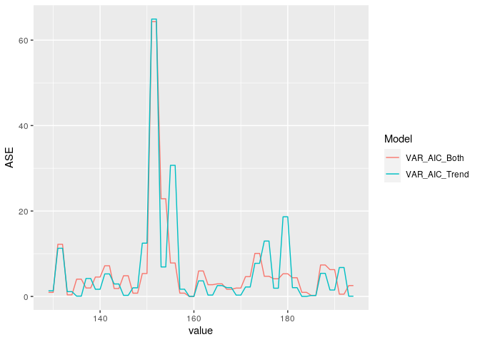<!-- -->

## Multivariate Compare Object

``` r
lag.max = 4 # Increased since AIC is hitting its limit

models = list(
  # "VARS AIC Both A" = list(type = "VAR", select = "aic", trend_type = "both", lag.max = lag.max, sliding_ase = FALSE),
  # "VARS BIC Both A" = list(type = "VAR", select = "bic", trend_type = "both", lag.max = lag.max, sliding_ase = FALSE),
  "VARS AIC Both B" = list(type = "VAR", select = "aic", trend_type = "both", lag.max = lag.max, sliding_ase = TRUE),
  #"VARS AIC Trend B" = list(type = "VAR", select = "aic", trend_type = "trend", lag.max = lag.max, sliding_ase = TRUE),
  #"VARS AIC Const B" = list(type = "VAR", select = "aic", trend_type = "const", lag.max = lag.max, sliding_ase = TRUE),
  #"VARS AIC None B" = list(type = "VAR", select = "aic", trend_type = "none", lag.max = lag.max, sliding_ase = TRUE),
  "VARS BIC Both B" = list(type = "VAR", select = "bic", trend_type = "both", lag.max = lag.max, sliding_ase = TRUE)#,
  #"VARS BIC Trend B" = list(type = "VAR", select = "bic", trend_type = "trend", lag.max = lag.max, sliding_ase = TRUE),
  #"VARS BIC Const B" = list(type = "VAR", select = "bic", trend_type = "const", lag.max = lag.max, sliding_ase = TRUE),
  #"VARS BIC None B" = list(type = "VAR", select = "bic", trend_type = "none", lag.max = lag.max, sliding_ase = TRUE)
)
```

``` r
n.ahead = 2
batch_size = 100 ## 12 years to predict the next 2 quarters
```

``` r
mdl_compare = ModelCompareMultivariateVAR$new(data = data, mdl_list = models, var_interest = var_interest,
                                              n.ahead = n.ahead, batch_size = batch_size, verbose = 1)
```

    ## 
    ## 
    ## 
    ## Model:  VARS AIC Both B 
    ## Trend type:  both 
    ## 
    ## VARselect Object:
    ## $selection
    ## AIC(n)  HQ(n)  SC(n) FPE(n) 
    ##      4      1      1      4 
    ## 
    ## $criteria
    ##                  1            2            3            4
    ## AIC(n) -4.16823884 -4.728729249 -5.815039820 -6.001664917
    ## HQ(n)  -2.82332891 -2.218230714 -2.138952679 -1.159989171
    ## SC(n)  -0.84785497  1.469320634  3.260676081  5.951717001
    ## FPE(n)  0.01554486  0.009085571  0.003257274  0.003040159
    ## 
    ## Lag K to use for the VAR Model:  4 
    ## 
    ## 
    ## Printing summary of the VAR fit for the variable of interest: gdp_change
    ## 
    ## Call:
    ## lm(formula = y ~ -1 + ., data = datamat)
    ## 
    ## Residuals:
    ##     Min      1Q  Median      3Q     Max 
    ## -6.7547 -1.2850 -0.2129  1.3655 12.1808 
    ## 
    ## Coefficients:
    ##                        Estimate Std. Error t value Pr(>|t|)    
    ## gdp_change.l1        -1.449e-01  1.067e-01  -1.358 0.176847    
    ## nfjobschg.l1          2.820e+00  1.205e+00   2.341 0.020674 *  
    ## ipichg.l1             5.525e-01  2.428e-01   2.276 0.024427 *  
    ## treas10yr.l1         -7.498e-01  4.099e-01  -1.829 0.069557 .  
    ## fedintrate.l1         2.832e-01  2.425e-01   1.168 0.244850    
    ## cpichg.l1             1.044e+00  5.188e-01   2.011 0.046238 *  
    ## inventorieschg.l1    -7.785e-01  3.997e-01  -1.948 0.053489 .  
    ## ppichg.l1            -1.541e-01  1.777e-01  -0.867 0.387508    
    ## popchg.l1            -1.123e+01  1.438e+01  -0.781 0.436219    
    ## homeownership.l1      8.036e-01  7.596e-01   1.058 0.291958    
    ## corpprofitchg.l1      3.041e-02  3.990e-02   0.762 0.447199    
    ## personincomechg.l1    2.280e-01  1.976e-01   1.154 0.250410    
    ## housingpermitschg.l1  9.193e-02  2.461e-02   3.736 0.000274 ***
    ## gdp_change.l2         2.274e-01  1.111e-01   2.048 0.042514 *  
    ## nfjobschg.l2          1.013e+00  1.231e+00   0.823 0.411844    
    ## ipichg.l2            -5.862e-01  2.687e-01  -2.181 0.030859 *  
    ## treas10yr.l2          6.122e-01  5.288e-01   1.158 0.248987    
    ## fedintrate.l2        -1.443e-01  2.873e-01  -0.502 0.616230    
    ## cpichg.l2            -3.349e-01  5.155e-01  -0.650 0.516998    
    ## inventorieschg.l2    -2.961e-01  4.040e-01  -0.733 0.464942    
    ## ppichg.l2             1.962e-01  1.854e-01   1.058 0.291912    
    ## popchg.l2            -1.113e+00  1.609e+01  -0.069 0.944974    
    ## homeownership.l2     -3.435e-01  9.599e-01  -0.358 0.720993    
    ## corpprofitchg.l2     -3.166e-02  4.100e-02  -0.772 0.441322    
    ## personincomechg.l2   -3.910e-01  2.210e-01  -1.770 0.079006 .  
    ## housingpermitschg.l2  5.862e-02  2.734e-02   2.144 0.033763 *  
    ## gdp_change.l3        -1.035e-01  1.084e-01  -0.954 0.341732    
    ## nfjobschg.l3         -6.189e-01  1.188e+00  -0.521 0.603124    
    ## ipichg.l3            -5.835e-02  2.688e-01  -0.217 0.828447    
    ## treas10yr.l3          6.410e-01  5.509e-01   1.163 0.246654    
    ## fedintrate.l3         1.139e-01  2.861e-01   0.398 0.691118    
    ## cpichg.l3             3.917e-01  5.068e-01   0.773 0.440971    
    ## inventorieschg.l3     9.339e-01  3.739e-01   2.498 0.013684 *  
    ## ppichg.l3            -2.025e-01  1.810e-01  -1.119 0.265214    
    ## popchg.l3            -1.881e+00  1.550e+01  -0.121 0.903598    
    ## homeownership.l3      2.358e-01  1.002e+00   0.235 0.814210    
    ## corpprofitchg.l3      1.345e-03  3.853e-02   0.035 0.972195    
    ## personincomechg.l3   -6.216e-02  2.217e-01  -0.280 0.779604    
    ## housingpermitschg.l3  2.596e-02  2.592e-02   1.001 0.318435    
    ## gdp_change.l4         1.516e-02  9.088e-02   0.167 0.867762    
    ## nfjobschg.l4         -1.512e-01  1.021e+00  -0.148 0.882496    
    ## ipichg.l4             1.410e-01  2.619e-01   0.539 0.591104    
    ## treas10yr.l4         -9.053e-01  4.274e-01  -2.118 0.035954 *  
    ## fedintrate.l4         1.584e-03  2.609e-01   0.006 0.995166    
    ## cpichg.l4             2.583e-02  4.924e-01   0.052 0.958241    
    ## inventorieschg.l4    -3.853e-01  3.515e-01  -1.096 0.274911    
    ## ppichg.l4             4.826e-02  1.745e-01   0.277 0.782493    
    ## popchg.l4             2.648e+00  1.411e+01   0.188 0.851373    
    ## homeownership.l4     -4.577e-01  7.974e-01  -0.574 0.566907    
    ## corpprofitchg.l4      6.106e-02  3.412e-02   1.790 0.075705 .  
    ## personincomechg.l4   -5.439e-02  1.891e-01  -0.288 0.774094    
    ## housingpermitschg.l4 -1.023e-04  2.439e-02  -0.004 0.996659    
    ## const                -2.532e+00  1.006e+01  -0.252 0.801559    
    ## trend                -3.936e-02  9.697e-03  -4.059 8.23e-05 ***
    ## ---
    ## Signif. codes:  0 '***' 0.001 '**' 0.01 '*' 0.05 '.' 0.1 ' ' 1
    ## 
    ## Residual standard error: 2.491 on 137 degrees of freedom
    ## Multiple R-squared:  0.7275, Adjusted R-squared:  0.622 
    ## F-statistic:   6.9 on 53 and 137 DF,  p-value: < 2.2e-16
    ## 
    ## 
    ## 
    ## 
    ## Model:  VARS BIC Both B 
    ## Trend type:  both 
    ## 
    ## VARselect Object:
    ## $selection
    ## AIC(n)  HQ(n)  SC(n) FPE(n) 
    ##      4      1      1      4 
    ## 
    ## $criteria
    ##                  1            2            3            4
    ## AIC(n) -4.16823884 -4.728729249 -5.815039820 -6.001664917
    ## HQ(n)  -2.82332891 -2.218230714 -2.138952679 -1.159989171
    ## SC(n)  -0.84785497  1.469320634  3.260676081  5.951717001
    ## FPE(n)  0.01554486  0.009085571  0.003257274  0.003040159
    ## 
    ## Lag K to use for the VAR Model:  1 
    ## 
    ## 
    ## Printing summary of the VAR fit for the variable of interest: gdp_change
    ## 
    ## Call:
    ## lm(formula = y ~ -1 + ., data = datamat)
    ## 
    ## Residuals:
    ##     Min      1Q  Median      3Q     Max 
    ## -8.3441 -1.4229 -0.1246  1.3530 14.2535 
    ## 
    ## Coefficients:
    ##                        Estimate Std. Error t value Pr(>|t|)    
    ## gdp_change.l1         -0.057139   0.077388  -0.738 0.461269    
    ## nfjobschg.l1           2.465425   0.757938   3.253 0.001366 ** 
    ## ipichg.l1              0.704930   0.203657   3.461 0.000672 ***
    ## treas10yr.l1          -0.274685   0.175419  -1.566 0.119144    
    ## fedintrate.l1          0.143830   0.139863   1.028 0.305167    
    ## cpichg.l1              1.055846   0.403462   2.617 0.009630 ** 
    ## inventorieschg.l1     -1.040993   0.285163  -3.651 0.000343 ***
    ## ppichg.l1             -0.122380   0.157873  -0.775 0.439254    
    ## popchg.l1            -12.434432   4.273991  -2.909 0.004082 ** 
    ## homeownership.l1       0.243952   0.143021   1.706 0.089798 .  
    ## corpprofitchg.l1      -0.038551   0.032005  -1.205 0.229983    
    ## personincomechg.l1    -0.001543   0.127048  -0.012 0.990323    
    ## housingpermitschg.l1   0.074131   0.020516   3.613 0.000393 ***
    ## const                 -2.634597   9.164781  -0.287 0.774085    
    ## trend                 -0.042353   0.006694  -6.327 1.94e-09 ***
    ## ---
    ## Signif. codes:  0 '***' 0.001 '**' 0.01 '*' 0.05 '.' 0.1 ' ' 1
    ## 
    ## Residual standard error: 2.645 on 179 degrees of freedom
    ## Multiple R-squared:  0.5994, Adjusted R-squared:  0.5681 
    ## F-statistic: 19.13 on 14 and 179 DF,  p-value: < 2.2e-16
    ## 
    ## 
    ## 
    ## 
    ## Computing metrics for:  VARS AIC Both B 
    ## Number of batches expected:  48 
    ## 
    ## 
    ## 
    ## Computing metrics for:  VARS BIC Both B 
    ## Number of batches expected:  48 
    ## # A tibble: 2 x 6
    ##   Model           Selection Trend SlidingASE Init_K Final_K
    ##   <chr>           <chr>     <chr> <lgl>       <dbl>   <dbl>
    ## 1 VARS AIC Both B aic       both  TRUE            4       4
    ## 2 VARS BIC Both B bic       both  TRUE            1       1

### AIC BIC Full Data

``` r
mdl_compare$get_xIC() 
```

    ## # A tibble: 2 x 3
    ##   Model             AIC   BIC
    ##   <chr>           <dbl> <dbl>
    ## 1 VARS AIC Both B 5900. 8183.
    ## 2 VARS BIC Both B 6334. 6971.

### Tabular Metrics

``` r
ASEs = mdl_compare$get_tabular_metrics() 

ASEs %>% 
  group_by(Model) %>% 
  summarise(ASE_mean = mean(ASE),
            ASE_median = median(ASE),
            ASE_sd = sd(ASE),
            num_batches = n())
```

    ## # A tibble: 2 x 5
    ##   Model           ASE_mean ASE_median ASE_sd num_batches
    ##   <chr>              <dbl>      <dbl>  <dbl>       <int>
    ## 1 VARS AIC Both B    13.4        6.43  18.6           48
    ## 2 VARS BIC Both B     5.91       3.69   8.37          48

``` r
mdl_compare$get_tabular_metrics(ases = FALSE) %>% 
  na.omit()
```

    ## # A tibble: 387 x 5
    ##    Model            Time     f     ll    ul
    ##    <chr>           <dbl> <dbl>  <dbl> <dbl>
    ##  1 VARS AIC Both B    99 3.81  -1.69   9.31
    ##  2 VARS AIC Both B   100 4.11  -3.26  11.5 
    ##  3 VARS AIC Both B   101 1.63  -3.87   7.12
    ##  4 VARS AIC Both B   102 7.33  -0.114 14.8 
    ##  5 VARS AIC Both B   103 1.82  -3.75   7.39
    ##  6 VARS AIC Both B   104 6.49  -0.908 13.9 
    ##  7 VARS AIC Both B   105 2.41  -3.18   8.00
    ##  8 VARS AIC Both B   106 4.05  -3.23  11.3 
    ##  9 VARS AIC Both B   107 0.152 -5.25   5.55
    ## 10 VARS AIC Both B   108 2.34  -4.83   9.51
    ## # … with 377 more rows

### Remove unwanted models

``` r
#mdls_to_remove = c("VARS AIC Both B", "VARS AIC Const B", "VARS AIC None B", "VARS AIC Trend B")
#mdl_compare$remove_models(mdl_names = mdls_to_remove)
```

### Simple Forecasts

``` r
mdl_compare$plot_simple_forecasts(lastn = TRUE, limits = TRUE)
```

<!-- -->

``` r
mdl_compare$plot_simple_forecasts(lastn = FALSE, limits = TRUE)
```

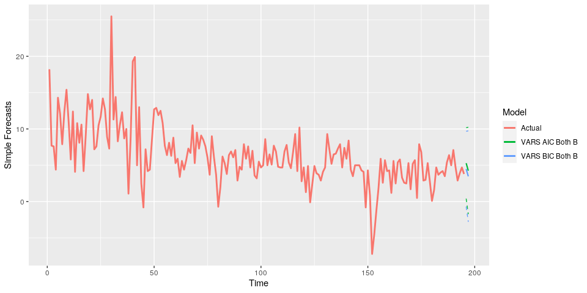<!-- -->

### Batch Forecasts

``` r
mdl_compare$plot_batch_forecasts(only_sliding = FALSE)
```

    ## Warning: Removed 198 row(s) containing missing values (geom_path).

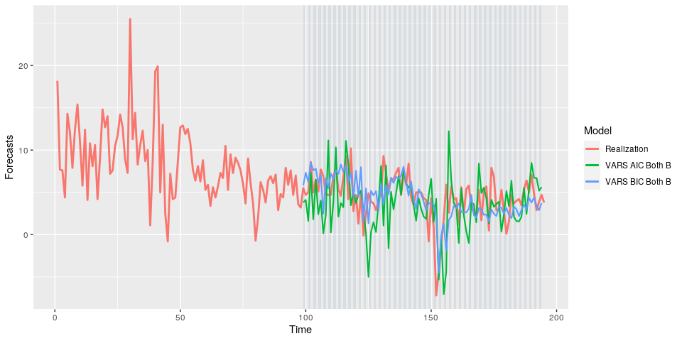<!-- -->

    ## Warning: Removed 198 row(s) containing missing values (geom_path).
    
    ## Warning: Removed 198 row(s) containing missing values (geom_path).

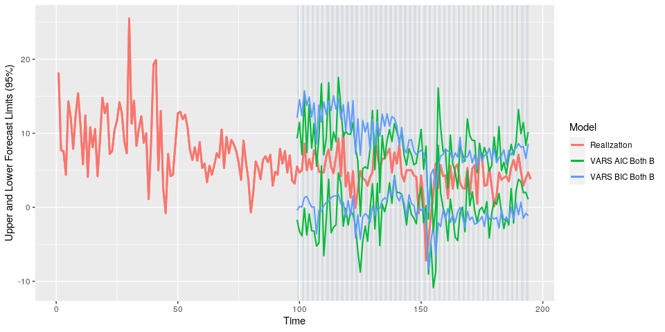<!-- -->

### Batch ASEs

``` r
mdl_compare$plot_batch_ases(only_sliding = FALSE)
```

    ## Loading required namespace: patchwork

    ## Warning: Removed 196 row(s) containing missing values (geom_path).

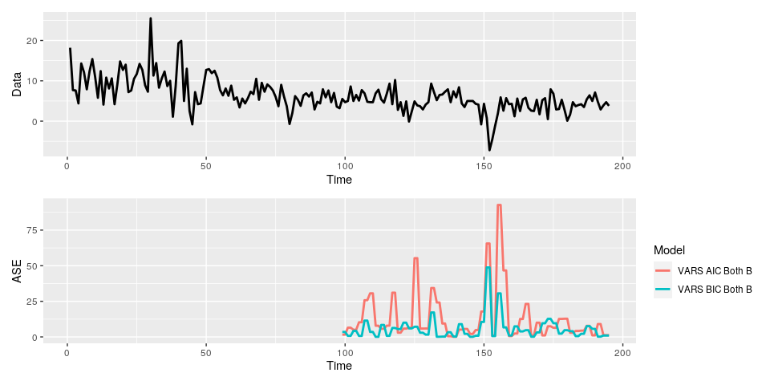<!-- -->

### ASE Histograms

``` r
mdl_compare$plot_histogram_ases()  # Same function as univariate
```

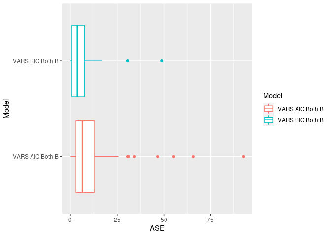<!-- -->

### Statistical Compare

``` r
mdl_compare$statistical_compare() 
```

    ##             Df Sum Sq Mean Sq F value Pr(>F)  
    ## Model        1   1363  1362.9   6.579 0.0119 *
    ## Residuals   94  19475   207.2                 
    ## ---
    ## Signif. codes:  0 '***' 0.001 '**' 0.01 '*' 0.05 '.' 0.1 ' ' 1
    ## 
    ## 
    ##   Tukey multiple comparisons of means
    ##     95% family-wise confidence level
    ## 
    ## Fit: aov(formula = ASE ~ Model, data = results)
    ## 
    ## $Model
    ##                                      diff       lwr       upr     p adj
    ## VARS BIC Both B-VARS AIC Both B -7.535856 -13.36953 -1.702184 0.0119045

    ## Call:
    ##    aov(formula = ASE ~ Model, data = results)
    ## 
    ## Terms:
    ##                     Model Residuals
    ## Sum of Squares   1362.939 19474.806
    ## Deg. of Freedom         1        94
    ## 
    ## Residual standard error: 14.39371
    ## Estimated effects may be unbalanced

# Manual Method

``` r
n = nrow(data)
train_data = data %>% dplyr::filter(row_number() <= (n - n.ahead))
test_data = data %>% dplyr::filter(row_number() > (n - n.ahead))
```

## VARselect

``` r
library(vars)
```

    ## Loading required package: MASS

    ## 
    ## Attaching package: 'MASS'

    ## The following object is masked from 'package:dplyr':
    ## 
    ##     select

    ## Loading required package: strucchange

    ## Loading required package: zoo

    ## 
    ## Attaching package: 'zoo'

    ## The following objects are masked from 'package:base':
    ## 
    ##     as.Date, as.Date.numeric

    ## Loading required package: sandwich

    ## 
    ## Attaching package: 'strucchange'

    ## The following object is masked from 'package:stringr':
    ## 
    ##     boundary

    ## Loading required package: urca

    ## Loading required package: lmtest

``` r
# VARselect will select the best K for this VAR model
# Looks at the cross correlation structure (ccf) to figure this out 
vselect = VARselect(data, lag.max = lag.max, type = "both", season = NULL, exogen = NULL)
vselect # Gives AIC values for various K values
```

    ## $selection
    ## AIC(n)  HQ(n)  SC(n) FPE(n) 
    ##      4      1      1      4 
    ## 
    ## $criteria
    ##                  1            2            3            4
    ## AIC(n) -4.16823884 -4.728729249 -5.815039820 -6.001664917
    ## HQ(n)  -2.82332891 -2.218230714 -2.138952679 -1.159989171
    ## SC(n)  -0.84785497  1.469320634  3.260676081  5.951717001
    ## FPE(n)  0.01554486  0.009085571  0.003257274  0.003040159

``` r
k = vselect$selection[["AIC(n)"]]  # BIC = SC(n)
k
```

    ## [1] 4

AIC picks a VAR(10) model

## VAR Model

``` r
varfit = VAR(train_data, p=k, type="both")
stats::AIC(varfit)
```

    ## [1] 5856.547

``` r
print(summary(varfit)$varresult[[var_interest]])
```

    ## 
    ## Call:
    ## lm(formula = y ~ -1 + ., data = datamat)
    ## 
    ## Residuals:
    ##    Min     1Q Median     3Q    Max 
    ## -6.816 -1.250 -0.233  1.351 12.098 
    ## 
    ## Coefficients:
    ##                        Estimate Std. Error t value Pr(>|t|)    
    ## gdp_change.l1        -1.530e-01  1.080e-01  -1.417 0.158728    
    ## nfjobschg.l1          2.782e+00  1.219e+00   2.283 0.024022 *  
    ## ipichg.l1             5.652e-01  2.454e-01   2.303 0.022798 *  
    ## treas10yr.l1         -7.273e-01  4.169e-01  -1.745 0.083315 .  
    ## fedintrate.l1         2.727e-01  2.446e-01   1.115 0.266894    
    ## cpichg.l1             9.799e-01  5.287e-01   1.853 0.065995 .  
    ## inventorieschg.l1    -7.902e-01  4.022e-01  -1.965 0.051484 .  
    ## ppichg.l1            -1.333e-01  1.812e-01  -0.736 0.463245    
    ## popchg.l1            -1.159e+01  1.449e+01  -0.800 0.425276    
    ## homeownership.l1      8.583e-01  7.676e-01   1.118 0.265451    
    ## corpprofitchg.l1      3.168e-02  4.036e-02   0.785 0.433863    
    ## personincomechg.l1    2.283e-01  1.986e-01   1.149 0.252460    
    ## housingpermitschg.l1  9.215e-02  2.475e-02   3.723 0.000288 ***
    ## gdp_change.l2         2.210e-01  1.124e-01   1.967 0.051272 .  
    ## nfjobschg.l2          1.062e+00  1.240e+00   0.856 0.393620    
    ## ipichg.l2            -5.801e-01  2.709e-01  -2.141 0.034046 *  
    ## treas10yr.l2          6.323e-01  5.333e-01   1.186 0.237835    
    ## fedintrate.l2        -1.437e-01  2.890e-01  -0.497 0.619903    
    ## cpichg.l2            -3.198e-01  5.260e-01  -0.608 0.544252    
    ## inventorieschg.l2    -2.838e-01  4.068e-01  -0.698 0.486644    
    ## ppichg.l2             2.005e-01  1.882e-01   1.066 0.288451    
    ## popchg.l2            -5.013e-01  1.623e+01  -0.031 0.975408    
    ## homeownership.l2     -4.902e-01  9.928e-01  -0.494 0.622289    
    ## corpprofitchg.l2     -3.123e-02  4.123e-02  -0.757 0.450155    
    ## personincomechg.l2   -3.885e-01  2.222e-01  -1.748 0.082670 .  
    ## housingpermitschg.l2  5.835e-02  2.771e-02   2.106 0.037074 *  
    ## gdp_change.l3        -9.494e-02  1.096e-01  -0.866 0.388095    
    ## nfjobschg.l3         -5.490e-01  1.198e+00  -0.458 0.647566    
    ## ipichg.l3            -9.048e-02  2.739e-01  -0.330 0.741649    
    ## treas10yr.l3          5.805e-01  5.610e-01   1.035 0.302628    
    ## fedintrate.l3         1.178e-01  2.878e-01   0.409 0.683000    
    ## cpichg.l3             3.939e-01  5.099e-01   0.772 0.441170    
    ## inventorieschg.l3     9.135e-01  3.771e-01   2.422 0.016742 *  
    ## ppichg.l3            -1.902e-01  1.828e-01  -1.040 0.299969    
    ## popchg.l3            -1.893e+00  1.563e+01  -0.121 0.903771    
    ## homeownership.l3      3.022e-01  1.042e+00   0.290 0.772160    
    ## corpprofitchg.l3     -3.456e-05  3.881e-02  -0.001 0.999291    
    ## personincomechg.l3   -6.627e-02  2.233e-01  -0.297 0.767090    
    ## housingpermitschg.l3  2.595e-02  2.607e-02   0.995 0.321284    
    ## gdp_change.l4         9.511e-03  9.176e-02   0.104 0.917602    
    ## nfjobschg.l4         -1.406e-01  1.034e+00  -0.136 0.892016    
    ## ipichg.l4             1.343e-01  2.666e-01   0.504 0.615312    
    ## treas10yr.l4         -8.728e-01  4.335e-01  -2.013 0.046084 *  
    ## fedintrate.l4        -3.590e-03  2.628e-01  -0.014 0.989122    
    ## cpichg.l4             3.869e-02  4.955e-01   0.078 0.937873    
    ## inventorieschg.l4    -3.475e-01  3.585e-01  -0.970 0.333997    
    ## ppichg.l4             3.676e-02  1.772e-01   0.208 0.835923    
    ## popchg.l4             2.937e+00  1.419e+01   0.207 0.836362    
    ## homeownership.l4     -4.181e-01  8.191e-01  -0.510 0.610560    
    ## corpprofitchg.l4      6.102e-02  3.443e-02   1.772 0.078590 .  
    ## personincomechg.l4   -6.313e-02  1.908e-01  -0.331 0.741246    
    ## housingpermitschg.l4  2.128e-03  2.470e-02   0.086 0.931484    
    ## const                -3.483e+00  1.021e+01  -0.341 0.733389    
    ## trend                -4.007e-02  9.826e-03  -4.078 7.72e-05 ***
    ## ---
    ## Signif. codes:  0 '***' 0.001 '**' 0.01 '*' 0.05 '.' 0.1 ' ' 1
    ## 
    ## Residual standard error: 2.504 on 135 degrees of freedom
    ## Multiple R-squared:  0.7278, Adjusted R-squared:  0.6209 
    ## F-statistic: 6.809 on 53 and 135 DF,  p-value: < 2.2e-16

## Predictions

``` r
preds = stats::predict(varfit, n.ahead=n.ahead)

results = preds$fcst[[var_interest]] %>% 
  dplyr::as_tibble() %>% 
  dplyr::mutate(Time = seq(n-n.ahead+1,n,1)) 

results
```

    ## # A tibble: 2 x 5
    ##    fcst lower upper    CI  Time
    ##   <dbl> <dbl> <dbl> <dbl> <dbl>
    ## 1  2.68 -2.23  7.59  4.91   194
    ## 2  3.11 -2.90  9.12  6.01   195

### ASE

``` r
ASE_data = data %>% 
  dplyr::mutate(Time = dplyr::row_number()) %>% 
  dplyr::full_join(results, by = "Time") %>% 
  na.omit()

ASE_data
```

    ##     gdp_change nfjobschg     ipichg treas10yr fedintrate    cpichg
    ## 194        4.7 0.3174033 -0.3680671      2.00       2.38 0.7635660
    ## 195        3.8 0.4039560  0.1785365      1.68       2.04 0.2404907
    ##     inventorieschg     ppichg  popchg homeownership corpprofitchg
    ## 194      0.6596441 -0.2490040 0.11554          64.1      3.316189
    ## 195      0.5905517 -0.9485771 0.15012          64.8     -1.242270
    ##     personincomechg housingpermitschg Time     fcst     lower    upper
    ## 194             3.0         -4.347826  194 2.682054 -2.226061 7.590169
    ## 195             2.7         12.905844  195 3.109636 -2.898255 9.117527
    ##           CI
    ## 194 4.908115
    ## 195 6.007891

``` r
ASE = mean((ASE_data[[var_interest]] - ASE_data$fcst)^2, na.rm = TRUE)
ASE
```

    ## [1] 2.274354

### Plots

``` r
results = results %>% 
  dplyr::mutate(!!var_interest := fcst) %>% 
  dplyr::mutate(Model = 'VAR Model') %>% 
  dplyr::select(Model, Time, !!var_interest)

combined_data = data %>% 
  dplyr::mutate(Time = dplyr::row_number()) %>% 
  mutate(Model = 'Realization') %>% 
  dplyr::select(Model, Time, !!var_interest) %>% 
  bind_rows(results) %>% 
  mutate(Model = as.factor(Model))

combined_data
```

    ##           Model Time gdp_change
    ## 1   Realization    1  18.200000
    ## 2   Realization    2   7.700000
    ## 3   Realization    3   7.600000
    ## 4   Realization    4   4.400000
    ## 5   Realization    5  14.300000
    ## 6   Realization    6  12.100000
    ## 7   Realization    7   7.900000
    ## 8   Realization    8  12.400000
    ## 9   Realization    9  15.400000
    ## 10  Realization   10  11.000000
    ## 11  Realization   11   5.800000
    ## 12  Realization   12  12.400000
    ## 13  Realization   13   4.100000
    ## 14  Realization   14  10.800000
    ## 15  Realization   15   8.100000
    ## 16  Realization   16  10.600000
    ## 17  Realization   17   4.200000
    ## 18  Realization   18   9.100000
    ## 19  Realization   19  14.800000
    ## 20  Realization   20  12.700000
    ## 21  Realization   21  14.000000
    ## 22  Realization   22   7.200000
    ## 23  Realization   23   7.600000
    ## 24  Realization   24  10.500000
    ## 25  Realization   25  11.700000
    ## 26  Realization   26  14.200000
    ## 27  Realization   27  12.700000
    ## 28  Realization   28   8.900000
    ## 29  Realization   29   7.300000
    ## 30  Realization   30  25.500000
    ## 31  Realization   31  11.300000
    ## 32  Realization   32  14.400000
    ## 33  Realization   33   8.300000
    ## 34  Realization   34  10.600000
    ## 35  Realization   35  12.300000
    ## 36  Realization   36   8.700000
    ## 37  Realization   37  10.000000
    ## 38  Realization   38   1.100000
    ## 39  Realization   39   8.700000
    ## 40  Realization   40  19.300000
    ## 41  Realization   41  19.900000
    ## 42  Realization   42   5.000000
    ## 43  Realization   43  13.000000
    ## 44  Realization   44   2.500000
    ## 45  Realization   45  -0.800000
    ## 46  Realization   46   7.200000
    ## 47  Realization   47   4.200000
    ## 48  Realization   48   4.400000
    ## 49  Realization   49   8.600000
    ## 50  Realization   50  12.700000
    ## 51  Realization   51  12.900000
    ## 52  Realization   52  11.900000
    ## 53  Realization   53  12.500000
    ## 54  Realization   54  10.800000
    ## 55  Realization   55   7.700000
    ## 56  Realization   56   6.400000
    ## 57  Realization   57   8.100000
    ## 58  Realization   58   6.300000
    ## 59  Realization   59   8.800000
    ## 60  Realization   60   5.300000
    ## 61  Realization   61   5.900000
    ## 62  Realization   62   3.400000
    ## 63  Realization   63   5.600000
    ## 64  Realization   64   4.400000
    ## 65  Realization   65   5.700000
    ## 66  Realization   66   7.300000
    ## 67  Realization   67   6.700000
    ## 68  Realization   68  10.500000
    ## 69  Realization   69   5.300000
    ## 70  Realization   70   9.500000
    ## 71  Realization   71   7.300000
    ## 72  Realization   72   9.100000
    ## 73  Realization   73   8.500000
    ## 74  Realization   74   7.600000
    ## 75  Realization   75   6.000000
    ## 76  Realization   76   3.700000
    ## 77  Realization   77   9.000000
    ## 78  Realization   78   6.100000
    ## 79  Realization   79   3.700000
    ## 80  Realization   80  -0.700000
    ## 81  Realization   81   2.000000
    ## 82  Realization   82   6.200000
    ## 83  Realization   83   5.300000
    ## 84  Realization   84   3.800000
    ## 85  Realization   85   6.400000
    ## 86  Realization   86   6.900000
    ## 87  Realization   87   6.100000
    ## 88  Realization   88   7.100000
    ## 89  Realization   89   2.900000
    ## 90  Realization   90   4.800000
    ## 91  Realization   91   4.400000
    ## 92  Realization   92   7.900000
    ## 93  Realization   93   5.900000
    ## 94  Realization   94   7.600000
    ## 95  Realization   95   4.700000
    ## 96  Realization   96   7.000000
    ## 97  Realization   97   3.600000
    ## 98  Realization   98   3.200000
    ## 99  Realization   99   5.500000
    ## 100 Realization  100   4.700000
    ## 101 Realization  101   5.000000
    ## 102 Realization  102   8.600000
    ## 103 Realization  103   5.000000
    ## 104 Realization  104   6.500000
    ## 105 Realization  105   5.100000
    ## 106 Realization  106   7.700000
    ## 107 Realization  107   6.900000
    ## 108 Realization  108   4.800000
    ## 109 Realization  109   4.700000
    ## 110 Realization  110   4.700000
    ## 111 Realization  111   6.900000
    ## 112 Realization  112   7.800000
    ## 113 Realization  113   5.400000
    ## 114 Realization  114   4.600000
    ## 115 Realization  115   6.800000
    ## 116 Realization  116   9.300000
    ## 117 Realization  117   4.200000
    ## 118 Realization  118  10.200000
    ## 119 Realization  119   2.800000
    ## 120 Realization  120   4.700000
    ## 121 Realization  121   1.300000
    ## 122 Realization  122   4.900000
    ## 123 Realization  123  -0.100000
    ## 124 Realization  124   2.400000
    ## 125 Realization  125   4.900000
    ## 126 Realization  126   3.900000
    ## 127 Realization  127   3.700000
    ## 128 Realization  128   2.900000
    ## 129 Realization  129   4.100000
    ## 130 Realization  130   4.700000
    ## 131 Realization  131   9.300000
    ## 132 Realization  132   7.200000
    ## 133 Realization  133   5.200000
    ## 134 Realization  134   6.500000
    ## 135 Realization  135   6.600000
    ## 136 Realization  136   7.300000
    ## 137 Realization  137   7.900000
    ## 138 Realization  138   4.700000
    ## 139 Realization  139   7.400000
    ## 140 Realization  140   5.900000
    ## 141 Realization  141   8.400000
    ## 142 Realization  142   4.400000
    ## 143 Realization  143   3.500000
    ## 144 Realization  144   5.000000
    ## 145 Realization  145   5.000000
    ## 146 Realization  146   5.000000
    ## 147 Realization  147   4.300000
    ## 148 Realization  148   4.100000
    ## 149 Realization  149  -0.800000
    ## 150 Realization  150   4.300000
    ## 151 Realization  151   0.800000
    ## 152 Realization  152  -7.200000
    ## 153 Realization  153  -4.500000
    ## 154 Realization  154  -1.200000
    ## 155 Realization  155   1.900000
    ## 156 Realization  156   5.900000
    ## 157 Realization  157   2.600000
    ## 158 Realization  158   5.700000
    ## 159 Realization  159   4.200000
    ## 160 Realization  160   4.300000
    ## 161 Realization  161   1.200000
    ## 162 Realization  162   5.600000
    ## 163 Realization  163   2.500000
    ## 164 Realization  164   5.400000
    ## 165 Realization  165   5.800000
    ## 166 Realization  166   3.300000
    ## 167 Realization  167   2.600000
    ## 168 Realization  168   2.500000
    ## 169 Realization  169   5.300000
    ## 170 Realization  170   1.700000
    ## 171 Realization  171   5.200000
    ## 172 Realization  172   5.700000
    ## 173 Realization  173   0.500000
    ## 174 Realization  174   7.900000
    ## 175 Realization  175   6.800000
    ## 176 Realization  176   2.900000
    ## 177 Realization  177   3.000000
    ## 178 Realization  178   5.300000
    ## 179 Realization  179   2.800000
    ## 180 Realization  180   0.100000
    ## 181 Realization  181   1.600000
    ## 182 Realization  182   4.700000
    ## 183 Realization  183   3.700000
    ## 184 Realization  184   4.000000
    ## 185 Realization  185   4.200000
    ## 186 Realization  186   3.500000
    ## 187 Realization  187   5.400000
    ## 188 Realization  188   6.400000
    ## 189 Realization  189   5.000000
    ## 190 Realization  190   7.100000
    ## 191 Realization  191   4.800000
    ## 192 Realization  192   2.900000
    ## 193 Realization  193   3.900000
    ## 194 Realization  194   4.700000
    ## 195 Realization  195   3.800000
    ## 196   VAR Model  194   2.682054
    ## 197   VAR Model  195   3.109636

``` r
p = ggplot2::ggplot() + 
  ggplot2::geom_line(data = combined_data, mapping = ggplot2::aes_string(x = "Time", y = var_interest, color = "Model"))

print(p)
```

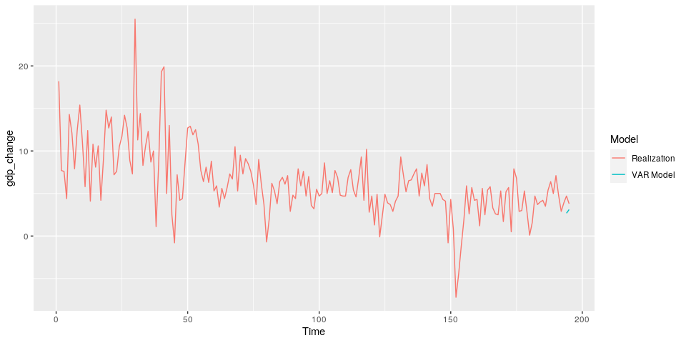<!-- -->

``` r
plot(seq(1,n,1), data[[var_interest]], type = "b")
points(seq(n-n.ahead+1,n,1), preds$fcst[[var_interest]][,'fcst'], type = "b", pch = 15)
```

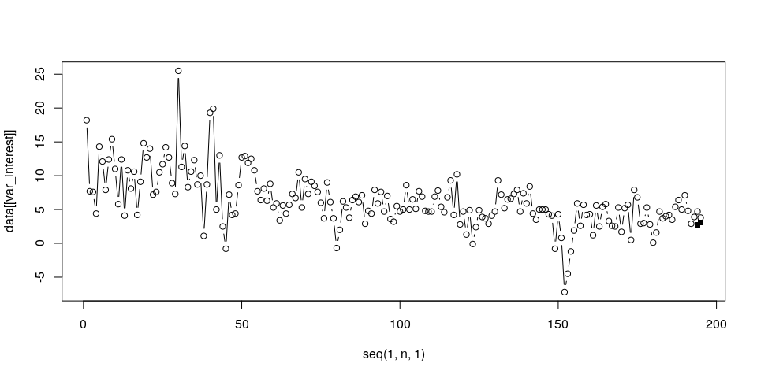<!-- -->

``` r
fanchart(preds, colors = brewer.pal(n = 8, name = "Blues"), names = var_interest) 
```

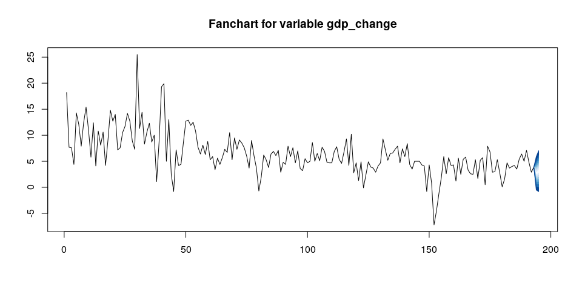<!-- -->
