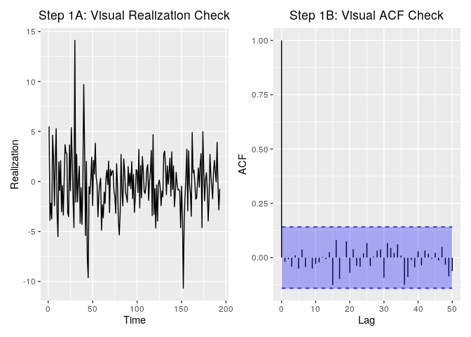

R Notebook
================

## Setup

``` r
library(tswge)
library(tswgewrapped)
library(tidyverse)
library(ggplot2)
library(tseries)
library(vars)
library(reshape)
source('./plotting.R')
```

# Ideas to consider

1.  Add scatterplots to check for multicolinearity.
2.  All variables given to a VAR model must be stationary. But some of
    our variables are non stationary. That might be an issue. Maybe
    consider converting some of them to % changes to make them more
    stationary.
3.  We may be missing some important columns based on CCF analysis
    below. Add them to see if forecasts improve.
4.  For the MLR model, we need to predict the independent variables for
    the next 2 time points rather than using the actual values from the
    test data (since these will not be available while forecasting). The
    VAR model assumes these are not available and just uses data upto t0
    to make the forecasts so that is why those ASE values may be higher.
    Just a thought.
5.  Maybe add seasonality of 6 in the models based on overfit tables?

<!-- end list -->

``` r
data = read.csv("../data/economic_indicators_all_ex_3mo_china.csv")
data %>% glimpse()
```

    ## Observations: 195
    ## Variables: 15
    ## $ date            <fct> 1971 Q1, 1971 Q2, 1971 Q3, 1971 Q4, 1972 Q1, 197…
    ## $ gdp_change      <dbl> 18.2, 7.7, 7.6, 4.4, 14.3, 12.1, 7.9, 12.4, 15.4…
    ## $ unrate          <dbl> 6.0, 5.9, 6.0, 6.0, 5.8, 5.7, 5.5, 5.2, 4.9, 4.9…
    ## $ nfjobschg       <dbl> 0.096056052, 0.556025967, 0.505234794, 0.6912056…
    ## $ treas10yr       <dbl> 5.53, 6.70, 6.00, 5.89, 6.12, 6.15, 6.54, 6.41, …
    ## $ fedintrate      <dbl> 3.71, 4.91, 5.55, 4.14, 3.83, 4.46, 4.87, 5.33, …
    ## $ personincomechg <dbl> 4.7, 4.9, 3.8, 5.2, 3.6, 3.2, 4.7, 7.6, 7.9, 7.7…
    ## $ cpichg          <dbl> 0.5025126, 1.5000000, 0.4926108, 0.7352941, 0.72…
    ## $ popchg          <dbl> 0.2946422, 0.2908775, 0.3218315, 0.2876627, 0.22…
    ## $ corpprofitchg   <dbl> 12.7497657, 3.7704482, 6.6068568, 3.2925583, 5.8…
    ## $ crude_wtichg    <dbl> 0.0000000, 0.0000000, 0.0000000, 0.0000000, 0.00…
    ## $ ppichg          <dbl> 1.8867925, 1.0582011, 0.2617801, 0.7832898, 1.55…
    ## $ goldchg         <dbl> 3.8127090, 3.6082474, 5.6592040, 2.4131842, 11.2…
    ## $ japanchg        <dbl> -0.14002011, -0.02990053, -5.42533850, -5.309818…
    ## $ ukchg           <dbl> 0.536204173, 0.004134452, 2.091946420, 2.3163521…

# Checking for seasonality

``` r
px = plotts.sample.wge(data$gdp_change)
```

<!-- -->

``` r
factor.wge.season(6)
```

    ## --------------------------------------------------
    ## Printing Factors for Seasonality 's' = 6
    ## --------------------------------------------------
    ## 
    ## Coefficients of Original polynomial:  
    ## 0.0000 0.0000 0.0000 0.0000 0.0000 1.0000 
    ## 
    ## Factor                 Roots                Abs Recip    System Freq 
    ## 1+1.0000B             -1.0000               1.0000       0.5000
    ## 1+1.0000B+1.0000B^2   -0.5000+-0.8660i      1.0000       0.3333
    ## 1-1.0000B+1.0000B^2    0.5000+-0.8660i      1.0000       0.1667
    ## 1-1.0000B              1.0000               1.0000       0.0000
    ##   
    ## 

``` r
e = est.ar.wge(data$gdp_change, p = 6, type = 'burg')
```

    ## 
    ## Coefficients of Original polynomial:  
    ## 0.3330 0.1613 0.0313 0.1231 0.0324 0.0775 
    ## 
    ## Factor                 Roots                Abs Recip    System Freq 
    ## 1-0.9001B              1.1109               0.9001       0.0000
    ## 1+0.6685B             -1.4960               0.6685       0.5000
    ## 1-0.6049B+0.3976B^2    0.7606+-1.3915i      0.6306       0.1704
    ## 1+0.5036B+0.3239B^2   -0.7774+-1.5758i      0.5691       0.3229
    ##   
    ## 

``` r
e = est.ar.wge(data$gdp_change, p = 8, type = 'burg')
```

    ## 
    ## Coefficients of Original polynomial:  
    ## 0.3326 0.1637 0.0260 0.1300 0.0251 0.0701 0.0800 -0.0716 
    ## 
    ## Factor                 Roots                Abs Recip    System Freq 
    ## 1-0.8933B              1.1195               0.8933       0.0000
    ## 1-0.7474B+0.5454B^2    0.6852+-1.1679i      0.7385       0.1656
    ## 1+0.4356B+0.5437B^2   -0.4006+-1.2957i      0.7373       0.2977
    ## 1+1.3754B+0.5375B^2   -1.2795+-0.4727i      0.7331       0.4437
    ## 1-0.5030B              1.9881               0.5030       0.0000
    ##   
    ## 

  - There may be seasonality of 6 which could be included in the VAR and
    MLR
models

# Plot all data

``` r
df.m = reshape::melt(data %>% dplyr::select(-date) %>% dplyr::mutate(time = row_number()), id.vars = "time")
ggplot(df.m) + 
  facet_wrap(variable ~ ., ncol = 3, scales = 'free_y') + 
  geom_line(aes(x = time, y = value, colour = variable))
```

<!-- -->

  - Some of the variables are not stationary. This may be an issue for
    some of the models like VAR

# CCF Analysis

``` r
var_interest = 'gdp_change'
lag.max = 12
max_ccf = lag.max

results = tribble(~variable, ~max_ccf_index, ~max_ccf_value)
for (name in colnames(data %>% dplyr::select(-date))){
  if (name != var_interest){
    # By convention, the X2 variable comes first
    c = ccf(data[name], data[var_interest], lag.max = lag.max, plot = FALSE)
    plot(c, main = paste("\nVariable: ", name, " , max cross-correlation @ at lag: ", max_ccf, sep = ""))
    index = which(abs(c$acf[,1,1]) == max(abs(c$acf[,1,1])))
    max_ccf_index = c$lag[,1,1][index] 
    max_ccf_value = c$acf[,1,1][index]
    
    results = results %>% 
      dplyr::add_row(variable = name, max_ccf_index = max_ccf_index, max_ccf_value = max_ccf_value)
    cat(paste("\nFor variable: ", name, " , max cross-correlation is at lag: ", max_ccf_index, sep = ""))
  }
}
```

<!-- -->

    ## 
    ## For variable: unrate , max cross-correlation is at lag: -3

<!-- -->

    ## 
    ## For variable: nfjobschg , max cross-correlation is at lag: 0

<!-- -->

    ## 
    ## For variable: treas10yr , max cross-correlation is at lag: 12

<!-- -->

    ## 
    ## For variable: fedintrate , max cross-correlation is at lag: 10

<!-- -->

    ## 
    ## For variable: personincomechg , max cross-correlation is at lag: 2

<!-- -->

    ## 
    ## For variable: cpichg , max cross-correlation is at lag: 3

<!-- -->

    ## 
    ## For variable: popchg , max cross-correlation is at lag: 9

<!-- -->

    ## 
    ## For variable: corpprofitchg , max cross-correlation is at lag: 0

<!-- -->

    ## 
    ## For variable: crude_wtichg , max cross-correlation is at lag: 7

<!-- -->

    ## 
    ## For variable: ppichg , max cross-correlation is at lag: 0

<!-- -->

    ## 
    ## For variable: goldchg , max cross-correlation is at lag: 4

<!-- -->

    ## 
    ## For variable: japanchg , max cross-correlation is at lag: 8

<!-- -->

    ## 
    ## For variable: ukchg , max cross-correlation is at lag: -2

``` r
results %>% 
  dplyr::mutate(max_ccf_index_adjusted = ifelse(max_ccf_index > 0, 0, max_ccf_index)) %>% 
  dplyr::arrange(desc(abs(max_ccf_value)))
```

    ## # A tibble: 13 x 4
    ##    variable        max_ccf_index max_ccf_value max_ccf_index_adjusted
    ##    <chr>                   <dbl>         <dbl>                  <dbl>
    ##  1 nfjobschg                   0        0.603                       0
    ##  2 fedintrate                 10        0.595                       0
    ##  3 treas10yr                  12        0.561                       0
    ##  4 cpichg                      3        0.481                       0
    ##  5 ppichg                      0        0.355                       0
    ##  6 personincomechg             2        0.339                       0
    ##  7 popchg                      9        0.271                       0
    ##  8 corpprofitchg               0        0.271                       0
    ##  9 goldchg                     4        0.221                       0
    ## 10 unrate                     -3        0.195                      -3
    ## 11 japanchg                    8       -0.152                       0
    ## 12 ukchg                      -2        0.107                      -2
    ## 13 crude_wtichg                7        0.0970                      0

# Lag Correlations

The the relationship between the response variable and lags of the
explanatory variables.

## Unemployement Rate

``` r
correlations <- plot.cross.lags(data, 'gdp_change', 'unrate', 16)
```

<!-- -->

## Change in Non-Farm Jobs

Correlations are low to moderate in the first few
lags.

``` r
correlations <- rbind(correlations, plot.cross.lags(data, 'gdp_change', 'nfjobschg', 16))
```

<!-- -->

## 10 Yr Treasury Yield

Correlations are moderate in the first 16 lags of the explanatory
variable.

``` r
correlations <- rbind(correlations, plot.cross.lags(data, 'gdp_change', 'treas10yr', 16))
```

<!-- -->

## Federal Interest Rate

Correlations are moderate in the first 16 lags of the explanatory
variable.

``` r
correlations <- rbind(correlations, plot.cross.lags(data, 'gdp_change', 'fedintrate', 16))
```

<!-- -->

## Change in Personal Income

Correlations are low to moderate in the first few lags of the
explanatory
variable.

``` r
correlations <- rbind(correlations, plot.cross.lags(data, 'gdp_change', 'personincomechg', 16))
```

<!-- -->

## Change in CPI

Correlations are low to moderate in the first 16 lags of the explanatory
variable.

``` r
correlations <- rbind(correlations, plot.cross.lags(data, 'gdp_change', 'cpichg', 16))
```

<!-- -->

## Change in Population

Correlations are low in the first 16 lags of the explanatory
variable.

``` r
correlations <- rbind(correlations, plot.cross.lags(data, 'gdp_change', 'popchg', 16))
```

<!-- -->

## Change in Corporate Profits

``` r
correlations <- rbind(correlations, plot.cross.lags(data, 'gdp_change', 'corpprofitchg', 16))
```

<!-- -->

## Change in Crude Prices

``` r
correlations <- rbind(correlations, plot.cross.lags(data, 'gdp_change', 'crude_wtichg', 16))
```

<!-- -->

## Change in PPI

``` r
correlations <- rbind(correlations, plot.cross.lags(data, 'gdp_change', 'ppichg', 16))
```

<!-- -->

## Change in Gold Prices

``` r
correlations <- rbind(correlations, plot.cross.lags(data, 'gdp_change', 'goldchg', 16))
```

<!-- -->

## japanchg

``` r
correlations <- rbind(correlations, plot.cross.lags(data, 'gdp_change', 'japanchg', 16))
```

<!-- -->

## ukchg

``` r
correlations <- rbind(correlations, plot.cross.lags(data, 'gdp_change', 'ukchg', 16))
```

<!-- -->

## Summary Table of Lagged Cross-Correlations

``` r
correlations %>% 
  group_by(variable) %>%
  summarise(
    mean_corr = mean(correlation),
    max_corr = max(correlation)
    ) %>%
  arrange(desc(mean_corr))
```

    ## # A tibble: 13 x 3
    ##    variable        mean_corr max_corr
    ##    <chr>               <dbl>    <dbl>
    ##  1 treas10yr          0.352    0.408 
    ##  2 fedintrate         0.328    0.388 
    ##  3 cpichg             0.297    0.382 
    ##  4 ppichg             0.156    0.305 
    ##  5 unrate             0.154    0.206 
    ##  6 nfjobschg          0.143    0.473 
    ##  7 popchg             0.131    0.190 
    ##  8 goldchg            0.0882   0.199 
    ##  9 personincomechg    0.0552   0.230 
    ## 10 corpprofitchg      0.0540   0.164 
    ## 11 crude_wtichg       0.0317   0.0819
    ## 12 ukchg             -0.0137   0.110 
    ## 13 japanchg          -0.0547   0.0328

# Subset Data

Subset to primary explanatory variables based on lagged
cross-correlations.

``` r
dat <- data %>% dplyr::select(c(gdp_change, fedintrate, treas10yr, cpichg, popchg, ppichg, nfjobschg, unrate))
```

## Plot Subset Data

``` r
df.m = reshape::melt(dat %>% dplyr::mutate(time = row_number()), id.vars = "time")
ggplot(df.m) + 
  facet_wrap(variable ~ ., ncol = 3, scales = 'free_y') + 
  geom_line(aes(x = time, y = value, colour = variable))
```

<!-- -->

# VAR Model

``` r
end <- 195
shift <- 2

dat.train <- dat[1:(end - shift), ]
dat.test <- dat[ (end - shift + 1)  :195, ]

VARselect(dat, lag.max = 16, type = "both")
```

    ## $selection
    ## AIC(n)  HQ(n)  SC(n) FPE(n) 
    ##     16      3      1     10 
    ## 
    ## $criteria
    ##                    1             2             3             4
    ## AIC(n) -1.214526e+01 -1.255146e+01 -1.390216e+01 -1.399062e+01
    ## HQ(n)  -1.156763e+01 -1.151172e+01 -1.240031e+01 -1.202666e+01
    ## SC(n)  -1.072073e+01 -9.987309e+00 -1.019838e+01 -9.147216e+00
    ## FPE(n)  5.318438e-06  3.559086e-06  9.323042e-07  8.713198e-07
    ##                    5             6             7             8
    ## AIC(n) -1.423155e+01 -1.449087e+01 -1.431879e+01 -1.467287e+01
    ## HQ(n)  -1.180548e+01 -1.160269e+01 -1.096850e+01 -1.086048e+01
    ## SC(n)  -8.248523e+00 -7.368221e+00 -6.056518e+00 -5.270975e+00
    ## FPE(n)  7.083802e-07  5.750162e-07  7.338270e-07  5.678829e-07
    ##                    9            10            11            12
    ## AIC(n) -1.496290e+01 -1.514176e+01 -1.528174e+01 -1.551372e+01
    ## HQ(n)  -1.068840e+01 -1.040515e+01 -1.008302e+01 -9.852890e+00
    ## SC(n)  -4.421381e+00 -3.460617e+00 -2.460973e+00 -1.553325e+00
    ## FPE(n)  4.836060e-07  4.783631e-07  5.156510e-07  5.371714e-07
    ##                   13            14            15            16
    ## AIC(n) -1.573473e+01 -1.629943e+01 -1.664683e+01 -1.742151e+01
    ## HQ(n)  -9.611788e+00 -9.714386e+00 -9.599677e+00 -9.912243e+00
    ## SC(n)  -6.347078e-01 -5.979080e-02  7.324339e-01  1.097383e+00
    ## FPE(n)  6.078438e-07  5.338805e-07  6.545043e-07  6.102177e-07

``` r
lsfit=VAR(dat,p=15,type="both")
summary(lsfit)
```

    ## 
    ## VAR Estimation Results:
    ## ========================= 
    ## Endogenous variables: gdp_change, fedintrate, treas10yr, cpichg, popchg, ppichg, nfjobschg, unrate 
    ## Deterministic variables: both 
    ## Sample size: 180 
    ## Log Likelihood: 422.305 
    ## Roots of the characteristic polynomial:
    ## 0.9989 0.9981 0.9981 0.9905 0.9905 0.9871 0.9871 0.9797 0.9797 0.9758 0.9758 0.9752 0.9752 0.9749 0.9749 0.9748 0.9748 0.9723 0.9723 0.9709 0.9709 0.9706 0.9706 0.9667 0.9667 0.9654 0.9654 0.9651 0.9651 0.9639 0.9639 0.9638 0.9638 0.9606 0.9606 0.9604 0.9604 0.9601 0.9601 0.9589 0.9589 0.958 0.958 0.9548 0.9548 0.9548 0.9548 0.9547 0.9547 0.954 0.954 0.953 0.953 0.9515 0.9515 0.951 0.951 0.9484 0.9484 0.9468 0.9468 0.9459 0.9459 0.9442 0.9442 0.9435 0.9435 0.9427 0.9405 0.9405 0.9392 0.9392 0.9336 0.9336 0.9326 0.9326 0.9311 0.9311 0.9299 0.9299 0.9291 0.9291 0.9229 0.9229 0.9227 0.9227 0.9181 0.9181 0.918 0.918 0.9074 0.9074 0.9026 0.9026 0.8979 0.8979 0.8958 0.8958 0.8922 0.8922 0.8874 0.8874 0.8853 0.8651 0.8651 0.8639 0.8639 0.8563 0.833 0.833 0.7716 0.7716 0.6845 0.6594 0.6594 0.6022 0.6022 0.5744 0.5744 0.3474
    ## Call:
    ## VAR(y = dat, p = 15, type = "both")
    ## 
    ## 
    ## Estimation results for equation gdp_change: 
    ## =========================================== 
    ## gdp_change = gdp_change.l1 + fedintrate.l1 + treas10yr.l1 + cpichg.l1 + popchg.l1 + ppichg.l1 + nfjobschg.l1 + unrate.l1 + gdp_change.l2 + fedintrate.l2 + treas10yr.l2 + cpichg.l2 + popchg.l2 + ppichg.l2 + nfjobschg.l2 + unrate.l2 + gdp_change.l3 + fedintrate.l3 + treas10yr.l3 + cpichg.l3 + popchg.l3 + ppichg.l3 + nfjobschg.l3 + unrate.l3 + gdp_change.l4 + fedintrate.l4 + treas10yr.l4 + cpichg.l4 + popchg.l4 + ppichg.l4 + nfjobschg.l4 + unrate.l4 + gdp_change.l5 + fedintrate.l5 + treas10yr.l5 + cpichg.l5 + popchg.l5 + ppichg.l5 + nfjobschg.l5 + unrate.l5 + gdp_change.l6 + fedintrate.l6 + treas10yr.l6 + cpichg.l6 + popchg.l6 + ppichg.l6 + nfjobschg.l6 + unrate.l6 + gdp_change.l7 + fedintrate.l7 + treas10yr.l7 + cpichg.l7 + popchg.l7 + ppichg.l7 + nfjobschg.l7 + unrate.l7 + gdp_change.l8 + fedintrate.l8 + treas10yr.l8 + cpichg.l8 + popchg.l8 + ppichg.l8 + nfjobschg.l8 + unrate.l8 + gdp_change.l9 + fedintrate.l9 + treas10yr.l9 + cpichg.l9 + popchg.l9 + ppichg.l9 + nfjobschg.l9 + unrate.l9 + gdp_change.l10 + fedintrate.l10 + treas10yr.l10 + cpichg.l10 + popchg.l10 + ppichg.l10 + nfjobschg.l10 + unrate.l10 + gdp_change.l11 + fedintrate.l11 + treas10yr.l11 + cpichg.l11 + popchg.l11 + ppichg.l11 + nfjobschg.l11 + unrate.l11 + gdp_change.l12 + fedintrate.l12 + treas10yr.l12 + cpichg.l12 + popchg.l12 + ppichg.l12 + nfjobschg.l12 + unrate.l12 + gdp_change.l13 + fedintrate.l13 + treas10yr.l13 + cpichg.l13 + popchg.l13 + ppichg.l13 + nfjobschg.l13 + unrate.l13 + gdp_change.l14 + fedintrate.l14 + treas10yr.l14 + cpichg.l14 + popchg.l14 + ppichg.l14 + nfjobschg.l14 + unrate.l14 + gdp_change.l15 + fedintrate.l15 + treas10yr.l15 + cpichg.l15 + popchg.l15 + ppichg.l15 + nfjobschg.l15 + unrate.l15 + const + trend 
    ## 
    ##                  Estimate Std. Error t value Pr(>|t|)   
    ## gdp_change.l1   -0.024012   0.161564  -0.149  0.88237   
    ## fedintrate.l1    1.060253   0.470309   2.254  0.02796 * 
    ## treas10yr.l1    -1.487273   0.705307  -2.109  0.03930 * 
    ## cpichg.l1       -0.370100   1.042211  -0.355  0.72380   
    ## popchg.l1       -9.342455  29.782242  -0.314  0.75488   
    ## ppichg.l1        0.055848   0.309855   0.180  0.85759   
    ## nfjobschg.l1     6.089827   2.093510   2.909  0.00513 **
    ## unrate.l1        2.113553   1.945502   1.086  0.28181   
    ## gdp_change.l2    0.390715   0.156760   2.492  0.01557 * 
    ## fedintrate.l2   -1.326098   0.667759  -1.986  0.05178 . 
    ## treas10yr.l2     0.232806   0.879483   0.265  0.79217   
    ## cpichg.l2        0.060728   1.124459   0.054  0.95712   
    ## popchg.l2      -19.732306  35.476854  -0.556  0.58021   
    ## ppichg.l2        0.037013   0.318919   0.116  0.90801   
    ## nfjobschg.l2    -3.393731   2.247303  -1.510  0.13644   
    ## unrate.l2       -3.813699   2.226234  -1.713  0.09204 . 
    ## gdp_change.l3   -0.070914   0.159453  -0.445  0.65817   
    ## fedintrate.l3    1.187444   0.679203   1.748  0.08571 . 
    ## treas10yr.l3     0.790588   0.886052   0.892  0.37594   
    ## cpichg.l3        0.233365   1.093203   0.213  0.83171   
    ## popchg.l3       30.409852  35.909864   0.847  0.40057   
    ## ppichg.l3       -0.045257   0.324395  -0.140  0.88953   
    ## nfjobschg.l3    -3.102968   2.169653  -1.430  0.15803   
    ## unrate.l3        1.255892   2.419667   0.519  0.60571   
    ## gdp_change.l4    0.102020   0.166241   0.614  0.54182   
    ## fedintrate.l4   -0.179592   0.711950  -0.252  0.80174   
    ## treas10yr.l4     0.622287   0.965029   0.645  0.52158   
    ## cpichg.l4       -0.036429   0.959843  -0.038  0.96986   
    ## popchg.l4      -25.345433  35.177782  -0.720  0.47411   
    ## ppichg.l4       -0.181776   0.289748  -0.627  0.53289   
    ## nfjobschg.l4    -2.289810   2.119594  -1.080  0.28448   
    ## unrate.l4        0.922916   2.541195   0.363  0.71779   
    ## gdp_change.l5   -0.017223   0.157068  -0.110  0.91306   
    ## fedintrate.l5   -0.066858   0.713627  -0.094  0.92568   
    ## treas10yr.l5    -0.659741   0.948013  -0.696  0.48926   
    ## cpichg.l5        0.070438   1.110708   0.063  0.94965   
    ## popchg.l5       33.526717  35.757048   0.938  0.35233   
    ## ppichg.l5        0.002530   0.303665   0.008  0.99338   
    ## nfjobschg.l5     0.663548   2.061200   0.322  0.74867   
    ## unrate.l5       -4.745627   2.692440  -1.763  0.08324 . 
    ## gdp_change.l6   -0.005627   0.163073  -0.035  0.97259   
    ## fedintrate.l6   -0.458046   0.640342  -0.715  0.47728   
    ## treas10yr.l6    -1.269256   0.996615  -1.274  0.20790   
    ## cpichg.l6        0.543921   1.038173   0.524  0.60233   
    ## popchg.l6      -14.921194  37.003943  -0.403  0.68826   
    ## ppichg.l6       -0.214148   0.308731  -0.694  0.49068   
    ## nfjobschg.l6    -2.728459   1.955627  -1.395  0.16828   
    ## unrate.l6        0.595203   2.791856   0.213  0.83192   
    ## gdp_change.l7    0.152688   0.167949   0.909  0.36704   
    ## fedintrate.l7    0.728550   0.600873   1.212  0.23024   
    ## treas10yr.l7     1.211872   1.057372   1.146  0.25645   
    ## cpichg.l7       -0.889118   1.054345  -0.843  0.40253   
    ## popchg.l7      -27.225064  38.204539  -0.713  0.47894   
    ## ppichg.l7        0.024247   0.315278   0.077  0.93896   
    ## nfjobschg.l7    -1.277357   2.379026  -0.537  0.59337   
    ## unrate.l7        4.216270   2.525838   1.669  0.10046   
    ## gdp_change.l8   -0.240347   0.170487  -1.410  0.16395   
    ## fedintrate.l8   -0.367113   0.616551  -0.595  0.55387   
    ## treas10yr.l8    -1.329403   0.977216  -1.360  0.17897   
    ## cpichg.l8        1.037843   0.970042   1.070  0.28910   
    ## popchg.l8       21.200463  37.321805   0.568  0.57220   
    ## ppichg.l8       -0.161877   0.307952  -0.526  0.60113   
    ## nfjobschg.l8    -0.915784   2.142442  -0.427  0.67064   
    ## unrate.l8       -1.336348   2.538627  -0.526  0.60061   
    ## gdp_change.l9    0.180542   0.191410   0.943  0.34948   
    ## fedintrate.l9   -0.434441   0.647494  -0.671  0.50491   
    ## treas10yr.l9     0.216250   0.965711   0.224  0.82360   
    ## cpichg.l9        1.593207   1.017575   1.566  0.12286   
    ## popchg.l9       -0.630702  37.100472  -0.017  0.98650   
    ## ppichg.l9       -0.558025   0.301914  -1.848  0.06966 . 
    ## nfjobschg.l9     1.147870   2.211105   0.519  0.60564   
    ## unrate.l9        1.146233   2.479988   0.462  0.64567   
    ## gdp_change.l10   0.123592   0.169762   0.728  0.46952   
    ## fedintrate.l10  -0.403506   0.599428  -0.673  0.50352   
    ## treas10yr.l10    0.915157   0.987183   0.927  0.35775   
    ## cpichg.l10      -1.663375   1.041721  -1.597  0.11575   
    ## popchg.l10      -6.681206  37.322085  -0.179  0.85855   
    ## ppichg.l10       0.039442   0.301998   0.131  0.89654   
    ## nfjobschg.l10    2.755073   2.252883   1.223  0.22631   
    ## unrate.l10       1.300610   2.317506   0.561  0.57682   
    ## gdp_change.l11  -0.057663   0.171885  -0.335  0.73848   
    ## fedintrate.l11   0.738197   0.530447   1.392  0.16934   
    ## treas10yr.l11    0.396304   1.039075   0.381  0.70430   
    ## cpichg.l11      -0.334440   1.127979  -0.296  0.76791   
    ## popchg.l11      -4.555115  34.458878  -0.132  0.89529   
    ## ppichg.l11      -0.143812   0.316650  -0.454  0.65140   
    ## nfjobschg.l11    0.832026   2.510175   0.331  0.74149   
    ## unrate.l11      -1.444179   2.331446  -0.619  0.53806   
    ## gdp_change.l12  -0.139471   0.170767  -0.817  0.41742   
    ## fedintrate.l12   0.321923   0.523976   0.614  0.54136   
    ## treas10yr.l12   -1.004984   1.042708  -0.964  0.33914   
    ## cpichg.l12      -0.919333   0.948379  -0.969  0.33638   
    ## popchg.l12      28.823595  34.196852   0.843  0.40276   
    ## ppichg.l12       0.374031   0.278983   1.341  0.18525   
    ## nfjobschg.l12    1.076216   2.355283   0.457  0.64942   
    ## unrate.l12       1.107276   2.518189   0.440  0.66178   
    ## gdp_change.l13  -0.094139   0.155917  -0.604  0.54835   
    ## fedintrate.l13   0.178631   0.534728   0.334  0.73954   
    ## treas10yr.l13   -0.023131   0.931274  -0.025  0.98027   
    ## cpichg.l13       0.857688   0.960001   0.893  0.37532   
    ## popchg.l13     -51.000872  35.037893  -1.456  0.15090   
    ## ppichg.l13      -0.501162   0.274274  -1.827  0.07281 . 
    ## nfjobschg.l13   -1.522877   2.334684  -0.652  0.51679   
    ## unrate.l13      -2.315868   2.738608  -0.846  0.40123   
    ## gdp_change.l14   0.138123   0.140420   0.984  0.32938   
    ## fedintrate.l14  -0.313849   0.550038  -0.571  0.57048   
    ## treas10yr.l14    0.435966   0.884612   0.493  0.62399   
    ## cpichg.l14       1.248502   0.941646   1.326  0.19008   
    ## popchg.l14      45.619713  36.237554   1.259  0.21311   
    ## ppichg.l14      -0.103166   0.269511  -0.383  0.70328   
    ## nfjobschg.l14   -3.291463   2.220080  -1.483  0.14360   
    ## unrate.l14      -0.841531   2.551175  -0.330  0.74269   
    ## gdp_change.l15  -0.224513   0.131986  -1.701  0.09429 . 
    ## fedintrate.l15  -0.485095   0.450819  -1.076  0.28637   
    ## treas10yr.l15   -0.015773   0.667084  -0.024  0.98122   
    ## cpichg.l15       0.799599   0.884906   0.904  0.36995   
    ## popchg.l15     -15.175732  27.174869  -0.558  0.57869   
    ## ppichg.l15       0.070400   0.271221   0.260  0.79612   
    ## nfjobschg.l15    1.244973   1.453306   0.857  0.39516   
    ## unrate.l15       1.558276   2.139941   0.728  0.46943   
    ## const           25.684866  10.597872   2.424  0.01851 * 
    ## trend           -0.089392   0.033652  -2.656  0.01018 * 
    ## ---
    ## Signif. codes:  0 '***' 0.001 '**' 0.01 '*' 0.05 '.' 0.1 ' ' 1
    ## 
    ## 
    ## Residual standard error: 2.438 on 58 degrees of freedom
    ## Multiple R-Squared: 0.877,   Adjusted R-squared: 0.6203 
    ## F-statistic: 3.417 on 121 and 58 DF,  p-value: 4.186e-07 
    ## 
    ## 
    ## Estimation results for equation fedintrate: 
    ## =========================================== 
    ## fedintrate = gdp_change.l1 + fedintrate.l1 + treas10yr.l1 + cpichg.l1 + popchg.l1 + ppichg.l1 + nfjobschg.l1 + unrate.l1 + gdp_change.l2 + fedintrate.l2 + treas10yr.l2 + cpichg.l2 + popchg.l2 + ppichg.l2 + nfjobschg.l2 + unrate.l2 + gdp_change.l3 + fedintrate.l3 + treas10yr.l3 + cpichg.l3 + popchg.l3 + ppichg.l3 + nfjobschg.l3 + unrate.l3 + gdp_change.l4 + fedintrate.l4 + treas10yr.l4 + cpichg.l4 + popchg.l4 + ppichg.l4 + nfjobschg.l4 + unrate.l4 + gdp_change.l5 + fedintrate.l5 + treas10yr.l5 + cpichg.l5 + popchg.l5 + ppichg.l5 + nfjobschg.l5 + unrate.l5 + gdp_change.l6 + fedintrate.l6 + treas10yr.l6 + cpichg.l6 + popchg.l6 + ppichg.l6 + nfjobschg.l6 + unrate.l6 + gdp_change.l7 + fedintrate.l7 + treas10yr.l7 + cpichg.l7 + popchg.l7 + ppichg.l7 + nfjobschg.l7 + unrate.l7 + gdp_change.l8 + fedintrate.l8 + treas10yr.l8 + cpichg.l8 + popchg.l8 + ppichg.l8 + nfjobschg.l8 + unrate.l8 + gdp_change.l9 + fedintrate.l9 + treas10yr.l9 + cpichg.l9 + popchg.l9 + ppichg.l9 + nfjobschg.l9 + unrate.l9 + gdp_change.l10 + fedintrate.l10 + treas10yr.l10 + cpichg.l10 + popchg.l10 + ppichg.l10 + nfjobschg.l10 + unrate.l10 + gdp_change.l11 + fedintrate.l11 + treas10yr.l11 + cpichg.l11 + popchg.l11 + ppichg.l11 + nfjobschg.l11 + unrate.l11 + gdp_change.l12 + fedintrate.l12 + treas10yr.l12 + cpichg.l12 + popchg.l12 + ppichg.l12 + nfjobschg.l12 + unrate.l12 + gdp_change.l13 + fedintrate.l13 + treas10yr.l13 + cpichg.l13 + popchg.l13 + ppichg.l13 + nfjobschg.l13 + unrate.l13 + gdp_change.l14 + fedintrate.l14 + treas10yr.l14 + cpichg.l14 + popchg.l14 + ppichg.l14 + nfjobschg.l14 + unrate.l14 + gdp_change.l15 + fedintrate.l15 + treas10yr.l15 + cpichg.l15 + popchg.l15 + ppichg.l15 + nfjobschg.l15 + unrate.l15 + const + trend 
    ## 
    ##                  Estimate Std. Error t value Pr(>|t|)    
    ## gdp_change.l1   3.398e-02  5.620e-02   0.605  0.54783    
    ## fedintrate.l1   9.509e-01  1.636e-01   5.812 2.78e-07 ***
    ## treas10yr.l1    1.271e-01  2.454e-01   0.518  0.60636    
    ## cpichg.l1      -3.812e-01  3.626e-01  -1.051  0.29746    
    ## popchg.l1      -5.807e+00  1.036e+01  -0.561  0.57729    
    ## ppichg.l1       7.335e-02  1.078e-01   0.680  0.49892    
    ## nfjobschg.l1    8.602e-02  7.283e-01   0.118  0.90638    
    ## unrate.l1       2.828e-01  6.768e-01   0.418  0.67759    
    ## gdp_change.l2   1.603e-01  5.453e-02   2.940  0.00471 ** 
    ## fedintrate.l2  -2.360e-01  2.323e-01  -1.016  0.31395    
    ## treas10yr.l2   -3.192e-01  3.059e-01  -1.043  0.30109    
    ## cpichg.l2       2.693e-01  3.912e-01   0.688  0.49395    
    ## popchg.l2      -4.010e-01  1.234e+01  -0.032  0.97419    
    ## ppichg.l2      -1.308e-01  1.109e-01  -1.179  0.24339    
    ## nfjobschg.l2   -6.008e-01  7.818e-01  -0.768  0.44531    
    ## unrate.l2       5.793e-02  7.744e-01   0.075  0.94063    
    ## gdp_change.l3  -7.878e-02  5.547e-02  -1.420  0.16089    
    ## fedintrate.l3   4.297e-01  2.363e-01   1.819  0.07415 .  
    ## treas10yr.l3    6.141e-01  3.082e-01   1.992  0.05107 .  
    ## cpichg.l3      -1.640e-01  3.803e-01  -0.431  0.66781    
    ## popchg.l3       1.125e+01  1.249e+01   0.900  0.37171    
    ## ppichg.l3       5.733e-02  1.128e-01   0.508  0.61334    
    ## nfjobschg.l3    8.950e-01  7.548e-01   1.186  0.24051    
    ## unrate.l3      -4.007e-01  8.417e-01  -0.476  0.63587    
    ## gdp_change.l4   5.744e-02  5.783e-02   0.993  0.32469    
    ## fedintrate.l4  -3.936e-01  2.477e-01  -1.589  0.11749    
    ## treas10yr.l4   -3.331e-01  3.357e-01  -0.992  0.32515    
    ## cpichg.l4       9.658e-02  3.339e-01   0.289  0.77343    
    ## popchg.l4      -7.684e+00  1.224e+01  -0.628  0.53251    
    ## ppichg.l4       2.291e-03  1.008e-01   0.023  0.98195    
    ## nfjobschg.l4   -5.315e-01  7.374e-01  -0.721  0.47389    
    ## unrate.l4       9.091e-01  8.840e-01   1.028  0.30805    
    ## gdp_change.l5   7.984e-02  5.464e-02   1.461  0.14933    
    ## fedintrate.l5   1.278e-01  2.483e-01   0.515  0.60865    
    ## treas10yr.l5    6.767e-01  3.298e-01   2.052  0.04469 *  
    ## cpichg.l5      -3.601e-01  3.864e-01  -0.932  0.35519    
    ## popchg.l5      -4.049e+00  1.244e+01  -0.326  0.74596    
    ## ppichg.l5       1.141e-01  1.056e-01   1.080  0.28456    
    ## nfjobschg.l5    1.319e-02  7.170e-01   0.018  0.98538    
    ## unrate.l5      -7.141e-01  9.366e-01  -0.762  0.44891    
    ## gdp_change.l6   1.647e-02  5.673e-02   0.290  0.77262    
    ## fedintrate.l6  -2.333e-01  2.228e-01  -1.047  0.29937    
    ## treas10yr.l6   -7.788e-01  3.467e-01  -2.246  0.02850 *  
    ## cpichg.l6       2.085e-01  3.612e-01   0.577  0.56589    
    ## popchg.l6       8.811e+00  1.287e+01   0.684  0.49641    
    ## ppichg.l6      -9.706e-02  1.074e-01  -0.904  0.36988    
    ## nfjobschg.l6   -1.289e-01  6.803e-01  -0.189  0.85040    
    ## unrate.l6      -1.257e-02  9.712e-01  -0.013  0.98972    
    ## gdp_change.l7   9.876e-02  5.843e-02   1.690  0.09633 .  
    ## fedintrate.l7  -1.834e-01  2.090e-01  -0.877  0.38390    
    ## treas10yr.l7    2.498e-01  3.678e-01   0.679  0.49975    
    ## cpichg.l7      -2.287e-01  3.668e-01  -0.624  0.53539    
    ## popchg.l7      -6.128e+00  1.329e+01  -0.461  0.64646    
    ## ppichg.l7       3.340e-02  1.097e-01   0.305  0.76178    
    ## nfjobschg.l7    5.500e-02  8.276e-01   0.066  0.94725    
    ## unrate.l7      -1.840e-01  8.787e-01  -0.209  0.83485    
    ## gdp_change.l8  -1.819e-01  5.931e-02  -3.068  0.00327 ** 
    ## fedintrate.l8   1.092e-01  2.145e-01   0.509  0.61275    
    ## treas10yr.l8   -1.563e-02  3.399e-01  -0.046  0.96349    
    ## cpichg.l8       6.170e-02  3.375e-01   0.183  0.85556    
    ## popchg.l8      -5.633e-01  1.298e+01  -0.043  0.96554    
    ## ppichg.l8       1.772e-03  1.071e-01   0.017  0.98686    
    ## nfjobschg.l8    2.371e-02  7.453e-01   0.032  0.97473    
    ## unrate.l8      -6.734e-01  8.831e-01  -0.763  0.44881    
    ## gdp_change.l9   1.263e-01  6.659e-02   1.897  0.06279 .  
    ## fedintrate.l9   1.722e-01  2.252e-01   0.765  0.44762    
    ## treas10yr.l9   -9.113e-02  3.359e-01  -0.271  0.78715    
    ## cpichg.l9       6.275e-01  3.540e-01   1.773  0.08153 .  
    ## popchg.l9       1.130e+01  1.291e+01   0.876  0.38471    
    ## ppichg.l9      -1.884e-01  1.050e-01  -1.794  0.07798 .  
    ## nfjobschg.l9   -7.205e-01  7.692e-01  -0.937  0.35279    
    ## unrate.l9       1.563e+00  8.627e-01   1.811  0.07525 .  
    ## gdp_change.l10  9.931e-02  5.906e-02   1.682  0.09802 .  
    ## fedintrate.l10 -1.941e-01  2.085e-01  -0.931  0.35585    
    ## treas10yr.l10   5.854e-01  3.434e-01   1.705  0.09362 .  
    ## cpichg.l10     -7.723e-01  3.624e-01  -2.131  0.03733 *  
    ## popchg.l10     -1.644e+01  1.298e+01  -1.266  0.21062    
    ## ppichg.l10      1.189e-01  1.051e-01   1.132  0.26221    
    ## nfjobschg.l10   2.503e+00  7.837e-01   3.193  0.00227 ** 
    ## unrate.l10      1.603e+00  8.062e-01   1.988  0.05156 .  
    ## gdp_change.l11  1.805e-02  5.979e-02   0.302  0.76388    
    ## fedintrate.l11 -6.638e-02  1.845e-01  -0.360  0.72037    
    ## treas10yr.l11  -2.649e-01  3.615e-01  -0.733  0.46660    
    ## cpichg.l11     -5.727e-02  3.924e-01  -0.146  0.88447    
    ## popchg.l11      1.220e+01  1.199e+01   1.018  0.31307    
    ## ppichg.l11     -6.415e-02  1.102e-01  -0.582  0.56257    
    ## nfjobschg.l11   1.576e-01  8.732e-01   0.180  0.85743    
    ## unrate.l11     -1.728e+00  8.110e-01  -2.131  0.03734 *  
    ## gdp_change.l12 -4.142e-04  5.941e-02  -0.007  0.99446    
    ## fedintrate.l12  1.734e-01  1.823e-01   0.951  0.34538    
    ## treas10yr.l12   1.724e-01  3.627e-01   0.475  0.63642    
    ## cpichg.l12     -3.871e-01  3.299e-01  -1.173  0.24547    
    ## popchg.l12      5.686e+00  1.190e+01   0.478  0.63448    
    ## ppichg.l12      9.962e-02  9.705e-02   1.027  0.30891    
    ## nfjobschg.l12  -5.982e-01  8.193e-01  -0.730  0.46826    
    ## unrate.l12     -1.208e+00  8.760e-01  -1.379  0.17321    
    ## gdp_change.l13  6.781e-03  5.424e-02   0.125  0.90095    
    ## fedintrate.l13  2.070e-02  1.860e-01   0.111  0.91179    
    ## treas10yr.l13  -3.730e-01  3.240e-01  -1.151  0.25433    
    ## cpichg.l13      7.257e-02  3.340e-01   0.217  0.82873    
    ## popchg.l13     -5.414e+00  1.219e+01  -0.444  0.65855    
    ## ppichg.l13      6.580e-03  9.541e-02   0.069  0.94526    
    ## nfjobschg.l13  -8.737e-01  8.122e-01  -1.076  0.28651    
    ## unrate.l13     -5.098e-01  9.527e-01  -0.535  0.59459    
    ## gdp_change.l14 -1.438e-02  4.885e-02  -0.294  0.76960    
    ## fedintrate.l14 -8.778e-02  1.913e-01  -0.459  0.64812    
    ## treas10yr.l14   3.533e-01  3.077e-01   1.148  0.25569    
    ## cpichg.l14      3.636e-01  3.276e-01   1.110  0.27162    
    ## popchg.l14      1.006e+01  1.261e+01   0.798  0.42798    
    ## ppichg.l14     -5.504e-02  9.376e-02  -0.587  0.55945    
    ## nfjobschg.l14  -4.506e-01  7.723e-01  -0.584  0.56182    
    ## unrate.l14      1.041e+00  8.875e-01   1.173  0.24572    
    ## gdp_change.l15 -9.694e-02  4.591e-02  -2.111  0.03906 *  
    ## fedintrate.l15 -2.218e-01  1.568e-01  -1.414  0.16258    
    ## treas10yr.l15   3.370e-03  2.321e-01   0.015  0.98846    
    ## cpichg.l15      2.791e-01  3.078e-01   0.907  0.36837    
    ## popchg.l15     -1.309e+01  9.453e+00  -1.385  0.17136    
    ## ppichg.l15     -6.705e-02  9.435e-02  -0.711  0.48014    
    ## nfjobschg.l15   1.036e+00  5.056e-01   2.049  0.04496 *  
    ## unrate.l15      4.938e-02  7.444e-01   0.066  0.94734    
    ## const          -3.502e+00  3.687e+00  -0.950  0.34614    
    ## trend           5.712e-03  1.171e-02   0.488  0.62747    
    ## ---
    ## Signif. codes:  0 '***' 0.001 '**' 0.01 '*' 0.05 '.' 0.1 ' ' 1
    ## 
    ## 
    ## Residual standard error: 0.8481 on 58 degrees of freedom
    ## Multiple R-Squared: 0.9854,  Adjusted R-squared: 0.955 
    ## F-statistic: 32.38 on 121 and 58 DF,  p-value: < 2.2e-16 
    ## 
    ## 
    ## Estimation results for equation treas10yr: 
    ## ========================================== 
    ## treas10yr = gdp_change.l1 + fedintrate.l1 + treas10yr.l1 + cpichg.l1 + popchg.l1 + ppichg.l1 + nfjobschg.l1 + unrate.l1 + gdp_change.l2 + fedintrate.l2 + treas10yr.l2 + cpichg.l2 + popchg.l2 + ppichg.l2 + nfjobschg.l2 + unrate.l2 + gdp_change.l3 + fedintrate.l3 + treas10yr.l3 + cpichg.l3 + popchg.l3 + ppichg.l3 + nfjobschg.l3 + unrate.l3 + gdp_change.l4 + fedintrate.l4 + treas10yr.l4 + cpichg.l4 + popchg.l4 + ppichg.l4 + nfjobschg.l4 + unrate.l4 + gdp_change.l5 + fedintrate.l5 + treas10yr.l5 + cpichg.l5 + popchg.l5 + ppichg.l5 + nfjobschg.l5 + unrate.l5 + gdp_change.l6 + fedintrate.l6 + treas10yr.l6 + cpichg.l6 + popchg.l6 + ppichg.l6 + nfjobschg.l6 + unrate.l6 + gdp_change.l7 + fedintrate.l7 + treas10yr.l7 + cpichg.l7 + popchg.l7 + ppichg.l7 + nfjobschg.l7 + unrate.l7 + gdp_change.l8 + fedintrate.l8 + treas10yr.l8 + cpichg.l8 + popchg.l8 + ppichg.l8 + nfjobschg.l8 + unrate.l8 + gdp_change.l9 + fedintrate.l9 + treas10yr.l9 + cpichg.l9 + popchg.l9 + ppichg.l9 + nfjobschg.l9 + unrate.l9 + gdp_change.l10 + fedintrate.l10 + treas10yr.l10 + cpichg.l10 + popchg.l10 + ppichg.l10 + nfjobschg.l10 + unrate.l10 + gdp_change.l11 + fedintrate.l11 + treas10yr.l11 + cpichg.l11 + popchg.l11 + ppichg.l11 + nfjobschg.l11 + unrate.l11 + gdp_change.l12 + fedintrate.l12 + treas10yr.l12 + cpichg.l12 + popchg.l12 + ppichg.l12 + nfjobschg.l12 + unrate.l12 + gdp_change.l13 + fedintrate.l13 + treas10yr.l13 + cpichg.l13 + popchg.l13 + ppichg.l13 + nfjobschg.l13 + unrate.l13 + gdp_change.l14 + fedintrate.l14 + treas10yr.l14 + cpichg.l14 + popchg.l14 + ppichg.l14 + nfjobschg.l14 + unrate.l14 + gdp_change.l15 + fedintrate.l15 + treas10yr.l15 + cpichg.l15 + popchg.l15 + ppichg.l15 + nfjobschg.l15 + unrate.l15 + const + trend 
    ## 
    ##                 Estimate Std. Error t value Pr(>|t|)    
    ## gdp_change.l1   0.045720   0.036801   1.242 0.219111    
    ## fedintrate.l1   0.125480   0.107127   1.171 0.246262    
    ## treas10yr.l1    0.478231   0.160655   2.977 0.004244 ** 
    ## cpichg.l1       0.311897   0.237395   1.314 0.194076    
    ## popchg.l1       3.043952   6.783815   0.449 0.655314    
    ## ppichg.l1      -0.112090   0.070579  -1.588 0.117690    
    ## nfjobschg.l1    0.263391   0.476861   0.552 0.582836    
    ## unrate.l1       0.368944   0.443148   0.833 0.408511    
    ## gdp_change.l2   0.028975   0.035707   0.811 0.420419    
    ## fedintrate.l2   0.024636   0.152103   0.162 0.871894    
    ## treas10yr.l2    0.278185   0.200329   1.389 0.170253    
    ## cpichg.l2       0.238419   0.256130   0.931 0.355790    
    ## popchg.l2      -1.785126   8.080937  -0.221 0.825942    
    ## ppichg.l2      -0.026972   0.072643  -0.371 0.711775    
    ## nfjobschg.l2   -0.480409   0.511892  -0.938 0.351881    
    ## unrate.l2      -0.173640   0.507093  -0.342 0.733270    
    ## gdp_change.l3  -0.026780   0.036320  -0.737 0.463901    
    ## fedintrate.l3   0.213045   0.154709   1.377 0.173784    
    ## treas10yr.l3   -0.217433   0.201825  -1.077 0.285792    
    ## cpichg.l3       0.245584   0.249010   0.986 0.328112    
    ## popchg.l3      -6.445017   8.179568  -0.788 0.433940    
    ## ppichg.l3      -0.072561   0.073891  -0.982 0.330179    
    ## nfjobschg.l3    0.562412   0.494205   1.138 0.259794    
    ## unrate.l3      -0.151698   0.551153  -0.275 0.784112    
    ## gdp_change.l4  -0.024838   0.037867  -0.656 0.514457    
    ## fedintrate.l4  -0.167748   0.162168  -1.034 0.305240    
    ## treas10yr.l4    0.024409   0.219815   0.111 0.911964    
    ## cpichg.l4      -0.001768   0.218634  -0.008 0.993576    
    ## popchg.l4       3.996252   8.012814   0.499 0.619854    
    ## ppichg.l4      -0.019362   0.065999  -0.293 0.770288    
    ## nfjobschg.l4   -0.242818   0.482802  -0.503 0.616915    
    ## unrate.l4      -0.295766   0.578835  -0.511 0.611313    
    ## gdp_change.l5   0.003662   0.035777   0.102 0.918818    
    ## fedintrate.l5  -0.020007   0.162550  -0.123 0.902466    
    ## treas10yr.l5   -0.130594   0.215939  -0.605 0.547689    
    ## cpichg.l5      -0.101549   0.252998  -0.401 0.689612    
    ## popchg.l5       0.199960   8.144760   0.025 0.980498    
    ## ppichg.l5       0.097931   0.069169   1.416 0.162176    
    ## nfjobschg.l5   -0.414755   0.469501  -0.883 0.380670    
    ## unrate.l5      -0.480627   0.613285  -0.784 0.436410    
    ## gdp_change.l6   0.026615   0.037145   0.717 0.476540    
    ## fedintrate.l6   0.091267   0.145857   0.626 0.533948    
    ## treas10yr.l6   -0.048943   0.227010  -0.216 0.830057    
    ## cpichg.l6       0.202251   0.236476   0.855 0.395920    
    ## popchg.l6      -5.934275   8.428778  -0.704 0.484219    
    ## ppichg.l6      -0.039143   0.070323  -0.557 0.579934    
    ## nfjobschg.l6   -1.118547   0.445454  -2.511 0.014847 *  
    ## unrate.l6       0.139355   0.635931   0.219 0.827314    
    ## gdp_change.l7  -0.007658   0.038256  -0.200 0.842038    
    ## fedintrate.l7  -0.102026   0.136867  -0.745 0.459016    
    ## treas10yr.l7    0.029819   0.240849   0.124 0.901895    
    ## cpichg.l7      -0.068066   0.240159  -0.283 0.777865    
    ## popchg.l7       9.112771   8.702251   1.047 0.299364    
    ## ppichg.l7       0.029890   0.071814   0.416 0.678789    
    ## nfjobschg.l7   -0.027589   0.541896  -0.051 0.959571    
    ## unrate.l7       0.460490   0.575337   0.800 0.426755    
    ## gdp_change.l8  -0.158275   0.038834  -4.076 0.000141 ***
    ## fedintrate.l8  -0.061956   0.140438  -0.441 0.660737    
    ## treas10yr.l8    0.109987   0.222591   0.494 0.623086    
    ## cpichg.l8       0.130102   0.220957   0.589 0.558272    
    ## popchg.l8      -1.956438   8.501181  -0.230 0.818795    
    ## ppichg.l8      -0.063340   0.070145  -0.903 0.370272    
    ## nfjobschg.l8    0.359028   0.488007   0.736 0.464876    
    ## unrate.l8      -0.570533   0.578250  -0.987 0.327910    
    ## gdp_change.l9   0.022461   0.043599   0.515 0.608390    
    ## fedintrate.l9   0.189749   0.147486   1.287 0.203363    
    ## treas10yr.l9   -0.161786   0.219970  -0.735 0.465005    
    ## cpichg.l9       0.184470   0.231784   0.796 0.429354    
    ## popchg.l9      -4.035854   8.450766  -0.478 0.634749    
    ## ppichg.l9      -0.049077   0.068770  -0.714 0.478312    
    ## nfjobschg.l9    0.147630   0.503647   0.293 0.770475    
    ## unrate.l9       0.725551   0.564893   1.284 0.204107    
    ## gdp_change.l10  0.075464   0.038669   1.952 0.055825 .  
    ## fedintrate.l10 -0.058983   0.136538  -0.432 0.667351    
    ## treas10yr.l10   0.058868   0.224861   0.262 0.794405    
    ## cpichg.l10     -0.222607   0.237284  -0.938 0.352060    
    ## popchg.l10     -1.566771   8.501245  -0.184 0.854422    
    ## ppichg.l10      0.025127   0.068789   0.365 0.716240    
    ## nfjobschg.l10   0.121067   0.513163   0.236 0.814323    
    ## unrate.l10      0.516605   0.527883   0.979 0.331825    
    ## gdp_change.l11  0.001885   0.039152   0.048 0.961769    
    ## fedintrate.l11 -0.041832   0.120826  -0.346 0.730433    
    ## treas10yr.l11   0.178813   0.236681   0.756 0.453005    
    ## cpichg.l11      0.135896   0.256932   0.529 0.598881    
    ## popchg.l11      5.520384   7.849062   0.703 0.484672    
    ## ppichg.l11     -0.006857   0.072127  -0.095 0.924583    
    ## nfjobschg.l11   0.037266   0.571769   0.065 0.948257    
    ## unrate.l11     -0.207130   0.531058  -0.390 0.697941    
    ## gdp_change.l12 -0.038924   0.038897  -1.001 0.321137    
    ## fedintrate.l12  0.033346   0.119352   0.279 0.780939    
    ## treas10yr.l12  -0.205324   0.237509  -0.864 0.390880    
    ## cpichg.l12      0.345619   0.216022   1.600 0.115050    
    ## popchg.l12      1.815724   7.789378   0.233 0.816502    
    ## ppichg.l12     -0.035926   0.063547  -0.565 0.574014    
    ## nfjobschg.l12  -0.491194   0.536488  -0.916 0.363682    
    ## unrate.l12     -1.158379   0.573594  -2.020 0.048063 *  
    ## gdp_change.l13  0.012908   0.035515   0.363 0.717580    
    ## fedintrate.l13 -0.045951   0.121801  -0.377 0.707356    
    ## treas10yr.l13   0.112232   0.212126   0.529 0.598766    
    ## cpichg.l13      0.217495   0.218670   0.995 0.324047    
    ## popchg.l13     -6.415335   7.980950  -0.804 0.424777    
    ## ppichg.l13     -0.097336   0.062474  -1.558 0.124671    
    ## nfjobschg.l13  -0.502319   0.531796  -0.945 0.348796    
    ## unrate.l13     -0.323219   0.623802  -0.518 0.606329    
    ## gdp_change.l14  0.009866   0.031985   0.308 0.758839    
    ## fedintrate.l14  0.038384   0.125288   0.306 0.760424    
    ## treas10yr.l14   0.176027   0.201497   0.874 0.385941    
    ## cpichg.l14     -0.074595   0.214489  -0.348 0.729262    
    ## popchg.l14     13.651202   8.254210   1.654 0.103561    
    ## ppichg.l14      0.054422   0.061389   0.887 0.379004    
    ## nfjobschg.l14  -0.555860   0.505691  -1.099 0.276219    
    ## unrate.l14      0.567664   0.581108   0.977 0.332693    
    ## gdp_change.l15 -0.060124   0.030064  -2.000 0.050205 .  
    ## fedintrate.l15  0.001188   0.102688   0.012 0.990813    
    ## treas10yr.l15  -0.078381   0.151949  -0.516 0.607928    
    ## cpichg.l15      0.050477   0.201564   0.250 0.803141    
    ## popchg.l15     -6.984038   6.189907  -1.128 0.263841    
    ## ppichg.l15     -0.004714   0.061779  -0.076 0.939441    
    ## nfjobschg.l15   0.320557   0.331035   0.968 0.336891    
    ## unrate.l15      0.571758   0.487437   1.173 0.245596    
    ## const           1.715712   2.413989   0.711 0.480095    
    ## trend          -0.007683   0.007665  -1.002 0.320386    
    ## ---
    ## Signif. codes:  0 '***' 0.001 '**' 0.01 '*' 0.05 '.' 0.1 ' ' 1
    ## 
    ## 
    ## Residual standard error: 0.5553 on 58 degrees of freedom
    ## Multiple R-Squared: 0.9904,  Adjusted R-squared: 0.9705 
    ## F-statistic:  49.6 on 121 and 58 DF,  p-value: < 2.2e-16 
    ## 
    ## 
    ## Estimation results for equation cpichg: 
    ## ======================================= 
    ## cpichg = gdp_change.l1 + fedintrate.l1 + treas10yr.l1 + cpichg.l1 + popchg.l1 + ppichg.l1 + nfjobschg.l1 + unrate.l1 + gdp_change.l2 + fedintrate.l2 + treas10yr.l2 + cpichg.l2 + popchg.l2 + ppichg.l2 + nfjobschg.l2 + unrate.l2 + gdp_change.l3 + fedintrate.l3 + treas10yr.l3 + cpichg.l3 + popchg.l3 + ppichg.l3 + nfjobschg.l3 + unrate.l3 + gdp_change.l4 + fedintrate.l4 + treas10yr.l4 + cpichg.l4 + popchg.l4 + ppichg.l4 + nfjobschg.l4 + unrate.l4 + gdp_change.l5 + fedintrate.l5 + treas10yr.l5 + cpichg.l5 + popchg.l5 + ppichg.l5 + nfjobschg.l5 + unrate.l5 + gdp_change.l6 + fedintrate.l6 + treas10yr.l6 + cpichg.l6 + popchg.l6 + ppichg.l6 + nfjobschg.l6 + unrate.l6 + gdp_change.l7 + fedintrate.l7 + treas10yr.l7 + cpichg.l7 + popchg.l7 + ppichg.l7 + nfjobschg.l7 + unrate.l7 + gdp_change.l8 + fedintrate.l8 + treas10yr.l8 + cpichg.l8 + popchg.l8 + ppichg.l8 + nfjobschg.l8 + unrate.l8 + gdp_change.l9 + fedintrate.l9 + treas10yr.l9 + cpichg.l9 + popchg.l9 + ppichg.l9 + nfjobschg.l9 + unrate.l9 + gdp_change.l10 + fedintrate.l10 + treas10yr.l10 + cpichg.l10 + popchg.l10 + ppichg.l10 + nfjobschg.l10 + unrate.l10 + gdp_change.l11 + fedintrate.l11 + treas10yr.l11 + cpichg.l11 + popchg.l11 + ppichg.l11 + nfjobschg.l11 + unrate.l11 + gdp_change.l12 + fedintrate.l12 + treas10yr.l12 + cpichg.l12 + popchg.l12 + ppichg.l12 + nfjobschg.l12 + unrate.l12 + gdp_change.l13 + fedintrate.l13 + treas10yr.l13 + cpichg.l13 + popchg.l13 + ppichg.l13 + nfjobschg.l13 + unrate.l13 + gdp_change.l14 + fedintrate.l14 + treas10yr.l14 + cpichg.l14 + popchg.l14 + ppichg.l14 + nfjobschg.l14 + unrate.l14 + gdp_change.l15 + fedintrate.l15 + treas10yr.l15 + cpichg.l15 + popchg.l15 + ppichg.l15 + nfjobschg.l15 + unrate.l15 + const + trend 
    ## 
    ##                  Estimate Std. Error t value Pr(>|t|)   
    ## gdp_change.l1    0.053474   0.035102   1.523  0.13309   
    ## fedintrate.l1    0.349991   0.102181   3.425  0.00113 **
    ## treas10yr.l1    -0.359879   0.153237  -2.349  0.02228 * 
    ## cpichg.l1        0.074126   0.226433   0.327  0.74457   
    ## popchg.l1        4.537772   6.470566   0.701  0.48592   
    ## ppichg.l1       -0.046260   0.067320  -0.687  0.49472   
    ## nfjobschg.l1    -0.102340   0.454841  -0.225  0.82277   
    ## unrate.l1       -0.179289   0.422685  -0.424  0.67301   
    ## gdp_change.l2    0.029546   0.034058   0.868  0.38923   
    ## fedintrate.l2   -0.249163   0.145079  -1.717  0.09124 . 
    ## treas10yr.l2     0.055953   0.191079   0.293  0.77070   
    ## cpichg.l2        0.393905   0.244303   1.612  0.11231   
    ## popchg.l2       -8.241103   7.707792  -1.069  0.28941   
    ## ppichg.l2       -0.106767   0.069289  -1.541  0.12878   
    ## nfjobschg.l2    -0.539155   0.488255  -1.104  0.27405   
    ## unrate.l2       -0.141363   0.483677  -0.292  0.77113   
    ## gdp_change.l3    0.003278   0.034643   0.095  0.92494   
    ## fedintrate.l3    0.392624   0.147565   2.661  0.01007 * 
    ## treas10yr.l3     0.345155   0.192506   1.793  0.07819 . 
    ## cpichg.l3        0.545567   0.237512   2.297  0.02525 * 
    ## popchg.l3        0.199040   7.801869   0.026  0.97973   
    ## ppichg.l3       -0.175091   0.070479  -2.484  0.01589 * 
    ## nfjobschg.l3    -0.290460   0.471384  -0.616  0.54018   
    ## unrate.l3        1.145306   0.525703   2.179  0.03344 * 
    ## gdp_change.l4    0.015452   0.036118   0.428  0.67036   
    ## fedintrate.l4   -0.400986   0.154680  -2.592  0.01204 * 
    ## treas10yr.l4    -0.249697   0.209665  -1.191  0.23853   
    ## cpichg.l4        0.287678   0.208538   1.380  0.17304   
    ## popchg.l4      -13.133156   7.642815  -1.718  0.09106 . 
    ## ppichg.l4       -0.069474   0.062951  -1.104  0.27432   
    ## nfjobschg.l4     0.225519   0.460508   0.490  0.62618   
    ## unrate.l4       -0.871926   0.552107  -1.579  0.11971   
    ## gdp_change.l5    0.018594   0.034125   0.545  0.58792   
    ## fedintrate.l5    0.052307   0.155044   0.337  0.73706   
    ## treas10yr.l5     0.068506   0.205968   0.333  0.74063   
    ## cpichg.l5       -0.429588   0.241315  -1.780  0.08028 . 
    ## popchg.l5        9.072334   7.768668   1.168  0.24766   
    ## ppichg.l5        0.111792   0.065975   1.694  0.09554 . 
    ## nfjobschg.l5    -0.028082   0.447822  -0.063  0.95021   
    ## unrate.l5       -0.765871   0.584966  -1.309  0.19561   
    ## gdp_change.l6    0.057843   0.035430   1.633  0.10797   
    ## fedintrate.l6   -0.156073   0.139122  -1.122  0.26655   
    ## treas10yr.l6    -0.343743   0.216527  -1.588  0.11783   
    ## cpichg.l6       -0.077210   0.225556  -0.342  0.73336   
    ## popchg.l6        6.508179   8.039571   0.810  0.42153   
    ## ppichg.l6       -0.061780   0.067076  -0.921  0.36084   
    ## nfjobschg.l6    -0.923123   0.424885  -2.173  0.03391 * 
    ## unrate.l6        0.347031   0.606566   0.572  0.56945   
    ## gdp_change.l7    0.018723   0.036489   0.513  0.60982   
    ## fedintrate.l7    0.268585   0.130547   2.057  0.04416 * 
    ## treas10yr.l7     0.501637   0.229727   2.184  0.03305 * 
    ## cpichg.l7       -0.482114   0.229070  -2.105  0.03966 * 
    ## popchg.l7        4.472931   8.300416   0.539  0.59203   
    ## ppichg.l7        0.056418   0.068498   0.824  0.41352   
    ## nfjobschg.l7    -0.476101   0.516873  -0.921  0.36080   
    ## unrate.l7        0.581512   0.548770   1.060  0.29369   
    ## gdp_change.l8   -0.109260   0.037040  -2.950  0.00458 **
    ## fedintrate.l8   -0.010093   0.133953  -0.075  0.94020   
    ## treas10yr.l8    -0.475295   0.212312  -2.239  0.02903 * 
    ## cpichg.l8        0.307515   0.210754   1.459  0.14993   
    ## popchg.l8        2.414749   8.108631   0.298  0.76692   
    ## ppichg.l8       -0.131471   0.066906  -1.965  0.05421 . 
    ## nfjobschg.l8     0.819125   0.465472   1.760  0.08372 . 
    ## unrate.l8        0.217374   0.551549   0.394  0.69494   
    ## gdp_change.l9   -0.022801   0.041586  -0.548  0.58560   
    ## fedintrate.l9   -0.144788   0.140676  -1.029  0.30765   
    ## treas10yr.l9     0.333101   0.209813   1.588  0.11781   
    ## cpichg.l9       -0.014795   0.221081  -0.067  0.94688   
    ## popchg.l9       -4.852514   8.060544  -0.602  0.54951   
    ## ppichg.l9       -0.066051   0.065595  -1.007  0.31813   
    ## nfjobschg.l9     0.960202   0.480390   1.999  0.05032 . 
    ## unrate.l9        0.111892   0.538808   0.208  0.83622   
    ## gdp_change.l10   0.007855   0.036883   0.213  0.83209   
    ## fedintrate.l10   0.119414   0.130233   0.917  0.36298   
    ## treas10yr.l10    0.005493   0.214478   0.026  0.97966   
    ## cpichg.l10      -0.572245   0.226327  -2.528  0.01420 * 
    ## popchg.l10      -2.732755   8.108692  -0.337  0.73732   
    ## ppichg.l10       0.121151   0.065613   1.846  0.06993 . 
    ## nfjobschg.l10    0.550583   0.489467   1.125  0.26528   
    ## unrate.l10       0.352670   0.503507   0.700  0.48646   
    ## gdp_change.l11   0.031682   0.037344   0.848  0.39971   
    ## fedintrate.l11   0.205099   0.115246   1.780  0.08037 . 
    ## treas10yr.l11   -0.265453   0.225752  -1.176  0.24446   
    ## cpichg.l11       0.041977   0.245068   0.171  0.86459   
    ## popchg.l11      -3.129968   7.486624  -0.418  0.67744   
    ## ppichg.l11       0.027914   0.068796   0.406  0.68642   
    ## nfjobschg.l11   -0.387639   0.545367  -0.711  0.48007   
    ## unrate.l11       0.022049   0.506536   0.044  0.96543   
    ## gdp_change.l12  -0.038173   0.037101  -1.029  0.30780   
    ## fedintrate.l12  -0.175764   0.113840  -1.544  0.12804   
    ## treas10yr.l12    0.013417   0.226541   0.059  0.95298   
    ## cpichg.l12       0.472904   0.206047   2.295  0.02536 * 
    ## popchg.l12      13.727897   7.429696   1.848  0.06975 . 
    ## ppichg.l12      -0.050240   0.060612  -0.829  0.41057   
    ## nfjobschg.l12    0.109548   0.511715   0.214  0.83123   
    ## unrate.l12      -0.784099   0.547108  -1.433  0.15718   
    ## gdp_change.l13  -0.004197   0.033875  -0.124  0.90183   
    ## fedintrate.l13  -0.298272   0.116176  -2.567  0.01285 * 
    ## treas10yr.l13   -0.017736   0.202331  -0.088  0.93045   
    ## cpichg.l13       0.314535   0.208572   1.508  0.13697   
    ## popchg.l13     -13.679837   7.612422  -1.797  0.07754 . 
    ## ppichg.l13      -0.047051   0.059590  -0.790  0.43299   
    ## nfjobschg.l13   -0.719607   0.507239  -1.419  0.16135   
    ## unrate.l13      -1.285148   0.594997  -2.160  0.03492 * 
    ## gdp_change.l14  -0.001332   0.030508  -0.044  0.96534   
    ## fedintrate.l14   0.010175   0.119503   0.085  0.93244   
    ## treas10yr.l14    0.505844   0.192193   2.632  0.01086 * 
    ## cpichg.l14      -0.002195   0.204584  -0.011  0.99147   
    ## popchg.l14       2.646459   7.873064   0.336  0.73798   
    ## ppichg.l14       0.044977   0.058555   0.768  0.44554   
    ## nfjobschg.l14   -0.674359   0.482340  -1.398  0.16741   
    ## unrate.l14       0.420321   0.554275   0.758  0.45133   
    ## gdp_change.l15  -0.008863   0.028676  -0.309  0.75838   
    ## fedintrate.l15   0.122208   0.097946   1.248  0.21715   
    ## treas10yr.l15   -0.303061   0.144932  -2.091  0.04091 * 
    ## cpichg.l15      -0.192236   0.192257  -1.000  0.32152   
    ## popchg.l15      -1.370762   5.904082  -0.232  0.81722   
    ## ppichg.l15       0.031375   0.058926   0.532  0.59645   
    ## nfjobschg.l15   -0.036491   0.315749  -0.116  0.90839   
    ## unrate.l15       0.747335   0.464929   1.607  0.11339   
    ## const            4.572497   2.302521   1.986  0.05178 . 
    ## trend           -0.014649   0.007311  -2.004  0.04980 * 
    ## ---
    ## Signif. codes:  0 '***' 0.001 '**' 0.01 '*' 0.05 '.' 0.1 ' ' 1
    ## 
    ## 
    ## Residual standard error: 0.5296 on 58 degrees of freedom
    ## Multiple R-Squared: 0.9032,  Adjusted R-squared: 0.7013 
    ## F-statistic: 4.474 on 121 and 58 DF,  p-value: 2.114e-09 
    ## 
    ## 
    ## Estimation results for equation popchg: 
    ## ======================================= 
    ## popchg = gdp_change.l1 + fedintrate.l1 + treas10yr.l1 + cpichg.l1 + popchg.l1 + ppichg.l1 + nfjobschg.l1 + unrate.l1 + gdp_change.l2 + fedintrate.l2 + treas10yr.l2 + cpichg.l2 + popchg.l2 + ppichg.l2 + nfjobschg.l2 + unrate.l2 + gdp_change.l3 + fedintrate.l3 + treas10yr.l3 + cpichg.l3 + popchg.l3 + ppichg.l3 + nfjobschg.l3 + unrate.l3 + gdp_change.l4 + fedintrate.l4 + treas10yr.l4 + cpichg.l4 + popchg.l4 + ppichg.l4 + nfjobschg.l4 + unrate.l4 + gdp_change.l5 + fedintrate.l5 + treas10yr.l5 + cpichg.l5 + popchg.l5 + ppichg.l5 + nfjobschg.l5 + unrate.l5 + gdp_change.l6 + fedintrate.l6 + treas10yr.l6 + cpichg.l6 + popchg.l6 + ppichg.l6 + nfjobschg.l6 + unrate.l6 + gdp_change.l7 + fedintrate.l7 + treas10yr.l7 + cpichg.l7 + popchg.l7 + ppichg.l7 + nfjobschg.l7 + unrate.l7 + gdp_change.l8 + fedintrate.l8 + treas10yr.l8 + cpichg.l8 + popchg.l8 + ppichg.l8 + nfjobschg.l8 + unrate.l8 + gdp_change.l9 + fedintrate.l9 + treas10yr.l9 + cpichg.l9 + popchg.l9 + ppichg.l9 + nfjobschg.l9 + unrate.l9 + gdp_change.l10 + fedintrate.l10 + treas10yr.l10 + cpichg.l10 + popchg.l10 + ppichg.l10 + nfjobschg.l10 + unrate.l10 + gdp_change.l11 + fedintrate.l11 + treas10yr.l11 + cpichg.l11 + popchg.l11 + ppichg.l11 + nfjobschg.l11 + unrate.l11 + gdp_change.l12 + fedintrate.l12 + treas10yr.l12 + cpichg.l12 + popchg.l12 + ppichg.l12 + nfjobschg.l12 + unrate.l12 + gdp_change.l13 + fedintrate.l13 + treas10yr.l13 + cpichg.l13 + popchg.l13 + ppichg.l13 + nfjobschg.l13 + unrate.l13 + gdp_change.l14 + fedintrate.l14 + treas10yr.l14 + cpichg.l14 + popchg.l14 + ppichg.l14 + nfjobschg.l14 + unrate.l14 + gdp_change.l15 + fedintrate.l15 + treas10yr.l15 + cpichg.l15 + popchg.l15 + ppichg.l15 + nfjobschg.l15 + unrate.l15 + const + trend 
    ## 
    ##                  Estimate Std. Error t value Pr(>|t|)    
    ## gdp_change.l1   7.567e-04  6.171e-04   1.226 0.225052    
    ## fedintrate.l1   2.758e-03  1.796e-03   1.536 0.130076    
    ## treas10yr.l1    2.660e-03  2.694e-03   0.987 0.327580    
    ## cpichg.l1       9.245e-03  3.981e-03   2.323 0.023727 *  
    ## popchg.l1       5.849e-01  1.137e-01   5.142 3.35e-06 ***
    ## ppichg.l1      -3.187e-03  1.183e-03  -2.693 0.009244 ** 
    ## nfjobschg.l1   -1.319e-02  7.996e-03  -1.650 0.104329    
    ## unrate.l1      -1.409e-03  7.430e-03  -0.190 0.850283    
    ## gdp_change.l2   2.550e-04  5.987e-04   0.426 0.671689    
    ## fedintrate.l2  -5.407e-03  2.550e-03  -2.120 0.038303 *  
    ## treas10yr.l2    3.201e-03  3.359e-03   0.953 0.344632    
    ## cpichg.l2       6.976e-03  4.295e-03   1.624 0.109700    
    ## popchg.l2       4.635e-02  1.355e-01   0.342 0.733548    
    ## ppichg.l2      -1.397e-03  1.218e-03  -1.147 0.255990    
    ## nfjobschg.l2   -8.674e-03  8.583e-03  -1.011 0.316396    
    ## unrate.l2      -5.459e-03  8.503e-03  -0.642 0.523377    
    ## gdp_change.l3   4.142e-04  6.090e-04   0.680 0.499115    
    ## fedintrate.l3   2.945e-03  2.594e-03   1.135 0.260891    
    ## treas10yr.l3   -4.854e-03  3.384e-03  -1.434 0.156859    
    ## cpichg.l3      -2.252e-03  4.175e-03  -0.539 0.591642    
    ## popchg.l3       9.510e-02  1.372e-01   0.693 0.490825    
    ## ppichg.l3      -7.085e-04  1.239e-03  -0.572 0.569657    
    ## nfjobschg.l3   -3.525e-03  8.287e-03  -0.425 0.672137    
    ## unrate.l3      -2.898e-03  9.241e-03  -0.314 0.754972    
    ## gdp_change.l4   5.942e-04  6.349e-04   0.936 0.353236    
    ## fedintrate.l4  -5.635e-04  2.719e-03  -0.207 0.836559    
    ## treas10yr.l4   -6.263e-03  3.686e-03  -1.699 0.094629 .  
    ## cpichg.l4      -2.513e-03  3.666e-03  -0.685 0.495828    
    ## popchg.l4       1.944e-01  1.344e-01   1.447 0.153214    
    ## ppichg.l4      -1.204e-03  1.107e-03  -1.088 0.281196    
    ## nfjobschg.l4   -6.294e-03  8.095e-03  -0.777 0.440036    
    ## unrate.l4      -8.859e-03  9.706e-03  -0.913 0.365128    
    ## gdp_change.l5   4.345e-06  5.999e-04   0.007 0.994246    
    ## fedintrate.l5  -7.100e-04  2.726e-03  -0.260 0.795403    
    ## treas10yr.l5    8.367e-03  3.621e-03   2.311 0.024410 *  
    ## cpichg.l5      -9.982e-03  4.242e-03  -2.353 0.022032 *  
    ## popchg.l5       8.216e-02  1.366e-01   0.602 0.549783    
    ## ppichg.l5       2.255e-03  1.160e-03   1.944 0.056741 .  
    ## nfjobschg.l5   -1.340e-03  7.872e-03  -0.170 0.865474    
    ## unrate.l5       1.292e-02  1.028e-02   1.257 0.213829    
    ## gdp_change.l6  -6.622e-04  6.228e-04  -1.063 0.292074    
    ## fedintrate.l6   5.480e-04  2.446e-03   0.224 0.823494    
    ## treas10yr.l6    7.084e-03  3.806e-03   1.861 0.067790 .  
    ## cpichg.l6      -7.798e-03  3.965e-03  -1.967 0.054026 .  
    ## popchg.l6      -2.540e-01  1.413e-01  -1.797 0.077520 .  
    ## ppichg.l6       1.028e-03  1.179e-03   0.872 0.386841    
    ## nfjobschg.l6    9.154e-03  7.469e-03   1.226 0.225325    
    ## unrate.l6       1.548e-02  1.066e-02   1.452 0.151993    
    ## gdp_change.l7  -1.045e-03  6.414e-04  -1.629 0.108634    
    ## fedintrate.l7   2.385e-03  2.295e-03   1.039 0.302911    
    ## treas10yr.l7   -3.841e-03  4.038e-03  -0.951 0.345497    
    ## cpichg.l7      -7.277e-04  4.027e-03  -0.181 0.857222    
    ## popchg.l7       1.148e-01  1.459e-01   0.787 0.434651    
    ## ppichg.l7      -8.344e-05  1.204e-03  -0.069 0.944997    
    ## nfjobschg.l7   -2.732e-03  9.086e-03  -0.301 0.764759    
    ## unrate.l7      -1.454e-02  9.647e-03  -1.507 0.137254    
    ## gdp_change.l8  -1.857e-03  6.511e-04  -2.851 0.006021 ** 
    ## fedintrate.l8  -2.998e-03  2.355e-03  -1.273 0.207999    
    ## treas10yr.l8   -2.735e-03  3.732e-03  -0.733 0.466648    
    ## cpichg.l8       5.355e-04  3.705e-03   0.145 0.885568    
    ## popchg.l8       3.540e-01  1.425e-01   2.483 0.015931 *  
    ## ppichg.l8      -6.172e-04  1.176e-03  -0.525 0.601721    
    ## nfjobschg.l8    7.824e-03  8.183e-03   0.956 0.342970    
    ## unrate.l8      -1.128e-02  9.696e-03  -1.163 0.249604    
    ## gdp_change.l9  -5.904e-04  7.310e-04  -0.808 0.422630    
    ## fedintrate.l9   7.730e-04  2.473e-03   0.313 0.755716    
    ## treas10yr.l9   -3.652e-03  3.688e-03  -0.990 0.326164    
    ## cpichg.l9       3.363e-03  3.886e-03   0.865 0.390403    
    ## popchg.l9      -1.717e-01  1.417e-01  -1.212 0.230576    
    ## ppichg.l9       2.973e-04  1.153e-03   0.258 0.797421    
    ## nfjobschg.l9    6.051e-03  8.445e-03   0.716 0.476563    
    ## unrate.l9       1.118e-02  9.472e-03   1.180 0.242659    
    ## gdp_change.l10  5.152e-04  6.484e-04   0.795 0.430040    
    ## fedintrate.l10  8.196e-05  2.289e-03   0.036 0.971564    
    ## treas10yr.l10  -9.013e-04  3.770e-03  -0.239 0.811912    
    ## cpichg.l10     -5.110e-03  3.979e-03  -1.284 0.204105    
    ## popchg.l10     -1.984e-01  1.425e-01  -1.392 0.169337    
    ## ppichg.l10      3.058e-03  1.153e-03   2.651 0.010327 *  
    ## nfjobschg.l10  -1.713e-03  8.604e-03  -0.199 0.842867    
    ## unrate.l10      6.969e-03  8.851e-03   0.787 0.434271    
    ## gdp_change.l11 -1.567e-03  6.565e-04  -2.387 0.020253 *  
    ## fedintrate.l11 -4.256e-04  2.026e-03  -0.210 0.834355    
    ## treas10yr.l11   1.021e-02  3.969e-03   2.572 0.012699 *  
    ## cpichg.l11      7.459e-03  4.308e-03   1.731 0.088696 .  
    ## popchg.l11      5.261e-02  1.316e-01   0.400 0.690788    
    ## ppichg.l11     -1.314e-03  1.209e-03  -1.087 0.281695    
    ## nfjobschg.l11  -2.193e-03  9.587e-03  -0.229 0.819844    
    ## unrate.l11      1.937e-03  8.904e-03   0.217 0.828588    
    ## gdp_change.l12 -1.278e-03  6.522e-04  -1.960 0.054801 .  
    ## fedintrate.l12 -3.419e-03  2.001e-03  -1.709 0.092890 .  
    ## treas10yr.l12  -2.881e-05  3.982e-03  -0.007 0.994253    
    ## cpichg.l12      6.856e-03  3.622e-03   1.893 0.063392 .  
    ## popchg.l12      3.406e-02  1.306e-01   0.261 0.795167    
    ## ppichg.l12     -3.586e-04  1.066e-03  -0.337 0.737665    
    ## nfjobschg.l12   1.092e-02  8.996e-03   1.214 0.229552    
    ## unrate.l12     -1.116e-02  9.618e-03  -1.160 0.250835    
    ## gdp_change.l13 -1.200e-03  5.955e-04  -2.016 0.048446 *  
    ## fedintrate.l13  2.025e-03  2.042e-03   0.992 0.325547    
    ## treas10yr.l13  -1.009e-03  3.557e-03  -0.284 0.777629    
    ## cpichg.l13     -2.449e-03  3.667e-03  -0.668 0.506897    
    ## popchg.l13     -2.178e-01  1.338e-01  -1.628 0.109017    
    ## ppichg.l13      1.297e-03  1.048e-03   1.238 0.220801    
    ## nfjobschg.l13   1.986e-03  8.917e-03   0.223 0.824517    
    ## unrate.l13     -9.144e-04  1.046e-02  -0.087 0.930635    
    ## gdp_change.l14 -1.230e-03  5.363e-04  -2.293 0.025498 *  
    ## fedintrate.l14 -1.649e-03  2.101e-03  -0.785 0.435560    
    ## treas10yr.l14  -1.281e-03  3.379e-03  -0.379 0.705876    
    ## cpichg.l14      6.699e-04  3.596e-03   0.186 0.852891    
    ## popchg.l14      2.868e-02  1.384e-01   0.207 0.836580    
    ## ppichg.l14      1.541e-03  1.029e-03   1.497 0.139832    
    ## nfjobschg.l14  -1.837e-02  8.479e-03  -2.167 0.034369 *  
    ## unrate.l14     -9.713e-03  9.744e-03  -0.997 0.322976    
    ## gdp_change.l15 -5.361e-04  5.041e-04  -1.064 0.291935    
    ## fedintrate.l15 -2.753e-04  1.722e-03  -0.160 0.873522    
    ## treas10yr.l15  -2.852e-04  2.548e-03  -0.112 0.911248    
    ## cpichg.l15     -6.206e-03  3.380e-03  -1.836 0.071462 .  
    ## popchg.l15      6.615e-02  1.038e-01   0.637 0.526387    
    ## ppichg.l15      3.800e-03  1.036e-03   3.668 0.000532 ***
    ## nfjobschg.l15  -2.036e-03  5.551e-03  -0.367 0.715047    
    ## unrate.l15      1.119e-02  8.173e-03   1.369 0.176186    
    ## const           1.656e-01  4.048e-02   4.092 0.000134 ***
    ## trend          -4.405e-04  1.285e-04  -3.428 0.001126 ** 
    ## ---
    ## Signif. codes:  0 '***' 0.001 '**' 0.01 '*' 0.05 '.' 0.1 ' ' 1
    ## 
    ## 
    ## Residual standard error: 0.009311 on 58 degrees of freedom
    ## Multiple R-Squared: 0.9911,  Adjusted R-squared: 0.9725 
    ## F-statistic: 53.37 on 121 and 58 DF,  p-value: < 2.2e-16 
    ## 
    ## 
    ## Estimation results for equation ppichg: 
    ## ======================================= 
    ## ppichg = gdp_change.l1 + fedintrate.l1 + treas10yr.l1 + cpichg.l1 + popchg.l1 + ppichg.l1 + nfjobschg.l1 + unrate.l1 + gdp_change.l2 + fedintrate.l2 + treas10yr.l2 + cpichg.l2 + popchg.l2 + ppichg.l2 + nfjobschg.l2 + unrate.l2 + gdp_change.l3 + fedintrate.l3 + treas10yr.l3 + cpichg.l3 + popchg.l3 + ppichg.l3 + nfjobschg.l3 + unrate.l3 + gdp_change.l4 + fedintrate.l4 + treas10yr.l4 + cpichg.l4 + popchg.l4 + ppichg.l4 + nfjobschg.l4 + unrate.l4 + gdp_change.l5 + fedintrate.l5 + treas10yr.l5 + cpichg.l5 + popchg.l5 + ppichg.l5 + nfjobschg.l5 + unrate.l5 + gdp_change.l6 + fedintrate.l6 + treas10yr.l6 + cpichg.l6 + popchg.l6 + ppichg.l6 + nfjobschg.l6 + unrate.l6 + gdp_change.l7 + fedintrate.l7 + treas10yr.l7 + cpichg.l7 + popchg.l7 + ppichg.l7 + nfjobschg.l7 + unrate.l7 + gdp_change.l8 + fedintrate.l8 + treas10yr.l8 + cpichg.l8 + popchg.l8 + ppichg.l8 + nfjobschg.l8 + unrate.l8 + gdp_change.l9 + fedintrate.l9 + treas10yr.l9 + cpichg.l9 + popchg.l9 + ppichg.l9 + nfjobschg.l9 + unrate.l9 + gdp_change.l10 + fedintrate.l10 + treas10yr.l10 + cpichg.l10 + popchg.l10 + ppichg.l10 + nfjobschg.l10 + unrate.l10 + gdp_change.l11 + fedintrate.l11 + treas10yr.l11 + cpichg.l11 + popchg.l11 + ppichg.l11 + nfjobschg.l11 + unrate.l11 + gdp_change.l12 + fedintrate.l12 + treas10yr.l12 + cpichg.l12 + popchg.l12 + ppichg.l12 + nfjobschg.l12 + unrate.l12 + gdp_change.l13 + fedintrate.l13 + treas10yr.l13 + cpichg.l13 + popchg.l13 + ppichg.l13 + nfjobschg.l13 + unrate.l13 + gdp_change.l14 + fedintrate.l14 + treas10yr.l14 + cpichg.l14 + popchg.l14 + ppichg.l14 + nfjobschg.l14 + unrate.l14 + gdp_change.l15 + fedintrate.l15 + treas10yr.l15 + cpichg.l15 + popchg.l15 + ppichg.l15 + nfjobschg.l15 + unrate.l15 + const + trend 
    ## 
    ##                  Estimate Std. Error t value Pr(>|t|)  
    ## gdp_change.l1    0.121510   0.121578   0.999   0.3217  
    ## fedintrate.l1    0.877017   0.353910   2.478   0.0161 *
    ## treas10yr.l1    -1.027500   0.530747  -1.936   0.0578 .
    ## cpichg.l1        0.333759   0.784269   0.426   0.6720  
    ## popchg.l1      -11.766382  22.411282  -0.525   0.6016  
    ## ppichg.l1       -0.009394   0.233167  -0.040   0.9680  
    ## nfjobschg.l1     0.305847   1.575377   0.194   0.8467  
    ## unrate.l1        0.032190   1.464000   0.022   0.9825  
    ## gdp_change.l2    0.078281   0.117963   0.664   0.5096  
    ## fedintrate.l2   -0.542112   0.502492  -1.079   0.2851  
    ## treas10yr.l2     0.094568   0.661815   0.143   0.8869  
    ## cpichg.l2        1.445820   0.846161   1.709   0.0929 .
    ## popchg.l2        0.400295  26.696505   0.015   0.9881  
    ## ppichg.l2       -0.587551   0.239988  -2.448   0.0174 *
    ## nfjobschg.l2    -1.366823   1.691106  -0.808   0.4223  
    ## unrate.l2       -0.866783   1.675252  -0.517   0.6068  
    ## gdp_change.l3   -0.022822   0.119989  -0.190   0.8498  
    ## fedintrate.l3    0.786318   0.511104   1.538   0.1294  
    ## treas10yr.l3     1.264230   0.666758   1.896   0.0629 .
    ## cpichg.l3        1.340325   0.822640   1.629   0.1087  
    ## popchg.l3      -11.237989  27.022347  -0.416   0.6790  
    ## ppichg.l3       -0.449962   0.244109  -1.843   0.0704 .
    ## nfjobschg.l3    -1.555029   1.632674  -0.952   0.3448  
    ## unrate.l3        2.121611   1.820812   1.165   0.2487  
    ## gdp_change.l4    0.112813   0.125097   0.902   0.3709  
    ## fedintrate.l4   -0.613856   0.535746  -1.146   0.2566  
    ## treas10yr.l4    -0.727301   0.726189  -1.002   0.3207  
    ## cpichg.l4       -0.944776   0.722287  -1.308   0.1960  
    ## popchg.l4      -26.673089  26.471452  -1.008   0.3178  
    ## ppichg.l4        0.145751   0.218037   0.668   0.5065  
    ## nfjobschg.l4    -0.376957   1.595005  -0.236   0.8140  
    ## unrate.l4       -1.486804   1.912262  -0.778   0.4400  
    ## gdp_change.l5   -0.062354   0.118194  -0.528   0.5998  
    ## fedintrate.l5   -0.037333   0.537008  -0.070   0.9448  
    ## treas10yr.l5     0.598632   0.713384   0.839   0.4048  
    ## cpichg.l5       -0.821976   0.835813  -0.983   0.3295  
    ## popchg.l5       34.614478  26.907352   1.286   0.2034  
    ## ppichg.l5       -0.062033   0.228510  -0.271   0.7870  
    ## nfjobschg.l5    -0.217657   1.551063  -0.140   0.8889  
    ## unrate.l5       -3.073000   2.026074  -1.517   0.1348  
    ## gdp_change.l6    0.017332   0.122713   0.141   0.8882  
    ## fedintrate.l6   -0.342213   0.481860  -0.710   0.4804  
    ## treas10yr.l6    -1.492887   0.749958  -1.991   0.0512 .
    ## cpichg.l6       -0.695924   0.781230  -0.891   0.3767  
    ## popchg.l6        4.971535  27.845647   0.179   0.8589  
    ## ppichg.l6        0.045967   0.232322   0.198   0.8438  
    ## nfjobschg.l6    -2.503788   1.471619  -1.701   0.0942 .
    ## unrate.l6        1.300836   2.100886   0.619   0.5382  
    ## gdp_change.l7    0.117957   0.126382   0.933   0.3545  
    ## fedintrate.l7    0.507217   0.452160   1.122   0.2666  
    ## treas10yr.l7     1.253833   0.795677   1.576   0.1205  
    ## cpichg.l7       -1.285181   0.793400  -1.620   0.1107  
    ## popchg.l7      -14.679443  28.749102  -0.511   0.6116  
    ## ppichg.l7       -0.023600   0.237249  -0.099   0.9211  
    ## nfjobschg.l7    -1.394615   1.790229  -0.779   0.4391  
    ## unrate.l7        2.062590   1.900705   1.085   0.2823  
    ## gdp_change.l8   -0.290020   0.128292  -2.261   0.0276 *
    ## fedintrate.l8    0.291163   0.463958   0.628   0.5328  
    ## treas10yr.l8    -1.157895   0.735360  -1.575   0.1208  
    ## cpichg.l8        1.148363   0.729961   1.573   0.1211  
    ## popchg.l8       40.827171  28.084839   1.454   0.1514  
    ## ppichg.l8       -0.414940   0.231735  -1.791   0.0786 .
    ## nfjobschg.l8     1.512974   1.612198   0.938   0.3519  
    ## unrate.l8        0.544845   1.910330   0.285   0.7765  
    ## gdp_change.l9    0.040562   0.144037   0.282   0.7792  
    ## fedintrate.l9   -0.487135   0.487242  -1.000   0.3216  
    ## treas10yr.l9     0.196760   0.726702   0.271   0.7875  
    ## cpichg.l9        0.415232   0.765730   0.542   0.5897  
    ## popchg.l9      -31.130210  27.918285  -1.115   0.2694  
    ## ppichg.l9       -0.315366   0.227192  -1.388   0.1704  
    ## nfjobschg.l9     2.958597   1.663867   1.778   0.0806 .
    ## unrate.l9        1.091908   1.866203   0.585   0.5608  
    ## gdp_change.l10  -0.022607   0.127747  -0.177   0.8602  
    ## fedintrate.l10   0.380570   0.451073   0.844   0.4023  
    ## treas10yr.l10    0.741984   0.742860   0.999   0.3220  
    ## cpichg.l10      -1.070293   0.783900  -1.365   0.1774  
    ## popchg.l10      -2.211273  28.085050  -0.079   0.9375  
    ## ppichg.l10       0.106584   0.227255   0.469   0.6408  
    ## nfjobschg.l10    2.184387   1.695305   1.288   0.2027  
    ## unrate.l10       0.986940   1.743935   0.566   0.5736  
    ## gdp_change.l11   0.064144   0.129344   0.496   0.6218  
    ## fedintrate.l11   0.358346   0.399164   0.898   0.3730  
    ## treas10yr.l11   -1.111375   0.781909  -1.421   0.1606  
    ## cpichg.l11       0.174662   0.848810   0.206   0.8377  
    ## popchg.l11      16.333497  25.930473   0.630   0.5312  
    ## ppichg.l11       0.174172   0.238281   0.731   0.4677  
    ## nfjobschg.l11   -2.139206   1.888919  -1.133   0.2621  
    ## unrate.l11      -2.025160   1.754424  -1.154   0.2531  
    ## gdp_change.l12  -0.080235   0.128503  -0.624   0.5348  
    ## fedintrate.l12  -0.348970   0.394294  -0.885   0.3798  
    ## treas10yr.l12    0.720317   0.784643   0.918   0.3624  
    ## cpichg.l12       0.701625   0.713660   0.983   0.3296  
    ## popchg.l12      10.553204  25.733297   0.410   0.6832  
    ## ppichg.l12      -0.071443   0.209936  -0.340   0.7349  
    ## nfjobschg.l12    0.378014   1.772362   0.213   0.8319  
    ## unrate.l12      -0.418240   1.894949  -0.221   0.8261  
    ## gdp_change.l13   0.009647   0.117328   0.082   0.9348  
    ## fedintrate.l13  -0.913638   0.402385  -2.271   0.0269 *
    ## treas10yr.l13   -0.353939   0.700788  -0.505   0.6154  
    ## cpichg.l13       0.446280   0.722405   0.618   0.5391  
    ## popchg.l13     -20.552537  26.366185  -0.780   0.4389  
    ## ppichg.l13      -0.002893   0.206393  -0.014   0.9889  
    ## nfjobschg.l13   -2.327829   1.756861  -1.325   0.1904  
    ## unrate.l13      -4.564286   2.060816  -2.215   0.0307 *
    ## gdp_change.l14   0.010344   0.105666   0.098   0.9224  
    ## fedintrate.l14   0.245767   0.413907   0.594   0.5550  
    ## treas10yr.l14    0.978203   0.665674   1.469   0.1471  
    ## cpichg.l14      -0.411334   0.708593  -0.580   0.5638  
    ## popchg.l14      11.094744  27.268936   0.407   0.6856  
    ## ppichg.l14       0.272934   0.202808   1.346   0.1836  
    ## nfjobschg.l14   -4.032685   1.670621  -2.414   0.0190 *
    ## unrate.l14       0.707969   1.919771   0.369   0.7136  
    ## gdp_change.l15  -0.059813   0.099320  -0.602   0.5494  
    ## fedintrate.l15  -0.002956   0.339243  -0.009   0.9931  
    ## treas10yr.l15   -0.404442   0.501984  -0.806   0.4237  
    ## cpichg.l15      -0.389726   0.665896  -0.585   0.5606  
    ## popchg.l15     -15.509130  20.449221  -0.758   0.4513  
    ## ppichg.l15       0.028573   0.204095   0.140   0.8891  
    ## nfjobschg.l15    0.315053   1.093620   0.288   0.7743  
    ## unrate.l15       2.965543   1.610316   1.842   0.0707 .
    ## const           20.342559   7.974950   2.551   0.0134 *
    ## trend           -0.060421   0.025323  -2.386   0.0203 *
    ## ---
    ## Signif. codes:  0 '***' 0.001 '**' 0.01 '*' 0.05 '.' 0.1 ' ' 1
    ## 
    ## 
    ## Residual standard error: 1.834 on 58 degrees of freedom
    ## Multiple R-Squared: 0.7345,  Adjusted R-squared: 0.1807 
    ## F-statistic: 1.326 on 121 and 58 DF,  p-value: 0.1154 
    ## 
    ## 
    ## Estimation results for equation nfjobschg: 
    ## ========================================== 
    ## nfjobschg = gdp_change.l1 + fedintrate.l1 + treas10yr.l1 + cpichg.l1 + popchg.l1 + ppichg.l1 + nfjobschg.l1 + unrate.l1 + gdp_change.l2 + fedintrate.l2 + treas10yr.l2 + cpichg.l2 + popchg.l2 + ppichg.l2 + nfjobschg.l2 + unrate.l2 + gdp_change.l3 + fedintrate.l3 + treas10yr.l3 + cpichg.l3 + popchg.l3 + ppichg.l3 + nfjobschg.l3 + unrate.l3 + gdp_change.l4 + fedintrate.l4 + treas10yr.l4 + cpichg.l4 + popchg.l4 + ppichg.l4 + nfjobschg.l4 + unrate.l4 + gdp_change.l5 + fedintrate.l5 + treas10yr.l5 + cpichg.l5 + popchg.l5 + ppichg.l5 + nfjobschg.l5 + unrate.l5 + gdp_change.l6 + fedintrate.l6 + treas10yr.l6 + cpichg.l6 + popchg.l6 + ppichg.l6 + nfjobschg.l6 + unrate.l6 + gdp_change.l7 + fedintrate.l7 + treas10yr.l7 + cpichg.l7 + popchg.l7 + ppichg.l7 + nfjobschg.l7 + unrate.l7 + gdp_change.l8 + fedintrate.l8 + treas10yr.l8 + cpichg.l8 + popchg.l8 + ppichg.l8 + nfjobschg.l8 + unrate.l8 + gdp_change.l9 + fedintrate.l9 + treas10yr.l9 + cpichg.l9 + popchg.l9 + ppichg.l9 + nfjobschg.l9 + unrate.l9 + gdp_change.l10 + fedintrate.l10 + treas10yr.l10 + cpichg.l10 + popchg.l10 + ppichg.l10 + nfjobschg.l10 + unrate.l10 + gdp_change.l11 + fedintrate.l11 + treas10yr.l11 + cpichg.l11 + popchg.l11 + ppichg.l11 + nfjobschg.l11 + unrate.l11 + gdp_change.l12 + fedintrate.l12 + treas10yr.l12 + cpichg.l12 + popchg.l12 + ppichg.l12 + nfjobschg.l12 + unrate.l12 + gdp_change.l13 + fedintrate.l13 + treas10yr.l13 + cpichg.l13 + popchg.l13 + ppichg.l13 + nfjobschg.l13 + unrate.l13 + gdp_change.l14 + fedintrate.l14 + treas10yr.l14 + cpichg.l14 + popchg.l14 + ppichg.l14 + nfjobschg.l14 + unrate.l14 + gdp_change.l15 + fedintrate.l15 + treas10yr.l15 + cpichg.l15 + popchg.l15 + ppichg.l15 + nfjobschg.l15 + unrate.l15 + const + trend 
    ## 
    ##                  Estimate Std. Error t value Pr(>|t|)   
    ## gdp_change.l1   0.0096657  0.0168341   0.574  0.56807   
    ## fedintrate.l1  -0.0405081  0.0490036  -0.827  0.41183   
    ## treas10yr.l1   -0.0143343  0.0734891  -0.195  0.84603   
    ## cpichg.l1      -0.2378377  0.1085926  -2.190  0.03255 * 
    ## popchg.l1      -3.3440215  3.1031446  -1.078  0.28566   
    ## ppichg.l1       0.0691158  0.0322852   2.141  0.03651 * 
    ## nfjobschg.l1    0.7027077  0.2181322   3.221  0.00209 **
    ## unrate.l1      -0.1386056  0.2027106  -0.684  0.49685   
    ## gdp_change.l2   0.0468142  0.0163335   2.866  0.00578 **
    ## fedintrate.l2  -0.0148478  0.0695768  -0.213  0.83176   
    ## treas10yr.l2    0.0004199  0.0916373   0.005  0.99636   
    ## cpichg.l2      -0.2028061  0.1171624  -1.731  0.08877 . 
    ## popchg.l2       4.2100448  3.6964916   1.139  0.25941   
    ## ppichg.l2       0.0190946  0.0332296   0.575  0.56777   
    ## nfjobschg.l2   -0.2250049  0.2341565  -0.961  0.34058   
    ## unrate.l2       0.0373931  0.2319612   0.161  0.87249   
    ## gdp_change.l3   0.0253310  0.0166142   1.525  0.13278   
    ## fedintrate.l3   0.0734966  0.0707692   1.039  0.30333   
    ## treas10yr.l3   -0.0175233  0.0923217  -0.190  0.85012   
    ## cpichg.l3      -0.0635891  0.1139057  -0.558  0.57881   
    ## popchg.l3      -3.0682003  3.7416088  -0.820  0.41556   
    ## ppichg.l3      -0.0015153  0.0338001  -0.045  0.96440   
    ## nfjobschg.l3   -0.2614045  0.2260658  -1.156  0.25229   
    ## unrate.l3       0.1235174  0.2521159   0.490  0.62604   
    ## gdp_change.l4   0.0150746  0.0173214   0.870  0.38773   
    ## fedintrate.l4  -0.0039443  0.0741812  -0.053  0.95778   
    ## treas10yr.l4    0.1378926  0.1005507   1.371  0.17554   
    ## cpichg.l4      -0.0767335  0.1000104  -0.767  0.44604   
    ## popchg.l4      -0.8656121  3.6653299  -0.236  0.81414   
    ## ppichg.l4      -0.0046172  0.0301902  -0.153  0.87898   
    ## nfjobschg.l4   -0.3732676  0.2208499  -1.690  0.09637 . 
    ## unrate.l4      -0.0399290  0.2647785  -0.151  0.88066   
    ## gdp_change.l5  -0.0061285  0.0163656  -0.374  0.70942   
    ## fedintrate.l5   0.0091921  0.0743560   0.124  0.90204   
    ## treas10yr.l5    0.0074753  0.0987777   0.076  0.93994   
    ## cpichg.l5       0.0007607  0.1157296   0.007  0.99478   
    ## popchg.l5       6.6907799  3.7256863   1.796  0.07773 . 
    ## ppichg.l5      -0.0093431  0.0316403  -0.295  0.76883   
    ## nfjobschg.l5    0.1732630  0.2147656   0.807  0.42310   
    ## unrate.l5      -0.0085092  0.2805373  -0.030  0.97591   
    ## gdp_change.l6  -0.0080335  0.0169913  -0.473  0.63813   
    ## fedintrate.l6  -0.0935347  0.0667201  -1.402  0.16628   
    ## treas10yr.l6   -0.1946703  0.1038418  -1.875  0.06587 . 
    ## cpichg.l6       0.0865372  0.1081719   0.800  0.42698   
    ## popchg.l6      -5.7864609  3.8556058  -1.501  0.13883   
    ## ppichg.l6      -0.0292879  0.0321681  -0.910  0.36635   
    ## nfjobschg.l6    0.3418302  0.2037655   1.678  0.09881 . 
    ## unrate.l6      -0.0970148  0.2908960  -0.334  0.73996   
    ## gdp_change.l7   0.0382836  0.0174994   2.188  0.03273 * 
    ## fedintrate.l7   0.0292356  0.0626077   0.467  0.64227   
    ## treas10yr.l7   -0.0194274  0.1101723  -0.176  0.86064   
    ## cpichg.l7       0.0117893  0.1098570   0.107  0.91491   
    ## popchg.l7      -0.7583988  3.9807013  -0.191  0.84957   
    ## ppichg.l7      -0.0116620  0.0328503  -0.355  0.72387   
    ## nfjobschg.l7    0.0463679  0.2478813   0.187  0.85227   
    ## unrate.l7       0.3507487  0.2631783   1.333  0.18783   
    ## gdp_change.l8   0.0027517  0.0177638   0.155  0.87744   
    ## fedintrate.l8  -0.0147364  0.0642412  -0.229  0.81937   
    ## treas10yr.l8    0.0915303  0.1018205   0.899  0.37240   
    ## cpichg.l8       0.0012369  0.1010730   0.012  0.99028   
    ## popchg.l8       4.0979070  3.8887253   1.054  0.29635   
    ## ppichg.l8      -0.0011156  0.0320869  -0.035  0.97238   
    ## nfjobschg.l8   -0.4635995  0.2232306  -2.077  0.04226 * 
    ## unrate.l8       0.0027277  0.2645109   0.010  0.99181   
    ## gdp_change.l9   0.0194665  0.0199438   0.976  0.33308   
    ## fedintrate.l9  -0.0006551  0.0674652  -0.010  0.99229   
    ## treas10yr.l9    0.1052565  0.1006217   1.046  0.29987   
    ## cpichg.l9       0.0546456  0.1060257   0.515  0.60823   
    ## popchg.l9      -1.9364020  3.8656636  -0.501  0.61832   
    ## ppichg.l9      -0.0237101  0.0314577  -0.754  0.45407   
    ## nfjobschg.l9    0.3991430  0.2303849   1.733  0.08850 . 
    ## unrate.l9       0.0251336  0.2584010   0.097  0.92285   
    ## gdp_change.l10  0.0023468  0.0176883   0.133  0.89491   
    ## fedintrate.l10 -0.0415361  0.0624571  -0.665  0.50866   
    ## treas10yr.l10   0.0065637  0.1028590   0.064  0.94934   
    ## cpichg.l10     -0.1609029  0.1085416  -1.482  0.14365   
    ## popchg.l10      0.5640546  3.8887544   0.145  0.88518   
    ## ppichg.l10      0.0139729  0.0314665   0.444  0.65865   
    ## nfjobschg.l10   0.2246227  0.2347379   0.957  0.34259   
    ## unrate.l10     -0.0132998  0.2414713  -0.055  0.95627   
    ## gdp_change.l11 -0.0265868  0.0179095  -1.485  0.14309   
    ## fedintrate.l11  0.0445945  0.0552697   0.807  0.42305   
    ## treas10yr.l11   0.0149682  0.1082659   0.138  0.89052   
    ## cpichg.l11     -0.1635148  0.1175291  -1.391  0.16946   
    ## popchg.l11      2.6230140  3.5904241   0.731  0.46799   
    ## ppichg.l11      0.0132362  0.0329932   0.401  0.68976   
    ## nfjobschg.l11   0.1040238  0.2615464   0.398  0.69229   
    ## unrate.l11     -0.2597773  0.2429237  -1.069  0.28933   
    ## gdp_change.l12  0.0046693  0.0177929   0.262  0.79392   
    ## fedintrate.l12  0.0413627  0.0545954   0.758  0.45174   
    ## treas10yr.l12  -0.0665169  0.1086444  -0.612  0.54277   
    ## cpichg.l12     -0.0978961  0.0988158  -0.991  0.32595   
    ## popchg.l12     -0.4417493  3.5631225  -0.124  0.90176   
    ## ppichg.l12      0.0356946  0.0290685   1.228  0.22443   
    ## nfjobschg.l12  -0.0819539  0.2454075  -0.334  0.73962   
    ## unrate.l12      0.2612788  0.2623813   0.996  0.32348   
    ## gdp_change.l13  0.0075875  0.0162457   0.467  0.64222   
    ## fedintrate.l13 -0.0485560  0.0557157  -0.871  0.38708   
    ## treas10yr.l13  -0.0144759  0.0970336  -0.149  0.88193   
    ## cpichg.l13      0.0616600  0.1000268   0.616  0.54002   
    ## popchg.l13     -3.6185169  3.6507543  -0.991  0.32572   
    ## ppichg.l13     -0.0187373  0.0285779  -0.656  0.51464   
    ## nfjobschg.l13   0.0405252  0.2432612   0.167  0.86827   
    ## unrate.l13     -0.0377299  0.2853478  -0.132  0.89526   
    ## gdp_change.l14 -0.0115572  0.0146310  -0.790  0.43280   
    ## fedintrate.l14 -0.0124659  0.0573109  -0.218  0.82857   
    ## treas10yr.l14   0.0586071  0.0921716   0.636  0.52738   
    ## cpichg.l14      0.0944381  0.0981143   0.963  0.33978   
    ## popchg.l14      4.1849874  3.7757523   1.108  0.27227   
    ## ppichg.l14     -0.0049173  0.0280816  -0.175  0.86160   
    ## nfjobschg.l14  -0.2510760  0.2313201  -1.085  0.28223   
    ## unrate.l14     -0.2478499  0.2658183  -0.932  0.35499   
    ## gdp_change.l15 -0.0316481  0.0137522  -2.301  0.02499 * 
    ## fedintrate.l15 -0.0673895  0.0469728  -1.435  0.15676   
    ## treas10yr.l15  -0.0049461  0.0695064  -0.071  0.94351   
    ## cpichg.l15      0.1965105  0.0922023   2.131  0.03731 * 
    ## popchg.l15     -3.7486188  2.8314708  -1.324  0.19073   
    ## ppichg.l15     -0.0418257  0.0282597  -1.480  0.14427   
    ## nfjobschg.l15   0.4065586  0.1514265   2.685  0.00944 **
    ## unrate.l15      0.1075971  0.2229700   0.483  0.63122   
    ## const           0.5911265  1.1042396   0.535  0.59447   
    ## trend          -0.0051733  0.0035064  -1.475  0.14551   
    ## ---
    ## Signif. codes:  0 '***' 0.001 '**' 0.01 '*' 0.05 '.' 0.1 ' ' 1
    ## 
    ## 
    ## Residual standard error: 0.254 on 58 degrees of freedom
    ## Multiple R-Squared: 0.9257,  Adjusted R-squared: 0.7708 
    ## F-statistic: 5.974 on 121 and 58 DF,  p-value: 3.993e-12 
    ## 
    ## 
    ## Estimation results for equation unrate: 
    ## ======================================= 
    ## unrate = gdp_change.l1 + fedintrate.l1 + treas10yr.l1 + cpichg.l1 + popchg.l1 + ppichg.l1 + nfjobschg.l1 + unrate.l1 + gdp_change.l2 + fedintrate.l2 + treas10yr.l2 + cpichg.l2 + popchg.l2 + ppichg.l2 + nfjobschg.l2 + unrate.l2 + gdp_change.l3 + fedintrate.l3 + treas10yr.l3 + cpichg.l3 + popchg.l3 + ppichg.l3 + nfjobschg.l3 + unrate.l3 + gdp_change.l4 + fedintrate.l4 + treas10yr.l4 + cpichg.l4 + popchg.l4 + ppichg.l4 + nfjobschg.l4 + unrate.l4 + gdp_change.l5 + fedintrate.l5 + treas10yr.l5 + cpichg.l5 + popchg.l5 + ppichg.l5 + nfjobschg.l5 + unrate.l5 + gdp_change.l6 + fedintrate.l6 + treas10yr.l6 + cpichg.l6 + popchg.l6 + ppichg.l6 + nfjobschg.l6 + unrate.l6 + gdp_change.l7 + fedintrate.l7 + treas10yr.l7 + cpichg.l7 + popchg.l7 + ppichg.l7 + nfjobschg.l7 + unrate.l7 + gdp_change.l8 + fedintrate.l8 + treas10yr.l8 + cpichg.l8 + popchg.l8 + ppichg.l8 + nfjobschg.l8 + unrate.l8 + gdp_change.l9 + fedintrate.l9 + treas10yr.l9 + cpichg.l9 + popchg.l9 + ppichg.l9 + nfjobschg.l9 + unrate.l9 + gdp_change.l10 + fedintrate.l10 + treas10yr.l10 + cpichg.l10 + popchg.l10 + ppichg.l10 + nfjobschg.l10 + unrate.l10 + gdp_change.l11 + fedintrate.l11 + treas10yr.l11 + cpichg.l11 + popchg.l11 + ppichg.l11 + nfjobschg.l11 + unrate.l11 + gdp_change.l12 + fedintrate.l12 + treas10yr.l12 + cpichg.l12 + popchg.l12 + ppichg.l12 + nfjobschg.l12 + unrate.l12 + gdp_change.l13 + fedintrate.l13 + treas10yr.l13 + cpichg.l13 + popchg.l13 + ppichg.l13 + nfjobschg.l13 + unrate.l13 + gdp_change.l14 + fedintrate.l14 + treas10yr.l14 + cpichg.l14 + popchg.l14 + ppichg.l14 + nfjobschg.l14 + unrate.l14 + gdp_change.l15 + fedintrate.l15 + treas10yr.l15 + cpichg.l15 + popchg.l15 + ppichg.l15 + nfjobschg.l15 + unrate.l15 + const + trend 
    ## 
    ##                  Estimate Std. Error t value Pr(>|t|)    
    ## gdp_change.l1  -0.0131955  0.0149943  -0.880 0.382473    
    ## fedintrate.l1   0.0356913  0.0436481   0.818 0.416873    
    ## treas10yr.l1    0.0165640  0.0654576   0.253 0.801125    
    ## cpichg.l1       0.0368757  0.0967247   0.381 0.704415    
    ## popchg.l1       2.6202555  2.7640092   0.948 0.347067    
    ## ppichg.l1      -0.0098319  0.0287568  -0.342 0.733663    
    ## nfjobschg.l1   -0.6792579  0.1942930  -3.496 0.000912 ***
    ## unrate.l1       0.6359028  0.1805568   3.522 0.000842 ***
    ## gdp_change.l2  -0.0361415  0.0145485  -2.484 0.015893 *  
    ## fedintrate.l2  -0.0086338  0.0619729  -0.139 0.889684    
    ## treas10yr.l2    0.0634953  0.0816224   0.778 0.439781    
    ## cpichg.l2       0.0783919  0.1043580   0.751 0.455580    
    ## popchg.l2      -4.2887923  3.2925107  -1.303 0.197863    
    ## ppichg.l2      -0.0122251  0.0295980  -0.413 0.681101    
    ## nfjobschg.l2    0.2540149  0.2085661   1.218 0.228189    
    ## unrate.l2       0.3945550  0.2066107   1.910 0.061128 .  
    ## gdp_change.l3  -0.0213473  0.0147984  -1.443 0.154529    
    ## fedintrate.l3  -0.0863928  0.0630350  -1.371 0.175796    
    ## treas10yr.l3   -0.0109806  0.0822321  -0.134 0.894235    
    ## cpichg.l3       0.0852419  0.1014572   0.840 0.404260    
    ## popchg.l3       0.0623081  3.3326972   0.019 0.985148    
    ## ppichg.l3      -0.0016350  0.0301062  -0.054 0.956878    
    ## nfjobschg.l3    0.2626040  0.2013596   1.304 0.197333    
    ## unrate.l3      -0.0339118  0.2245628  -0.151 0.880490    
    ## gdp_change.l4  -0.0193073  0.0154284  -1.251 0.215808    
    ## fedintrate.l4   0.0549203  0.0660741   0.831 0.409274    
    ## treas10yr.l4   -0.1063137  0.0895618  -1.187 0.240050    
    ## cpichg.l4       0.1370977  0.0890805   1.539 0.129235    
    ## popchg.l4      -0.8506397  3.2647546  -0.261 0.795361    
    ## ppichg.l4      -0.0263924  0.0268908  -0.981 0.330439    
    ## nfjobschg.l4    0.1211348  0.1967138   0.616 0.540441    
    ## unrate.l4      -0.1692128  0.2358415  -0.717 0.475954    
    ## gdp_change.l5   0.0065113  0.0145770   0.447 0.656766    
    ## fedintrate.l5  -0.0409585  0.0662298  -0.618 0.538713    
    ## treas10yr.l5    0.0098957  0.0879825   0.112 0.910837    
    ## cpichg.l5       0.0424648  0.1030818   0.412 0.681893    
    ## popchg.l5      -3.6640389  3.3185148  -1.104 0.274101    
    ## ppichg.l5       0.0037561  0.0281824   0.133 0.894436    
    ## nfjobschg.l5    0.1220770  0.1912944   0.638 0.525879    
    ## unrate.l5       0.3648160  0.2498781   1.460 0.149692    
    ## gdp_change.l6   0.0036621  0.0151344   0.242 0.809654    
    ## fedintrate.l6   0.0844997  0.0594284   1.422 0.160418    
    ## treas10yr.l6    0.0660980  0.0924931   0.715 0.477707    
    ## cpichg.l6      -0.0172580  0.0963501  -0.179 0.858469    
    ## popchg.l6       7.0023142  3.4342357   2.039 0.046019 *  
    ## ppichg.l6       0.0155471  0.0286525   0.543 0.589478    
    ## nfjobschg.l6   -0.0468030  0.1814964  -0.258 0.797418    
    ## unrate.l6      -0.0663619  0.2591046  -0.256 0.798764    
    ## gdp_change.l7  -0.0203199  0.0155869  -1.304 0.197503    
    ## fedintrate.l7  -0.0310056  0.0557654  -0.556 0.580349    
    ## treas10yr.l7    0.0234546  0.0981318   0.239 0.811940    
    ## cpichg.l7       0.0506252  0.0978509   0.517 0.606865    
    ## popchg.l7       2.7099363  3.5456598   0.764 0.447789    
    ## ppichg.l7      -0.0029351  0.0292601  -0.100 0.920443    
    ## nfjobschg.l7   -0.0180238  0.2207910  -0.082 0.935220    
    ## unrate.l7      -0.0652572  0.2344162  -0.278 0.781709    
    ## gdp_change.l8   0.0021555  0.0158224   0.136 0.892111    
    ## fedintrate.l8   0.0461997  0.0572204   0.807 0.422736    
    ## treas10yr.l8   -0.0129455  0.0906927  -0.143 0.886990    
    ## cpichg.l8      -0.1591573  0.0900270  -1.768 0.082340 .  
    ## popchg.l8      -0.4774195  3.4637356  -0.138 0.890849    
    ## ppichg.l8       0.0381517  0.0285802   1.335 0.187125    
    ## nfjobschg.l8    0.3972858  0.1988342   1.998 0.050405 .  
    ## unrate.l8      -0.1900593  0.2356031  -0.807 0.423139    
    ## gdp_change.l9  -0.0279875  0.0177642  -1.576 0.120580    
    ## fedintrate.l9  -0.0408255  0.0600921  -0.679 0.499599    
    ## treas10yr.l9   -0.0308231  0.0896250  -0.344 0.732157    
    ## cpichg.l9      -0.1394821  0.0944384  -1.477 0.145095    
    ## popchg.l9      -0.4248236  3.4431943  -0.123 0.902232    
    ## ppichg.l9       0.0421173  0.0280198   1.503 0.138233    
    ## nfjobschg.l9   -0.1146563  0.2052066  -0.559 0.578493    
    ## unrate.l9      -0.0312920  0.2301609  -0.136 0.892326    
    ## gdp_change.l10 -0.0217057  0.0157552  -1.378 0.173592    
    ## fedintrate.l10  0.0436348  0.0556313   0.784 0.436023    
    ## treas10yr.l10  -0.0373500  0.0916178  -0.408 0.685016    
    ## cpichg.l10     -0.0285474  0.0966793  -0.295 0.768835    
    ## popchg.l10     -1.1360891  3.4637616  -0.328 0.744098    
    ## ppichg.l10      0.0311340  0.0280276   1.111 0.271224    
    ## nfjobschg.l10  -0.1652913  0.2090840  -0.791 0.432427    
    ## unrate.l10     -0.0209975  0.2150815  -0.098 0.922566    
    ## gdp_change.l11 -0.0009920  0.0159522  -0.062 0.950629    
    ## fedintrate.l11 -0.0170387  0.0492294  -0.346 0.730514    
    ## treas10yr.l11  -0.0123955  0.0964338  -0.129 0.898167    
    ## cpichg.l11      0.0437216  0.1046847   0.418 0.677744    
    ## popchg.l11     -3.8549487  3.1980351  -1.205 0.232939    
    ## ppichg.l11      0.0129067  0.0293874   0.439 0.662154    
    ## nfjobschg.l11  -0.0827923  0.2329626  -0.355 0.723588    
    ## unrate.l11      0.0557835  0.2163752   0.258 0.797467    
    ## gdp_change.l12  0.0046347  0.0158484   0.292 0.770996    
    ## fedintrate.l12 -0.0275607  0.0486288  -0.567 0.573066    
    ## treas10yr.l12   0.0097391  0.0967709   0.101 0.920182    
    ## cpichg.l12      0.1166270  0.0880165   1.325 0.190348    
    ## popchg.l12      1.4966084  3.1737172   0.472 0.639008    
    ## ppichg.l12     -0.0185018  0.0258916  -0.715 0.477731    
    ## nfjobschg.l12  -0.0105833  0.2185875  -0.048 0.961550    
    ## unrate.l12     -0.0481790  0.2337063  -0.206 0.837394    
    ## gdp_change.l13 -0.0175053  0.0144702  -1.210 0.231284    
    ## fedintrate.l13 -0.0188488  0.0496267  -0.380 0.705473    
    ## treas10yr.l13   0.0163322  0.0864290   0.189 0.850779    
    ## cpichg.l13      0.0774696  0.0890951   0.870 0.388149    
    ## popchg.l13      0.6342035  3.2517719   0.195 0.846049    
    ## ppichg.l13      0.0019439  0.0254546   0.076 0.939389    
    ## nfjobschg.l13   0.1943013  0.2166757   0.897 0.373566    
    ## unrate.l13      0.1546655  0.2541628   0.609 0.545212    
    ## gdp_change.l14  0.0105467  0.0130320   0.809 0.421652    
    ## fedintrate.l14  0.0240877  0.0510476   0.472 0.638792    
    ## treas10yr.l14  -0.0477979  0.0820984  -0.582 0.562687    
    ## cpichg.l14      0.0187789  0.0873916   0.215 0.830613    
    ## popchg.l14     -1.7853345  3.3631093  -0.531 0.597544    
    ## ppichg.l14     -0.0024289  0.0250126  -0.097 0.922976    
    ## nfjobschg.l14   0.1871500  0.2060396   0.908 0.367468    
    ## unrate.l14      0.1304023  0.2367676   0.551 0.583913    
    ## gdp_change.l15  0.0379324  0.0122493   3.097 0.003013 ** 
    ## fedintrate.l15  0.0459393  0.0418393   1.098 0.276744    
    ## treas10yr.l15   0.0207009  0.0619102   0.334 0.739306    
    ## cpichg.l15     -0.0947617  0.0821257  -1.154 0.253290    
    ## popchg.l15      1.2256474  2.5220260   0.486 0.628814    
    ## ppichg.l15      0.0252338  0.0251713   1.002 0.320273    
    ## nfjobschg.l15  -0.3644700  0.1348774  -2.702 0.009018 ** 
    ## unrate.l15     -0.2193490  0.1986021  -1.104 0.273953    
    ## const           1.1212887  0.9835598   1.140 0.258959    
    ## trend          -0.0004461  0.0031232  -0.143 0.886915    
    ## ---
    ## Signif. codes:  0 '***' 0.001 '**' 0.01 '*' 0.05 '.' 0.1 ' ' 1
    ## 
    ## 
    ## Residual standard error: 0.2262 on 58 degrees of freedom
    ## Multiple R-Squared: 0.9939,  Adjusted R-squared: 0.9811 
    ## F-statistic: 77.68 on 121 and 58 DF,  p-value: < 2.2e-16 
    ## 
    ## 
    ## 
    ## Covariance matrix of residuals:
    ##            gdp_change fedintrate  treas10yr     cpichg     popchg
    ## gdp_change   5.942943  0.8499574  0.5668400  0.0110320 -1.916e-03
    ## fedintrate   0.849957  0.7191923  0.2814531  0.0716753  8.317e-04
    ## treas10yr    0.566840  0.2814531  0.3083435  0.0173234 -4.578e-04
    ## cpichg       0.011032  0.0716753  0.0173234  0.2805249  6.225e-04
    ## popchg      -0.001916  0.0008317 -0.0004578  0.0006225  8.669e-05
    ## ppichg       0.007210  0.1620971 -0.0150956  0.8213765  2.855e-03
    ## nfjobschg    0.390842  0.1041699  0.0708715 -0.0016889 -2.573e-05
    ## unrate      -0.253324 -0.0674189 -0.0472308 -0.0026724 -8.065e-05
    ##                ppichg  nfjobschg     unrate
    ## gdp_change  0.0072097  3.908e-01 -2.533e-01
    ## fedintrate  0.1620971  1.042e-01 -6.742e-02
    ## treas10yr  -0.0150956  7.087e-02 -4.723e-02
    ## cpichg      0.8213765 -1.689e-03 -2.672e-03
    ## popchg      0.0028552 -2.573e-05 -8.065e-05
    ## ppichg      3.3652722 -2.123e-02 -9.011e-04
    ## nfjobschg  -0.0212293  6.452e-02 -4.159e-02
    ## unrate     -0.0009011 -4.159e-02  5.119e-02
    ## 
    ## Correlation matrix of residuals:
    ##            gdp_change fedintrate treas10yr    cpichg   popchg    ppichg
    ## gdp_change   1.000000     0.4111   0.41874  0.008544 -0.08440  0.001612
    ## fedintrate   0.411125     1.0000   0.59768  0.159574  0.10533  0.104194
    ## treas10yr    0.418738     0.5977   1.00000  0.058902 -0.08854 -0.014819
    ## cpichg       0.008544     0.1596   0.05890  1.000000  0.12622  0.845369
    ## popchg      -0.084395     0.1053  -0.08854  0.126224  1.00000  0.167166
    ## ppichg       0.001612     0.1042  -0.01482  0.845369  0.16717  1.000000
    ## nfjobschg    0.631183     0.4836   0.50247 -0.012554 -0.01088 -0.045560
    ## unrate      -0.459297    -0.3514  -0.37595 -0.022301 -0.03828 -0.002171
    ##            nfjobschg    unrate
    ## gdp_change   0.63118 -0.459297
    ## fedintrate   0.48359 -0.351379
    ## treas10yr    0.50247 -0.375945
    ## cpichg      -0.01255 -0.022301
    ## popchg      -0.01088 -0.038284
    ## ppichg      -0.04556 -0.002171
    ## nfjobschg    1.00000 -0.723654
    ## unrate      -0.72365  1.000000

``` r
AIC(lsfit)
```

    ## [1] 1107.39

``` r
# check residuals on VAR model of gdp_change
tswgewrapped::evaluate_residuals(residuals(lsfit)[ , 1])
```

    ## Loading required namespace: ggfortify

    ## Loading required namespace: patchwork

<!-- -->

    ## None of the 'ljung_box' tests rejected the null hypothesis that the data is consistent with white noise at an significance level of  0.05

    ## # A tibble: 2 x 7
    ##   test               K chi.square    df  pval Model    Decision
    ##   <chr>          <dbl>      <dbl> <dbl> <dbl> <chr>    <chr>   
    ## 1 Ljung-Box test    24       22.1    24 0.576 My Model FTR NULL
    ## 2 Ljung-Box test    48       54.2    48 0.250 My Model FTR NULL

``` r
preds.trend <- predict(lsfit, n.ahead = dim(dat.test)[1])

mean( (dat.test$gdp_change - preds.trend$fcst$gdp_change[, 1])^2 )
```

    ## [1] 5.820043

``` r
plot(seq_along(dat.train$gdp_change), dat.train$gdp_change, xlim = c(170, 200))
points(seq(end - shift + 1, 195), dat.test$gdp_change)
points(seq(end - shift + 1, 195), preds.trend$fcst$gdp_change[ , 1], type = 'b', pch = 15)
```

<!-- -->

# Univariate Model

``` r
est <- est.arma.wge(dat.train$gdp_change, 13, 1)
```

    ## 
    ## Coefficients of Original polynomial:  
    ## 1.1955 -0.1003 -0.1058 -0.0291 -0.0403 0.0793 -0.0424 -0.2061 0.3975 -0.0518 0.0100 -0.3957 0.2821 
    ## 
    ## Factor                 Roots                Abs Recip    System Freq 
    ## 1-0.9929B              1.0071               0.9929       0.0000
    ## 1-0.6042B+0.8884B^2    0.3401+-1.0050i      0.9426       0.1981
    ## 1+1.7937B+0.8782B^2   -1.0213+-0.3094i      0.9371       0.4532
    ## 1+0.5387B+0.8413B^2   -0.3202+-1.0422i      0.9172       0.2974
    ## 1-1.4244B+0.8071B^2    0.8824+-0.6785i      0.8984       0.1043
    ## 1-1.6626B+0.7435B^2    1.1181+-0.3079i      0.8623       0.0428
    ## 1+1.1562B+0.7213B^2   -0.8014+-0.8626i      0.8493       0.3692
    ##   
    ## 

``` r
preds <- fore.arma.wge(dat.train$gdp_change, est$phi, est$theta, n.ahead = dim(dat.test)[1], plot = F)

tswgewrapped::evaluate_residuals(est$res)
```

<!-- -->

    ## None of the 'ljung_box' tests rejected the null hypothesis that the data is consistent with white noise at an significance level of  0.05

    ## # A tibble: 2 x 7
    ##   test               K chi.square    df  pval Model    Decision
    ##   <chr>          <dbl>      <dbl> <dbl> <dbl> <chr>    <chr>   
    ## 1 Ljung-Box test    24       12.8    24 0.969 My Model FTR NULL
    ## 2 Ljung-Box test    48       27.4    48 0.993 My Model FTR NULL

``` r
mean( (dat.test$gdp_change - preds$f)^2 )
```

    ## [1] 0.4377175

``` r
plot(seq_along(dat.train$gdp_change), dat.train$gdp_change, xlim = c(170, 200))
points(seq(end - shift + 1, 195), dat.test$gdp_change)
points(seq(end - shift + 1, 195), preds$f, type = 'b', pch = 15)
```

<!-- -->
