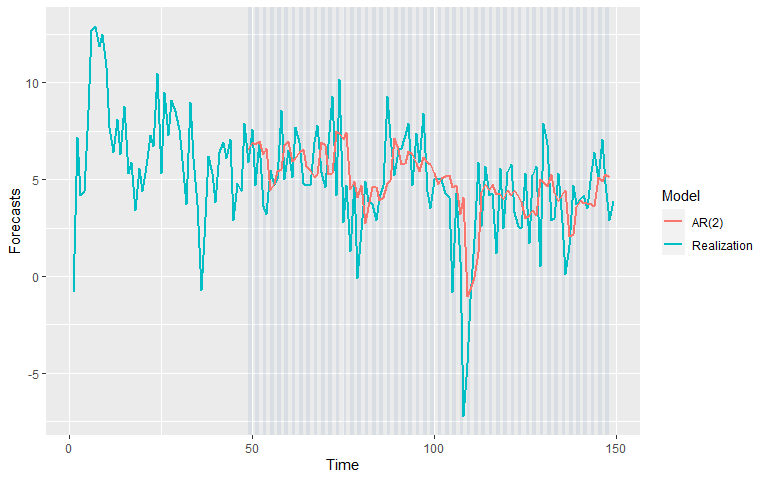
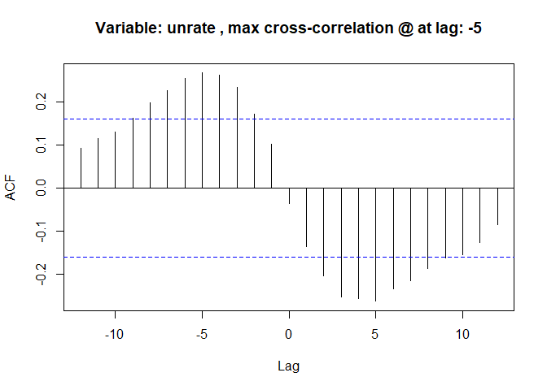
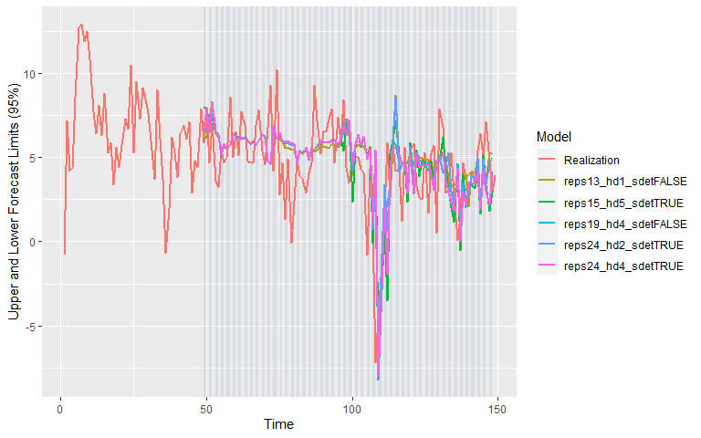
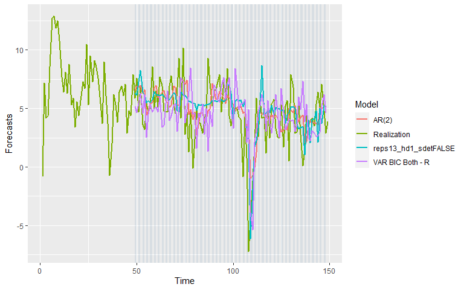

GDP Prediction
================
Nikhil Gutpa and Stuart Miller
2020-04-10 21:09:28

-   [Introduction](#introduction)
-   [Data](#data)
-   [Response Variable](#response-variable)
-   [Modeling](#modeling)
    -   [Stationarity](#stationarity)
        -   [Condition 1: Constant Mean](#condition-1-constant-mean)
        -   [Condition 2: Constant Variance](#condition-2-constant-variance)
        -   [Condition 3: Constant Autocorrelation](#condition-3-constant-autocorrelation)
        -   [Conclusion](#conclusion)
    -   [ARMA Model](#arma-model)
        -   [Model ID](#model-id)
        -   [Model Fit](#model-fit)
            -   [Evaluation of the Residuals](#evaluation-of-the-residuals)
            -   [Model Characterisics](#model-characterisics)
        -   [Forecast Results](#forecast-results)
    -   [VAR Model](#var-model)
        -   [Explanatory Variables](#explanatory-variables)
        -   [CCF Analysis](#ccf-analysis)
        -   [Modeling](#modeling-1)
        -   [Compare the models](#compare-the-models)
        -   [Model Fit](#model-fit-1)
    -   [Neural Network Model](#neural-network-model)
        -   [Hyperparameter Grid Search](#hyperparameter-grid-search)
        -   [Model Fit](#model-fit-2)
        -   [Forecast Results](#forecast-results-1)
    -   [Comparison the best models](#comparison-the-best-models)
    -   [Ensemble Models](#ensemble-models)
        -   [Simple Forecasts (Test data)](#simple-forecasts-test-data)
        -   [Create the ensemble (glm + naive)](#create-the-ensemble-glm-naive)
        -   [Forecasts with Ensemble Models](#forecasts-with-ensemble-models)
            -   [Naive with combine = 'median'](#naive-with-combine-median)
            -   [Naive with combine = 'mean'](#naive-with-combine-mean)
            -   [glm ensemble](#glm-ensemble)
    -   [Conclusion](#conclusion-1)
-   [References](#references)

``` r
# load libraries
library(tswge)
library(tswgewrapped)
library(tidyverse)
library(ggplot2)
library(tseries)
library(kableExtra)
library(knitr)
```

Introduction
============

Economic recessions are periods of time when an economy shinks. These periods of time generally costly to businesses and the populace alike. Deep recessions can be particularly costly to the populace as business downsizing and business failures during recessions generally result in a decrease in available jobs (increasing unemployment). However, if it was possible to predict a coming recession with some confidence, then it may be possible for business and the populace to prepare and mitigate losses.

We propose to model the change in GDP for the United States to attempt to predict recessions. A working definition of a recession is two consecutive quarters of decrease in GDP \[1\]. Thus, we will use a 2-step ahead forecast in evaluating models. 50 quarters of historical data will be used for training models to predict the next 2 quarters.

Data
====

All data was collected from [Federal Reserve Economic Data (FRED) Repository](https://fred.stlouisfed.org/), which is provided by the Federal Reserve Bank of Saint Louis. In addition to quarterly change in GDP, 18 exogenous variables were also collected. The data from 151 quarters (from 1982 Q1 to 2019 Q3) were collected. The data starts at 1982 Q1 because that was the earliest observation available for `treas10yr3mo`.

The exogenous variables are summerized in the table below.

<table style="width:49%;">
<colgroup>
<col width="15%" />
<col width="19%" />
<col width="13%" />
</colgroup>
<thead>
<tr class="header">
<th>Variable</th>
<th>Description</th>
<th>FRED ID</th>
</tr>
</thead>
<tbody>
<tr class="odd">
<td>Date</td>
<td>Date of observation</td>
<td>N/A</td>
</tr>
<tr class="even">
<td>gdp_change</td>
<td>Change in GDP from the previous observation</td>
<td>A191RP1Q027SBEA</td>
</tr>
<tr class="odd">
<td>unrate</td>
<td>Unemployment rate</td>
<td>UNRATE</td>
</tr>
<tr class="even">
<td>nfjobs</td>
<td>Non-farming jobs</td>
<td>PAYEMS</td>
</tr>
<tr class="odd">
<td>treas10yr</td>
<td>10 Year US treasury constant maturity rate</td>
<td>DGS10</td>
</tr>
<tr class="even">
<td>fedintrate</td>
<td>US federal interest rate</td>
<td>FEDFUNDS</td>
</tr>
<tr class="odd">
<td>personincomechg</td>
<td>Change in real disposable personal income</td>
<td>A067RO1Q156NBEA</td>
</tr>
<tr class="even">
<td>cpichg</td>
<td>Change in Consumer Price Index for all urban consumers: all ttems in U.S. city average</td>
<td>CPIAUCNS</td>
</tr>
<tr class="odd">
<td>popchg</td>
<td>Change in Population</td>
<td>POPTHM</td>
</tr>
<tr class="even">
<td>corpprofitchg</td>
<td>Change in Corporate profits after tax (converted to percent change)</td>
<td>CP</td>
</tr>
<tr class="odd">
<td>crude_wtichg</td>
<td>Change in Spot Crude Oil Price: West Texas Intermediate</td>
<td>WTISPLC</td>
</tr>
<tr class="even">
<td>goldchg</td>
<td>Change in Gold Fixing Price 10:30 A.M. (London time) in london bullion market, based in U.S. Dollars</td>
<td>GOLDAMGBD228NLBM</td>
</tr>
<tr class="odd">
<td>ppichg</td>
<td>Change in Producer price index</td>
<td>PPIACO</td>
</tr>
<tr class="even">
<td>japanchg</td>
<td>Change in US/Japan exchange rate</td>
<td>EXJPUS</td>
</tr>
<tr class="odd">
<td>ukchg</td>
<td>Change in US/UK exchange rate</td>
<td>EXUSUK</td>
</tr>
<tr class="even">
<td>wilshirechg</td>
<td>Change in Wilshire 5000 Total Market Full Cap Index</td>
<td>WILL5000INDFC</td>
</tr>
<tr class="odd">
<td>ipichg</td>
<td>Change in Industrial Production Index</td>
<td>INDPRO</td>
</tr>
<tr class="even">
<td>inventorieschg</td>
<td>Change in Real Manufacturing and Trade Inventories</td>
<td>INVCMRMTSPL</td>
</tr>
<tr class="odd">
<td>homeownership</td>
<td>Cahnge in Homeownership Rate for the United States</td>
<td>RHORUSQ156N</td>
</tr>
<tr class="even">
<td>housingpermitschg</td>
<td>Change in New Private Housing Units Authorized by Building Permits</td>
<td>PERMIT</td>
</tr>
<tr class="odd">
<td>treas10yr3mo</td>
<td>10-Year Treasury Constant Maturity Minus 3-Month Treasury Constant Maturity</td>
<td>T10Y3M</td>
</tr>
</tbody>
</table>

``` r
# read data set
data <- read.csv("../data/economic_indicators_all_ex_3mo_china_inc_treas3mo.csv")
data %>%  glimpse()
```

    ## Observations: 151
    ## Variables: 22
    ## $ date              <fct> 1982 Q1, 1982 Q2, 1982 Q3, 1982 Q4, 1983 Q1,...
    ## $ gdp_change        <dbl> -0.8, 7.2, 4.2, 4.4, 8.6, 12.7, 12.9, 11.9, ...
    ## $ unrate            <dbl> 9.0, 9.6, 10.1, 10.8, 10.3, 10.1, 9.2, 8.3, ...
    ## $ nfjobschg         <dbl> -0.5071786, -0.6291881, -0.7589162, -0.46197...
    ## $ treas10yr         <dbl> 14.18, 14.44, 11.73, 10.36, 10.62, 10.96, 11...
    ## $ treas3mo          <dbl> 13.99, 13.36, 7.88, 8.20, 8.96, 9.15, 9.04, ...
    ## $ treas10yr3mo      <dbl> 0.19, 1.08, 3.85, 2.16, 1.66, 1.81, 2.40, 2....
    ## $ fedintrate        <dbl> 14.68, 14.15, 10.31, 8.95, 8.77, 8.98, 9.45,...
    ## $ personincomechg   <dbl> 2.6, 3.1, 1.4, 1.6, 2.4, 2.5, 3.5, 5.5, 6.6,...
    ## $ cpichg            <dbl> 0.5319149, 2.6455026, 0.9278351, -0.3064351,...
    ## $ popchg            <dbl> 0.2098904, 0.2297481, 0.2662760, 0.2290424, ...
    ## $ housingpermitschg <dbl> 11.9346734, 2.4691358, 14.1292442, 29.654510...
    ## $ homeownership     <dbl> 64.8, 64.9, 64.9, 64.5, 64.7, 64.7, 64.8, 64...
    ## $ corpprofitchg     <dbl> -9.8822616, 1.0334227, -2.5010250, -3.405117...
    ## $ inventorieschg    <dbl> -1.3318626, -0.2449114, -0.1071666, -1.63672...
    ## $ crude_wtichg      <dbl> -18.6285714, 23.1390449, 1.5968064, -10.9738...
    ## $ ppichg            <dbl> 0.80971660, 0.40160643, 0.00000000, 0.500000...
    ## $ ipichg            <dbl> -0.81243157, -1.84873818, -1.48731619, -1.99...
    ## $ wilshirechg       <dbl> -9.0163934, -1.3513514, 11.4155251, 18.85245...
    ## $ goldchg           <dbl> -19.8750000, -2.0280811, 25.7165605, 13.4895...
    ## $ japanchg          <dbl> 10.1727985, 4.1327655, 4.8121460, -8.1069348...
    ## $ ukchg             <dbl> -5.1489518, -2.7142303, -2.5223481, -5.60747...

``` r
# Remove the date column
data = data %>% dplyr::select(-date)
```

``` r
# global settings
var_interest = 'gdp_change'
batch_size = 50
n.ahead = 2
```

``` r
# split data into a train and test set
data_train = data %>% dplyr::slice(1:(dplyr::n()-n.ahead))
data_test = data %>% dplyr::slice((dplyr::n()-n.ahead), dplyr::n())
```

Response Variable
=================

The response variable is change in GDP, denoted as `gdp_change`. The realization, sample autocorrelations, and Parzen window are shown below. The realization appears to express wandering behavior with some oscillation. Based on the sample aucorrelations, wandering appears to be the dominate behavior. The oscillations do not appear to be expressed strongly in the sample autocorrelations. This is consisent with the Parzen window, which shows a dominate frequency at 0. The other frequencies shown in the parzen window have very low magnitudes.


Modeling
========

Stationarity
------------

We start the analysis with an assessment of startionarity of the realization.


    ## [1] TRUE

### Condition 1: Constant Mean

-   There does not appear to be evidence of a trend in the data.
-   Additionaly there does not appear to be any kind of deterministic oscillation in the data

Therefore, the assumption of constant mean does not appear to be violated.

### Condition 2: Constant Variance

-   There does not apprear to be evidence of the variance of the realization changing over time.
-   the drastic change at time step 75 maybe uncharacterisic of the process generating this realization, but it is difficult to determine with only one realization. This could be normal wandering behavior of the process generating this realization.

Therefore, the assumption of constant variance does not appear to be violated.

### Condition 3: Constant Autocorrelation

The ACF of the first and second half of the realization appear to exhibit similar behavior. However, the autocorrelations have very low magnitudes - most of the autocorrelations do not appear to be significantly different than 0.

Therefore, the assumption of constant autocorrelation does not appear to be violated.

### Conclusion

Given the above analysis, there does not appear to be sufficient evidence to suggest that the process generating the realization is not stationary. We will continue the ananlysis assuming the process generating the realization is stationary.

ARMA Model
----------

Since the process generating the realization is assumed to be stationary, we will model this realization with an ARMA model.

### Model ID

``` r
# get the top five models selected by AIC and BIC
aicbic.tables <- aicbic(data_train$gdp_change, 0:12, 0:3, silent = TRUE)
```

<table class="table table-striped" style="width: auto !important; margin-left: auto; margin-right: auto;">
<thead>
<tr>
<th style="text-align:left;">
</th>
<th style="text-align:right;">
p
</th>
<th style="text-align:right;">
q
</th>
<th style="text-align:right;">
aic
</th>
</tr>
</thead>
<tbody>
<tr>
<td style="text-align:left;">
9
</td>
<td style="text-align:right;">
2
</td>
<td style="text-align:right;">
0
</td>
<td style="text-align:right;">
1.778271
</td>
</tr>
<tr>
<td style="text-align:left;">
6
</td>
<td style="text-align:right;">
1
</td>
<td style="text-align:right;">
1
</td>
<td style="text-align:right;">
1.785061
</td>
</tr>
<tr>
<td style="text-align:left;">
7
</td>
<td style="text-align:right;">
1
</td>
<td style="text-align:right;">
2
</td>
<td style="text-align:right;">
1.789710
</td>
</tr>
<tr>
<td style="text-align:left;">
10
</td>
<td style="text-align:right;">
2
</td>
<td style="text-align:right;">
1
</td>
<td style="text-align:right;">
1.791287
</td>
</tr>
<tr>
<td style="text-align:left;">
13
</td>
<td style="text-align:right;">
3
</td>
<td style="text-align:right;">
0
</td>
<td style="text-align:right;">
1.791429
</td>
</tr>
</tbody>
</table>
<table class="table table-striped" style="width: auto !important; margin-left: auto; margin-right: auto;">
<thead>
<tr>
<th style="text-align:left;">
</th>
<th style="text-align:right;">
p
</th>
<th style="text-align:right;">
q
</th>
<th style="text-align:right;">
bic
</th>
</tr>
</thead>
<tbody>
<tr>
<td style="text-align:left;">
9
</td>
<td style="text-align:right;">
2
</td>
<td style="text-align:right;">
0
</td>
<td style="text-align:right;">
1.838753
</td>
</tr>
<tr>
<td style="text-align:left;">
6
</td>
<td style="text-align:right;">
1
</td>
<td style="text-align:right;">
1
</td>
<td style="text-align:right;">
1.845543
</td>
</tr>
<tr>
<td style="text-align:left;">
5
</td>
<td style="text-align:right;">
1
</td>
<td style="text-align:right;">
0
</td>
<td style="text-align:right;">
1.867211
</td>
</tr>
<tr>
<td style="text-align:left;">
7
</td>
<td style="text-align:right;">
1
</td>
<td style="text-align:right;">
2
</td>
<td style="text-align:right;">
1.870353
</td>
</tr>
<tr>
<td style="text-align:left;">
10
</td>
<td style="text-align:right;">
2
</td>
<td style="text-align:right;">
1
</td>
<td style="text-align:right;">
1.871930
</td>
</tr>
</tbody>
</table>
Both AIC and BIC select low order models with an ARMA(2, 0) selected as the best ID by both criteria. The following models are selected by both criteria:

-   ARMA(2, 0)
-   ARMA(1, 1)
-   ARMA(1, 2)
-   ARMA(2, 1)

An ARMA(2,0) was fit based on the model ID from AIC and BIC. The factor table for the estimated model does not show roots near the unit circle.

``` r
est.s <- est.arma.wge(data_train$gdp_change, 2, 0)
```

    ## 
    ## Coefficients of Original polynomial:  
    ## 0.3921 0.2568 
    ## 
    ## Factor                 Roots                Abs Recip    System Freq 
    ## 1-0.7394B              1.3525               0.7394       0.0000
    ## 1+0.3473B             -2.8794               0.3473       0.5000
    ##   
    ## 

The following factored model is suggested by the MLE fit:

(1-0.7391 *B* )(1+0.3472 *B* )( *X*<sub>*t*</sub> - 5.1490066) = *a*<sub>*t*</sub> with *σ*<sub>*a*</sub><sup>2</sup> = 5.6859734

### Model Fit

``` r
# setup object with unitvariate model
models = list("AR(2)" = list(phi = est.s$phi, vara = est.s$avar, res = est.s$res, sliding_ase = TRUE))
mdl_compare_uni = ModelCompareUnivariate$new(data = data_train, var_interest = var_interest, mdl_list = models,
                                             n.ahead = n.ahead, batch_size = batch_size)
```

#### Evaluation of the Residuals

The residuals appear to be nearly consisent with white noise. Some of the autocorrelations of the residuals are marginally significant, but not more than expected. As secondary evaluation, the Ljung-Box test does not reject the null hypothesis that residuals are not white noise.

    ## 
    ## 
    ## Evaluating residuals for model: 'AR(2)'


    ## None of the 'ljung_box' tests rejected the null hypothesis that the data is consistent with white noise at an significance level of  0.05

<table class="table table-striped" style="width: auto !important; margin-left: auto; margin-right: auto;">
<thead>
<tr>
<th style="text-align:left;">
test
</th>
<th style="text-align:right;">
K
</th>
<th style="text-align:right;">
chi.square
</th>
<th style="text-align:right;">
df
</th>
<th style="text-align:right;">
pval
</th>
<th style="text-align:left;">
Decision
</th>
</tr>
</thead>
<tbody>
<tr>
<td style="text-align:left;">
Ljung-Box test
</td>
<td style="text-align:right;">
24
</td>
<td style="text-align:right;">
31.48493
</td>
<td style="text-align:right;">
22
</td>
<td style="text-align:right;">
0.0866114
</td>
<td style="text-align:left;">
FTR NULL
</td>
</tr>
<tr>
<td style="text-align:left;">
Ljung-Box test
</td>
<td style="text-align:right;">
48
</td>
<td style="text-align:right;">
51.68120
</td>
<td style="text-align:right;">
46
</td>
<td style="text-align:right;">
0.2615968
</td>
<td style="text-align:left;">
FTR NULL
</td>
</tr>
</tbody>
</table>
#### Model Characterisics

Realizations were simulated from the fit model for comparing realizations, ACFs, and spectral densities to the data.

-   The realization simulated from the univariate model appear to have a similar amount of wandering and sharp changes.
-   The ACFs of the simulated realizations appear to exhibit similar behavior through lag 7. After lag 7, one of the ACFs diverge from the other realizations. However the magnitude of the ACFs at these lags is fairly small so it is not a concern.
-   The spectral densitied generally show similar behavior: a peak at or near a frequency of zero with roll-off that ends at about frequency 0.15. One spectral density shows a peak slightly above 0 (about 0.03) with a steaper roll off. However, this spectral density is still exhibiting the same general behavior consistent with the realization.

``` r
mdl_compare_uni$plot_multiple_realizations()
```


### Forecast Results

Generally, the realization is contained in the forecast limits of the model, although the model is unable to capture the sharp changes in the GDP from quarter to quarter. Also, the model is unable to capture the steap dip near time step 100.

``` r
# show sliding window forecasts
tbl <- mdl_compare_uni$plot_batch_forecasts(only_sliding = TRUE)
```



Viewing the rolling window ASE over time, we see that the most extreme value occurs at the same location as the extreme value of the realization. This is not surprising since an ARMA model will tend toward the mean and this value is far from the window mean.

``` r
# show ASE over time (windows)
tbl <- mdl_compare_uni$plot_batch_ases(only_sliding = TRUE)
```


VAR Model
---------

### Explanatory Variables

The realizations of the exogeneous variables are shown below.

``` r
eda <- MultivariateEDA$new(data = data_train, var_interest = var_interest)
eda$plot_data(ncol = 3)
```


### CCF Analysis

**Summary**

Based on the CCF analysis, we find that very few variables show a strong cross correlation with `gdp_change`. The most significant cross correlation was obtained for `nfjobschg`, `ipichg`, `inventorieschg`, `treas10yr`, `treas3mo` (top 5) and most of the variables showed the max cross correlation at lag = 0. This would mean that it might be benefitial to keep a low lag value in the VAR model (esepcially given that we have many exogenous variables and not a lot of data points).

**NOTE: The CCF Analysis conclusions and values are based on negative lags of the variables with respect to 'gdp\_change' only since we wont have the future values to forecast the results.**

``` r
# plot the ccfs and get back the ccf table
ccf <- eda$plot_ccf_analysis(negative_only = TRUE)
```



``` r
# show the ccf table
ccf %>%
  dplyr::select(-c(max_ccf_index_adjusted)) %>%
  kable() %>%
  kable_styling(bootstrap_options = "striped", full_width = F)
```

<table class="table table-striped" style="width: auto !important; margin-left: auto; margin-right: auto;">
<thead>
<tr>
<th style="text-align:left;">
variable
</th>
<th style="text-align:right;">
max\_ccf\_index
</th>
<th style="text-align:right;">
max\_ccf\_value
</th>
</tr>
</thead>
<tbody>
<tr>
<td style="text-align:left;">
nfjobschg
</td>
<td style="text-align:right;">
0
</td>
<td style="text-align:right;">
0.6823141
</td>
</tr>
<tr>
<td style="text-align:left;">
ipichg
</td>
<td style="text-align:right;">
0
</td>
<td style="text-align:right;">
0.5907157
</td>
</tr>
<tr>
<td style="text-align:left;">
inventorieschg
</td>
<td style="text-align:right;">
0
</td>
<td style="text-align:right;">
0.4852442
</td>
</tr>
<tr>
<td style="text-align:left;">
treas10yr
</td>
<td style="text-align:right;">
0
</td>
<td style="text-align:right;">
0.4677121
</td>
</tr>
<tr>
<td style="text-align:left;">
treas3mo
</td>
<td style="text-align:right;">
0
</td>
<td style="text-align:right;">
0.4453255
</td>
</tr>
<tr>
<td style="text-align:left;">
fedintrate
</td>
<td style="text-align:right;">
0
</td>
<td style="text-align:right;">
0.4162709
</td>
</tr>
<tr>
<td style="text-align:left;">
personincomechg
</td>
<td style="text-align:right;">
0
</td>
<td style="text-align:right;">
0.3711154
</td>
</tr>
<tr>
<td style="text-align:left;">
homeownership
</td>
<td style="text-align:right;">
-12
</td>
<td style="text-align:right;">
-0.2841890
</td>
</tr>
<tr>
<td style="text-align:left;">
cpichg
</td>
<td style="text-align:right;">
0
</td>
<td style="text-align:right;">
0.2797316
</td>
</tr>
<tr>
<td style="text-align:left;">
unrate
</td>
<td style="text-align:right;">
-5
</td>
<td style="text-align:right;">
0.2668851
</td>
</tr>
<tr>
<td style="text-align:left;">
housingpermitschg
</td>
<td style="text-align:right;">
-1
</td>
<td style="text-align:right;">
0.2664965
</td>
</tr>
<tr>
<td style="text-align:left;">
wilshirechg
</td>
<td style="text-align:right;">
-3
</td>
<td style="text-align:right;">
0.2598483
</td>
</tr>
<tr>
<td style="text-align:left;">
ppichg
</td>
<td style="text-align:right;">
0
</td>
<td style="text-align:right;">
0.2579584
</td>
</tr>
<tr>
<td style="text-align:left;">
treas10yr3mo
</td>
<td style="text-align:right;">
-9
</td>
<td style="text-align:right;">
0.2085462
</td>
</tr>
<tr>
<td style="text-align:left;">
corpprofitchg
</td>
<td style="text-align:right;">
0
</td>
<td style="text-align:right;">
0.1764240
</td>
</tr>
<tr>
<td style="text-align:left;">
goldchg
</td>
<td style="text-align:right;">
-8
</td>
<td style="text-align:right;">
-0.1509366
</td>
</tr>
<tr>
<td style="text-align:left;">
crude\_wtichg
</td>
<td style="text-align:right;">
0
</td>
<td style="text-align:right;">
0.1366070
</td>
</tr>
<tr>
<td style="text-align:left;">
popchg
</td>
<td style="text-align:right;">
0
</td>
<td style="text-align:right;">
0.1327717
</td>
</tr>
<tr>
<td style="text-align:left;">
japanchg
</td>
<td style="text-align:right;">
-9
</td>
<td style="text-align:right;">
-0.1071158
</td>
</tr>
<tr>
<td style="text-align:left;">
ukchg
</td>
<td style="text-align:right;">
-1
</td>
<td style="text-align:right;">
0.0953229
</td>
</tr>
</tbody>
</table>
### Modeling

The VAR models selected by the following process.

-   BIC was used to select the maximum lag to consider (since we wanted to have a small lag order selection given the large number of exogenous variables and the conclusions from the CCF analysis).
-   The model of the selected lag was fit.
-   In order to reduce the variables further, those variables that were insignificant in the fit were dropped and the maximum lag was reduced further to the maximum significant lag found in the fit. This is a crude variable selection technique. In the future, we will evaluate a better variable selection technique.

``` r
# maximum lag to consider in VAR models
lag.max = 10

# List of VAR models to build for comparison
models = list("VAR BIC None" = list(select = "bic", trend_type = "none", lag.max = lag.max),
              "VAR BIC Trend" = list(select = "bic", trend_type = "trend", lag.max = lag.max),
              "VAR BIC Both" = list(select = "bic", trend_type = "both", lag.max = lag.max))

# instantiate the model build object
mdl_build_var = ModelBuildMultivariateVAR$new(data = data_train, var_interest = var_interest,
                                              mdl_list = models, verbose = 0)
```

The model building process shows that even though we had used lag.max = 10, the p (lag order) selected by VARSelect was 6.

``` r
# summarize the the recommended models
summary_build = mdl_build_var$summarize_build()

summary_build %>% 
  kable() %>%
  kable_styling(bootstrap_options = "striped", full_width = F)
```

<table class="table table-striped" style="width: auto !important; margin-left: auto; margin-right: auto;">
<thead>
<tr>
<th style="text-align:left;">
Model
</th>
<th style="text-align:left;">
select
</th>
<th style="text-align:left;">
trend\_type
</th>
<th style="text-align:right;">
season
</th>
<th style="text-align:right;">
p
</th>
<th style="text-align:left;">
SigVar
</th>
<th style="text-align:left;">
OriginalVar
</th>
<th style="text-align:right;">
Lag
</th>
<th style="text-align:right;">
MaxLag
</th>
</tr>
</thead>
<tbody>
<tr>
<td style="text-align:left;">
VAR BIC None
</td>
<td style="text-align:left;">
bic
</td>
<td style="text-align:left;">
none
</td>
<td style="text-align:right;">
0
</td>
<td style="text-align:right;">
6
</td>
<td style="text-align:left;">
nfjobschg.l3
</td>
<td style="text-align:left;">
nfjobschg
</td>
<td style="text-align:right;">
-3
</td>
<td style="text-align:right;">
-6
</td>
</tr>
<tr>
<td style="text-align:left;">
VAR BIC None
</td>
<td style="text-align:left;">
bic
</td>
<td style="text-align:left;">
none
</td>
<td style="text-align:right;">
0
</td>
<td style="text-align:right;">
6
</td>
<td style="text-align:left;">
corpprofitchg.l4
</td>
<td style="text-align:left;">
corpprofitchg
</td>
<td style="text-align:right;">
-4
</td>
<td style="text-align:right;">
-4
</td>
</tr>
<tr>
<td style="text-align:left;">
VAR BIC None
</td>
<td style="text-align:left;">
bic
</td>
<td style="text-align:left;">
none
</td>
<td style="text-align:right;">
0
</td>
<td style="text-align:right;">
6
</td>
<td style="text-align:left;">
nfjobschg.l6
</td>
<td style="text-align:left;">
nfjobschg
</td>
<td style="text-align:right;">
-6
</td>
<td style="text-align:right;">
-6
</td>
</tr>
<tr>
<td style="text-align:left;">
VAR BIC Trend
</td>
<td style="text-align:left;">
bic
</td>
<td style="text-align:left;">
trend
</td>
<td style="text-align:right;">
0
</td>
<td style="text-align:right;">
6
</td>
<td style="text-align:left;">
nfjobschg.l3
</td>
<td style="text-align:left;">
nfjobschg
</td>
<td style="text-align:right;">
-3
</td>
<td style="text-align:right;">
-6
</td>
</tr>
<tr>
<td style="text-align:left;">
VAR BIC Trend
</td>
<td style="text-align:left;">
bic
</td>
<td style="text-align:left;">
trend
</td>
<td style="text-align:right;">
0
</td>
<td style="text-align:right;">
6
</td>
<td style="text-align:left;">
corpprofitchg.l4
</td>
<td style="text-align:left;">
corpprofitchg
</td>
<td style="text-align:right;">
-4
</td>
<td style="text-align:right;">
-4
</td>
</tr>
<tr>
<td style="text-align:left;">
VAR BIC Trend
</td>
<td style="text-align:left;">
bic
</td>
<td style="text-align:left;">
trend
</td>
<td style="text-align:right;">
0
</td>
<td style="text-align:right;">
6
</td>
<td style="text-align:left;">
nfjobschg.l6
</td>
<td style="text-align:left;">
nfjobschg
</td>
<td style="text-align:right;">
-6
</td>
<td style="text-align:right;">
-6
</td>
</tr>
<tr>
<td style="text-align:left;">
VAR BIC Both
</td>
<td style="text-align:left;">
bic
</td>
<td style="text-align:left;">
both
</td>
<td style="text-align:right;">
0
</td>
<td style="text-align:right;">
6
</td>
<td style="text-align:left;">
gdp\_change.l1
</td>
<td style="text-align:left;">
gdp\_change
</td>
<td style="text-align:right;">
-1
</td>
<td style="text-align:right;">
-1
</td>
</tr>
<tr>
<td style="text-align:left;">
VAR BIC Both
</td>
<td style="text-align:left;">
bic
</td>
<td style="text-align:left;">
both
</td>
<td style="text-align:right;">
0
</td>
<td style="text-align:right;">
6
</td>
<td style="text-align:left;">
nfjobschg.l3
</td>
<td style="text-align:left;">
nfjobschg
</td>
<td style="text-align:right;">
-3
</td>
<td style="text-align:right;">
-3
</td>
</tr>
<tr>
<td style="text-align:left;">
VAR BIC Both
</td>
<td style="text-align:left;">
bic
</td>
<td style="text-align:left;">
both
</td>
<td style="text-align:right;">
0
</td>
<td style="text-align:right;">
6
</td>
<td style="text-align:left;">
cpichg.l3
</td>
<td style="text-align:left;">
cpichg
</td>
<td style="text-align:right;">
-3
</td>
<td style="text-align:right;">
-3
</td>
</tr>
<tr>
<td style="text-align:left;">
VAR BIC Both
</td>
<td style="text-align:left;">
bic
</td>
<td style="text-align:left;">
both
</td>
<td style="text-align:right;">
0
</td>
<td style="text-align:right;">
6
</td>
<td style="text-align:left;">
ppichg.l3
</td>
<td style="text-align:left;">
ppichg
</td>
<td style="text-align:right;">
-3
</td>
<td style="text-align:right;">
-3
</td>
</tr>
</tbody>
</table>
``` r
# get the recommended models
mdl_build_var$get_recommendations() %>% 
  kable() %>%
  kable_styling(bootstrap_options = "striped", full_width = F)
```

<table class="table table-striped" style="width: auto !important; margin-left: auto; margin-right: auto;">
<thead>
<tr>
<th style="text-align:left;">
Model
</th>
<th style="text-align:left;">
trend\_type
</th>
<th style="text-align:right;">
season
</th>
<th style="text-align:right;">
num\_sig\_lag\_vars
</th>
<th style="text-align:right;">
lag\_to\_use
</th>
<th style="text-align:left;">
lag\_vars\_to\_use
</th>
<th style="text-align:right;">
season\_to\_use
</th>
</tr>
</thead>
<tbody>
<tr>
<td style="text-align:left;">
VAR BIC Both
</td>
<td style="text-align:left;">
both
</td>
<td style="text-align:right;">
0
</td>
<td style="text-align:right;">
4
</td>
<td style="text-align:right;">
3
</td>
<td style="text-align:left;">
gdp\_change,nfjobschg,cpichg,ppichg
</td>
<td style="text-align:right;">
0
</td>
</tr>
<tr>
<td style="text-align:left;">
VAR BIC None
</td>
<td style="text-align:left;">
none
</td>
<td style="text-align:right;">
0
</td>
<td style="text-align:right;">
2
</td>
<td style="text-align:right;">
6
</td>
<td style="text-align:left;">
nfjobschg,corpprofitchg
</td>
<td style="text-align:right;">
0
</td>
</tr>
<tr>
<td style="text-align:left;">
VAR BIC Trend
</td>
<td style="text-align:left;">
trend
</td>
<td style="text-align:right;">
0
</td>
<td style="text-align:right;">
2
</td>
<td style="text-align:right;">
6
</td>
<td style="text-align:left;">
nfjobschg,corpprofitchg
</td>
<td style="text-align:right;">
0
</td>
</tr>
</tbody>
</table>
The above table shows that for the "VAR BIC Both" model, only 4 lagged variables were significant and that too upto a max lag of 3. For the other 2 models, only 2 lagged variables were significant but till a lag of 6. So we will continue to build the recommended models with this reduced set of variables and lags.

``` r
# build the VAR models
mdl_build_var$build_recommended_models()
```

``` r
# return the VAR models for comparison
models = mdl_build_var$get_final_models(subset = 'r')

# Setup Models to be compared with sliding ASE = TRUE
for (name in names(models)){
  models[[name]][['sliding_ase']] = TRUE
}
```

### Compare the models

``` r
# Initialize the ModelCompareMultivariateVAR object
mdl_compare_var = ModelCompareMultivariateVAR$new(data = data_train, var_interest = var_interest,
                                                  mdl_list = models, n.ahead = n.ahead, batch_size = batch_size, verbose = 1)
```

    ## 
    ## Computing metrics for:  VAR BIC Both - R 
    ## 
    ## Number of batches expected:  50
    ## Computing metrics for:  VAR BIC None - R 
    ## 
    ## Number of batches expected:  50
    ## Computing metrics for:  VAR BIC Trend - R 
    ## 
    ## Number of batches expected:  50# A tibble: 3 x 6
    ##   Model             Trend Season SlidingASE Init_K Final_K
    ##   <chr>             <chr>  <dbl> <lgl>       <dbl>   <dbl>
    ## 1 VAR BIC Both - R  both       0 TRUE            3       3
    ## 2 VAR BIC None - R  none       0 TRUE            6       6
    ## 3 VAR BIC Trend - R trend      0 TRUE            6       6

Note:

-   If the sliding window is not large enough, we can not build the models with the variables provided. Hence the k values used in the VAR model must be reduced (this is reflected in the Final\_K column). If we do run into this issue, the models will most likely not turn out to be good since we wont have enough degrees of freedom to compute the residuals.
-   In this case however, since we have reduced the variables to be used for model development, we do not run into this issues and Final\_K is the same as the value of K (Init\_K) recommended by the model build process.

The rolling window forecasts are shown below. The model with trend only (VAR BIC Trend - R) and the model without trend and constant terms (VAR BIC None - R), appear to overshoot the movement of the realization. This is especially true just after the large dip in the realization after time step 100.

``` r
tbl <- mdl_compare_var$plot_batch_forecasts()
```


Overall, the model with both trend and constant term (VAR BIC Both - R) appears produce forecasts with lower ASEs on average.

``` r
# show distributions of ASEs
tbl <- mdl_compare_var$plot_boxplot_ases()
```


Visualizing the realizations over time shows that the model with both trend and constant appears to perform best. The large ASEs from the forecasts occur around the sharp dip in the realization just after time step 100.

``` r
p = mdl_compare_var$plot_batch_ases()
```


Since the model with both trend and constant terms appears to be the best, we will drop the other two models from further analysis.

``` r
mdl_compare_var$keep_models(mdl_names = c("VAR BIC Both - R"))
```

    ## 
    ## Model: 'VAR BIC None - R' will be removed.
    ## Model: 'VAR BIC Trend - R' will be removed.

### Model Fit

An examination of the residuals show that the residuals of the VAR appear to be consistent with white noise. The autocorrelations of the residuals appear to be marginally inconsistent with white noise. Since these residuals are close to white noise, we will assume the model is sufficient for modeling these data.


    ## At least one of the 'ljung_box' tests rejected the null hypothesis that the data is consistent with white noise at an significance level of  0.05

Neural Network Model
--------------------

### Hyperparameter Grid Search

Since it is sometimes hard to figure out the hyperparameters to be used for the neural network model, we will perform a random grid search over number of repetitions (reps), the number of hidden layers (hd), and whether seasonality should be automatically detected or not (allow.det.season) to figure out the best settings.

``` r
# search for best NN hyperparameters in given grid
model = ModelBuildNNforCaret$new(data = data_train, var_interest = var_interest,
                                 search = 'random', tuneLength = 5, parallel = TRUE, seed = 1,
                                 batch_size = batch_size, h = n.ahead, 
                                 verbose = 1)
```

The ASEs associated with the grid of hyperparameters is shown in the table and heatmap below.

``` r
res <- model$summarize_hyperparam_results()
```

<table class="table table-striped" style="width: auto !important; margin-left: auto; margin-right: auto;">
<thead>
<tr>
<th style="text-align:right;">
reps
</th>
<th style="text-align:right;">
hd
</th>
<th style="text-align:left;">
allow.det.season
</th>
<th style="text-align:right;">
RMSE
</th>
<th style="text-align:right;">
ASE
</th>
<th style="text-align:right;">
RMSESD
</th>
<th style="text-align:right;">
ASESD
</th>
</tr>
</thead>
<tbody>
<tr>
<td style="text-align:right;">
13
</td>
<td style="text-align:right;">
1
</td>
<td style="text-align:left;">
FALSE
</td>
<td style="text-align:right;">
2.023790
</td>
<td style="text-align:right;">
5.496455
</td>
<td style="text-align:right;">
1.195540
</td>
<td style="text-align:right;">
7.592233
</td>
</tr>
<tr>
<td style="text-align:right;">
15
</td>
<td style="text-align:right;">
5
</td>
<td style="text-align:left;">
TRUE
</td>
<td style="text-align:right;">
2.264970
</td>
<td style="text-align:right;">
7.469284
</td>
<td style="text-align:right;">
1.544971
</td>
<td style="text-align:right;">
12.852294
</td>
</tr>
<tr>
<td style="text-align:right;">
19
</td>
<td style="text-align:right;">
4
</td>
<td style="text-align:left;">
FALSE
</td>
<td style="text-align:right;">
2.170847
</td>
<td style="text-align:right;">
6.807313
</td>
<td style="text-align:right;">
1.462014
</td>
<td style="text-align:right;">
11.221647
</td>
</tr>
<tr>
<td style="text-align:right;">
24
</td>
<td style="text-align:right;">
2
</td>
<td style="text-align:left;">
TRUE
</td>
<td style="text-align:right;">
2.115481
</td>
<td style="text-align:right;">
6.196821
</td>
<td style="text-align:right;">
1.325404
</td>
<td style="text-align:right;">
9.547164
</td>
</tr>
<tr>
<td style="text-align:right;">
24
</td>
<td style="text-align:right;">
4
</td>
<td style="text-align:left;">
TRUE
</td>
<td style="text-align:right;">
2.181295
</td>
<td style="text-align:right;">
6.964699
</td>
<td style="text-align:right;">
1.500562
</td>
<td style="text-align:right;">
12.154614
</td>
</tr>
</tbody>
</table>
``` r
model$plot_hyperparam_results()
```


The best hyperparemeters are shown below

``` r
best <- model$summarize_best_hyperparams()
```

<table class="table table-striped" style="width: auto !important; margin-left: auto; margin-right: auto;">
<thead>
<tr>
<th style="text-align:right;">
reps
</th>
<th style="text-align:right;">
hd
</th>
<th style="text-align:left;">
allow.det.season
</th>
</tr>
</thead>
<tbody>
<tr>
<td style="text-align:right;">
13
</td>
<td style="text-align:right;">
1
</td>
<td style="text-align:left;">
FALSE
</td>
</tr>
</tbody>
</table>
``` r
final.ase <- filter(res, reps == best$reps &
                    hd == best$hd &
                    allow.det.season == best$allow.det.season)[['ASE']]
```

The best hyperparameters based on this grid search are 13 repetitions and 1 hidden layers, and allow.det.season = FALSE which has a mean rolling window ASE of 5.4964555.

### Model Fit

A plot of the residuals shows that the residuals are consistent with white noise with about as many excursions as expected in the ACF plot.

``` r
# get back the nnfor mlp model
model.nnfor <- model$get_final_models(subset = 'r')

# extract the fitted values for white noise evaluation
values.fitted <- as.numeric(model.nnfor$fitted)
# find the difference in length between the realization and the fitted values
size <- length(data_train$gdp_change)
diff.size <- length(data_train$gdp_change) - length(values.fitted) + 1
# get the residuals (fitted - realization)
resids <- values.fitted - data_train$gdp_change[diff.size : size]
```

``` r
tbl <- tswgewrapped::evaluate_residuals(resids)
```


    ## None of the 'ljung_box' tests rejected the null hypothesis that the data is consistent with white noise at an significance level of  0.05

### Forecast Results

``` r
caret_model = model$get_final_models(subset = 'a')
# Initialize the ModelCompareNNforCaret object
mdl_compare_mlp = ModelCompareNNforCaret$new(data = data_train, var_interest = var_interest,
                                             mdl_list = caret_model,
                                             verbose = 0)
```

    ## Warning in if (class(mdl_list) == "mlp") {: the condition has length > 1
    ## and only the first element will be used

    ## Warning in private$models[[name]]$ASEs = res$ASEs: Coercing LHS to a list

    ## Warning in private$models[[name]]$ASEs = res$ASEs: Coercing LHS to a list

    ## Warning in private$models[[name]]$ASEs = res$ASEs: Coercing LHS to a list

    ## Warning in private$models[[name]]$ASEs = res$ASEs: Coercing LHS to a list

    ## Warning in private$models[[name]]$ASEs = res$ASEs: Coercing LHS to a list

    ## NULL

The rolling window forecasts for the neural network model (all models in the grid) is shown below.

``` r
# plot the rolling window forecasts
p = mdl_compare_mlp$plot_batch_forecasts()
```



The plot of ASE over time shows that the ASE appears to spike frequently, especially near sharp changes in the realization.

``` r
# plot the ASC over time
p = mdl_compare_mlp$plot_batch_ases() 
```


Comparison the best models
--------------------------

``` r
newxreg <- data_test %>% dplyr::select(-!!var_interest)

# build compare model object
mdl_combine = ModelCombine$new(data = data_train, 
                               var_interest = var_interest,
                               uni_models = mdl_compare_uni, 
                               var_models = mdl_compare_var, 
                               mlp_models = mdl_compare_mlp,
                               verbose = 1)
```

The rolling window ASE distributions for each type of model constructed are shown below. Overall, the ARMA(2, 0) model produces forecasts with the least error as the mean and upper IQR line appear to have a lower value than the other two models. Each model has a window forecast ASE above a value of 60. These are the forests for the steap dip in the realization after time step 100, indicating that none of the models are forecasting this change.

``` r
# plot the distributions of ASE from the rolling windows
mdl_combine$plot_boxplot_ases()
```


However, statistically speaking there is no difference in the performance of these models (p-value from ANOVA = 0.503). Hence, we will eventually keep all 3 models in the final ensemble.

``` r
comparison = mdl_combine$statistical_compare()
```

    ##              Df Sum Sq Mean Sq F value Pr(>F)
    ## Model         2    136   68.08   0.691  0.503
    ## Residuals   147  14493   98.59               
    ## 
    ## 
    ##   Tukey multiple comparisons of means
    ##     95% family-wise confidence level
    ## 
    ## Fit: aov(formula = ASE ~ Model, data = results)
    ## 
    ## $Model
    ##                                             diff       lwr      upr
    ## reps13_hd1_sdetFALSE-AR(2)            -0.0747316 -4.776592 4.627129
    ## VAR BIC Both - R-AR(2)                 1.9827313 -2.719129 6.684592
    ## VAR BIC Both - R-reps13_hd1_sdetFALSE  2.0574629 -2.644398 6.759323
    ##                                           p adj
    ## reps13_hd1_sdetFALSE-AR(2)            0.9992195
    ## VAR BIC Both - R-AR(2)                0.5790203
    ## VAR BIC Both - R-reps13_hd1_sdetFALSE 0.5553679

Comparing the rolling window forecasts of each model, we can make several observations. The ARMA model appears to be conservative, but generally captures the movement of the realization. The VAR model captures the movement of the realization, but wanders away from the realization in some cases. The neural network model does not capture the movement of the realization as well as the ARMA model or the VAR model. This is particularly evident in the second half of the forecasts where the neural network appears to have a high variance. Additionally, all models appear to lag the major dip in the realization after time step 100.

``` r
mdl_combine$plot_batch_forecasts()
```



Ensemble Models
---------------

### Simple Forecasts (Test data)

``` r
p = mdl_combine$plot_simple_forecasts(lastn = FALSE, newxreg = newxreg, zoom = 20) 
```


Ensembles of the base models are created by combining the forecasts of the base models using a simple linear regression model. In addition 2 naive ensembles were also created which combined the base model forecasts using a mean and a median operator.

### Create the ensemble (glm + naive)

``` r
mdl_combine$create_ensemble()
```

    ## 
    ## Call:
    ## glm(formula = Realization ~ ., data = data_for_model)
    ## 
    ## Deviance Residuals: 
    ##     Min       1Q   Median       3Q      Max  
    ## -9.9071  -1.2034   0.0134   1.6239   4.8804  
    ## 
    ## Coefficients:
    ##                      Estimate Std. Error t value Pr(>|t|)   
    ## (Intercept)           0.41118    0.74790   0.550  0.58374   
    ## `AR(2)`               0.31278    0.24443   1.280  0.20376   
    ## `VAR BIC Both - R`   -0.09548    0.15598  -0.612  0.54190   
    ## reps13_hd1_sdetFALSE  0.60804    0.22717   2.677  0.00875 **
    ## ---
    ## Signif. codes:  0 '***' 0.001 '**' 0.01 '*' 0.05 '.' 0.1 ' ' 1
    ## 
    ## (Dispersion parameter for gaussian family taken to be 5.188762)
    ## 
    ##     Null deviance: 695.87  on 99  degrees of freedom
    ## Residual deviance: 498.12  on 96  degrees of freedom
    ## AIC: 454.36
    ## 
    ## Number of Fisher Scoring iterations: 2


**Based on the residual and QQ plots, the assumptions for linear regression appear to be reazonably met.**

### Forecasts with Ensemble Models

``` r
test_var_interest = data_test[var_interest]
```

    ## [1] "Expected Values"

    ##   gdp_change
    ## 1        3.9
    ## 2        3.8

#### Naive with combine = 'median'

``` r
ensemble1 = mdl_combine$predict_ensemble(naive = TRUE, comb = 'median', newxreg = newxreg)
```

<table class="table table-striped" style="width: auto !important; margin-left: auto; margin-right: auto;">
<thead>
<tr>
<th style="text-align:right;">
reps13\_hd1\_sdetFALSE
</th>
<th style="text-align:right;">
AR(2)
</th>
<th style="text-align:right;">
VAR BIC Both - R
</th>
<th style="text-align:right;">
ensemble
</th>
</tr>
</thead>
<tbody>
<tr>
<td style="text-align:right;">
4.852671
</td>
<td style="text-align:right;">
4.086030
</td>
<td style="text-align:right;">
3.766524
</td>
<td style="text-align:right;">
4.086030
</td>
</tr>
<tr>
<td style="text-align:right;">
2.910566
</td>
<td style="text-align:right;">
4.415752
</td>
<td style="text-align:right;">
2.500141
</td>
<td style="text-align:right;">
2.910566
</td>
</tr>
</tbody>
</table>
``` r
ASE1 = mean((ensemble1$ensemble - test_var_interest$gdp_change)^2)
```

    ## [1] "The ASE value with the naive median ensemble = 0.4128"

#### Naive with combine = 'mean'

``` r
ensemble2 = mdl_combine$predict_ensemble(naive = TRUE, comb = 'mean', newxreg = newxreg)
```

<table class="table table-striped" style="width: auto !important; margin-left: auto; margin-right: auto;">
<thead>
<tr>
<th style="text-align:right;">
reps13\_hd1\_sdetFALSE
</th>
<th style="text-align:right;">
AR(2)
</th>
<th style="text-align:right;">
VAR BIC Both - R
</th>
<th style="text-align:right;">
ensemble
</th>
</tr>
</thead>
<tbody>
<tr>
<td style="text-align:right;">
4.852671
</td>
<td style="text-align:right;">
4.086030
</td>
<td style="text-align:right;">
3.766524
</td>
<td style="text-align:right;">
4.235075
</td>
</tr>
<tr>
<td style="text-align:right;">
2.910566
</td>
<td style="text-align:right;">
4.415752
</td>
<td style="text-align:right;">
2.500141
</td>
<td style="text-align:right;">
3.275486
</td>
</tr>
</tbody>
</table>
``` r
ASE2 = mean((ensemble2$ensemble - test_var_interest$gdp_change)^2)
```

    ## [1] "The ASE value with the naive mean ensemble = 0.1937"

#### glm ensemble

``` r
ensemble3 = mdl_combine$predict_ensemble(naive = FALSE, newxreg = newxreg)
```

<table class="table table-striped" style="width: auto !important; margin-left: auto; margin-right: auto;">
<thead>
<tr>
<th style="text-align:right;">
reps13\_hd1\_sdetFALSE
</th>
<th style="text-align:right;">
AR(2)
</th>
<th style="text-align:right;">
VAR BIC Both - R
</th>
<th style="text-align:right;">
ensemble
</th>
</tr>
</thead>
<tbody>
<tr>
<td style="text-align:right;">
4.852671
</td>
<td style="text-align:right;">
4.086030
</td>
<td style="text-align:right;">
3.766524
</td>
<td style="text-align:right;">
4.280197
</td>
</tr>
<tr>
<td style="text-align:right;">
2.910566
</td>
<td style="text-align:right;">
4.415752
</td>
<td style="text-align:right;">
2.500141
</td>
<td style="text-align:right;">
3.323373
</td>
</tr>
</tbody>
</table>
``` r
ASE3 = mean((ensemble3$ensemble - test_var_interest$gdp_change)^2)
```

    ## [1] "The ASE value with the glm ensemble = 0.1859"

Conclusion
----------

TODO

References
==========

1.  Jim Chappelow, Recession, Investopedia. Accessed March 6, 2020. <https://www.investopedia.com/terms/r/recession.asp>
2.  U.S. Bureau of Economic Analysis, Gross Domestic Product \[A191RP1Q027SBEA\], retrieved from FRED, Federal Reserve Bank of St. Louis; <https://fred.stlouisfed.org/series/A191RP1Q027SBEA>, March 6, 2020.
3.  U.S. Bureau of Labor Statistics, All Employees, Total Nonfarm \[PAYEMS\], retrieved from FRED, Federal Reserve Bank of St. Louis; <https://fred.stlouisfed.org/series/PAYEMS>, March 6, 2020.
4.  Board of Governors of the Federal Reserve System (US), 10-Year Treasury Constant Maturity Rate \[DGS10\], retrieved from FRED, Federal Reserve Bank of St. Louis; <https://fred.stlouisfed.org/series/DGS10>, March 6, 2020.
5.  Board of Governors of the Federal Reserve System (US), Effective Federal Funds Rate \[FEDFUNDS\], retrieved from FRED, Federal Reserve Bank of St. Louis; <https://fred.stlouisfed.org/series/FEDFUNDS>, March 6, 2020.
6.  U.S. Bureau of Economic Analysis, Real Disposable Personal Income \[A067RO1Q156NBEA\], retrieved from FRED, Federal Reserve Bank of St. Louis; <https://fred.stlouisfed.org/series/A067RO1Q156NBEA>, March 6, 2020.
7.  U.S. Bureau of Labor Statistics, Consumer Price Index for All Urban Consumers: All Items in U.S. City Average \[CPIAUCNS\], retrieved from FRED, Federal Reserve Bank of St. Louis; <https://fred.stlouisfed.org/series/CPIAUCNS>, March 6, 2020.
8.  U.S. Bureau of Economic Analysis, Population \[POPTHM\], retrieved from FRED, Federal Reserve Bank of St. Louis; <https://fred.stlouisfed.org/series/POPTHM>, March 6, 2020.
9.  U.S. Bureau of Economic Analysis, Corporate Profits After Tax (without IVA and CCAdj) \[CP\], retrieved from FRED, Federal Reserve Bank of St. Louis; <https://fred.stlouisfed.org/series/CP>, March 6, 2020.
10. Federal Reserve Bank of St. Louis, Spot Crude Oil Price: West Texas Intermediate (WTI) \[WTISPLC\], retrieved from FRED, Federal Reserve Bank of St. Louis; <https://fred.stlouisfed.org/series/WTISPLC>, March 6, 2020.
11. ICE Benchmark Administration Limited (IBA), Gold Fixing Price 10:30 A.M. (London time) in London Bullion Market, based in U.S. Dollars \[GOLDAMGBD228NLBM\], retrieved from FRED, Federal Reserve Bank of St. Louis; <https://fred.stlouisfed.org/series/GOLDAMGBD228NLBM>, March 6, 2020.
12. Board of Governors of the Federal Reserve System (US), Japan / U.S. Foreign Exchange Rate \[EXJPUS\], retrieved from FRED, Federal Reserve Bank of St. Louis; <https://fred.stlouisfed.org/series/EXJPUS>, March 6, 2020.
13. Board of Governors of the Federal Reserve System (US), U.S. / U.K. Foreign Exchange Rate \[EXUSUK\], retrieved from FRED, Federal Reserve Bank of St. Louis; <https://fred.stlouisfed.org/series/EXUSUK>, March 6, 2020.
14. Wilshire Associates, Wilshire 5000 Total Market Full Cap Index \[WILL5000INDFC\], retrieved from FRED, Federal Reserve Bank of St. Louis; <https://fred.stlouisfed.org/series/WILL5000INDFC>, March 26, 2020.
15. Federal Reserve Bank of St. Louis, Real Manufacturing and Trade Inventories \[INVCMRMTSPL\], retrieved from FRED, Federal Reserve Bank of St. Louis; <https://fred.stlouisfed.org/series/INVCMRMTSPL>, March 26, 2020.
16. U.S. Census Bureau and U.S. Department of Housing and Urban Development, New Private Housing Units Authorized by Building Permits \[PERMIT\], retrieved from FRED, Federal Reserve Bank of St. Louis; <https://fred.stlouisfed.org/series/PERMIT>, March 26, 2020.
17. U.S. Census Bureau, Homeownership Rate for the United States \[RHORUSQ156N\], retrieved from FRED, Federal Reserve Bank of St. Louis; <https://fred.stlouisfed.org/series/RHORUSQ156N>, March 26, 2020.
18. Board of Governors of the Federal Reserve System (US), Industrial Production Index \[INDPRO\], retrieved from FRED, Federal Reserve Bank of St. Louis; <https://fred.stlouisfed.org/series/INDPRO>, March 26, 2020.
19. Federal Reserve Bank of St. Louis, 10-Year Treasury Constant Maturity Minus 3-Month Treasury Constant Maturity \[T10Y3M\], retrieved from FRED, Federal Reserve Bank of St. Louis; <https://fred.stlouisfed.org/series/T10Y3M>, March 26, 2020.
